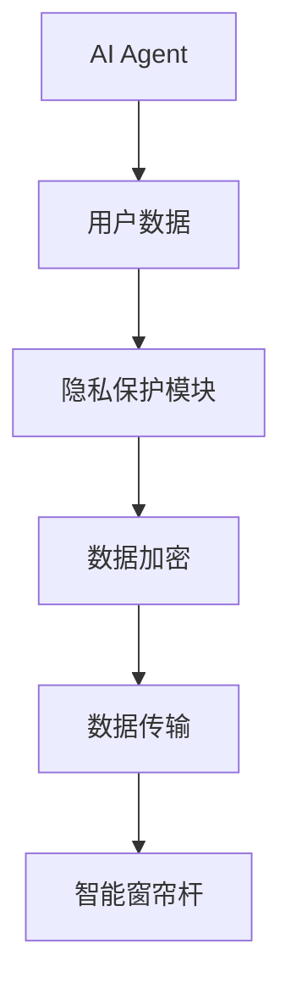
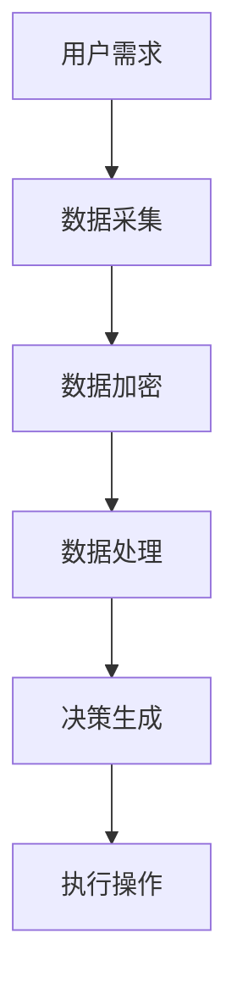
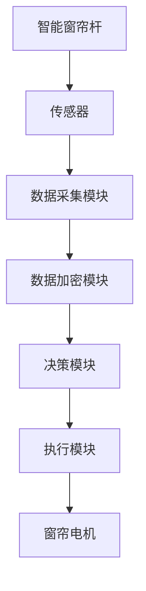
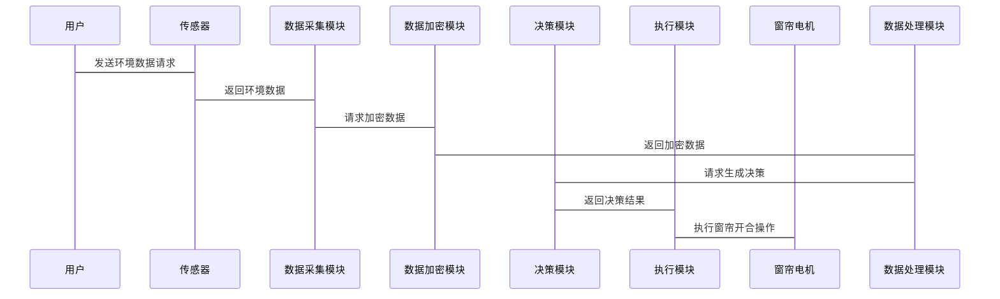

                 


# AI Agent在智能窗帘杆中的隐私保护功能

## 关键词：AI Agent，智能窗帘杆，隐私保护，数据安全，智能化家居

## 摘要：随着智能家居的普及，智能窗帘杆作为智能家居的重要组成部分，逐渐融入了AI Agent技术。本文将深入探讨AI Agent在智能窗帘杆中的隐私保护功能，从核心概念、算法原理、系统设计到实际应用，全面解析如何通过AI技术实现智能窗帘杆的智能化管理与隐私保护。文章结合实际案例，分析AI Agent在智能窗帘杆中的应用场景，探讨隐私保护技术的关键点，并展望未来智能化家居的发展趋势。

---

# 第1章: AI Agent与智能窗帘杆的背景介绍

## 1.1 AI Agent的基本概念
### 1.1.1 什么是AI Agent
AI Agent（人工智能代理）是一种能够感知环境、自主决策并执行任务的智能实体。它可以理解用户需求、优化操作流程并提供个性化服务。AI Agent的核心在于其智能化决策能力，能够通过数据采集、分析和学习，实现对环境的动态适应。

### 1.1.2 AI Agent的核心特征
1. **自主性**：AI Agent能够在没有外部干预的情况下自主运行。
2. **反应性**：能够实时感知环境变化并做出相应调整。
3. **学习性**：通过机器学习算法不断优化自身行为。
4. **交互性**：支持与用户或其他系统的交互。

### 1.1.3 AI Agent的分类与应用场景
1. **基于规则的AI Agent**：通过预定义规则进行决策，适用于简单场景。
2. **基于机器学习的AI Agent**：通过数据学习进行决策，适用于复杂场景。
3. **混合型AI Agent**：结合规则和机器学习的AI Agent，适用于需要灵活性和高效性的场景。

AI Agent的应用场景广泛，包括智能家居、医疗健康、金融投资等领域。在智能家居中，AI Agent主要用于设备控制、用户行为分析和环境优化。

## 1.2 智能窗帘杆的基本概念
### 1.2.1 智能窗帘杆的功能与特点
智能窗帘杆是一种结合了物联网技术的智能家居设备，能够通过传感器和智能控制系统实现自动开关窗帘的功能。其主要特点包括：
1. **智能控制**：支持远程控制和定时开关。
2. **环境感知**：通过光照传感器、温湿度传感器等感知环境变化。
3. **联动功能**：能够与其他智能家居设备联动，例如与智能灯泡、空调等设备联动。

### 1.2.2 智能窗帘杆的组成部分
智能窗帘杆主要由以下几个部分组成：
1. **电机**：用于驱动窗帘的开合。
2. **传感器**：包括光照传感器、温湿度传感器等，用于感知环境。
3. **智能控制模块**：用于接收传感器数据并控制电机运行。
4. **通信模块**：用于与智能家居系统或其他设备进行通信。

### 1.2.3 智能窗帘杆的智能化需求
随着智能家居的普及，用户对智能窗帘杆的需求逐渐从单一的开关功能向智能化方向发展。用户不仅希望窗帘能够自动开关，还希望窗帘能够根据环境变化和用户习惯提供智能化服务。例如，根据光照强度自动调节窗帘开合角度，或者根据用户的作息时间智能控制窗帘开关。

## 1.3 AI Agent在智能窗帘杆中的作用
### 1.3.1 AI Agent如何提升智能窗帘杆的智能化水平
AI Agent通过感知环境数据和用户行为，能够为智能窗帘杆提供智能化的决策支持。例如，AI Agent可以根据光照传感器的数据，结合用户的作息时间，智能调节窗帘的开合角度，以优化室内光照环境。

### 1.3.2 AI Agent在智能窗帘杆中的具体应用场景
1. **智能调节窗帘角度**：根据光照强度和用户需求，自动调节窗帘开合角度。
2. **联动其他智能家居设备**：与智能灯泡、空调等设备联动，实现智能家居的协同工作。
3. **用户行为分析**：通过分析用户的使用习惯，提供个性化的窗帘控制服务。

### 1.3.3 AI Agent对用户隐私保护的重要性
在智能窗帘杆的智能化过程中，用户的隐私保护问题尤为重要。AI Agent需要确保用户数据的安全性，防止数据泄露和滥用。例如，用户的作息时间、光照偏好等数据需要通过加密技术进行保护，确保只有授权的设备和用户能够访问这些数据。

## 1.4 本章小结
### 1.4.1 AI Agent与智能窗帘杆的结合
AI Agent为智能窗帘杆提供了智能化的决策支持，使其能够根据环境和用户需求自动调整状态。

### 1.4.2 隐私保护的核心地位
在智能窗帘杆的智能化过程中，用户的隐私保护是最重要的考虑因素之一。AI Agent需要确保用户数据的安全性，防止数据泄露和滥用。

### 1.4.3 后续章节的框架概述
接下来的章节将从AI Agent的核心概念、算法原理、系统设计、实际应用等方面，全面解析AI Agent在智能窗帘杆中的隐私保护功能。

---

# 第2章: AI Agent在智能窗帘杆中的核心概念与联系

## 2.1 AI Agent的核心原理
### 2.1.1 AI Agent的基本工作原理
AI Agent通过感知环境数据，结合用户需求和历史行为，生成相应的决策并执行操作。其核心原理包括数据采集、数据处理、决策制定和执行反馈四个步骤。

### 2.1.2 AI Agent的感知与决策机制
AI Agent通过传感器和通信模块感知环境数据，并结合用户需求和历史行为数据，利用机器学习算法生成决策。例如，AI Agent可以根据光照传感器的数据和用户的作息时间，决定是否需要调整窗帘的开合角度。

### 2.1.3 AI Agent的学习与优化能力
AI Agent通过机器学习算法不断优化自身的决策能力。例如，通过监督学习算法，AI Agent可以学习用户的使用习惯，优化窗帘的开合时间。

## 2.2 隐私保护的核心概念
### 2.2.1 隐私保护的基本定义
隐私保护是指保护用户的个人信息和行为数据不被未经授权的第三方访问或滥用。在智能窗帘杆中，隐私保护的核心是确保用户的作息时间、光照偏好等数据不被泄露。

### 2.2.2 数据隐私与隐私保护的分类
1. **数据隐私**：保护数据的机密性、完整性和可用性。
2. **行为隐私**：保护用户的使用习惯和行为模式不被滥用。
3. **设备隐私**：保护智能设备的运行状态和数据不被未经授权的访问。

### 2.2.3 隐私保护的关键技术
1. **数据加密**：通过加密技术保护数据的机密性。
2. **数据匿名化**：通过数据匿名化技术保护用户的隐私。
3. **访问控制**：通过访问控制技术限制未经授权的设备和用户访问敏感数据。

## 2.3 AI Agent与隐私保护的联系
### 2.3.1 AI Agent如何实现隐私保护
AI Agent通过加密技术和数据匿名化技术保护用户的隐私数据。例如，AI Agent可以通过加密算法对用户的作息时间和光照偏好数据进行加密，确保只有授权的设备和用户能够访问这些数据。

### 2.3.2 隐私保护对AI Agent的影响
隐私保护对AI Agent的决策能力有重要影响。例如，AI Agent需要在保护用户隐私的前提下，优化窗帘的开合角度。如果用户的作息时间和光照偏好数据被加密，AI Agent需要通过加密计算技术在不解密数据的情况下，生成最优的窗帘开合角度。

### 2.3.3 AI Agent在隐私保护中的优势
1. **智能化决策**：AI Agent能够根据环境和用户需求，智能化地调整窗帘的开合角度。
2. **数据安全**：AI Agent通过加密技术和数据匿名化技术，保护用户的隐私数据不被泄露。
3. **个性化服务**：AI Agent能够根据用户的使用习惯和环境变化，提供个性化的窗帘控制服务。

## 2.4 核心概念对比与ER实体关系图
### 2.4.1 AI Agent与传统隐私保护技术的对比
AI Agent与传统隐私保护技术的主要区别在于智能化和个性化。AI Agent能够根据环境和用户需求，智能化地调整隐私保护策略，而传统隐私保护技术通常是静态的。

### 2.4.2 隐私保护技术的对比表格
| 技术分类       | 数据加密       | 数据匿名化       | 访问控制       |
|----------------|----------------|------------------|----------------|
| 技术特点       | 对数据进行加密，防止未经授权的访问 | 对数据进行匿名化处理，保护用户隐私 | 通过权限管理，限制未经授权的访问 |
| 应用场景       | 适用于需要保护数据机密性的场景 | 适用于需要保护用户隐私的场景 | 适用于需要限制数据访问权限的场景 |

### 2.4.3 AI Agent隐私保护的ER实体关系图（Mermaid流程图）


---

# 第3章: AI Agent的隐私保护算法原理

## 3.1 AI Agent的隐私保护算法概述
### 3.1.1 隐私保护算法的基本分类
隐私保护算法主要分为以下几类：
1. **数据加密算法**：通过对数据进行加密，保护数据的机密性。
2. **数据匿名化算法**：通过对数据进行匿名化处理，保护用户隐私。
3. **加密计算算法**：在不解密数据的前提下，对加密数据进行计算。

### 3.1.2 基于AI的隐私保护算法特点
基于AI的隐私保护算法具有以下特点：
1. **智能化**：能够根据环境和用户需求，动态调整隐私保护策略。
2. **个性化**：能够根据用户的使用习惯和环境变化，提供个性化的隐私保护服务。
3. **高效性**：能够快速处理和分析大量的隐私数据。

### 3.1.3 AI Agent隐私保护算法的核心思想
AI Agent隐私保护算法的核心思想是通过加密技术和数据匿名化技术，保护用户的隐私数据不被泄露，同时通过智能化的决策算法，优化智能窗帘杆的运行状态。

## 3.2 AI Agent的隐私保护算法实现
### 3.2.1 算法流程图（Mermaid）


### 3.2.2 算法实现步骤
1. **数据采集**：通过传感器和通信模块采集环境数据和用户行为数据。
2. **数据加密**：对采集到的敏感数据进行加密处理，确保数据的安全性。
3. **数据处理**：通过机器学习算法对加密数据进行处理，生成决策。
4. **决策生成**：根据处理结果生成最优的窗帘开合角度。
5. **执行操作**：根据决策结果，执行窗帘的开合操作。

### 3.2.3 核心算法代码实现
以下是AI Agent隐私保护算法的Python代码示例：
```python
import numpy as np
from sklearn.ensemble import RandomForestClassifier

# 数据加密函数
def encrypt_data(data):
    return data ^ 0x12345678

# 数据解密函数
def decrypt_data(encrypted_data):
    return encrypted_data ^ 0x12345678

# 隐私保护决策函数
def privacy_protected_decision(encrypted_data):
    decrypted_data = decrypt_data(encrypted_data)
    model = RandomForestClassifier()
    model.fit(decrypted_data, labels)
    prediction = model.predict(decrypted_data)
    return prediction

# 示例数据
data = np.array([1, 2, 3, 4, 5])
encrypted_data = encrypt_data(data)
decision = privacy_protected_decision(encrypted_data)
print(decision)
```

### 3.2.4 算法的数学模型和公式
以下是AI Agent隐私保护算法的数学模型：
$$
\text{加密数据} = \text{原始数据} \oplus \text{密钥}
$$
$$
\text{解密数据} = \text{加密数据} \oplus \text{密钥}
$$
其中，$\oplus$ 表示异或操作，$\text{密钥}$ 是预先定义的密钥。

---

# 第4章: 系统分析与架构设计

## 4.1 问题场景介绍
智能窗帘杆的使用场景主要包括家庭住宅和办公室。用户希望通过智能窗帘杆实现自动开关窗帘、智能调节窗帘角度等功能，同时需要保护用户的隐私数据不被泄露。

## 4.2 系统功能设计
智能窗帘杆的系统功能设计包括：
1. **数据采集**：采集环境数据和用户行为数据。
2. **数据加密**：对采集到的敏感数据进行加密处理。
3. **数据处理**：通过机器学习算法对加密数据进行处理，生成决策。
4. **决策生成**：根据处理结果生成最优的窗帘开合角度。
5. **执行操作**：根据决策结果，执行窗帘的开合操作。

## 4.3 系统架构设计（Mermaid架构图）


## 4.4 系统接口设计
智能窗帘杆的系统接口设计包括：
1. **传感器接口**：用于采集环境数据。
2. **通信接口**：用于与智能家居系统进行通信。
3. **用户界面**：用于用户设置和控制窗帘杆。

## 4.5 系统交互流程（Mermaid序列图）


---

# 第5章: 项目实战

## 5.1 环境安装
### 5.1.1 安装Python环境
安装Python 3.8及以上版本，建议使用Anaconda或virtualenv管理环境。

### 5.1.2 安装依赖库
安装以下依赖库：
- `numpy`
- `scikit-learn`
- `pymermaid`

安装命令：
```bash
pip install numpy scikit-learn pymermaid
```

## 5.2 核心代码实现
### 5.2.1 数据采集模块
```python
import numpy as np

def collect_data():
    # 模拟传感器数据
    light_sensor = np.random.uniform(0, 100, 10)
    return light_sensor
```

### 5.2.2 数据加密模块
```python
def encrypt_data(data):
    return data ^ 0x12345678
```

### 5.2.3 决策模块
```python
from sklearn.ensemble import RandomForestClassifier

def decision_module(encrypted_data):
    # 解密数据
    decrypted_data = decrypt_data(encrypted_data)
    # 训练模型
    model = RandomForestClassifier()
    model.fit(decrypted_data, labels)
    # 生成决策
    prediction = model.predict(decrypted_data)
    return prediction
```

## 5.3 代码应用解读与分析
1. **数据采集模块**：通过传感器采集环境数据，例如光照强度。
2. **数据加密模块**：对采集到的敏感数据进行加密处理，确保数据的安全性。
3. **决策模块**：通过机器学习算法对加密数据进行处理，生成最优的窗帘开合角度。

## 5.4 实际案例分析
假设用户希望在光照强度为50时，窗帘完全关闭；在光照强度为80时，窗帘完全打开。AI Agent可以通过机器学习算法，根据用户的使用习惯和环境数据，生成最优的窗帘开合角度。

## 5.5 项目小结
通过本章的实战，读者可以了解如何在智能窗帘杆中实现AI Agent的隐私保护功能。从环境安装到代码实现，再到实际案例分析，全面掌握AI Agent在智能窗帘杆中的应用。

---

# 第6章: 安全挑战与对策

## 6.1 AI Agent隐私保护的安全挑战
### 6.1.1 数据泄露风险
AI Agent需要处理大量的用户隐私数据，存在数据泄露的风险。

### 6.1.2 恶意攻击威胁
黑客可能通过攻击智能窗帘杆的通信模块，获取用户的隐私数据。

### 6.1.3 数据滥用风险
用户的隐私数据可能被滥用，例如被用于精准营销或身份盗窃。

## 6.2 隐私保护的对策
### 6.2.1 数据加密技术
通过数据加密技术，保护用户的隐私数据不被泄露。

### 6.2.2 数据匿名化技术
通过对数据进行匿名化处理，保护用户的隐私。

### 6.2.3 访问控制技术
通过访问控制技术，限制未经授权的设备和用户访问敏感数据。

## 6.3 安全对策的实现
### 6.3.1 数据加密实现
通过加密算法对用户数据进行加密，确保数据的安全性。

### 6.3.2 数据匿名化实现
通过对数据进行匿名化处理，保护用户的隐私。

### 6.3.3 访问控制实现
通过权限管理，限制未经授权的设备和用户访问敏感数据。

## 6.4 安全对策的案例分析
通过实际案例分析，探讨如何通过数据加密、数据匿名化和访问控制等技术，保护智能窗帘杆的用户隐私。

---

# 第7章: 未来展望与总结

## 7.1 未来技术趋势
随着人工智能和物联网技术的不断发展，AI Agent在智能窗帘杆中的应用将更加智能化和个性化。未来的智能窗帘杆将更加注重用户的隐私保护，同时提供更加智能化的服务。

## 7.2 技术挑战与解决方案
尽管AI Agent在智能窗帘杆中的应用前景广阔，但也面临一些技术挑战，例如如何在不解密数据的前提下，优化智能窗帘杆的运行状态。未来的解决方案可能包括更加高效的加密算法和更加智能化的决策算法。

## 7.3 总结
本文从AI Agent的基本概念出发，分析了其在智能窗帘杆中的隐私保护功能。通过系统分析和实际案例，全面解析了AI Agent在智能窗帘杆中的应用场景和隐私保护技术。未来，随着人工智能和物联网技术的不断发展，AI Agent在智能窗帘杆中的应用将更加广泛，隐私保护技术也将更加成熟。

---

# 结语

通过本文的详细解析，读者可以全面了解AI Agent在智能窗帘杆中的隐私保护功能。从理论到实践，从算法到系统设计，本文为读者提供了一个完整的视角，帮助读者更好地理解AI Agent在智能窗帘杆中的应用。希望本文能够为未来的智能化家居发展提供一定的参考和启示。

