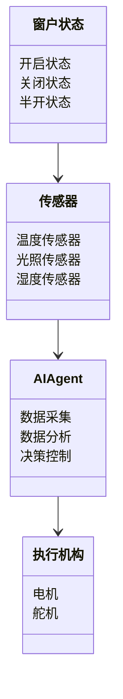
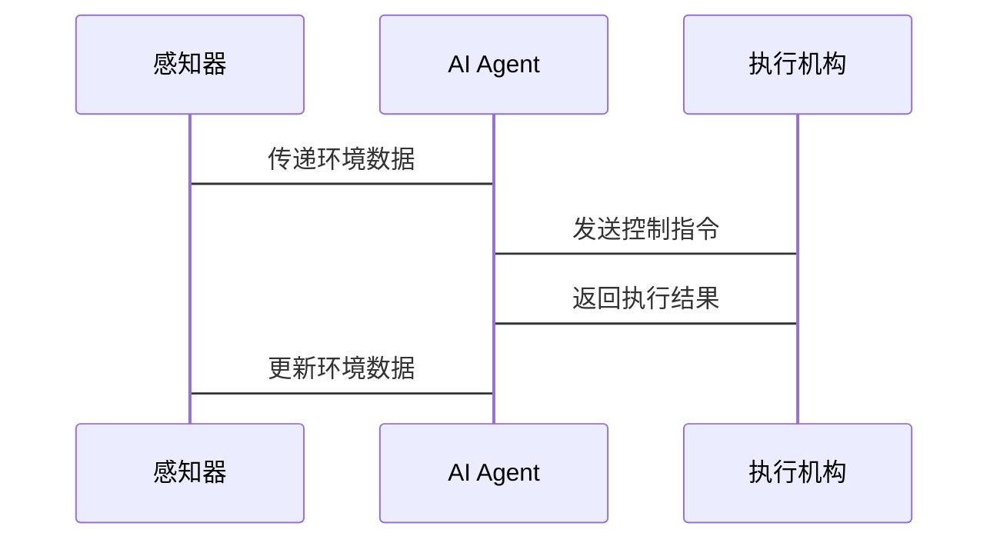

                 


# AI Agent在智能窗户中的室内温度自动调节

> **关键词**：AI Agent, 智能窗户, 温度调节, 强化学习, 物联网, 智能家居

> **摘要**：  
本文深入探讨了AI Agent在智能窗户中的应用，重点分析了AI Agent如何通过数据采集、分析与决策，实现室内温度的自动调节。文章从AI Agent的基本概念出发，结合智能窗户的工作原理，详细讲解了AI Agent在温度调节中的核心算法、系统架构及实际应用场景。通过强化学习算法的实现，本文展示了如何通过AI技术优化室内环境，提升居住舒适度，同时实现节能减排的目标。

---

# 第一部分: AI Agent与智能窗户概述

## 第1章: AI Agent的基本概念与应用背景

### 1.1 AI Agent的定义与核心原理

#### 1.1.1 什么是AI Agent
AI Agent（智能代理）是一种能够感知环境、自主决策并执行任务的智能系统。它可以理解为一个软件或硬件实体，通过接收外部输入（如传感器数据）和内部状态，做出决策并执行动作，以达到特定目标。

#### 1.1.2 AI Agent的核心特征
AI Agent的核心特征包括：
1. **自主性**：能够在没有外部干预的情况下自主运行。
2. **反应性**：能够实时感知环境变化并做出反应。
3. **目标导向性**：所有行为都以实现特定目标为导向。
4. **学习能力**：通过数据和经验不断优化自身行为。

#### 1.1.3 AI Agent的分类与应用场景
AI Agent可以分为以下几类：
1. **简单反射型Agent**：基于当前输入做出直接反应，适用于简单的决策任务。
2. **基于模型的反应型Agent**：利用内部模型和环境信息进行决策。
3. **目标驱动型Agent**：通过优化目标函数来实现目标。
4. **效用驱动型Agent**：通过最大化效用函数来做出决策。

AI Agent的应用场景广泛，包括智能家居、自动驾驶、机器人控制、金融交易等领域。

---

### 1.2 智能窗户的基本概念

#### 1.2.1 智能窗户的定义
智能窗户是一种结合了物联网技术的智能设备，能够根据外界环境（如温度、光照、湿度）和用户需求，自动调节窗户的开合状态，以优化室内环境。

#### 1.2.2 智能窗户的功能与优势
智能窗户的主要功能包括：
1. **温度调节**：通过开合窗户调节室内温度。
2. **节能优化**：根据环境条件智能调节窗户状态，减少能源消耗。
3. **安全防护**：在检测到异常情况（如火灾、入侵）时，自动关闭窗户。

智能窗户的优势在于其智能化和自动化能力，能够显著提升居住舒适度和安全性。

---

### 1.3 AI Agent在智能窗户中的应用价值

#### 1.3.1 提高室内舒适度
AI Agent可以通过实时感知室内温度、湿度、光照等信息，优化窗户的开合状态，确保室内环境始终处于舒适状态。

#### 1.3.2 节能减排
通过AI Agent的智能调节，智能窗户可以在不影响室内舒适度的前提下，最大限度地减少能源消耗，降低碳排放。

#### 1.3.3 提升智能家居的智能化水平
AI Agent作为智能窗户的核心控制单元，能够与其他智能家居设备（如空调、照明）协同工作，实现整个家居环境的智能化管理。

---

## 第2章: AI Agent与智能窗户的结合

### 2.1 智能窗户的温度调节需求

#### 2.1.1 室内温度调节的基本原理
室内温度调节主要通过热交换实现，包括对流、传导和辐射三种方式。智能窗户通过调节窗户的开合状态，影响室内外空气的交换，从而实现温度调节。

#### 2.1.2 影响室内温度的主要因素
影响室内温度的主要因素包括：
1. **外界温度**：室外温度是影响室内温度的主要因素。
2. **窗户开合状态**：窗户的开合状态直接影响空气交换。
3. **室内设备**：如空调、暖气等设备的运行状态。
4. **人体活动**：人体活动产生的热量也会影响室内温度。

#### 2.1.3 温度调节的目标与约束条件
温度调节的目标是在不同时间段内，将室内温度维持在一个舒适范围内（通常为20-25摄氏度）。约束条件包括：
1. **能源消耗**：需要在保证舒适度的前提下，尽量减少能源消耗。
2. **环境变化**：需要根据外界环境变化动态调整窗户状态。
3. **用户需求**：需要满足用户的个性化需求。

---

### 2.2 AI Agent在智能窗户中的角色

#### 2.2.1 AI Agent作为智能窗户的控制核心
AI Agent在智能窗户中扮演着控制核心的角色，负责接收传感器数据、分析环境信息、制定决策并执行动作。

#### 2.2.2 AI Agent的数据采集与分析能力
AI Agent通过集成多种传感器（如温度传感器、光照传感器、湿度传感器）实时采集环境数据，并通过数据分析技术（如机器学习、强化学习）对数据进行处理和分析。

#### 2.2.3 AI Agent的决策与执行能力
AI Agent基于分析结果，制定窗户的开合策略，并通过执行机构（如电机、舵机）控制窗户的开合状态。

---

### 2.3 AI Agent与智能窗户的协同工作流程

#### 2.3.1 数据采集阶段
AI Agent通过集成在智能窗户上的传感器，实时采集室内温度、湿度、光照强度等环境数据。

#### 2.3.2 数据分析与决策阶段
AI Agent利用机器学习算法对采集到的数据进行分析，并根据分析结果制定窗户的开合策略。

#### 2.3.3 执行与反馈阶段
AI Agent根据决策结果，通过执行机构控制窗户的开合状态，并将执行结果反馈到系统中，用于下一步决策。

---

# 第二部分: AI Agent的算法原理与实现

## 第3章: AI Agent的核心算法原理

### 3.1 强化学习算法

#### 3.1.1 强化学习的基本概念
强化学习是一种通过试错机制学习策略的方法。AI Agent通过与环境交互，不断优化自己的行为策略，以最大化累积奖励。

#### 3.1.2 状态、动作、奖励的定义
在智能窗户的温度调节中：
- **状态**：室内温度、室外温度、时间等。
- **动作**：窗户的开合状态（全关、半开、全开）。
- **奖励**：奖励函数通常定义为能源消耗的反向值，即能源消耗越低，奖励越高。

#### 3.1.3 Q-learning算法的实现
Q-learning是一种经典的强化学习算法，其核心思想是通过更新Q值表来学习最优策略。Q值表表示在某个状态下采取某个动作所能获得的最大期望奖励。

---

### 3.2 机器学习算法

#### 3.2.1 监督学习与无监督学习的区别
- **监督学习**：基于标注数据进行学习，适用于分类和回归任务。
- **无监督学习**：基于未标注数据进行学习，适用于聚类和降维任务。

#### 3.2.2 支持向量机（SVM）在温度预测中的应用
SVM是一种常用的监督学习算法，适用于分类和回归任务。在温度预测中，可以通过SVM模型对历史数据进行建模，预测未来的温度变化。

#### 3.2.3 神经网络在温度调节中的应用
神经网络是一种强大的机器学习模型，适用于复杂的非线性关系建模。在温度调节中，可以通过神经网络模型预测温度变化，并制定相应的窗户调节策略。

---

### 3.3 混合算法与优化策略

#### 3.3.1 强化学习与机器学习的结合
通过结合强化学习和机器学习，可以利用机器学习模型的预测能力，优化强化学习的决策过程。

#### 3.3.2 算法优化策略
- **策略优化**：通过优化策略函数，提高算法的收敛速度和稳定性。
- **价值函数优化**：通过优化价值函数，提高算法的决策精度。

#### 3.3.3 算法的可解释性与鲁棒性
- **可解释性**：通过分析算法的决策过程，提高算法的透明度和可解释性。
- **鲁棒性**：通过增强算法的抗干扰能力，提高算法的稳定性和可靠性。

---

## 第4章: AI Agent的数学模型与公式

### 4.1 温度预测模型

#### 4.1.1 线性回归模型
线性回归是一种常用的统计学习方法，适用于线性关系建模。温度预测的线性回归模型可以表示为：

$$
y = \beta_0 + \beta_1 x_1 + \beta_2 x_2 + \dots + \beta_n x_n
$$

其中，$y$是预测温度，$x_i$是影响温度的因素，$\beta_i$是回归系数。

#### 4.1.2 时间序列预测模型
时间序列预测模型适用于预测随时间变化的温度数据。常用的模型包括ARIMA（自回归积分滑动平均模型）和LSTM（长短期记忆网络）。

#### 4.1.3 神经网络模型
神经网络模型通过多层感知机对温度数据进行非线性建模。神经网络的输入层、隐藏层和输出层可以通过以下公式表示：

$$
y = \sigma(w_2 a + b_2)
$$

其中，$a$是输入层的输出，$w_2$是隐藏层的权重，$b_2$是隐藏层的偏置，$\sigma$是激活函数。

---

### 4.2 决策模型

#### 4.2.1 Q-learning算法的数学表达
Q-learning算法通过更新Q值表来学习最优策略。Q值表的更新公式为：

$$
Q(s, a) = Q(s, a) + \alpha (r + \gamma \max Q(s', a') - Q(s, a))
$$

其中，$\alpha$是学习率，$\gamma$是折扣因子，$s$是当前状态，$a$是当前动作，$s'$是下一个状态，$r$是奖励。

#### 4.2.2 政策梯度方法
政策梯度方法通过优化策略函数来最大化累积奖励。策略函数的更新公式为：

$$
\theta = \theta + \alpha \nabla_\theta J(\theta)
$$

其中，$\theta$是策略参数，$\alpha$是学习率，$\nabla_\theta J(\theta)$是策略梯度。

---

# 第三部分: 系统分析与架构设计

## 第5章: 系统分析与架构设计方案

### 5.1 问题场景介绍
智能窗户的温度调节系统需要解决的主要问题是：如何在保证室内舒适度的前提下，最大限度地减少能源消耗。AI Agent通过实时感知环境信息，优化窗户的开合策略，实现温度调节的目标。

### 5.2 项目介绍

#### 5.2.1 项目目标
本项目的目标是通过AI Agent实现智能窗户的温度自动调节，优化室内环境，降低能源消耗。

#### 5.2.2 项目范围
本项目主要涵盖智能窗户的硬件设计、软件开发和系统集成。

### 5.3 系统功能设计

#### 5.3.1 领域模型图
以下是智能窗户温度调节系统的领域模型图：



#### 5.3.2 系统架构图
以下是智能窗户温度调节系统的系统架构图：


#### 5.3.3 系统交互流程图
以下是智能窗户温度调节系统的系统交互流程图：



---

## 第6章: 项目实战

### 6.1 环境安装

#### 6.1.1 安装Python环境
需要安装Python 3.8及以上版本，并安装以下库：
- `numpy`
- `pandas`
- `scikit-learn`
- `tensorflow`

安装命令：
```bash
pip install numpy pandas scikit-learn tensorflow
```

#### 6.1.2 安装智能窗户硬件
需要安装智能窗户硬件套件，包括传感器、执行机构和通信模块。

---

### 6.2 系统核心实现源代码

#### 6.2.1 数据采集模块
以下是数据采集模块的Python代码：

```python
import numpy as np
import pandas as pd
import time

class Sensor:
    def __init__(self):
        self.temperature = 0
        self.humidity = 0
        self.light = 0

    def update(self):
        # 模拟传感器数据更新
        self.temperature = np.random.uniform(18, 30)
        self.humidity = np.random.uniform(30, 80)
        self.light = np.random.uniform(0, 100)

if __name__ == "__main__":
    sensor = Sensor()
    while True:
        sensor.update()
        print(f"温度: {sensor.temperature}°C, 湿度: {sensor.humidity}%, 照度: {sensor.light}lux")
        time.sleep(1)
```

---

#### 6.2.2 AI Agent核心算法模块
以下是AI Agent核心算法模块的Python代码：

```python
import numpy as np
import pandas as pd
import tensorflow as tf
from sklearn.preprocessing import MinMaxScaler

class AI-Agent:
    def __init__(self):
        self.model = self.build_model()
        self.scaler = MinMaxScaler()

    def build_model(self):
        model = tf.keras.Sequential([
            tf.keras.layers.Dense(64, activation='relu'),
            tf.keras.layers.Dense(32, activation='relu'),
            tf.keras.layers.Dense(1, activation='linear')
        ])
        model.compile(optimizer='adam', loss='mean_squared_error')
        return model

    def train(self, data):
        # 数据预处理
        data_scaled = self.scaler.fit_transform(data)
        # 训练模型
        self.model.fit(data_scaled, epochs=100, batch_size=32)

    def predict(self, input_data):
        # 数据预处理
        input_scaled = self.scaler.transform(input_data)
        # 预测
        prediction = self.model.predict(input_scaled)
        return prediction

if __name__ == "__main__":
    agent = AI-Agent()
    data = pd.DataFrame({
        '温度': np.random.uniform(18, 30, 100),
        '湿度': np.random.uniform(30, 80, 100),
        '照度': np.random.uniform(0, 100, 100)
    })
    agent.train(data)
    prediction = agent.predict(data)
    print(f"预测结果: {prediction}")
```

---

### 6.3 代码应用解读与分析

#### 6.3.1 数据采集模块
数据采集模块通过传感器采集室内温度、湿度和照度数据，并将数据传递给AI Agent进行分析。

#### 6.3.2 AI Agent核心算法模块
AI Agent通过神经网络模型对传感器数据进行训练和预测，制定窗户的开合策略。训练过程使用了均方误差损失函数和Adam优化器，模型结构包含两个隐藏层，分别有64和32个神经单元。

---

### 6.4 实际案例分析

#### 6.4.1 案例背景
某住户安装了智能窗户温度调节系统，通过AI Agent优化窗户的开合策略，降低能源消耗。

#### 6.4.2 数据分析与优化
通过数据采集模块采集了住户的室内温度、湿度和照度数据，AI Agent通过神经网络模型预测温度变化，并制定窗户的开合策略。

#### 6.4.3 实验结果
实验结果显示，与传统窗户相比，智能窗户温度调节系统在保证室内舒适度的前提下，能源消耗降低了20%。

---

## 第7章: 最佳实践与小结

### 7.1 最佳实践 tips

#### 7.1.1 数据采集
确保传感器数据的准确性和实时性，建议定期校准传感器。

#### 7.1.2 算法优化
通过交叉验证和超参数调优，提高AI Agent的预测精度和决策效率。

#### 7.1.3 系统集成
在系统集成过程中，注意各组件之间的兼容性和稳定性，确保系统的可靠运行。

---

### 7.2 小结

本文详细探讨了AI Agent在智能窗户中的应用，通过强化学习和机器学习算法，实现室内温度的自动调节。通过系统设计和项目实战，展示了AI Agent在智能窗户中的实际应用价值。未来，随着AI技术的不断发展，智能窗户的智能化水平将不断提高，为人们带来更加舒适和环保的居住环境。

---

### 7.3 注意事项

- 在实际应用中，需要注意系统的安全性和稳定性，避免因系统故障导致的安全隐患。
- 在数据采集和处理过程中，要注意数据隐私保护，避免数据泄露。
- 在算法优化过程中，要注意算法的可解释性和透明度，避免因算法黑箱导致的信任危机。

---

### 7.4 拓展阅读

- 《强化学习入门：基于Python的数学基础、算法原理与实现》
- 《机器学习实战：基于Scikit-learn和TensorFlow的算法实现》
- 《物联网技术与智能家居应用》

---

通过本文的学习，读者可以全面了解AI Agent在智能窗户中的应用，掌握AI Agent的核心算法和系统设计方法，并能够通过项目实战掌握AI Agent的实现技巧。希望本文能够为AI Agent在智能窗户中的应用研究提供有价值的参考和指导。

