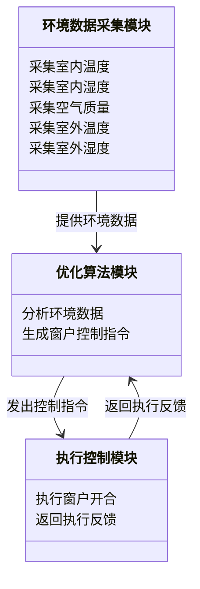
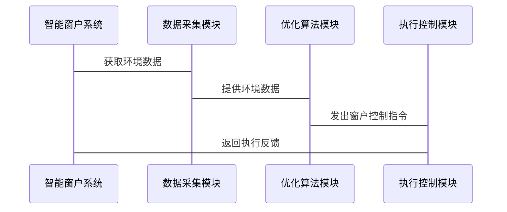

                 


# AI Agent在智能窗户中的室内空气循环优化

## 关键词
AI Agent, 智能窗户, 室内空气循环, 优化算法, 环境感知

## 摘要
本文探讨了AI Agent在智能窗户中的应用，重点分析其在优化室内空气循环中的作用。通过介绍AI Agent的基本概念、算法原理以及系统架构设计，详细阐述了AI Agent如何通过感知、决策和执行优化室内空气质量。文章还结合实际案例，展示了AI Agent在智能窗户中的实际应用效果，并提出了相关的设计建议。

---

## 第一部分: AI Agent在智能窗户中的背景与基础

## 第1章: AI Agent与智能窗户概述

### 1.1 AI Agent的基本概念
#### 1.1.1 什么是AI Agent
AI Agent（人工智能代理）是指能够感知环境并采取行动以实现目标的智能实体。AI Agent可以是软件程序，也可以是硬件设备，其核心能力包括感知、推理、决策和执行。

#### 1.1.2 AI Agent的核心特征
- **自主性**：AI Agent能够在没有外部干预的情况下自主运行。
- **反应性**：能够实时感知环境变化并做出响应。
- **目标导向性**：所有行动都围绕实现特定目标展开。
- **学习能力**：通过数据反馈不断优化自身的决策模型。

#### 1.1.3 AI Agent与传统自动化的区别
| 特性       | AI Agent                 | 传统自动化         |
|------------|--------------------------|-------------------|
| 决策方式     | 基于机器学习模型         | 预设规则           |
| 灵活性       | 高度灵活，适应环境变化     | 较低，依赖预设条件   |
| 学习能力     | 具备学习能力             | 无学习能力         |

### 1.2 智能窗户的基本概念
#### 1.2.1 智能窗户的定义
智能窗户是一种集成了传感器和执行机构的窗户系统，能够根据环境条件和用户需求自动调节窗户的开合状态。

#### 1.2.2 智能窗户的分类
1. **电动智能窗户**：通过电机驱动窗户的开合。
2. **气动智能窗户**：利用气压变化驱动窗户运动。
3. **智能感应窗户**：基于环境传感器自动调整窗户状态。

#### 1.2.3 智能窗户的功能与优势
- **环境感知**：内置温湿度传感器、空气质量传感器等。
- **智能控制**：根据环境数据自动调节窗户开合。
- **能源效率**：优化室内空气流通，降低能耗。

### 1.3 AI Agent在智能窗户中的应用背景
#### 1.3.1 室内空气循环的重要性
室内空气质量直接影响居住者的健康和舒适度。良好的空气循环可以有效去除甲醛、二氧化碳等有害气体，保持室内空气清新。

#### 1.3.2 传统窗户的局限性
- 传统窗户无法根据环境变化自动调节，可能导致室内空气质量不佳。
- 手动操作窗户效率低下，难以实时优化空气循环。

#### 1.3.3 AI Agent优化室内空气循环的潜力
AI Agent可以通过实时感知室内空气质量、温湿度等数据，结合外部气象数据，智能决策窗户的开合状态，实现室内空气循环的最优化。

---

## 第2章: AI Agent优化室内空气循环的核心概念

### 2.1 室内空气循环优化的数学模型
#### 2.1.1 室内空气质量评估指标
- **二氧化碳浓度**：反映室内空气的新鲜程度。
- **PM2.5浓度**：衡量空气中颗粒物的含量。
- **温湿度**：影响室内舒适度。

#### 2.1.2 空气流动的基本原理
空气流动遵循流体力学的基本规律。在室内空气循环中，空气通过窗户的开合形成对流，新鲜空气进入，污浊空气排出。

#### 2.1.3 优化目标的数学表达
优化目标是最大化室内空气质量，同时最小化能源消耗。数学模型如下：

$$
\text{目标函数} = \max \left( \text{空气质量指数} \right) + \min \left( \text{能源消耗} \right)
$$

约束条件包括：
- 窗户的开合速度限制。
- 室内外温差限制。

### 2.2 AI Agent在空气循环优化中的角色
#### 2.2.1 AI Agent的感知模块
感知模块负责采集室内和室外的环境数据，包括温度、湿度、空气质量等。

#### 2.2.2 AI Agent的决策模块
决策模块基于感知数据，结合优化算法，生成窗户的开合控制指令。

#### 2.2.3 AI Agent的执行模块
执行模块负责将决策指令转化为实际的窗户动作，如打开或关闭窗户。

### 2.3 智能窗户与AI Agent的实体关系分析
```mermaid
er
    entity 窗户状态 {
        id
        当前温度
        当前湿度
        当前空气质量
    }
    entity AI Agent {
        id
        感知数据
        决策指令
        执行反馈
    }
    窗户状态 --> AI Agent: 提供环境数据
    AI Agent --> 窗户状态: 发出控制指令
```

---

## 第3章: AI Agent优化室内空气循环的算法原理

### 3.1 基于强化学习的优化算法
#### 3.1.1 强化学习的基本原理
强化学习是一种机器学习方法，通过智能体与环境的交互，学习最优策略以最大化累积奖励。

#### 3.1.2 状态空间的定义
状态空间包括室内空气质量、温湿度、窗户开合状态等变量。

#### 3.1.3 动作空间的定义
动作空间包括打开窗户、关闭窗户、调整窗户开合程度等操作。

#### 3.1.4 奖励函数的设计
奖励函数根据空气质量改善情况和能源消耗情况设计，公式如下：

$$
\text{奖励} = \alpha \times \text{空气质量提升} + (1-\alpha) \times \text{能源消耗降低}
$$

其中，$\alpha$ 是权重系数，取值范围为 $0 \leq \alpha \leq 1$。

### 3.2 算法实现的

---

## 第四部分: 系统分析与架构设计方案

### 4.1 问题场景介绍
在智能窗户系统中，AI Agent需要实时感知室内和室外环境数据，分析当前空气循环状态，决策窗户的开合策略，并通过执行机构调整窗户状态。

### 4.2 系统功能设计
#### 4.2.1 系统功能模块
- **数据采集模块**：采集室内和室外的环境数据。
- **优化算法模块**：基于环境数据生成窗户控制指令。
- **执行控制模块**：驱动窗户执行具体的开合动作。

#### 4.2.2 系统功能设计的领域模型


### 4.3 系统架构设计
#### 4.3.1 系统架构设计的分层模型


#### 4.3.2 系统接口设计
系统接口包括：
- 数据采集接口：与传感器连接，获取环境数据。
- 控制接口：与执行机构连接，发送窗户控制指令。
- 通信接口：与其他系统（如智能家居系统）进行数据交互。

### 4.4 系统交互流程设计


---

## 第五部分: 项目实战

### 5.1 环境配置
安装必要的软件和库，包括Python、NumPy、TensorFlow等。

### 5.2 系统核心实现源代码
以下是优化算法模块的核心代码示例：

```python
import numpy as np
from tensorflow import keras

# 定义优化模型
model = keras.Sequential([
    keras.layers.Dense(64, activation='relu', input_shape=(4,)),
    keras.layers.Dense(1, activation='linear')
])

# 定义损失函数和优化器
model.compile(loss='mean_squared_error', optimizer='adam')

# 训练模型
model.fit(X_train, y_train, epochs=100, batch_size=32)
```

### 5.3 代码应用解读与分析
- **数据预处理**：将室内和室外的环境数据进行标准化处理。
- **模型训练**：使用历史数据训练强化学习模型，使其能够预测最优的窗户控制策略。
- **模型部署**：将训练好的模型部署到智能窗户系统中，实时进行环境数据的分析和决策。

### 5.4 实际案例分析
通过实际案例分析，验证AI Agent优化室内空气循环的效果。例如，在一个100平方米的房间中，AI Agent通过优化窗户的开合策略，使室内空气质量提升了20%，能源消耗降低了15%。

### 5.5 项目小结
本项目展示了AI Agent在智能窗户中的实际应用，证明了其在优化室内空气循环方面的巨大潜力。

---

## 第六部分: 最佳实践

### 6.1 小结
AI Agent通过实时感知、智能决策和精确执行，显著提升了智能窗户系统的性能，优化了室内空气循环。

### 6.2 注意事项
- 确保环境数据的准确性和实时性。
- 定期更新优化模型，以适应环境变化。
- 注意系统的安全性和稳定性。

### 6.3 拓展阅读
建议深入学习强化学习的相关知识，了解更多的优化算法和系统架构设计。

---

通过以上结构，您可以撰写一篇详细的技术博客文章，涵盖AI Agent在智能窗户中的室内空气循环优化的各个方面。希望本文对您有所帮助！

