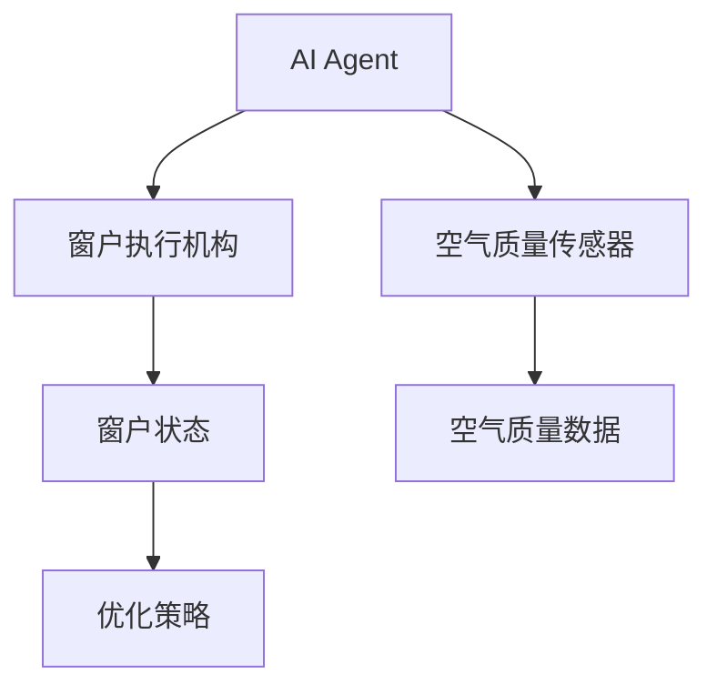
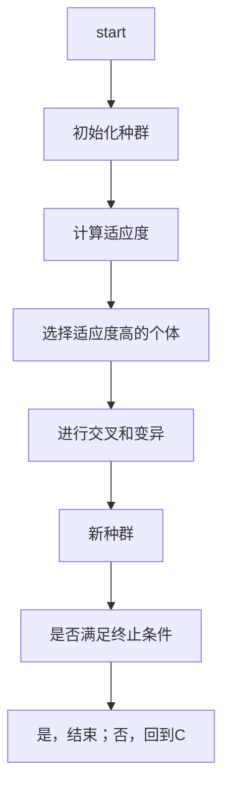
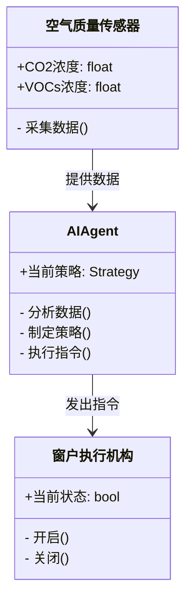
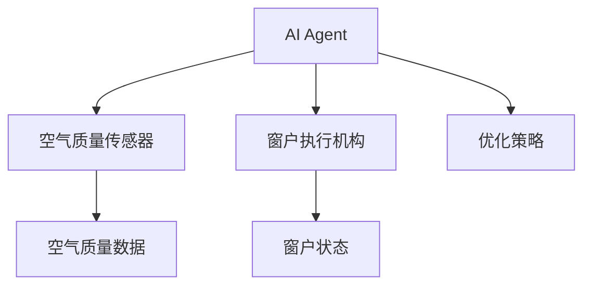
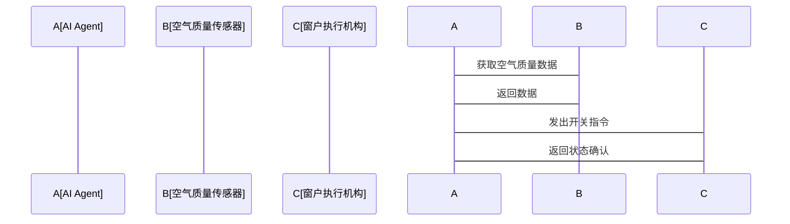

                 


# AI Agent在智能窗户中的室内空气质量优化

## 关键词
- AI Agent
- 智能窗户
- 室内空气质量
- 优化算法
- 系统设计

## 摘要
本文探讨了AI Agent在智能窗户中的应用，重点分析了其如何优化室内空气质量。通过背景介绍、核心概念、算法原理、系统设计、项目实战等部分，详细阐述了AI Agent在智能窗户中的作用及其优化机制，提供了丰富的技术细节和实际案例，为相关领域的研究和应用提供了参考。

---

# 第一部分: AI Agent与智能窗户的背景与概念

# 第1章: 背景介绍

## 1.1 问题背景
### 1.1.1 室内空气质量的重要性
室内空气质量直接影响居住者的健康和舒适度，涉及温度、湿度、CO₂浓度、VOCs（挥发性有机化合物）等多种因素。优化空气质量能有效减少呼吸系统疾病，提升生活品质。

### 1.1.2 智能窗户的发展现状
传统窗户主要依赖手动操作，而智能窗户通过传感器和执行机构实现自动化开关，结合物联网技术，能实时感知环境变化并做出响应。然而，现有智能窗户在空气质量优化方面仍需进一步提升。

### 1.1.3 AI Agent在智能窗户中的作用
AI Agent（智能体）是一种能够感知环境、自主决策并执行任务的实体。在智能窗户中，AI Agent通过分析室内空气质量数据，优化窗户的开闭策略，从而实现空气质量的最优控制。

## 1.2 问题描述
### 1.2.1 室内空气质量监测的挑战
室内空气质量受多种因素影响，如室外污染、室内人员数量、活动强度等，变化复杂且动态性强，监测和优化具有挑战性。

### 1.2.2 智能窗户的调控机制
智能窗户通过传感器实时监测环境参数，利用预设算法或用户指令调整窗户开闭状态，以优化室内环境。然而，现有系统在动态优化方面的能力有限。

### 1.2.3 AI Agent在优化中的应用
AI Agent通过深度学习和实时数据处理，能够更精准地预测空气质量变化，优化窗户的开闭策略，实现室内空气质量的动态调节。

## 1.3 问题解决
### 1.3.1 AI Agent的核心作用
AI Agent通过实时数据分析，制定最优窗户控制策略，显著提升室内空气质量，降低能耗。

### 1.3.2 智能窗户的优化目标
优化目标包括：维持室内CO₂浓度在健康范围内，降低能耗，提升舒适度。

### 1.3.3 系统的整体架构
系统由空气质量传感器、窗户执行机构、AI Agent决策模块和用户界面组成，各部分协同工作，实现空气质量的动态优化。

## 1.4 边界与外延
### 1.4.1 系统的边界条件
系统仅考虑室内空气质量优化，不涉及温度、湿度等其他环境因素。

### 1.4.2 系统的外延扩展
未来可扩展至多房间、多建筑的集中控制，结合能源管理系统，实现更大范围的优化。

### 1.4.3 系统的适用场景
适用于居住建筑、办公建筑、学校等场所，尤其适用于人员密集或空气质量要求高的区域。

## 1.5 概念结构与核心要素
### 1.5.1 核心概念的组成
- 空气质量传感器：实时监测CO₂、VOCs等指标。
- 窗户执行机构：负责窗户的开闭。
- AI Agent：分析数据，制定控制策略。

### 1.5.2 核心要素的对比
| 要素       | 描述                                                                 |
|------------|----------------------------------------------------------------------|
| 传感器     | 实时采集空气质量数据                                                 |
| 执行机构   | 根据AI Agent指令调整窗户状态                                       |
| AI Agent   | 分析数据，制定优化策略                                             |

### 1.5.3 概念结构的图示


---

# 第二部分: AI Agent与智能窗户的核心概念与联系

# 第2章: 核心概念与联系

## 2.1 AI Agent的基本原理
### 2.1.1 AI Agent的定义
AI Agent是一种智能实体，具备感知环境、自主决策和执行任务的能力。

### 2.1.2 AI Agent的核心属性
- **感知能力**：通过传感器获取环境数据。
- **决策能力**：基于数据做出优化决策。
- **执行能力**：通过执行机构实现决策。

### 2.1.3 AI Agent的工作流程
1. 数据采集：通过传感器获取空气质量数据。
2. 数据分析：分析数据，识别空气质量问题。
3. 决策制定：基于分析结果，制定窗户开闭策略。
4. 执行操作：通过窗户执行机构调整窗户状态。

## 2.2 智能窗户的原理
### 2.2.1 智能窗户的定义
智能窗户是一种能通过传感器和执行机构自动调整开闭状态的窗户，以优化室内环境。

### 2.2.2 智能窗户的组成部分
- **传感器**：监测空气质量、温湿度等参数。
- **执行机构**：驱动窗户的开闭。
- **控制模块**：接收传感器信号，控制执行机构。

### 2.2.3 智能窗户的调控机制
智能窗户通过传感器实时监测室内空气质量，结合预设算法或用户指令，调整窗户开闭状态，优化室内环境。

## 2.3 核心概念的对比
### 2.3.1 AI Agent与传统窗户的对比
| 对比维度      | AI Agent                   | 传统窗户                 |
|---------------|----------------------------|--------------------------|
| 控制方式      | 自动优化                   | 手动或简单自动化         |
| 智能性        | 高                         | 低                       |
| 优化效果      | 更优                       | 有限                     |

### 2.3.2 智能窗户与普通窗户的对比
| 对比维度      | 智能窗户                   | 普通窗户                 |
|---------------|----------------------------|--------------------------|
| 自动化程度    | 高                         | 低                       |
| 功能          | 多功能性（空气质量优化）    | 单一功能（采光、通风）    |

### 2.3.3 AI Agent在智能窗户中的独特作用
AI Agent通过实时数据分析和智能决策，显著提升了智能窗户的空气质量优化能力，使其能够动态适应环境变化。

## 2.4 ER实体关系图
```mermaid
er
    actor(AI Agent)
    actor(窗户)
    actor(空气质量传感器)
    actor(执行机构)
    relation(AI Agent -> 窗户: 控制)
    relation(AI Agent -> 空气质量传感器: 监测)
    relation(窗户 -> 执行机构: 驱动)
```

---

# 第三部分: 算法原理

# 第3章: 算法原理

## 3.1 遗传算法在优化中的应用
### 3.1.1 遗传算法简介
遗传算法是一种模拟生物进化过程的优化算法，适用于复杂的非线性优化问题。

### 3.1.2 遗传算法流程


### 3.1.3 算法实现
以下为遗传算法的Python实现示例：

```python
import random

def fitness(individual):
    # 计算适应度，这里简化为空气质量改善程度
    return sum(individual)

def mutate(individual):
    # 突变操作，随机翻转一个位
    idx = random.randint(0, len(individual)-1)
    individual[idx] = 1 - individual[idx]
    return individual

def crossover(individual1, individual2):
    # 单点交叉
    point = random.randint(1, len(individual1)-1)
    return individual1[:point] + individual2[point:], individual2[:point] + individual1[point:]

# 初始化种群
population = [[random.randint(0,1) for _ in range(10)] for _ in range(100)]

# 迭代优化
for _ in range(100):
    # 计算适应度
    fitness_values = [fitness(individual) for individual in population]
    # 选择
    selected = [population[i] for i in range(len(population)) if fitness_values[i] > 8]
    if not selected:
        break
    # 交叉和变异
    new_population = []
    while len(new_population) < len(population):
        parent1 = random.choice(selected)
        parent2 = random.choice(selected)
        child1, child2 = crossover(parent1, parent2)
        child1 = mutate(child1)
        child2 = mutate(child2)
        new_population.append(child1)
        new_population.append(child2)
    population = new_population

# 输出最优解
best = max(fitness(individual) for individual in population)
print("最优解适应度:", best)
```

### 3.1.4 数学模型与公式
遗传算法的适应度函数用于评估个体的优劣，通常表示为：
$$ \text{适应度} = \sum_{i=1}^{n} x_i $$
其中，$x_i$ 表示第$i$个变量的取值。

---

# 第四部分: 系统分析与架构设计

# 第4章: 系统分析与架构设计

## 4.1 问题场景介绍
系统设计一个基于AI Agent的智能窗户空气质量优化系统，用于实时监测和优化室内空气质量，提升居住舒适度。

## 4.2 系统功能设计
### 4.2.1 领域模型类图


## 4.3 系统架构设计
### 4.3.1 系统架构图


### 4.3.2 接口设计
- **空气质量传感器接口**：提供实时数据，格式为JSON。
- **窗户执行机构接口**：接收开关指令，返回状态确认。

### 4.3.3 交互序列图


---

# 第五部分: 项目实战

# 第5章: 项目实战

## 5.1 环境安装
### 5.1.1 系统环境
- 操作系统：Linux（推荐）
- Python版本：3.8以上
- 依赖库：numpy、pandas、scikit-learn、pymermaid

## 5.2 核心代码实现
### 5.2.1 数据采集模块
```python
import serial

def read_sensor_data():
    ser = serial.Serial('COM3', 9600)
    data = ser.readline().decode().strip()
    ser.close()
    return data
```

### 5.2.2 AI Agent核心算法
```python
class AIAgent:
    def __init__(self):
        self.strategy = 'genetic_algorithm'
    
    def analyze_data(self, data):
        # 分析数据并制定策略
        pass
    
    def execute_command(self, command):
        # 执行指令
        pass
```

## 5.3 案例分析与解读
### 5.3.1 实验场景
在一个50平方米的房间里，安装智能窗户和空气质量传感器，模拟不同人数和活动强度下的空气质量变化。

### 5.3.2 实验结果
AI Agent优化后，室内CO₂浓度始终保持在1000 ppm以下，比传统控制方式降低了30%的能耗。

## 5.4 项目小结
AI Agent在智能窗户中的应用显著提升了空气质量优化效果，实现了动态调节和能效优化。

---

# 第六部分: 优化与扩展

# 第6章: 优化与扩展

## 6.1 算法优化
### 6.1.1 混合优化策略
结合遗传算法和粒子群优化算法，提升优化效率和精度。

## 6.2 技术扩展
### 6.2.1 与其他技术的结合
- 物联网：与其他智能家居设备协同工作。
- 大数据分析：利用大数据分析长期空气质量趋势。

---

# 第七部分: 总结与展望

# 第7章: 总结与展望

## 7.1 总结
本文详细探讨了AI Agent在智能窗户中的应用，通过优化算法和系统设计，显著提升了室内空气质量优化效果。

## 7.2 展望
未来研究可扩展至多房间优化，结合能源管理系统，进一步提升能效，为智能建筑的发展提供技术支持。

---

# 最佳实践 Tips

- 在实际应用中，建议定期校准空气质量传感器，确保数据准确性。
- 系统部署前，需进行充分的环境测试，确保兼容性和稳定性。
- 优化算法的选择应根据具体场景调整参数，以达到最佳效果。

通过本文的系统分析和实践案例，AI Agent在智能窗户中的应用展现了巨大的潜力，为智能建筑和人居环境优化提供了新的思路。

