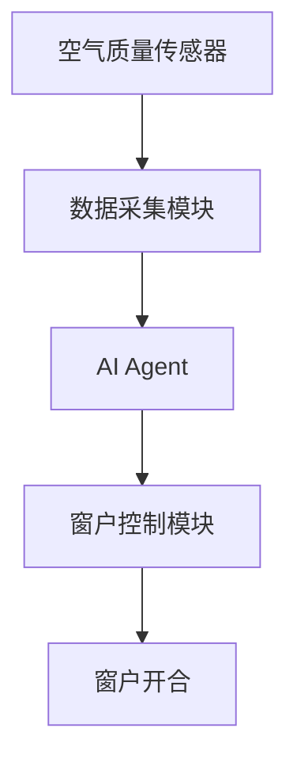
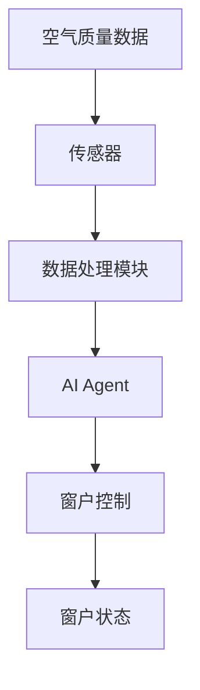

                 

# AI Agent在智能窗户中的室内空气质量控制

> 关键词：AI Agent，智能窗户，室内空气质量，空气质量控制，传感器数据，机器学习

> 摘要：本文探讨了AI Agent在智能窗户中的应用，重点分析了其在室内空气质量控制中的作用。通过传感器数据的实时采集与处理，结合机器学习模型，AI Agent能够智能调节窗户的开合状态，优化室内空气质量。本文从背景、算法、系统架构、项目实战等多个角度进行详细分析，最终得出AI Agent在智能窗户中的实现方案与实际应用效果。

---

# 第1章: 室内空气质量控制的背景与问题

## 1.1 室内空气质量的重要性

### 1.1.1 室内空气质量的定义与影响

室内空气质量（Indoor Air Quality，IAQ）指的是室内空气中污染物的浓度、温度、湿度、气流速度等指标的综合状态。良好的IAQ对人们的健康至关重要，它直接影响到人们的呼吸系统、心血管系统以及整体舒适度。现代建筑中，由于密闭性增强，空气流通不畅，导致室内空气质量问题日益突出。

### 1.1.2 当前室内空气质量控制的主要挑战

传统的空气质量控制方法依赖于机械通风系统，但存在以下问题：
1. **能耗高**：机械通风需要大量能源支持，尤其是在寒冷或炎热地区。
2. **响应迟缓**：传统系统无法实时感知室内空气质量变化，导致调节滞后。
3. **个性化不足**：不同人群对空气质量的需求不同，传统系统难以满足个性化需求。

### 1.1.3 AI技术在空气质量控制中的潜力

AI技术，特别是AI Agent（智能体），能够通过实时感知、分析和决策，实现对室内空气质量的智能化控制。AI Agent可以根据室内环境变化和用户需求，动态调整窗户的开合状态，从而优化空气质量，同时降低能耗。

---

## 1.2 智能窗户的基本概念

### 1.2.1 智能窗户的功能与类型

智能窗户是一种结合了传感器、执行器和智能控制系统的新型窗户，具有以下功能：
1. **实时感知**：内置传感器可以检测室内和室外的温度、湿度、PM2.5、CO2浓度等指标。
2. **智能调节**：根据传感器数据和AI算法，自动调节窗户的开合状态。
3. **远程控制**：通过手机APP或智能家居系统实现远程控制。

常见的智能窗户类型包括：
- **电动智能窗户**：通过电机驱动窗户开合。
- **磁控智能窗户**：利用电磁感应原理实现窗户的智能化控制。

### 1.2.2 智能窗户与传统窗户的主要区别

| 特性                | 传统窗户             | 智能窗户             |
|---------------------|----------------------|----------------------|
| 控制方式            | 手动操作             | 自动化控制           |
| 传感器              | 无                   | 配备多种传感器       |
| 能耗                | 高                   | 低                   |
| 适应性              | 低                   | 高                   |

### 1.2.3 智能窗户在建筑中的应用前景

随着环保意识的增强和智能技术的进步，智能窗户在建筑中的应用前景广阔。它不仅能够提升室内空气质量，还能通过优化通风降低能耗，助力绿色建筑的发展。

---

## 1.3 AI Agent的基本概念

### 1.3.1 AI Agent的定义与分类

AI Agent是一种智能实体，能够感知环境、理解用户需求，并通过自主决策和行动实现目标。根据功能和应用场景，AI Agent可以分为：
1. **简单反射型AI Agent**：基于规则的简单决策。
2. **基于模型的AI Agent**：具备知识库和推理能力，能够进行复杂决策。
3. **目标驱动型AI Agent**：根据目标优化行动。

### 1.3.2 AI Agent的核心功能与特点

AI Agent的核心功能包括：
1. **感知环境**：通过传感器或其他数据源获取环境信息。
2. **理解需求**：分析数据并理解用户需求。
3. **决策与行动**：根据分析结果做出决策，并通过执行器实现行动。

AI Agent的特点：
- **自主性**：能够在没有外部干预的情况下自主运行。
- **反应性**：能够实时感知环境变化并做出反应。
- **学习能力**：通过机器学习不断优化自身的决策模型。

---

## 1.4 AI Agent在智能窗户中的应用

### 1.4.1 AI Agent与智能窗户的结合

AI Agent通过整合智能窗户的传感器数据，分析室内空气质量，并根据结果动态调节窗户的开合状态。例如：
1. **实时监测**：AI Agent通过传感器获取室内和室外空气质量数据。
2. **智能决策**：根据数据和预设目标（如维持CO2浓度在1000 ppm以下），AI Agent决定是否开启窗户。
3. **动态调整**：根据室外空气质量变化，AI Agent动态调整窗户开合时间。

### 1.4.2 AI Agent如何实现室内空气质量控制

AI Agent通过以下步骤实现室内空气质量控制：
1. **数据采集**：获取室内和室外的空气质量数据。
2. **数据分析**：利用机器学习模型预测空气质量变化。
3. **决策制定**：根据预测结果和用户需求，制定窗户的开合策略。
4. **执行控制**：通过智能窗户的执行机构实现窗户的开合。

---

## 1.5 AI Agent与智能窗户的核心概念与联系

### 1.5.1 核心概念原理

AI Agent在智能窗户中的核心原理是通过实时数据采集、分析和决策，实现对窗户的智能控制。以下是其实现流程：

### 1.5.2 核心概念属性特征对比

以下是AI Agent与传统控制系统在空气质量控制中的对比：

| 特性                | AI Agent              | 传统控制系统          |
|---------------------|-----------------------|-----------------------|
| 数据处理能力        | 强大                  | 较弱                  |
| 决策能力            | 高度智能化            | 基于固定规则          |
| 学习能力            | 具备机器学习能力      | 无                    |
| 响应速度            | 快速                  | 较慢                  |

### 1.5.3 ER实体关系图

以下是AI Agent在智能窗户中的实体关系图：

---

## 1.6 总结与展望

本章介绍了室内空气质量控制的重要性，分析了传统方法的不足，并提出了AI Agent在智能窗户中的应用。通过AI Agent的智能决策，智能窗户能够实现对室内空气质量的实时优化，从而提升居住舒适度并降低能耗。

---

接下来，我们将深入探讨AI Agent在智能窗户中的空气质量控制算法原理，包括数据处理、模型训练和决策优化等内容。

