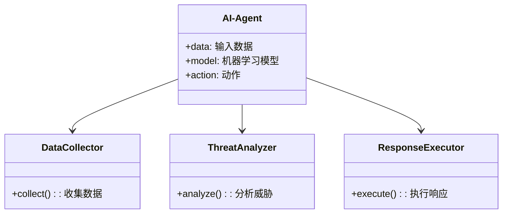
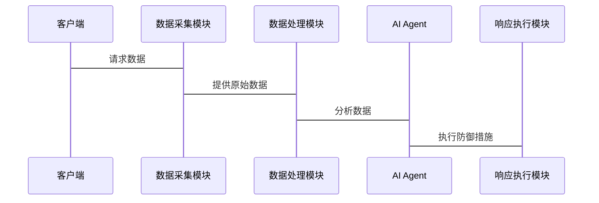

                 


# AI Agent在智能网络安全中的应用

> 关键词：AI Agent, 智能网络安全, 机器学习, 自然语言处理, 网络威胁检测, 自动化响应, 多模态数据处理

> 摘要：本文深入探讨了AI Agent在智能网络安全中的应用，从基本概念到核心技术，再到实际应用场景，系统地分析了AI Agent如何利用机器学习、自然语言处理和多模态数据处理技术提升网络安全能力。文章详细讲解了AI Agent的体系结构、算法原理、系统架构设计，并通过项目实战展示了其实际应用价值。最后，本文总结了当前技术的优势与挑战，并展望了未来的发展方向。

---

## 第1章 AI Agent与智能网络安全概述

### 1.1 AI Agent的基本概念

AI Agent是一种智能体，能够在没有人工干预的情况下感知环境、分析问题并执行任务。与传统安全技术相比，AI Agent具有更高的自主性和适应性，能够实时响应网络安全威胁。

### 1.2 智能网络安全的背景与挑战

随着网络环境的复杂化，网络安全威胁日益增加，传统的被动防御手段已难以应对新型攻击。AI Agent通过智能化手段，能够主动识别和应对威胁，提升网络安全防护能力。

### 1.3 AI Agent在网络安全中的作用

AI Agent通过机器学习算法，能够快速识别异常行为，预测潜在威胁，并自动化执行防御措施，显著提高了网络安全的效率和准确性。

---

## 第2章 AI Agent的核心技术

### 2.1 机器学习技术

#### 2.1.1 监督学习

监督学习通过训练模型识别网络安全威胁。例如，使用线性回归算法（$$y = wx + b$$）进行分类，能够有效识别异常流量。

#### 2.1.2 无监督学习

无监督学习适用于检测未知威胁。聚类算法可以将相似的攻击行为归类，帮助识别潜在的威胁模式。

#### 2.1.3 强化学习

强化学习通过奖励机制优化AI Agent的决策能力，使其在动态环境中做出最优响应。

### 2.2 自然语言处理技术

自然语言处理用于分析安全报告和漏洞数据库，识别潜在威胁。例如，使用词嵌入技术（如Word2Vec）提取文本特征，提高威胁情报的准确性。

### 2.3 多模态数据处理

多模态数据处理整合了结构化数据和非结构化数据，增强了威胁检测的准确性。例如，结合日志数据和网络流量分析，能够更全面地识别攻击行为。

---

## 第3章 AI Agent的体系结构

### 3.1 AI Agent的感知层

感知层负责数据采集和处理。通过多种传感器（如网络流量监控、日志分析）获取数据，并利用特征提取技术识别潜在威胁。

### 3.2 AI Agent的决策层

决策层基于感知层提供的数据，利用机器学习模型进行威胁分析和预测。例如，使用决策树算法（如ID3）进行分类，确定威胁的严重性。

### 3.3 AI Agent的执行层

执行层根据决策层的指令，自动化执行防御措施。例如，通过API调用防火墙关闭可疑端口，阻断攻击。

---

## 第4章 AI Agent在网络安全中的应用

### 4.1 入侵检测

AI Agent通过分析网络流量，识别异常行为，及时发现入侵尝试。

### 4.2 威胁情报分析

AI Agent能够实时分析威胁情报，识别潜在的攻击源和攻击方式。

### 4.3 漏洞挖掘

AI Agent利用自然语言处理技术，分析漏洞数据库，预测潜在漏洞。

### 4.4 安全防护

AI Agent通过自动化响应，执行防御措施，阻止潜在威胁。

---

## 第5章 算法原理

### 5.1 监督学习算法

线性回归模型（$$y = wx + b$$）用于分类问题，识别正常与异常流量。

### 5.2 无监督学习算法

K-means聚类算法用于检测未知威胁，通过聚类分析识别异常行为。

### 5.3 强化学习算法

Q-learning算法通过状态和动作的奖励机制，优化AI Agent的决策能力。

---

## 第6章 系统架构设计

### 6.1 项目背景

项目旨在开发一个基于AI Agent的智能网络安全系统，提升威胁检测和响应能力。

### 6.2 系统功能设计

使用mermaid类图展示系统功能模块，包括数据采集、威胁分析、自动化响应等。



### 6.3 系统架构设计

使用mermaid架构图展示系统架构，包括前端、后端和数据库模块。


### 6.4 接口设计

定义API接口，如RESTful API，用于数据采集和响应执行。

### 6.5 交互流程

使用mermaid序列图展示系统交互流程。



---

## 第7章 项目实战

### 7.1 环境安装

安装Python、TensorFlow、Keras等工具，搭建开发环境。

### 7.2 核心代码实现

实现AI Agent的核心功能，如数据采集、威胁分析和自动化响应。

```python
import tensorflow as tf
from tensorflow.keras import layers

# 数据预处理
data = ...  # 输入数据

# 模型构建
model = tf.keras.Sequential([
    layers.Dense(64, activation='relu'),
    layers.Dense(1, activation='sigmoid')
])

# 模型训练
model.compile(optimizer='adam', loss='binary_crossentropy', metrics=['accuracy'])
model.fit(data, labels, epochs=10, batch_size=32)
```

### 7.3 代码解读与分析

解释代码功能，展示如何实现AI Agent的核心算法。

### 7.4 案例分析

分析一个具体案例，说明AI Agent如何识别并响应网络安全威胁。

### 7.5 项目小结

总结项目经验，分析优缺点，并提出改进建议。

---

## 第8章 总结与展望

### 8.1 全文总结

回顾全文，总结AI Agent在智能网络安全中的应用价值和优势。

### 8.2 技术优缺点

分析当前技术的优缺点，如计算资源消耗高、模型解释性差等问题。

### 8.3 未来展望

展望AI Agent的发展方向，如模型优化、多模态数据处理能力提升等。

---

## 附录

### 附录A 参考文献

列出参考文献，提供进一步学习的资源。

### 附录B 工具推荐

推荐相关的工具和技术，如TensorFlow、Keras、Scikit-learn等。

---

通过以上结构，本文系统地探讨了AI Agent在智能网络安全中的应用，从技术原理到实际应用，为读者提供了全面的视角和深入的分析。

