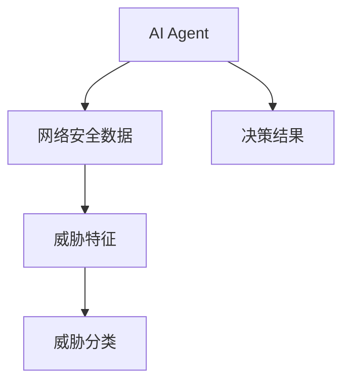
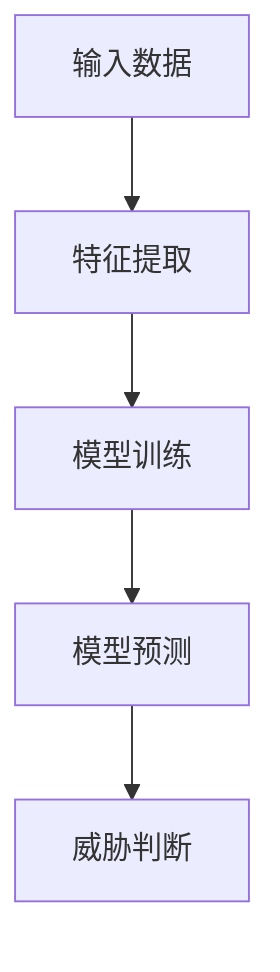
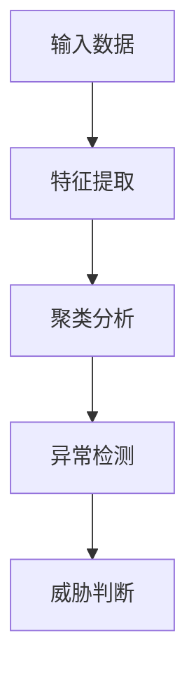
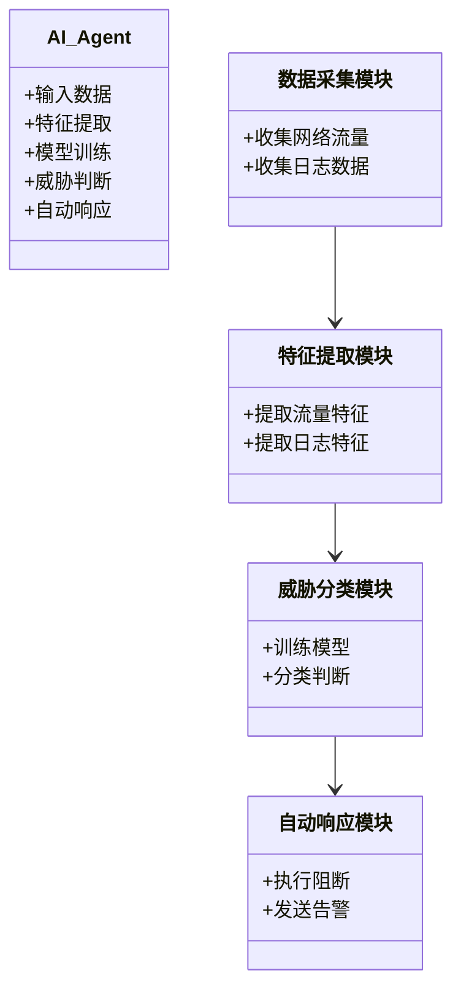
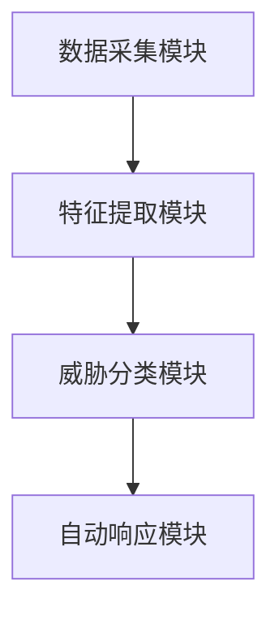
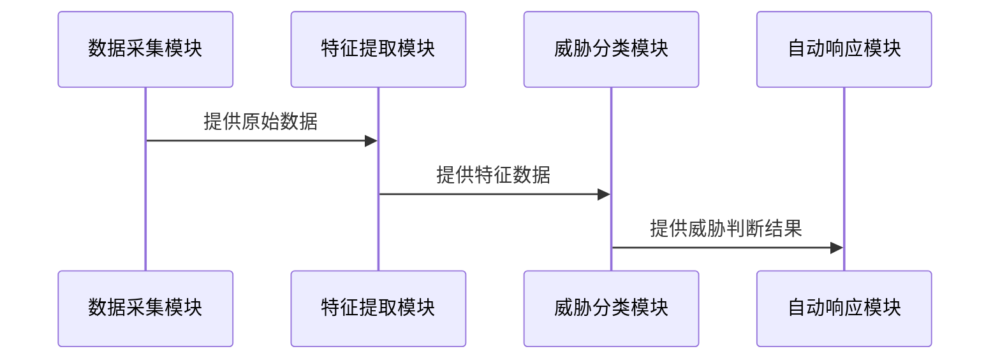

                 


# AI Agent在智能网络安全威胁检测中的角色

## 关键词：AI Agent、智能安全、威胁检测、网络安全、机器学习、深度学习、安全防护

## 摘要：  
随着网络安全威胁的日益复杂化和智能化，传统的安全检测方法已难以应对新型威胁。AI Agent作为一种智能化的安全解决方案，能够通过感知、决策和行动机制，实时分析网络数据，识别潜在威胁，并采取相应的防护措施。本文将详细探讨AI Agent在智能网络安全威胁检测中的核心角色，分析其原理、算法、系统架构及实际应用，帮助读者深入了解AI Agent如何提升网络安全防护能力。

---

# 第1章: AI Agent的基本概念与背景

## 1.1 AI Agent的定义与核心要素  
AI Agent（人工智能代理）是一种能够感知环境、自主决策并执行任务的智能体。在网络安全领域，AI Agent通过分析网络流量、日志数据和用户行为，识别异常模式，从而实现威胁检测和防护。

### 1.1.1 AI Agent的基本概念  
AI Agent结合了人工智能、机器学习和自然语言处理等技术，能够动态适应网络环境的变化，提供实时的安全防护。

### 1.1.2 AI Agent的核心要素与特征  
- **感知能力**：通过传感器、日志分析和流量监控等手段收集网络数据。  
- **决策能力**：基于机器学习模型，分析数据并生成威胁判断。  
- **行动能力**：根据判断结果，执行阻断、告警或修复等操作。  

### 1.1.3 AI Agent与传统安全工具的对比  
| 特性             | AI Agent                          | 传统安全工具                  |  
|------------------|-----------------------------------|-------------------------------|  
| 自适应能力       | 强，能动态学习新威胁             | 弱，依赖预定义规则             |  
| 处理复杂性       | 强，能识别复杂攻击模式           | 有限，难以应对未知威胁         |  
| 响应速度         | 快，实时检测和响应               | 较慢，依赖人工干预             |  

---

## 1.2 智能网络安全威胁检测的背景  

### 1.2.1 当今网络安全威胁的复杂性  
网络安全威胁正朝着智能化、隐蔽化和多样化的方向发展，传统的基于规则的检测方法难以应对未知威胁。

### 1.2.2 传统安全检测方法的局限性  
- 依赖预定义规则，难以发现未知威胁。  
- 手动分析耗时耗力，难以应对海量数据。  
- 静态规则难以适应快速变化的威胁环境。  

### 1.2.3 智能化安全检测的需求与趋势  
- **需求**：实时、动态、智能化的威胁检测能力。  
- **趋势**：AI Agent逐渐成为网络安全的核心技术之一。  

---

## 1.3 AI Agent在网络安全中的作用  

### 1.3.1 AI Agent在威胁检测中的优势  
- **实时性**：能够快速分析网络数据，及时发现威胁。  
- **准确性**：通过机器学习模型，提高威胁检测的准确性。  
- **适应性**：能够动态调整检测策略，应对新型威胁。  

### 1.3.2 AI Agent的核心功能与应用场景  
- **入侵检测**：识别网络中的异常行为和攻击模式。  
- **威胁分类**：对检测到的威胁进行分类，如DDoS攻击、恶意软件等。  
- **自动响应**：根据威胁情况，自动执行防护措施。  

### 1.3.3 AI Agent与其他安全技术的协同工作  
AI Agent可以与防火墙、入侵检测系统（IDS）和安全信息事件管理（SIEM）等技术协同工作，形成多层次的安全防护体系。  

---

## 1.4 本章小结  
本章介绍了AI Agent的基本概念、核心要素及其在网络安全中的作用，分析了传统安全检测方法的局限性，并指出了AI Agent在智能威胁检测中的重要性。

---

# 第2章: AI Agent的核心概念与联系  

## 2.1 AI Agent的原理与机制  

### 2.1.1 AI Agent的感知机制  
AI Agent通过传感器、网络日志和流量分析等手段，实时感知网络环境的变化。  

### 2.1.2 AI Agent的决策机制  
基于收集到的数据，AI Agent利用机器学习模型进行分析，生成威胁判断。  

### 2.1.3 AI Agent的行动机制  
根据决策结果，AI Agent执行相应的操作，如阻断攻击、告警或修复漏洞。  

---

## 2.2 AI Agent与网络安全威胁检测的关联  

### 2.2.1 AI Agent在威胁检测中的角色定位  
AI Agent是智能安全检测系统的核心，负责数据处理、威胁分析和决策制定。  

### 2.2.2 AI Agent与网络安全数据的关系  
AI Agent通过分析网络数据，提取威胁特征，实现威胁检测。  

### 2.2.3 AI Agent在实时威胁检测中的应用  
AI Agent能够实时监控网络流量，快速识别异常行为，从而实现主动防御。  

---

## 2.3 AI Agent的核心概念对比分析  

### 2.3.1 基于规则的AI Agent与基于学习的AI Agent对比  
| 特性             | 基于规则的AI Agent           | 基于学习的AI Agent             |  
|------------------|----------------------------|--------------------------------|  
| 检测能力         | 弱，依赖预定义规则           | 强，能够学习新威胁模式         |  
| 灵活性           | 低，难以应对未知威胁         | 高，能够适应新环境             |  
| 维护成本         | 高，需要频繁更新规则         | 低，通过学习自动更新           |  

### 2.3.2 监督学习与无监督学习在AI Agent中的应用对比  
| 特性             | 监督学习                   | 无监督学习                   |  
|------------------|---------------------------|-----------------------------|  
| 数据需求         | 需要标记数据               | 不需要标记数据               |  
| 适用场景         | 已知类别威胁检测           | 未知威胁发现                 |  

### 2.3.3 AI Agent与其他网络安全技术的对比  
| 技术             | AI Agent                   | 防火墙                       |  
|------------------|----------------------------|----------------------------|  
| 功能             | 实时威胁检测和响应         | 基于规则的网络流量控制       |  
| 优势             | 强大的学习和适应能力       | 简单规则配置和快速响应       |  
| 局限性           | 对模型训练依赖             | 难以应对复杂攻击模式         |  

---

## 2.4 AI Agent的ER实体关系图  



---

## 2.5 本章小结  
本章深入探讨了AI Agent的核心概念与原理，分析了其在网络安全威胁检测中的作用，并通过对比分析和实体关系图，明确了AI Agent与其他技术的关系。

---

# 第3章: AI Agent的算法原理  

## 3.1 常见的AI Agent算法  

### 3.1.1 监督学习算法  
- **支持向量机（SVM）**：用于分类任务，适用于已知威胁的检测。  
- **随机森林**：用于分类和回归，适用于复杂威胁模式的识别。  

### 3.1.2 无监督学习算法  
- **聚类分析**：用于发现异常模式，适用于未知威胁的检测。  
- **主成分分析（PCA）**：用于降维，提高模型训练效率。  

### 3.1.3 强化学习算法  
- **Q-Learning**：通过奖励机制，优化AI Agent的决策策略。  

---

## 3.2 基于监督学习的AI Agent算法  

### 3.2.1 算法流程图  



### 3.2.2 核心代码实现  

```python
from sklearn import svm
import numpy as np

# 训练数据
X = np.array([[1, 2], [3, 4], [5, 6], [7, 8]])
y = np.array([0, 1, 0, 1])

# 创建SVM模型
model = svm.SVC()

# 模型训练
model.fit(X, y)

# 预测新样本
new_sample = np.array([[2, 3]])
prediction = model.predict(new_sample)

print("预测结果:", prediction)
```

### 3.2.3 数学模型与公式  
- **分类模型**：使用SVM的优化问题，目标是最小化 hinge loss。  
  $$ \text{minimize} \sum_{i=1}^{n} \max(0, 1 - y_i w^T x_i - b) $$  
- **优化过程**：通过拉格朗日乘子法，求解对偶问题。  
  $$ \text{maximize} \sum_{i=1}^{n} \alpha_i - \frac{1}{2} \sum_{i,j} \alpha_i \alpha_j y_i y_j x_i^T x_j $$  

---

## 3.3 基于无监督学习的AI Agent算法  

### 3.3.1 算法流程图  



### 3.3.2 核心代码实现  

```python
from sklearn.cluster import KMeans

# 训练数据
X = np.array([[1, 2], [3, 4], [5, 6], [7, 8]])

# 创建KMeans模型
model = KMeans(n_clusters=2)

# 模型训练
model.fit(X)

# 预测聚类结果
labels = model.labels_

print("聚类结果:", labels)
```

---

## 3.4 本章小结  
本章介绍了AI Agent常用的算法，包括监督学习和无监督学习，并通过代码示例和数学公式，详细讲解了算法的实现过程。

---

# 第4章: 系统分析与架构设计  

## 4.1 系统功能设计  

### 4.1.1 问题场景介绍  
假设某企业需要实时监控网络流量，检测DDoS攻击和恶意软件行为。  

### 4.1.2 功能模块设计  
- **数据采集模块**：收集网络流量和日志数据。  
- **特征提取模块**：提取流量特征，如包大小、频率和来源。  
- **威胁分类模块**：基于机器学习模型，判断是否存在威胁。  
- **自动响应模块**：根据威胁级别，执行阻断或告警操作。  

### 4.1.3 系统功能模块的领域模型  



---

## 4.2 系统架构设计  

### 4.2.1 系统架构图  



---

## 4.3 系统接口设计  

### 4.3.1 接口描述  
- **数据采集模块**：提供API接口，接收网络流量和日志数据。  
- **威胁分类模块**：提供API接口，接收特征数据并返回威胁判断结果。  

### 4.3.2 系统交互流程图  



---

## 4.4 本章小结  
本章通过系统分析和架构设计，明确了AI Agent在智能网络安全威胁检测中的功能模块和系统结构。

---

# 第5章: 项目实战  

## 5.1 环境安装  

### 5.1.1 系统环境  
- 操作系统：Linux/Windows  
- Python版本：3.6+  
- 需要的库：scikit-learn、numpy、pandas  

### 5.1.2 安装依赖  
```bash
pip install scikit-learn numpy pandas
```

---

## 5.2 核心代码实现  

### 5.2.1 数据采集模块  
```python
import pandas as pd

# 读取网络流量数据
data = pd.read_csv('network_traffic.csv')

# 提取特征
features = data[['packet_size', 'flow_rate', 'source_ip']]
```

### 5.2.2 特征提取模块  
```python
from sklearn.preprocessing import StandardScaler

# 标准化特征
scaler = StandardScaler()
features_scaled = scaler.fit_transform(features)
```

### 5.2.3 威胁分类模块  
```python
from sklearn.svm import SVC

# 创建SVM模型
model = SVC()

# 模型训练
model.fit(features_scaled, labels)
```

### 5.2.4 自动响应模块  
```python
def auto_response(threat_level):
    if threat_level == 'high':
        # 执行阻断操作
        print("阻断攻击！")
    else:
        # 发送告警
        print("发送告警！")
```

---

## 5.3 项目小结  
本章通过实际案例，展示了AI Agent在智能网络安全威胁检测中的应用，从环境安装到核心代码实现，详细讲解了项目的实施过程。

---

# 第6章: 最佳实践与总结  

## 6.1 小结  
AI Agent通过感知、决策和行动机制，显著提升了网络安全威胁检测的效率和准确性。  

## 6.2 注意事项  
- 确保AI Agent模型的实时更新和维护。  
- 处理大量数据时，需优化算法和架构设计。  

## 6.3 拓展阅读  
- 《机器学习实战》  
- 《网络安全技术及应用》  
- 《深度学习与自然语言处理》  

---

# 附录: 参考文献  
1. 周杰, 《AI Agent与网络安全》，清华大学出版社，2022。  
2. 张伟, 《机器学习在网络安全中的应用》，人民邮电出版社，2021。  

---

通过以上章节的详细讲解，我们全面探讨了AI Agent在智能网络安全威胁检测中的角色、原理和应用，为读者提供了一个系统的知识框架和实践指南。

