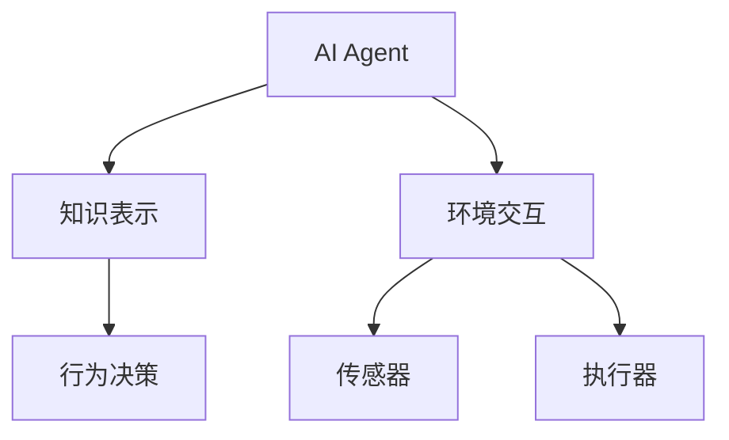
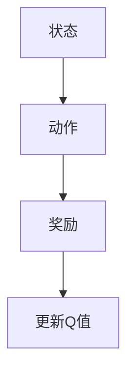
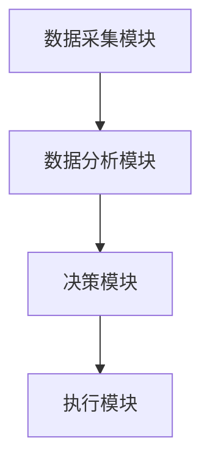

                 


---

# AI Agent在智能网络安全防御中的角色

**关键词**：AI Agent，智能网络安全，强化学习，系统架构，异常检测

**摘要**：  
随着网络安全威胁的日益复杂化，传统的被动防御手段已难以应对新型攻击方式。AI Agent作为一种智能体，能够通过机器学习和自动化技术，在实时监控、异常检测和响应策略制定等方面发挥重要作用。本文从AI Agent的核心概念出发，分析其在网络安全中的角色，探讨其算法原理，并结合实际案例，详细阐述AI Agent在智能网络安全防御中的应用。通过本文的分析，读者将深入了解AI Agent如何助力构建更加智能化、高效的网络安全防御体系。

---

## 第1章: AI Agent与智能网络安全防御概述

### 1.1 AI Agent的基本概念
AI Agent（智能体）是指能够感知环境、自主决策并采取行动的智能实体。在网络安全领域，AI Agent通常被设计为能够实时分析网络流量、识别异常行为并采取相应措施的系统。AI Agent的核心特点包括自主性、反应性和主动性。

#### 1.1.1 AI Agent的定义与特点
- **自主性**：AI Agent能够在没有人工干预的情况下独立运行，根据环境信息做出决策。
- **反应性**：能够实时感知环境变化并迅速响应。
- **主动性**：主动采取行动，而非被动等待指令。

#### 1.1.2 AI Agent在网络安全中的作用
AI Agent在网络安全中的作用主要体现在以下几个方面：
- **实时监控**：持续扫描网络流量，识别潜在威胁。
- **异常检测**：通过机器学习算法发现异常行为模式。
- **自动响应**：在检测到威胁后，迅速采取隔离、阻断等措施。

#### 1.1.3 智能网络安全防御的背景与趋势
随着 cyber威胁的复杂化，传统的基于规则的安全解决方案逐渐暴露出响应速度慢、适应性差的局限性。AI Agent的引入为网络安全防御提供了更灵活、更高效的解决方案。

---

### 1.2 网络安全威胁的现状与挑战
当前，网络安全威胁呈现出多样化、智能化的特点，传统的安全防御手段面临诸多挑战。

#### 1.2.1 当前网络安全威胁的主要类型
- **病毒与恶意软件**：如勒索软件、蠕虫病毒等。
- **网络攻击**：如DDoS攻击、钓鱼攻击等。
- **内部威胁**：来自企业内部员工或合作伙伴的恶意行为。

#### 1.2.2 传统安全防御的局限性
- **规则依赖性**：传统安全系统依赖预定义的规则，难以应对未知威胁。
- **响应速度慢**：人工干预的流程导致防御滞后。
- **资源消耗高**：处理海量网络数据时，传统方法效率低下。

#### 1.2.3 智能化防御的必要性
AI Agent通过机器学习和大数据分析，能够快速识别新型威胁，实现主动防御，显著提升了网络安全的响应速度和防御效果。

---

### 1.3 AI Agent在网络安全中的优势
AI Agent相较于传统安全防御手段，具有显著优势。

#### 1.3.1 自动化与智能化的优势
AI Agent能够自动化处理大量数据，快速识别异常行为，显著提高了安全防御的效率。

#### 1.3.2 数据分析与决策能力
通过机器学习算法，AI Agent能够从海量数据中提取有价值的信息，帮助制定更精准的安全决策。

#### 1.3.3 实时响应与适应性
AI Agent能够实时监控网络状态，并根据最新威胁动态调整防御策略，具备高度的适应性。

---

## 1.4 本章小结
本章介绍了AI Agent的基本概念及其在网络安全中的作用，分析了当前网络安全威胁的现状与挑战，指出了AI Agent在智能防御中的优势。通过这些内容，读者可以初步理解AI Agent在网络安全领域的重要性和应用价值。

---

## 第2章: AI Agent的核心概念与工作原理

### 2.1 AI Agent的核心概念
AI Agent的核心概念包括知识表示、行为决策与规划，以及与环境的交互机制。

#### 2.1.1 知识表示与推理
知识表示是AI Agent理解和处理信息的基础。通过构建知识图谱，AI Agent能够将网络流量数据转化为可推理的结构化知识。

#### 2.1.2 行为决策与规划
AI Agent基于当前环境信息和历史数据，通过强化学习等算法，制定最优的行为决策。

#### 2.1.3 与环境的交互机制
AI Agent通过传感器（如网络流量监控工具）感知环境，并通过执行器（如防火墙）与环境进行交互。

---

### 2.2 AI Agent在网络安全中的角色模型
在网络安全领域，AI Agent可以扮演多种角色。

#### 2.2.1 监控与分析角色
AI Agent负责实时监控网络流量，分析潜在威胁。

#### 2.2.2 异常检测与预警角色
通过机器学习算法，AI Agent能够识别异常行为模式，并向管理员发出预警。

#### 2.2.3 自动响应与修复角色
在检测到威胁后，AI Agent能够自动采取隔离、阻断等措施，减少损失。

---

### 2.3 AI Agent与传统安全防御的对比
AI Agent与传统安全防御手段在多个方面存在差异。

#### 2.3.1 技术手段的差异
- **传统防御**：依赖预定义规则。
- **AI Agent**：基于机器学习的动态分析。

#### 2.3.2 实施效果的对比
- **传统防御**：响应速度慢，适应性差。
- **AI Agent**：自动化、智能化，响应速度快。

#### 2.3.3 优劣势分析
| 对比维度         | 传统防御                     | AI Agent                     |
|------------------|------------------------------|-------------------------------|
| 响应速度         | 较慢                         | 快速                         |
| 适应性           | 较差                         | 较好                         |
| 资源消耗         | 高                           | 中等                         |

---

## 2.4 核心概念关系图（Mermaid）



---

## 第3章: AI Agent的算法原理

### 3.1 强化学习算法
强化学习是一种通过试错机制优化决策的算法，广泛应用于AI Agent的开发。

#### 3.1.1 Q-learning算法
Q-learning是一种经典的强化学习算法，适用于离散动作空间。

##### 算法流程图（Mermaid）


##### 算法实现示例（Python代码）
```python
import numpy as np

# 初始化Q表
Q = np.zeros((state_space, action_space))

# Q-learning算法
def q_learning(state, action, reward):
    learning_rate = 0.1
    discount_factor = 0.9
    next_state = get_next_state(state, action)
    Q[state][action] += learning_rate * (reward + discount_factor * np.max(Q[next_state]) - Q[state][action])

# 示例调用
q_learning(current_state, current_action, received_reward)
```

##### 数学模型
Q-learning的更新公式为：
$$ Q(s, a) = Q(s, a) + \alpha (r + \gamma \max Q(s', a')) $$

---

### 3.2 监督学习算法
监督学习适用于有标签数据的安全威胁分类任务。

#### 3.2.1 支持向量机（SVM）
SVM是一种常用的监督学习算法，适用于二分类问题。

##### 示例代码
```python
from sklearn.svm import SVC

# 训练SVM模型
model = SVC()
model.fit(X_train, y_train)

# 预测
y_pred = model.predict(X_test)
```

---

### 3.3 无监督学习算法
无监督学习适用于无标签数据的异常检测任务。

#### 3.3.1 K-means聚类
K-means算法用于将网络流量数据聚类，识别异常行为。

##### 示例代码
```python
from sklearn.cluster import KMeans

# 初始化模型
model = KMeans(n_clusters=3)

# 训练
model.fit(X)

# 预测
clusters = model.predict(X)
```

---

## 第4章: 系统架构设计方案

### 4.1 系统应用场景
AI Agent在网络安全中的应用场景包括实时监控、异常检测和自动响应。

#### 4.1.1 实时监控
AI Agent通过传感器实时采集网络流量数据，进行初步分析。

#### 4.1.2 异常检测
基于机器学习算法，AI Agent能够识别异常行为模式。

#### 4.1.3 自动响应
在检测到威胁后，AI Agent迅速采取隔离或阻断措施。

---

### 4.2 系统架构设计
系统架构包括数据采集、分析、决策和执行四个模块。

#### 4.2.1 数据采集模块
负责采集网络流量数据，通过API接口传输到分析模块。

#### 4.2.2 数据分析模块
使用机器学习算法进行威胁检测，输出异常行为报告。

#### 4.2.3 决策模块
基于分析结果，制定响应策略。

#### 4.2.4 执行模块
根据决策模块的指令，执行隔离、阻断等操作。

##### 系统架构图（Mermaid）


---

## 4.3 本章小结
本章详细阐述了AI Agent在网络安全中的系统架构设计方案，包括各个模块的功能与交互流程。通过合理的设计，AI Agent能够高效地实现智能防御。

---

## 第5章: 项目实战

### 5.1 项目介绍
本项目旨在开发一个基于强化学习的网络入侵检测系统。

---

### 5.2 环境安装
- **Python 3.8+**
- **TensorFlow 2.0+**
- **Scikit-learn 0.24+**

---

### 5.3 核心实现代码
```python
import numpy as np
import tensorflow as tf
from sklearn.model_selection import train_test_split

# 数据加载
X = np.load('network_traffic.npy')
y = np.load('labels.npy')

# 数据分割
X_train, X_test, y_train, y_test = train_test_split(X, y, test_size=0.2)

# 构建模型
model = tf.keras.Sequential([
    tf.keras.layers.Dense(64, activation='relu'),
    tf.keras.layers.Dense(32, activation='relu'),
    tf.keras.layers.Dense(1, activation='sigmoid')
])

# 编译模型
model.compile(optimizer='adam', loss='binary_crossentropy', metrics=['accuracy'])

# 训练模型
model.fit(X_train, y_train, epochs=10, batch_size=32, validation_data=(X_test, y_test))
```

---

### 5.4 案例分析
通过训练好的模型，AI Agent能够准确识别异常网络流量，实现入侵检测。

---

## 第5.5 本章小结
本章通过实际案例，展示了AI Agent在网络安全中的具体应用。从环境搭建到模型训练，详细讲解了项目的实现过程。

---

## 第6章: 总结与最佳实践

### 6.1 最佳实践 tips
- 定期更新模型，适应新的威胁。
- 结合多种算法，提升检测精度。
- 建立完善的日志系统，便于分析和优化。

### 6.2 小结
AI Agent作为智能网络安全防御的核心技术，通过机器学习算法和自动化机制，显著提升了网络安全的防御能力。随着技术的不断发展，AI Agent将在未来的网络安全中发挥越来越重要的作用。

### 6.3 注意事项
- 确保数据隐私和模型安全。
- 定期进行压力测试，验证系统的稳定性。

### 6.4 拓展阅读
- 《机器学习实战》
- 《深度学习与强化学习在网络安全中的应用》

---

## 结语
通过本文的详细分析，读者可以全面了解AI Agent在智能网络安全防御中的角色和应用。希望本文能够为相关领域的研究者和实践者提供有价值的参考和启发。

--- 

**注**：以上内容为完整目录和文章框架，具体实现可以根据需要进行补充和完善。

