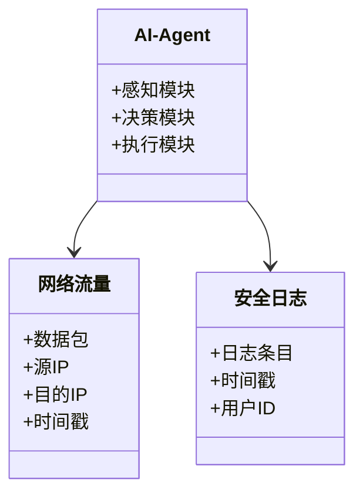
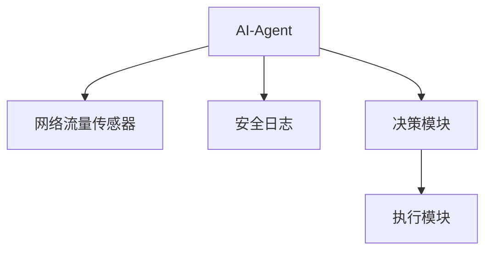
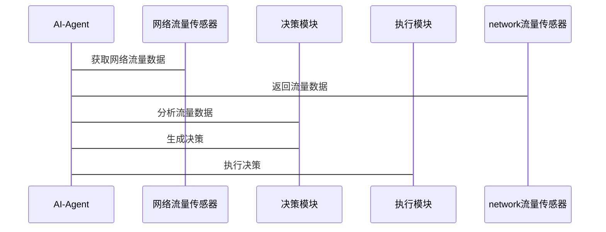

                 


# AI Agent在智能网络攻击检测中的角色

> 关键词：AI Agent, 智能网络攻击检测, 机器学习, 深度学习, 入侵检测系统

> 摘要：AI Agent（人工智能代理）在智能网络攻击检测中扮演着越来越重要的角色。本文将详细探讨AI Agent的核心原理、技术实现、算法原理、系统架构以及实际应用案例。通过分析AI Agent在网络安全中的优势，结合具体的算法实现和系统设计，本文旨在为读者提供一个全面的视角，理解AI Agent如何提升网络攻击检测的效率和准确性。

---

## 第1章: AI Agent的基本概念与背景介绍

### 1.1 AI Agent的定义与核心概念

AI Agent（人工智能代理）是一种能够感知环境、做出决策并采取行动的智能实体。它能够通过学习和推理，自动完成特定任务，是人工智能领域的重要研究方向之一。

#### 1.1.1 什么是AI Agent

AI Agent可以是软件程序、机器人或其他智能设备，其核心目标是通过感知环境信息，自主决策并执行任务。在网络安全领域，AI Agent主要用于检测和应对网络攻击。

#### 1.1.2 AI Agent的核心属性与特征

- **自主性**：能够在没有人为干预的情况下独立运行。
- **反应性**：能够实时感知环境变化并做出响应。
- **学习能力**：通过机器学习算法不断优化自身的检测和应对能力。
- **推理能力**：能够基于已有信息进行推理和决策。

#### 1.1.3 AI Agent在网络安全中的定位与作用

AI Agent在网络安全中主要负责实时监控网络流量、分析日志数据、检测异常行为，并在发现潜在威胁时采取相应的防御措施。它能够显著提升安全检测的效率和准确性。

### 1.2 网络攻击检测的背景与挑战

#### 1.2.1 当前网络攻击的主要形式

- **病毒和恶意软件**：通过感染设备传播，窃取数据或破坏系统。
- **DDoS攻击**：通过大量流量攻击目标，导致服务中断。
- **钓鱼攻击**：通过欺骗手段获取用户的敏感信息。
- **内部威胁**：由组织内部人员发起的攻击。

#### 1.2.2 网络攻击检测的传统方法与局限性

传统的网络攻击检测方法包括基于规则的检测、统计分析和简单的模式匹配。然而，这些方法在面对复杂多变的攻击手段时往往显得力不从心，容易漏报或误报。

#### 1.2.3 AI Agent在提升网络攻击检测中的优势

AI Agent能够通过机器学习算法，从海量数据中提取特征，识别异常模式，并实时做出响应。它不仅能够处理已知威胁，还能够发现新的、未知的攻击模式。

---

## 第2章: AI Agent的核心原理与技术实现

### 2.1 AI Agent的核心原理

AI Agent的核心原理包括感知、决策和执行三个主要阶段。它能够通过传感器或其他数据源获取环境信息，利用机器学习模型进行分析和推理，最后做出相应的决策并执行行动。

#### 2.1.1 AI Agent的感知机制

AI Agent通过多种方式感知网络环境，包括：

- **流量监控**：实时监控网络流量，分析数据包的特征。
- **日志分析**：读取系统日志，发现异常行为。
- **行为分析**：通过用户行为分析，识别潜在的威胁。

#### 2.1.2 AI Agent的决策机制

AI Agent的决策机制基于机器学习模型，主要包括：

- **分类模型**：将数据分类为正常或异常。
- **回归模型**：预测未来的行为趋势。
- **强化学习**：通过奖励机制优化决策策略。

#### 2.1.3 AI Agent的执行机制

AI Agent在做出决策后，会采取相应的行动，包括：

- **发出警报**：通知安全团队潜在威胁。
- **自动响应**：采取自动化的防御措施，如断开受感染设备的网络连接。

### 2.2 AI Agent的关键技术

#### 2.2.1 机器学习在AI Agent中的应用

机器学习是AI Agent的核心技术之一，主要包括监督学习、无监督学习和强化学习。

- **监督学习**：通过标记好的数据训练模型，识别正常和异常行为。
- **无监督学习**：在无标签数据中发现隐藏的模式和异常。
- **强化学习**：通过奖励机制优化AI Agent的决策策略。

#### 2.2.2 自然语言处理在AI Agent中的应用

自然语言处理技术用于分析文本数据，如安全日志和用户行为，帮助AI Agent更好地理解上下文信息。

#### 2.2.3 强化学习在AI Agent中的应用

强化学习用于优化AI Agent的决策过程，使其在复杂的网络环境中能够做出更优的选择。

### 2.3 AI Agent的算法实现

#### 2.3.1 基于监督学习的网络攻击检测

- **分类算法**：如支持向量机（SVM）、随机森林（Random Forest）等。
- **训练数据**：需要标记好的正常和异常数据。
- **实现流程**：
  1. 收集网络流量数据。
  2. 标记数据为正常或异常。
  3. 使用训练好的模型进行分类。

#### 2.3.2 基于无监督学习的网络攻击检测

- **聚类算法**：如K-means、DBSCAN等。
- **实现流程**：
  1. 收集网络流量数据。
  2. 使用聚类算法发现异常簇。

#### 2.3.3 基于强化学习的网络攻击检测

- **强化学习框架**：如Q-Learning、Deep Q-Network等。
- **实现流程**：
  1. 定义状态空间、动作空间和奖励函数。
  2. 通过与环境交互优化策略。

---

## 第3章: AI Agent在智能网络攻击检测中的应用

### 3.1 AI Agent在网络流量分析中的应用

#### 3.1.1 流量特征提取与异常检测

- **特征提取**：提取流量数据中的关键特征，如数据包大小、频率、源目的IP等。
- **异常检测**：通过机器学习模型识别异常流量模式。

#### 3.1.2 基于深度学习的流量分类

- **深度学习模型**：如卷积神经网络（CNN）、长短期记忆网络（LSTM）等。
- **实现流程**：
  1. 收集和预处理流量数据。
  2. 构建深度学习模型进行训练。
  3. 使用模型进行实时流量分类。

#### 3.1.3 流量异常检测的案例分析

- **案例**：某企业网络遭受DDoS攻击，AI Agent通过流量分析及时发现并发出警报。

### 3.2 AI Agent在入侵检测系统中的应用

#### 3.2.1 入侵检测系统的基本原理

入侵检测系统（IDS）通过监控网络或系统中的事件，检测潜在的入侵行为。

#### 3.2.2 AI Agent在入侵检测中的优势

- **高准确性**：通过机器学习算法减少误报和漏报。
- **实时性**：能够快速响应潜在威胁。

#### 3.2.3 典型入侵检测系统的AI Agent实现

- **实现案例**：使用AI Agent对网络中的异常行为进行实时监控和分类。

### 3.3 AI Agent在恶意代码检测中的应用

#### 3.3.1 恶意代码特征分析

- **静态分析**：分析程序的静态特征，如文件结构、API调用等。
- **动态分析**：分析程序运行时的行为，如内存使用、网络通信等。

#### 3.3.2 基于AI的恶意代码检测算法

- **算法选择**：使用深度学习模型，如卷积神经网络（CNN）进行恶意代码分类。
- **实现流程**：
  1. 收集恶意代码样本。
  2. 使用CNN模型进行训练。
  3. 部署模型进行实时检测。

#### 3.3.3 案例分析：AI Agent在恶意代码检测中的实际应用

- **案例**：某企业服务器感染了恶意软件，AI Agent通过分析程序行为及时检测并隔离了威胁。

---

## 第4章: AI Agent的系统架构与设计

### 4.1 AI Agent的系统架构

#### 4.1.1 领域模型类图



#### 4.1.2 系统架构图



### 4.2 系统接口与交互流程

#### 4.2.1 系统接口设计

- **输入接口**：接收网络流量数据和安全日志。
- **输出接口**：发出警报和执行指令。

#### 4.2.2 系统交互流程



---

## 第5章: 项目实战与案例分析

### 5.1 环境安装与配置

#### 5.1.1 系统环境

- 操作系统：Linux（如Ubuntu 20.04）
- 开发工具：Python 3.8以上版本，Jupyter Notebook
- 依赖库：Scikit-learn、TensorFlow、PyTorch等

#### 5.1.2 数据集准备

- 数据来源：公开的网络安全数据集（如KDD Cup 1999数据集）
- 数据预处理：清洗数据、特征工程

### 5.2 核心功能实现

#### 5.2.1 流量分类模型实现

```python
from sklearn.svm import SVC
from sklearn.model_selection import train_test_split
from sklearn.metrics import accuracy_score

# 数据预处理
X = ... # 特征数据
y = ... # 标签

# 划分训练集和测试集
X_train, X_test, y_train, y_test = train_test_split(X, y, test_size=0.2)

# 训练模型
model = SVC()
model.fit(X_train, y_train)

# 模型评估
print("Accuracy:", accuracy_score(y_test, model.predict(X_test)))
```

#### 5.2.2 恶意代码检测实现

```python
import tensorflow as tf
from tensorflow.keras import layers

# 构建CNN模型
model = tf.keras.Sequential([
    layers.Conv2D(32, (3,3), activation='relu', input_shape=(img_height, img_width, 1)),
    layers.MaxPooling2D((2,2)),
    layers.Conv2D(64, (3,3), activation='relu'),
    layers.MaxPooling2D((2,2)),
    layers.Flatten(),
    layers.Dense(64, activation='relu'),
    layers.Dense(2, activation='softmax')
])

# 编译模型
model.compile(optimizer='adam', loss='sparse_categorical_crossentropy', metrics=['accuracy'])

# 训练模型
model.fit(x_train, y_train, epochs=10, validation_data=(x_test, y_test))
```

### 5.3 案例分析与总结

#### 5.3.1 案例分析

- **案例**：某企业网络遭受未知恶意软件攻击，AI Agent通过深度学习模型成功检测并阻止了攻击。

#### 5.3.2 项目总结

AI Agent在智能网络攻击检测中的应用显著提升了检测的准确性和效率，能够有效应对复杂的网络安全威胁。

---

## 第6章: 最佳实践与未来发展

### 6.1 最佳实践

- **数据质量**：确保训练数据的多样性和代表性。
- **模型更新**：定期更新模型，应对新的威胁。
- **人机协作**：结合AI Agent和人工分析，提升检测效果。

### 6.2 未来发展方向

- **多模态学习**：结合文本、图像等多种数据源进行检测。
- **自适应防御**：AI Agent能够根据环境变化自适应调整防御策略。
- **边缘计算**：在边缘设备中部署AI Agent，实现本地化的实时检测。

---

## 第7章: 结语

AI Agent在智能网络攻击检测中的应用前景广阔，随着人工智能技术的不断进步，AI Agent将能够在更复杂的网络环境中发挥更大的作用，为网络安全提供更有力的保障。

---

## 参考文献

- KDD Cup 1999 数据集
- TensorFlow 官方文档
- Scikit-learn 官方文档
- 《机器学习实战》
- 《深度学习》

---

## 附录: 代码示例

### 附录A: 流量分类模型代码

```python
from sklearn.svm import SVC
from sklearn.model_selection import train_test_split
from sklearn.metrics import accuracy_score

# 数据预处理
X = ... # 特征数据
y = ... # 标签

# 划分训练集和测试集
X_train, X_test, y_train, y_test = train_test_split(X, y, test_size=0.2)

# 训练模型
model = SVC()
model.fit(X_train, y_train)

# 模型评估
print("Accuracy:", accuracy_score(y_test, model.predict(X_test)))
```

### 附录B: 恶意代码检测代码

```python
import tensorflow as tf
from tensorflow.keras import layers

# 构建CNN模型
model = tf.keras.Sequential([
    layers.Conv2D(32, (3,3), activation='relu', input_shape=(img_height, img_width, 1)),
    layers.MaxPooling2D((2,2)),
    layers.Conv2D(64, (3,3), activation='relu'),
    layers.MaxPooling2D((2,2)),
    layers.Flatten(),
    layers.Dense(64, activation='relu'),
    layers.Dense(2, activation='softmax')
])

# 编译模型
model.compile(optimizer='adam', loss='sparse_categorical_crossentropy', metrics=['accuracy'])

# 训练模型
model.fit(x_train, y_train, epochs=10, validation_data=(x_test, y_test))
```

---

通过以上内容，我们可以看到AI Agent在智能网络攻击检测中的巨大潜力和实际应用价值。随着技术的不断进步，AI Agent将在未来的网络安全领域发挥越来越重要的作用。

