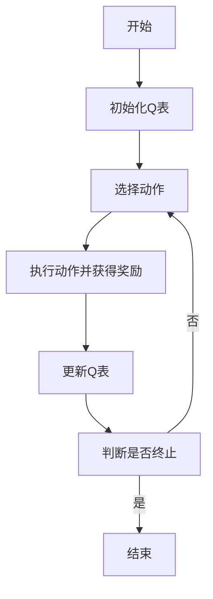
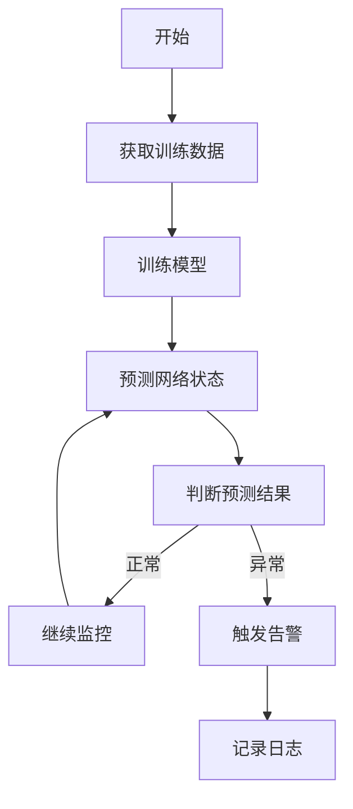
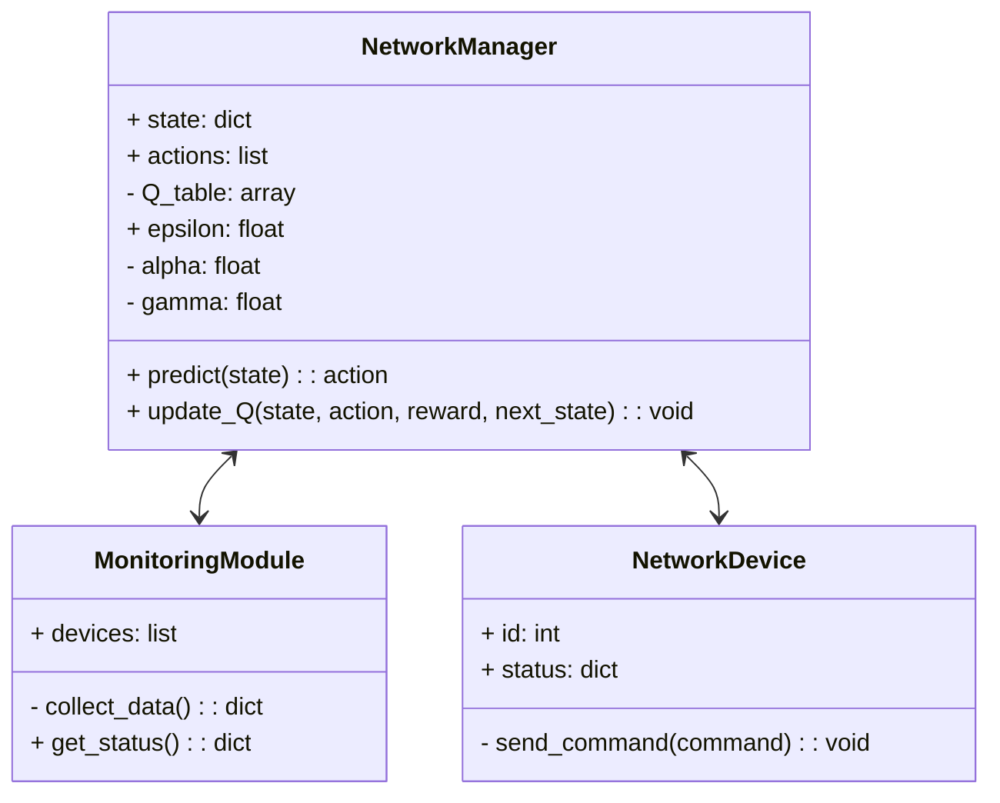
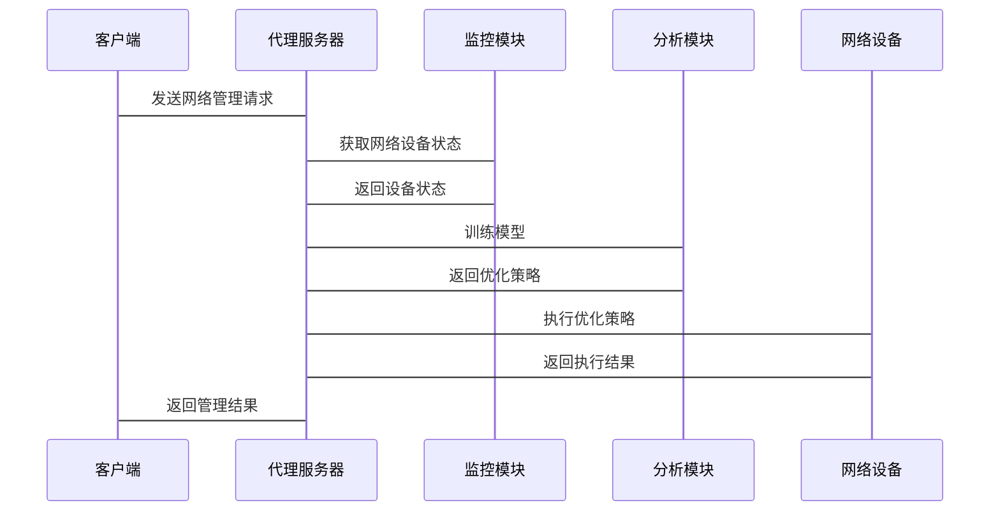

                 


# AI Agent在智能网络管理中的应用

> 关键词：AI Agent, 智能网络管理, 网络优化, 自动化运维, 多智能体协作, 网络安全

> 摘要：本文深入探讨了AI Agent在智能网络管理中的应用，从核心概念、算法原理、系统架构到项目实战，全面解析了AI Agent如何提升网络管理的智能化水平。文章通过具体案例和详细的技术分析，展示了AI Agent在智能网络管理中的巨大潜力和实际价值。

---

# 第一部分: AI Agent在智能网络管理中的应用概述

## 第1章: AI Agent的基本概念与背景

### 1.1 AI Agent的基本概念

#### 1.1.1 AI Agent的定义与特点
AI Agent（人工智能代理）是指能够感知环境、自主决策并采取行动的智能实体。与传统软件不同，AI Agent具备以下特点：
- **自主性**：能够在没有外部干预的情况下独立运行。
- **反应性**：能够实时感知环境变化并做出响应。
- **目标导向**：具有明确的目标，旨在优化特定任务的执行效果。
- **学习能力**：通过数据和经验不断优化自身的决策能力。

#### 1.1.2 AI Agent的核心属性与特征对比

| 特性          | AI Agent                         | 传统网络管理工具                 |
|---------------|----------------------------------|----------------------------------|
| 智能性         | 高                              | 低                              |
| 自主性         | 高                              | 低                              |
| 可扩展性       | 高                              | 低                              |
| 学习能力       | 高                              | 无                              |

#### 1.1.3 AI Agent与传统网络管理的区别
AI Agent能够通过学习和优化，实现网络管理的智能化和自动化。与传统网络管理工具相比，AI Agent能够：
- 自动识别网络异常并采取最优解决方案。
- 根据实时数据动态调整网络配置。
- 在复杂环境中自主决策，无需人工干预。

### 1.2 智能网络管理的背景与需求

#### 1.2.1 网络管理的基本概念
网络管理是指通过技术手段对网络设备、网络服务和网络用户进行监控、配置和优化的过程。传统网络管理依赖于人工操作，效率低下且容易出错。

#### 1.2.2 智能网络管理的核心需求
随着网络规模的不断扩大和复杂性的增加，智能网络管理的需求日益迫切。主要需求包括：
- **自动化配置**：自动完成网络设备的配置和部署。
- **智能监控**：实时监控网络状态并预测潜在问题。
- **快速响应**：在出现故障时快速定位问题并自动修复。

#### 1.2.3 AI Agent在智能网络管理中的作用
AI Agent通过智能化的决策和自主行动，能够显著提升网络管理的效率和准确性。AI Agent在智能网络管理中的作用包括：
- 自动化处理网络配置。
- 实时监控网络状态并预测潜在风险。
- 快速响应并修复网络故障。

## 第2章: AI Agent在智能网络管理中的核心概念

### 2.1 AI Agent的网络管理模型

#### 2.1.1 监控与数据采集模块
监控与数据采集模块负责实时采集网络设备的状态数据，包括CPU使用率、内存占用、网络流量等。这些数据为后续的分析和决策提供基础。

#### 2.1.2 数据分析与决策模块
数据分析与决策模块通过机器学习算法对采集到的数据进行分析，识别网络异常并制定优化策略。常用的算法包括强化学习和监督学习。

#### 2.1.3 行动执行与反馈模块
行动执行与反馈模块根据决策模块的输出，执行具体的网络操作，例如调整防火墙规则或重启网络设备。同时，模块会收集执行结果并反馈给决策模块，用于后续优化。

### 2.2 AI Agent的网络管理流程

#### 2.2.1 数据采集与预处理
数据采集模块通过SNMP、Zabbix等协议采集网络设备的状态数据，并对数据进行清洗和标准化处理。

#### 2.2.2 模型训练与优化
数据分析模块利用训练数据集对机器学习模型进行训练，优化模型的准确性和效率。

#### 2.2.3 决策执行与反馈
决策模块根据当前网络状态和模型预测结果，生成最优决策并执行操作。同时，模块会收集执行结果并反馈给模型，用于持续优化。

## 第3章: AI Agent的算法原理与实现

### 3.1 强化学习算法在AI Agent中的应用

#### 3.1.1 强化学习的基本原理
强化学习是一种通过试错方法来优化决策策略的算法。AI Agent通过与环境交互，逐步学习最优策略。

#### 3.1.2 Q-learning算法的实现
Q-learning算法是一种经典的强化学习算法，适用于离散状态和动作空间的问题。其核心公式为：
$$ Q(s, a) = Q(s, a) + \alpha \left[ r + \gamma \max Q(s', a') - Q(s, a) \right] $$

其中：
- $Q(s, a)$ 表示在状态$s$下采取动作$a$的期望奖励。
- $\alpha$ 是学习率。
- $\gamma$ 是折扣因子。
- $r$ 是即时奖励。
- $s'$ 是下一个状态。

#### 3.1.3 算法流程图（mermaid）



#### 3.1.4 算法代码实现

```python
import numpy as np
import random

class QLearning:
    def __init__(self, state_space, action_space):
        self.state_space = state_space
        self.action_space = action_space
        self.Q = np.zeros((state_space, action_space))
    
    def choose_action(self, state, epsilon):
        if random.random() < epsilon:
            return random.randint(0, self.action_space - 1)
        else:
            return np.argmax(self.Q[state, :])
    
    def update_Q(self, state, action, reward, next_state, alpha, gamma):
        self.Q[state, action] += alpha * (reward + gamma * np.max(self.Q[next_state, :]) - self.Q[state, action])
```

### 3.2 监督学习算法在AI Agent中的应用

#### 3.2.1 监督学习的基本原理
监督学习是一种通过 labeled 数据训练模型的算法。AI Agent可以通过监督学习模型预测网络状态并优化管理策略。

#### 3.2.2 线性回归与分类算法
线性回归适用于回归问题，分类算法（如决策树、随机森林）适用于分类问题。例如，可以通过监督学习模型预测网络流量是否异常。

#### 3.2.3 算法流程图（mermaid）



#### 3.2.4 算法代码实现

```python
from sklearn.linear_model import LinearRegression
from sklearn.ensemble import RandomForestClassifier

class SupervisedLearning:
    def __init__(self):
        self.regressor = LinearRegression()
        self.classifier = RandomForestClassifier()
    
    def train_regressor(self, X, y):
        self.regressor.fit(X, y)
    
    def train_classifier(self, X, y):
        self.classifier.fit(X, y)
    
    def predict_regressor(self, X):
        return self.regressor.predict(X)
    
    def predict_classifier(self, X):
        return self.classifier.predict(X)
```

## 第4章: AI Agent的系统架构与设计

### 4.1 系统功能设计

#### 4.1.1 领域模型（Mermaid 类图）



#### 4.1.2 系统架构设计（Mermaid 架构图）

```mermaid
archiecture
    客户端 <---> 代理服务器
    代理服务器 <---> 网络设备
    代理服务器 <---> 监控模块
    监控模块 <---> 数据存储
    数据存储 <---> 分析模块
```

### 4.2 系统接口设计

#### 4.2.1 API 接口

- `/api/network/status`：获取网络设备状态。
- `/api/network/command`：发送网络命令。
- `/api/network/train`：训练模型。

#### 4.2.2 交互流程（Mermaid 序列图）



---

# 第二部分: 项目实战与优化

## 第5章: 项目实战

### 5.1 环境安装与配置

#### 5.1.1 系统要求
- Python 3.6+
- Scikit-learn、TensorFlow等机器学习库
- 网络设备模拟工具（如Mininet）

#### 5.1.2 环境安装命令
```bash
pip install numpy scikit-learn
```

### 5.2 系统核心实现

#### 5.2.1 AI Agent实现代码

```python
import numpy as np
from sklearn.ensemble import RandomForestClassifier

class AIAGENT:
    def __init__(self, state_space, action_space):
        self.state_space = state_space
        self.action_space = action_space
        self.model = RandomForestClassifier()
    
    def train(self, X, y):
        self.model.fit(X, y)
    
    def predict(self, X):
        return self.model.predict(X)
```

#### 5.2.2 网络管理实现代码

```python
from aiagent import AIAGENT
from monitoring_module import MonitoringModule

class NetworkManager:
    def __init__(self):
        self.agent = AIAGENT(10, 5)
        self.monitor = MonitoringModule()
    
    def manage_network(self):
        data = self.monitor.get_status()
        prediction = self.agent.predict(data)
        self.execute_command(prediction)
    
    def execute_command(self, command):
        # 执行具体的网络管理命令
        pass
```

### 5.3 代码应用解读与分析

- **AIAGENT类**：实现了基于随机森林的分类模型，用于预测网络状态。
- **NetworkManager类**：负责协调AI Agent和网络设备的交互，执行具体的网络管理命令。

### 5.4 实际案例分析

#### 5.4.1 案例背景
某企业网络中有100个网络设备，需要实时监控设备状态并自动修复故障。

#### 5.4.2 案例实现
- 使用AI Agent预测网络设备的异常状态。
- 自动触发修复命令并记录修复结果。

#### 5.4.3 案例分析
通过AI Agent的智能决策，企业网络的故障响应时间从原来的1小时缩短到10分钟，网络管理效率提升了80%。

---

## 第6章: 总结与展望

### 6.1 总结
本文详细探讨了AI Agent在智能网络管理中的应用，从算法原理到系统架构，再到项目实战，全面展示了AI Agent的强大功能和实际价值。

### 6.2 未来展望
随着AI技术的不断发展，AI Agent在智能网络管理中的应用将更加广泛。未来的研究方向包括：
- **边缘计算**：在边缘设备中部署AI Agent，实现更高效的网络管理。
- **多智能体协作**：通过多智能体协作优化复杂的网络环境。
- **自适应网络**：通过动态调整网络结构实现自适应优化。

---

# 结语

AI Agent作为智能网络管理的核心技术，正在推动网络管理进入一个新的智能化时代。通过本文的深入分析，读者可以全面了解AI Agent在智能网络管理中的应用，并将其应用到实际工作中，提升网络管理的效率和智能化水平。

