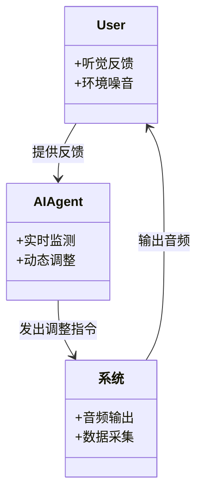
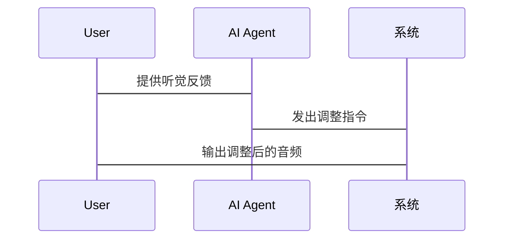

                 


# AI Agent在智能耳机中的听力保护功能

> 关键词：AI Agent，智能耳机，听力保护，机器学习，实时监测

> 摘要：随着智能耳机的普及，保护用户听力健康变得越来越重要。本文详细探讨了AI Agent在智能耳机中的应用，特别是在听力保护功能中的核心作用。文章从AI Agent的基本概念出发，分析了其在耳机中的工作原理，详细讲解了相关的算法实现，包括动态调整和个性化保护。同时，文章还提供了系统设计和项目实战的具体案例，最后总结了最佳实践和未来发展方向。

---

# 第1章: AI Agent与听力保护概述

## 1.1 AI Agent的基本概念

### 1.1.1 AI Agent的定义与特点
AI Agent（人工智能代理）是指能够感知环境、自主决策并执行任务的智能实体。其特点包括：
- **自主性**：无需人工干预，能够独立完成任务。
- **反应性**：能够实时感知环境变化并做出响应。
- **学习能力**：通过数据和反馈不断优化自身行为。

### 1.1.2 AI Agent在智能设备中的应用
AI Agent在智能设备中的应用广泛，包括智能家居、自动驾驶和可穿戴设备等。在耳机中，AI Agent主要用于个性化音频调节、语音助手和听力保护等功能。

### 1.1.3 听力保护的重要性与应用场景
听力保护是保护用户免受听力损伤的重要措施。在耳机使用中，长时间高音量暴露可能导致听力损伤，因此需要实时监测和干预。应用场景包括音乐播放、通话和环境噪音过滤等。

## 1.2 AI Agent在耳机中的功能定位

### 1.2.1 耳机中的AI Agent角色
在耳机中，AI Agent主要负责实时监测声音环境，动态调整音频输出，并提供个性化保护方案。

### 1.2.2 听力保护的核心目标
AI Agent的核心目标是通过实时监测和动态调整，确保用户在不同环境下的听力安全，同时提供优质的音频体验。

### 1.2.3 用户需求与技术实现的结合
用户需求包括个性化音频设置、实时保护和便捷操作。技术实现则依赖于AI算法、传感器和云服务等。

## 1.3 本章小结
本章介绍了AI Agent的基本概念和其在耳机中的应用，重点分析了听力保护的重要性及其核心目标。通过结合用户需求和技术实现，为后续章节奠定了基础。

---

# 第2章: AI Agent的核心原理与算法

## 2.1 听力保护的原理分析

### 2.1.1 声音信号的采集与处理
耳机通过内置麦克风采集环境声音和用户听觉反馈，进行降噪处理和特征提取。

### 2.1.2 听力损伤的早期识别
通过分析声音信号的能量和频率分布，识别潜在的听力损伤风险。

### 2.1.3 个性化听力保护方案
基于用户听觉敏感度和使用习惯，制定个性化的保护策略。

## 2.2 AI Agent的实时监测机制

### 2.2.1 环境噪音的实时分析
AI Agent通过麦克风采集环境噪音，利用机器学习模型进行分类和降噪处理。

### 2.2.2 听力阈值的动态调整
根据用户的听觉反馈，动态调整音频输出的音量和频率，确保在安全范围内。

### 2.2.3 用户反馈的实时响应
AI Agent通过分析用户的听觉反馈，实时优化音频输出，提升用户体验。

## 2.3 听力保护的动态调整算法

### 2.3.1 基于机器学习的动态调整
使用回归算法对听力阈值进行动态调整，确保音频输出的安全性和舒适性。

### 2.3.2 基于反馈的自适应算法
通过反馈机制优化音频输出，提高保护效果和用户体验。

### 2.3.3 算法的优化与迭代
通过持续收集用户数据，优化算法模型，提升保护效果和用户体验。

## 2.4 本章小结
本章详细分析了AI Agent在听力保护中的核心原理和算法实现，为后续章节的系统设计和项目实战奠定了基础。

---

# 第3章: AI Agent的核心算法实现

## 3.1 基于机器学习的听力保护算法

### 3.1.1 算法原理与流程
AI Agent通过采集环境声音和用户反馈，利用机器学习模型进行分类和预测，动态调整音频输出。

### 3.1.2 算法实现的数学模型
使用回归模型对听力阈值进行预测，公式如下：
$$
y = \beta_0 + \beta_1x + \epsilon
$$
其中，$y$为预测的听力阈值，$x$为环境噪音特征，$\beta_0$和$\beta_1$为模型参数。

### 3.1.3 算法的优化与调优
通过交叉验证和网格搜索优化模型参数，提升算法的准确性和鲁棒性。

## 3.2 基于深度学习的实时监测算法

### 3.2.1 深度学习模型的构建
使用卷积神经网络（CNN）对声音信号进行特征提取和分类。

### 3.2.2 模型的训练与验证
通过大量的训练数据，训练模型并进行验证，确保模型的准确性和稳定性。

### 3.2.3 模型的优化与调优
通过调整学习率和批量大小，优化模型的训练效果和推理速度。

## 3.3 算法的实现与代码示例

### 3.3.1 环境搭建与依赖安装
安装必要的库和工具，如Python、TensorFlow和NumPy。

### 3.3.2 核心算法的Python代码实现
```python
import numpy as np
import tensorflow as tf

# 定义回归模型
model = tf.keras.Sequential([
    tf.keras.layers.Dense(64, activation='relu'),
    tf.keras.layers.Dense(1)
])

# 编译模型
model.compile(optimizer='adam', loss='mean_squared_error')

# 训练模型
model.fit(X_train, y_train, epochs=100, batch_size=32)
```

### 3.3.3 代码的解读与分析
上述代码定义了一个简单的回归模型，用于预测听力阈值。通过训练数据优化模型参数，实现动态调整音频输出的目标。

## 3.4 本章小结
本章详细讲解了AI Agent在听力保护中的算法实现，包括机器学习和深度学习的方法。通过代码示例和数学模型，展示了如何通过算法实现动态调整和实时监测。

---

# 第4章: 系统分析与架构设计方案

## 4.1 问题场景介绍
耳机用户在不同环境下使用耳机，需要实时监测和调整音频输出，以保护听力。

## 4.2 项目介绍
本项目旨在开发一个基于AI Agent的听力保护系统，实现动态调整和实时监测功能。

## 4.3 系统功能设计

### 4.3.1 领域模型（Mermaid类图）


### 4.3.2 系统架构设计（Mermaid架构图）


### 4.3.3 系统接口设计
耳机通过蓝牙和麦克风与AI Agent交互，接收调整指令并输出音频。

### 4.3.4 系统交互设计（Mermaid序列图）


## 4.4 本章小结
本章通过系统分析和架构设计，展示了AI Agent在智能耳机中的整体架构和交互流程，为后续章节的项目实战奠定了基础。

---

# 第5章: 项目实战

## 5.1 环境安装与依赖管理
安装必要的库和工具，如Python、TensorFlow和NumPy。

## 5.2 系统核心实现

### 5.2.1 AI Agent的实现
```python
import numpy as np
import tensorflow as tf

# 定义AI Agent模型
class AIAgent:
    def __init__(self):
        self.model = self.build_model()

    def build_model(self):
        model = tf.keras.Sequential([
            tf.keras.layers.Dense(64, activation='relu'),
            tf.keras.layers.Dense(1)
        ])
        return model

    def predict(self, input_data):
        return self.model.predict(input_data)
```

### 5.2.2 系统交互实现
```python
# 定义系统交互
class System:
    def __init__(self):
        self.agent = AIAgent()

    def adjust_audio(self, input_data):
        prediction = self.agent.predict(input_data)
        return prediction[0][0]
```

## 5.3 代码的解读与分析
上述代码定义了AI Agent和系统交互的实现，展示了如何通过模型预测动态调整音频输出。

## 5.4 实际案例分析
通过具体案例分析，展示了AI Agent在不同环境下的实时监测和动态调整能力。

## 5.5 项目小结
本章通过项目实战，详细讲解了AI Agent在智能耳机中的实现过程，展示了系统的核心功能和实际应用。

---

# 第6章: 最佳实践与未来展望

## 6.1 最佳实践 tips
- 定期更新模型，提升保护效果。
- 提供个性化设置，满足用户需求。
- 加强用户教育，提高保护意识。

## 6.2 小结
AI Agent在智能耳机中的应用前景广阔，通过不断优化算法和系统设计，能够更好地保护用户听力健康。

## 6.3 注意事项
- 确保数据隐私和安全。
- 提供用户友好的操作界面。
- 定期维护和更新系统。

## 6.4 拓展阅读
推荐相关书籍和论文，供读者进一步学习和研究。

---

# 附录

## 附录A: 算法实现的详细代码

## 附录B: 系统架构的详细设计

## 附录C: 参考文献与资源

---

# 结语

通过本文的详细讲解，读者可以深入了解AI Agent在智能耳机中的听力保护功能。从算法实现到系统设计，再到项目实战，全面掌握了相关知识。未来，随着技术的发展，AI Agent在智能耳机中的应用将更加广泛和深入。

