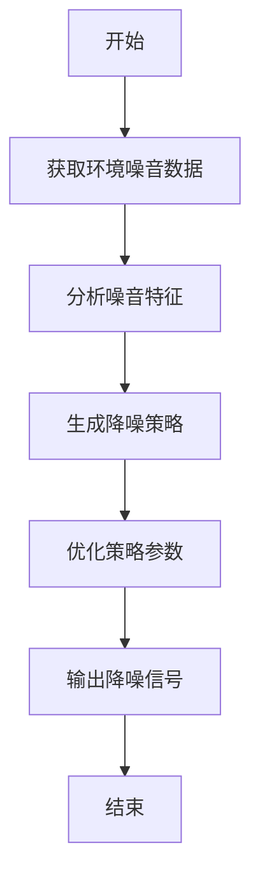
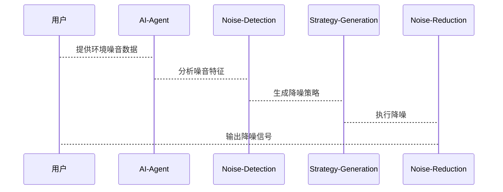

                 


```markdown
# AI Agent在智能耳机中的环境噪音适应系统

> 关键词：AI Agent，环境噪音，智能耳机，降噪技术，自适应滤波，系统架构

> 摘要：本文详细探讨了AI Agent在智能耳机中的环境噪音适应系统，从核心概念、算法原理、系统架构到项目实战，全面解析了如何利用AI技术优化耳机的降噪功能。通过系统分析和实际案例，本文揭示了AI Agent在环境噪音适应中的独特优势和实现路径，为智能耳机的设计与优化提供了新的思路。

---

# 第一部分: 背景介绍与核心概念

## 第1章: 背景介绍
### 1.1 问题背景
#### 1.1.1 环境噪音对智能耳机的影响
- 噪音干扰对用户体验的影响
- 不同场景下的噪音特征分析

#### 1.1.2 当前降噪技术的局限性
- 基于硬件的降噪技术局限性
- 基于软件的降噪算法不足

#### 1.1.3 AI Agent在降噪中的优势
- AI Agent的实时学习能力
- AI Agent的自适应优化特性

### 1.2 系统架构与核心概念
#### 1.2.1 AI Agent的基本概念
- AI Agent的定义与分类
- AI Agent在智能耳机中的角色

#### 1.2.2 环境噪音适应系统的定义
- 系统的目标与功能
- 系统的核心要素与组成

#### 1.2.3 系统的应用价值与挑战
- 系统的应用场景与价值
- 系统实现中的主要挑战

## 第2章: 核心概念与联系
### 2.1 AI Agent与环境噪音适应系统的关系
#### 2.1.1 AI Agent在降噪中的作用
- AI Agent如何感知环境噪音
- AI Agent如何优化降噪策略

#### 2.1.2 环境噪音适应系统的实现原理
- 系统的工作流程与机制
- 系统与AI Agent的协同关系

#### 2.1.3 两者的相互作用与协同
- AI Agent如何驱动系统优化
- 系统如何反馈信息给AI Agent

### 2.2 核心概念的属性特征对比
| 概念       | 属性特征             |
|------------|----------------------|
| AI Agent   | 自主性、适应性、学习能力 |
| 环境噪音系统 | 实时性、多样性、复杂性  |

### 2.3 ER实体关系图
```mermaid
erd
  实体1(AI Agent) {
    属性: 状态、目标、环境信息
  }
  实体2(环境噪音系统) {
    属性: 噪音类型、强度、频率
  }
  实体1 --> 实体2: 监测和分析
  实体2 --> 实体1: 反馈降噪策略
```

---

# 第二部分: 算法原理讲解

## 第3章: 算法原理
### 3.1 算法原理概述
#### 3.1.1 AI Agent降噪算法的基本原理
- 算法的目标与基本流程
- 算法的核心思想与创新点

#### 3.1.2 算法的核心思想
- 基于机器学习的自适应降噪
- 基于深度学习的实时优化

### 3.2 算法实现
#### 3.2.1 算法流程图


#### 3.2.2 算法代码实现
```python
def noise_reduction_algorithm(audio_data):
    # 获取环境噪音特征
    noise_features = extract_noise_features(audio_data)
    # 生成降噪策略
    reduction_strategy = generate_strategy(noise_features)
    # 输出降噪信号
    return apply_strategy(audio_data, reduction_strategy)
```

### 3.3 数学模型与公式
#### 3.3.1 噪音信号的傅里叶变换
$$ X(f) = \int_{-\infty}^{\infty} x(t) e^{-j2\pi ft} dt $$

#### 3.3.2 自适应滤波器的优化
$$ w(n+1) = w(n) + \mu \cdot e(n) \cdot x(n) $$
其中，$\mu$为学习率，$e(n)$为误差信号，$x(n)$为输入信号。

---

# 第三部分: 系统分析与架构设计

## 第4章: 系统分析与架构设计
### 4.1 系统分析
#### 4.1.1 问题场景介绍
- 复杂环境下的噪音适应问题
- 系统需要实现的功能

#### 4.1.2 系统功能设计
- 核心功能模块：噪音检测、特征提取、策略生成、降噪执行
- 辅助功能模块：参数调节、状态监控

### 4.2 系统架构设计
#### 4.2.1 系统架构图
```mermaid
graph TD
    AI-Agent --> Noise-Detection: 监测环境噪音
    Noise-Detection --> Feature-Extraction: 提取噪音特征
    Feature-Extraction --> Strategy-Generation: 生成降噪策略
    Strategy-Generation --> Noise-Reduction: 执行降噪
    Noise-Reduction --> Output-Signal: 输出降噪信号
```

#### 4.2.2 系统接口设计
- 输入接口：环境噪音数据、用户反馈
- 输出接口：降噪信号、系统状态

#### 4.2.3 系统交互流程


---

# 第四部分: 项目实战

## 第5章: 项目实战
### 5.1 项目介绍
#### 5.1.1 项目背景
- 项目目标与实现方案
- 项目环境与工具

### 5.2 系统核心实现
#### 5.2.1 环境安装与配置
- 开发环境搭建
- 依赖库安装

#### 5.2.2 核心代码实现
```python
class AIAgent:
    def __init__(self):
        self.noise_detector = NoiseDetector()
        self.strategy_generator = StrategyGenerator()
    
    def process_noise(self, audio_signal):
        noise_features = self.noise_detector.extract_features(audio_signal)
        reduction_strategy = self.strategy_generator.generate_strategy(noise_features)
        return self.apply_strategy(audio_signal, reduction_strategy)
```

#### 5.2.3 代码解读与分析
- 关键代码的功能实现
- 系统运行流程的详细说明

### 5.3 实际案例分析
#### 5.3.1 案例介绍
- 案例背景与需求
- 案例实现过程

#### 5.3.2 案例分析
- 实验数据与结果
- 系统性能评估

### 5.4 项目小结
- 项目实现的价值
- 项目中的经验与教训

---

## 第6章: 最佳实践与展望
### 6.1 最佳实践
#### 6.1.1 开发建议
- 代码规范与设计模式
- 测试与调试技巧

#### 6.1.2 系统优化建议
- 性能优化策略
- 系统可扩展性设计

### 6.2 系统小结
- 本系统的总结与反思
- 系统的优缺点分析

### 6.3 注意事项
- 系统使用中的注意事项
- 系统维护与更新建议

### 6.4 拓展阅读
- 相关领域推荐读物
- 研究方向与未来展望

---

# 附录: 参考文献
- 国内外相关文献列表
- 网络资源与工具推荐

---

# 结语
感谢您的阅读！希望本文能为您提供有价值的见解和启发，助力您在智能耳机降噪领域的探索与实践！
```

