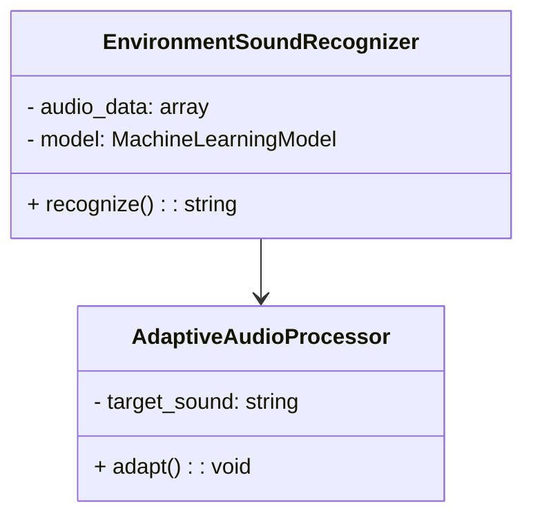
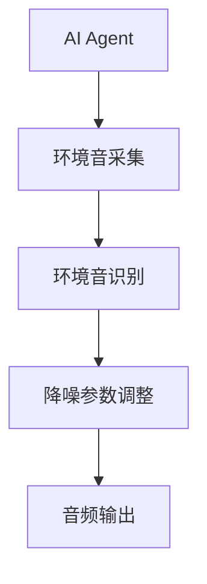
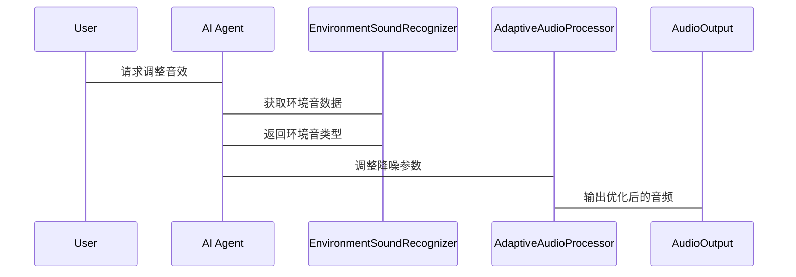

                 


# AI Agent在智能耳机中的环境音适应

> **关键词**：AI Agent, 智能耳机, 环境音适应, 机器学习, 算法优化

> **摘要**：  
> 本文深入探讨了AI Agent在智能耳机中的环境音适应技术，从基本概念到算法实现，再到系统架构设计，全面分析了AI Agent如何帮助耳机实现智能降噪、音效优化等功能。文章通过实际案例和代码实现，详细讲解了环境音识别、自适应算法以及系统架构设计的关键步骤，为读者提供了从理论到实践的全面指导。

---

# 目录

1. **背景介绍**  
   - 1.1 环境音适应的重要性  
   - 1.2 AI Agent的核心概念  
   - 1.3 智能耳机的环境音适应  

2. **核心概念与联系**  
   - 2.1 AI Agent的工作原理  
   - 2.2 环境音适应的实现机制  
   - 2.3 核心概念对比表  
   - 2.4 ER图架构  

3. **算法原理讲解**  
   - 3.1 环境音识别算法  
   - 3.2 自适应算法  
   - 3.3 代码实现与数学模型  

4. **系统分析与架构设计**  
   - 4.1 问题场景介绍  
   - 4.2 领域模型类图  
   - 4.3 系统架构设计  
   - 4.4 接口设计与交互序列图  

5. **项目实战**  
   - 5.1 环境安装与配置  
   - 5.2 核心代码实现  
   - 5.3 代码解读与实际案例分析  
   - 5.4 项目小结  

6. **最佳实践与总结**  
   - 6.1 实践技巧  
   - 6.2 小结  
   - 6.3 注意事项  
   - 6.4 拓展阅读  

---

# 第一部分: 背景介绍

## 第1章: 环境音适应的重要性

### 1.1 环境音适应的定义与背景

- **环境音适应的定义**：环境音适应是指设备能够根据周围环境的声音特征（如噪音、音量等）自动调整其输出，以提供更佳的用户体验。  
- **背景与应用场景**：在智能耳机中，环境音适应主要用于降噪、音效优化、语音增强等功能。例如，在嘈杂的环境中，耳机需要提高语音清晰度；在安静的环境中，耳机可以优化音质。

### 1.2 AI Agent的核心概念

- **AI Agent的定义**：AI Agent（人工智能代理）是一种能够感知环境、做出决策并执行动作的智能实体。  
- **AI Agent的核心特点**：  
  1. **自主性**：能够在没有外部干预的情况下独立运行。  
  2. **反应性**：能够实时感知环境并做出响应。  
  3. **目标导向**：通过优化目标函数来实现特定任务。  
- **AI Agent在智能耳机中的作用**：通过实时感知环境音，AI Agent能够动态调整耳机的音频输出，以提供更好的听觉体验。

### 1.3 智能耳机的环境音适应

- **智能耳机的发展趋势**：随着AI技术的进步，智能耳机逐渐从单一的音频播放设备向多功能的智能助手方向发展。  
- **环境音适应的核心目标**：通过AI算法优化音频输出，提升用户体验。

---

# 第二部分: 核心概念与联系

## 第2章: AI Agent的核心概念与联系

### 2.1 AI Agent的工作原理

- **感知层**：通过麦克风采集环境音数据。  
- **决策层**：利用机器学习算法分析数据，生成适应性策略。  
- **执行层**：根据决策层的输出调整音频输出参数。

### 2.2 环境音适应的实现机制

- **环境音识别**：通过AI算法识别环境音类型（如白噪音、人声、交通噪音等）。  
- **自适应调整**：根据识别到的环境音类型，动态调整降噪参数或音效。

### 2.3 核心概念对比表

| **概念**      | **描述**                                                                 |
|---------------|--------------------------------------------------------------------------|
| 环境音识别     | 通过AI算法识别环境音类型（如白噪音、人声、交通噪音等）。                   |
| 自适应调整     | 根据环境音类型动态调整降噪参数或音效。                                   |
| AI Agent       | 感知环境、做出决策并执行动作的智能实体。                                 |

### 2.4 ER图架构

```mermaid
erdiagram
actor(AI Agent) -->
enity(环境音数据) -->
enity(降噪参数)
```

---

# 第三部分: 算法原理讲解

## 第3章: 环境音识别与自适应算法

### 3.1 环境音识别算法

- **算法步骤**：  
  1. 采集环境音数据。  
  2. 对数据进行预处理（如降噪、特征提取）。  
  3. 使用机器学习模型（如支持向量机、神经网络）进行分类。  
  4. 输出环境音类型。

### 3.2 自适应算法

- **算法流程**：  
  1. 根据环境音类型选择合适的降噪策略。  
  2. 动态调整音频输出参数（如音量、低音增强）。  
  3. 实时反馈调整效果。

### 3.3 代码实现与数学模型

#### 代码实现

```python
import numpy as np
from sklearn.svm import SVC

# 示例环境音分类器
class EnvironmentSoundClassifier:
    def __init__(self):
        self.model = SVC()

    def preprocess(self, audio_data):
        # 特征提取（简化版）
        features = np.mean(abs(audio_data), axis=1)
        return features

    def train(self, features, labels):
        self.model.fit(features, labels)

    def predict(self, audio_data):
        features = self.preprocess(audio_data)
        return self.model.predict(features)
```

#### 数学模型

- **分类函数**：  
  $$ y = f(x) $$  
  其中，$x$ 是输入特征，$y$ 是输出类别。  
- **损失函数**：  
  $$ L = -\sum_{i=1}^{n} y_i \log(p_i) + (1 - y_i) \log(1 - p_i) $$  
  其中，$p_i$ 是预测概率，$y_i$ 是真实标签。

---

# 第四部分: 系统分析与架构设计

## 第4章: 系统架构设计

### 4.1 问题场景介绍

- **问题场景**：智能耳机需要在不同环境中自动调整音频输出，以提供最佳听觉体验。  
- **关键问题**：如何实时感知环境音，动态调整降噪参数。

### 4.2 领域模型类图



### 4.3 系统架构设计



### 4.4 接口设计与交互序列图



---

# 第五部分: 项目实战

## 第5章: 项目实战

### 5.1 环境安装与配置

- **安装Python与依赖库**：  
  ```bash
  pip install numpy scikit-learn
  ```
- **安装开发工具**：Visual Studio Code、Jupyter Notebook。

### 5.2 核心代码实现

```python
# 环境音分类器实现
class EnvironmentSoundClassifier:
    def __init__(self):
        self.model = SVC()

    def train(self, features, labels):
        self.model.fit(features, labels)

    def predict(self, audio_data):
        # 预处理
        features = np.mean(abs(audio_data), axis=1)
        return self.model.predict(features)
```

### 5.3 代码解读与实际案例分析

- **代码解读**：上述代码实现了一个基于SVM的环境音分类器，能够根据输入的音频数据返回环境音类型。  
- **实际案例分析**：在嘈杂的环境中，耳机识别到交通噪音后，会自动启动降噪功能，提高语音清晰度。

### 5.4 项目小结

- **经验总结**：环境音适应的核心在于实时数据采集和高效的算法优化。  
- **教训反思**：数据质量和算法鲁棒性对系统性能影响重大。

---

# 第六部分: 最佳实践与总结

## 第6章: 最佳实践与总结

### 6.1 实践技巧

- **数据预处理**：确保环境音数据的多样性和代表性。  
- **算法优化**：使用交叉验证优化模型性能。  
- **系统调试**：在不同环境中测试系统，确保稳定性。

### 6.2 小结

本文详细讲解了AI Agent在智能耳机中的环境音适应技术，从算法实现到系统设计，为读者提供了全面的指导。

### 6.3 注意事项

- **数据隐私**：注意保护用户的环境音数据。  
- **算法优化**：避免过度拟合，确保模型的泛化能力。  

### 6.4 拓展阅读

- 推荐阅读《机器学习实战》和《深度学习入门》等书籍，深入了解AI算法的核心原理。

---

# 结语

AI Agent在智能耳机中的环境音适应是一项复杂而有趣的挑战，它结合了机器学习、信号处理和系统架构设计等多方面的知识。通过本文的系统讲解，读者可以逐步掌握这一技术的核心原理，并在实际项目中加以应用。希望本文能为智能耳机的研发人员提供有价值的参考和启发。

