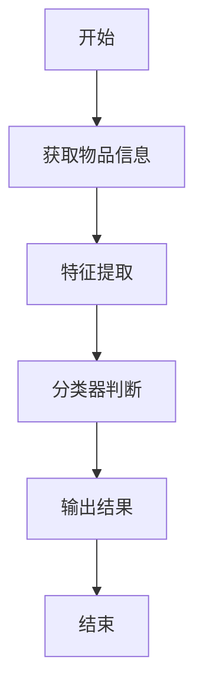
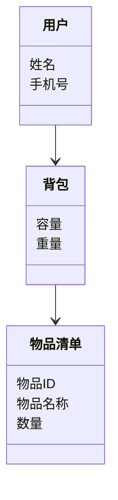

                 


# AI Agent在智能背包中的物品清单管理

**关键词**：AI Agent，智能背包，物品清单管理，算法原理，系统架构

**摘要**：本文探讨了AI Agent在智能背包中的物品清单管理的应用，详细分析了AI Agent的核心算法原理、系统架构设计以及实际项目实现。通过背景介绍、核心概念、算法实现、系统架构和项目实战的逐步讲解，展示了AI Agent如何优化物品清单管理流程，提升用户体验。

---

# 第一部分: AI Agent在智能背包中的物品清单管理概述

## 第1章: 问题背景与需求分析

### 1.1 问题背景

#### 1.1.1 智能背包的概念与特点
智能背包是一种结合了物联网和人工智能技术的智能设备，能够通过传感器和AI算法实现对背包内物品的自动识别、分类和管理。其核心特点包括：
- **智能化**：通过AI算法实现自动化管理
- **实时性**：能够实时感知和响应环境变化
- **便捷性**：用户可以通过手机或其他设备远程查看和管理物品清单

#### 1.1.2 物品清单管理的传统方式与局限性
传统的物品清单管理方式主要依赖手动记录或简单的电子设备（如纸质清单或简单的电子标签）。这种方式存在以下局限性：
- **效率低**：人工记录容易出错，且效率低下
- **准确性差**：缺乏自动化校验机制，容易遗漏或重复记录
- **实时性差**：无法实时更新和反馈

#### 1.1.3 AI Agent在物品清单管理中的优势
AI Agent（人工智能代理）通过结合传感器、图像识别和自然语言处理技术，能够实现对背包内物品的自动识别、分类和管理。其优势包括：
- **高效性**：AI Agent能够快速识别和分类物品
- **准确性高**：通过算法优化，显著降低错误率
- **实时反馈**：能够实时更新物品清单，并通过用户界面提供反馈

### 1.2 需求分析

#### 1.2.1 用户需求分析
用户在使用智能背包时，主要需求包括：
- **快速识别物品**：能够快速准确地识别背包内的物品
- **实时更新清单**：物品清单能够实时更新，并支持远程查看
- **智能推荐**：根据用户的使用习惯，推荐常用物品的位置或优先级

#### 1.2.2 系统功能需求
系统需要实现以下核心功能：
- **物品识别与分类**：通过传感器或摄像头识别物品，并进行分类
- **清单管理**：维护一个实时更新的物品清单
- **交互界面**：提供友好的用户界面，支持用户查询和管理物品
- **智能推荐**：基于用户行为推荐常用物品

#### 1.2.3 性能需求与边界条件
系统性能需求包括：
- **识别速度**：物品识别时间不超过1秒
- **准确率**：识别准确率≥95%
- **响应时间**：用户查询响应时间不超过2秒

边界条件包括：
- **背包容量**：支持最多50件物品
- **物品类型**：支持服装、电子产品、书籍等常用物品类型

### 1.3 问题解决思路

#### 1.3.1 AI Agent的核心作用
AI Agent通过以下方式实现物品清单管理：
- **数据采集**：通过传感器或摄像头采集背包内物品的数据
- **数据处理**：对采集的数据进行分析和分类
- **决策与反馈**：根据分析结果更新物品清单，并通过用户界面提供反馈

#### 1.3.2 物品清单管理的流程优化
传统的物品清单管理流程如下：
1. 用户手动记录物品
2. 手动更新清单
3. 手动查找物品

优化后的流程如下：
1. AI Agent自动识别物品
2. 自动更新物品清单
3. 提供智能推荐和快速查找功能

#### 1.3.3 系统设计的总体思路
系统设计的总体思路包括：
- **模块化设计**：将系统划分为数据采集、数据处理、用户界面等模块
- **高可用性**：确保系统在极端情况下仍能正常运行
- **可扩展性**：支持未来新增功能的扩展

### 1.4 本章小结
本章主要介绍了AI Agent在智能背包中的物品清单管理的应用背景，分析了传统方式的局限性和AI Agent的优势，明确了系统的需求和设计思路。

---

## 第二部分: 核心概念与系统架构

## 第2章: AI Agent与智能背包的核心概念

### 2.1 AI Agent的定义与特征

#### 2.1.1 AI Agent的基本定义
AI Agent是一种能够感知环境、执行任务并做出决策的智能实体。它可以自主工作或与用户交互，以完成特定目标。

#### 2.1.2 AI Agent的核心特征对比表
| 特征 | 描述 |
|------|------|
| 智能性 | 能够理解和处理复杂信息 |
| 自主性 | 可以自主决策和行动 |
| 反应性 | 能够实时感知和响应环境变化 |
| 学习能力 | 可以通过数据优化性能 |

### 2.2 智能背包的系统架构

#### 2.2.1 系统组成与功能模块
智能背包的系统架构包括以下几个功能模块：
- **数据采集模块**：负责采集背包内物品的数据
- **数据处理模块**：对采集的数据进行分类和分析
- **用户界面模块**：提供友好的用户交互界面
- **决策与反馈模块**：根据分析结果更新物品清单并提供反馈

#### 2.2.2 实体关系图
以下是智能背包系统的实体关系图：


### 2.3 AI Agent与智能背包的交互流程
以下是AI Agent与智能背包的交互流程图：


### 2.4 本章小结
本章主要介绍了AI Agent和智能背包的核心概念，分析了它们的特征和交互流程，并通过实体关系图展示了系统的组成与关系。

---

## 第三部分: 算法原理与实现

## 第3章: AI Agent的核心算法原理

### 3.1 物品识别与分类算法

#### 3.1.1 算法流程图
以下是物品识别与分类算法的流程图：


#### 3.1.2 分类器实现
以下是分类器实现的Python代码示例：
```python
import numpy as np
from sklearn.svm import SVC

# 假设X为特征向量，y为标签
X = np.array([[特征1, 特征2, ...], [...]])
y = np.array([标签1, 标签2, ...])

# 训练模型
model = SVC()
model.fit(X, y)

# 预测新样本
new_sample = np.array([[新特征1, 新特征2, ...]])
预测结果 = model.predict(new_sample)
```

#### 3.1.3 分类准确率的计算公式
分类准确率的计算公式为：
$$准确率 = \frac{正确分类的样本数}{总样本数}$$

---

## 第四部分: 系统分析与架构设计方案

## 第4章: 智能背包的系统架构设计

### 4.1 问题场景介绍
智能背包主要用于日常出行，用户需要快速查找和管理背包内的物品。系统需要支持物品识别、清单管理和智能推荐功能。

### 4.2 系统功能设计

#### 4.2.1 领域模型类图
以下是领域模型类图：


### 4.3 系统架构设计

#### 4.3.1 系统架构图
以下是系统架构图：


### 4.4 系统接口设计
系统主要接口包括：
- **物品识别接口**：用于获取背包内物品的数据
- **清单更新接口**：用于更新物品清单
- **用户查询接口**：用于用户查询物品信息

### 4.5 系统交互序列图
以下是系统交互序列图：


---

## 第五部分: 项目实战

## 第5章: 项目实现与案例分析

### 5.1 环境搭建

#### 5.1.1 安装Python和相关库
```bash
pip install numpy scikit-learn matplotlib
```

#### 5.1.2 安装其他工具
```bash
pip install mermaid.py
```

### 5.2 核心代码实现

#### 5.2.1 物品识别模块
```python
import cv2
import numpy as np

# 加载预训练模型
model = cv2.ml.SVM_load("model.yml")

# 读取图像
img = cv2.imread("item.jpg")

# 提取特征
features = extract_features(img)

# 预测类别
prediction = model.predict(features)
```

#### 5.2.2 清单管理模块
```python
class ItemList:
    def __init__(self):
        self.items = {}

    def add_item(self, name, quantity):
        self.items[name] = quantity

    def remove_item(self, name):
        del self.items[name]

    def get_items(self):
        return self.items
```

### 5.3 项目实战案例分析

#### 5.3.1 案例背景
用户使用智能背包管理日常物品，包括外套、笔记本电脑、书籍等。

#### 5.3.2 实现过程
1. 用户将背包内的物品放入背包
2. 系统通过摄像头采集物品图像
3. AI Agent识别并分类物品
4. 更新物品清单并显示在用户界面上

### 5.4 项目优化与扩展

#### 5.4.1 算法优化
通过增加训练数据和优化模型参数，提高识别准确率。

#### 5.4.2 功能扩展
增加语音控制和位置追踪功能，提升用户体验。

---

## 第六部分: 最佳实践与总结

## 第6章: 最佳实践与总结

### 6.1 小结
本文详细探讨了AI Agent在智能背包中的物品清单管理的应用，分析了其核心算法原理和系统架构设计，并通过实际项目展示了其应用价值。

### 6.2 注意事项
在实际应用中，需要注意以下几点：
- **数据隐私**：确保用户数据的安全性
- **算法优化**：持续优化算法以提高识别准确率
- **系统扩展性**：支持未来新增功能的扩展

### 6.3 拓展阅读
推荐以下学习资源：
- 《机器学习实战》
- 《深度学习入门：基于Python和TensorFlow》
- 《Python编程：从入门到实践》

---

**本文通过系统化的分析和实践，展示了AI Agent在智能背包中的物品清单管理的实现过程。通过理论与实践相结合，帮助读者更好地理解AI技术在实际生活中的应用。**

