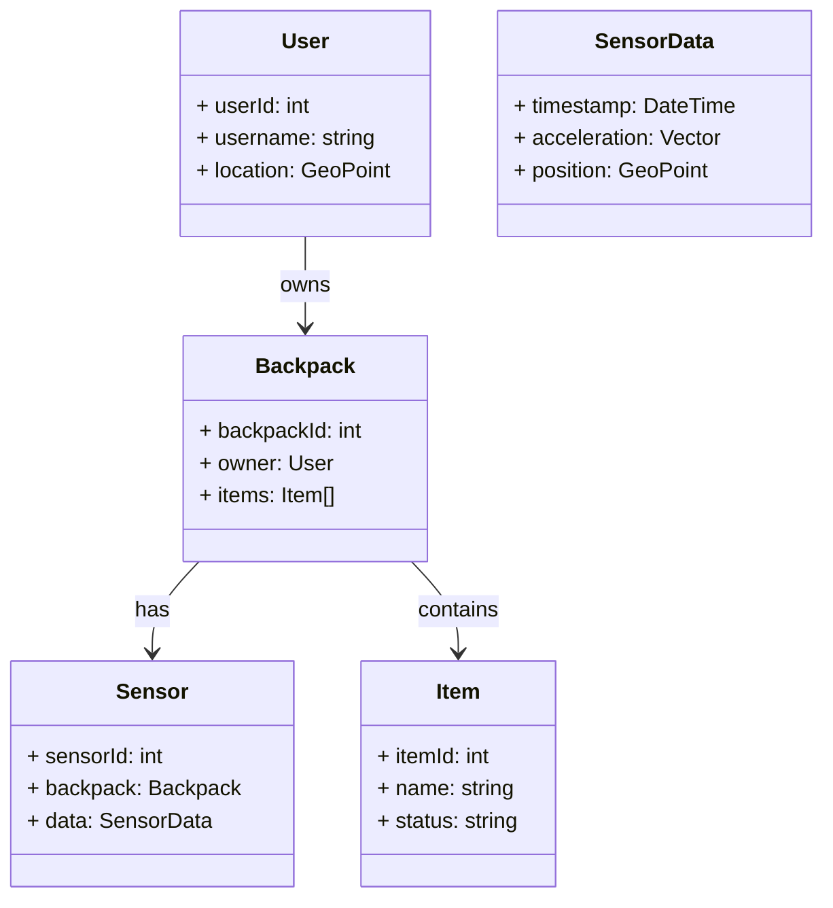
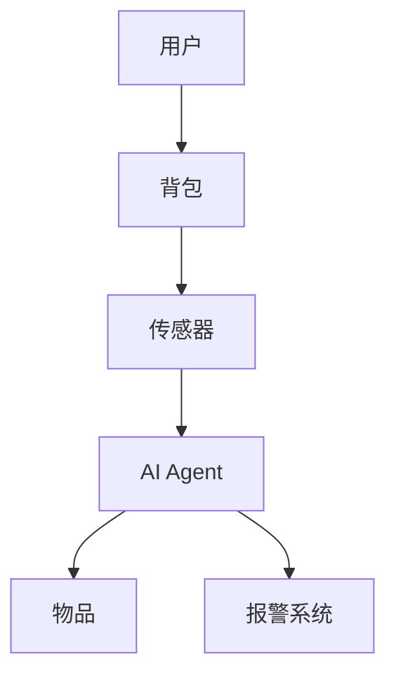
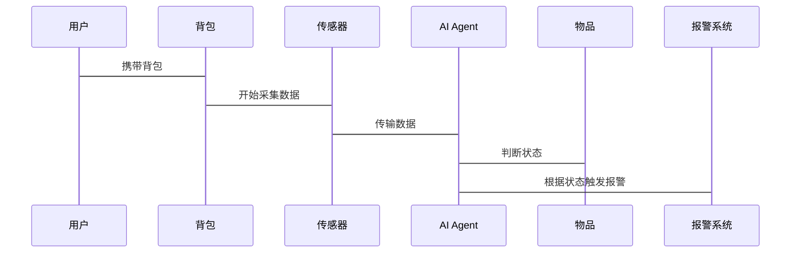

                 


# AI Agent在智能背包中的物品追踪

## 关键词：AI Agent、物品追踪、智能背包、物联网、AI算法、系统架构

## 摘要：本文深入探讨了AI Agent在智能背包中的物品追踪应用，分析了其核心概念、算法原理、系统架构，并通过实际案例展示了如何实现高效的物品追踪系统。文章内容涵盖背景介绍、核心概念、算法流程、系统设计、项目实战及最佳实践，为读者提供了全面的技术视角。

---

## 第1章：背景与概念

### 1.1 问题背景与需求分析

#### 1.1.1 物品追踪的背景与挑战
在现代生活中，随身携带的物品（如钱包、钥匙、手机等）常常容易遗失或被盗，这不仅带来经济损失，还可能引发安全隐患。传统的物品追踪方法依赖于物理标记或GPS设备，但在复杂环境中，这些方法存在精度低、成本高等问题。随着AI技术的发展，AI Agent（人工智能代理）被引入物品追踪领域，为智能背包提供了更高效的解决方案。

#### 1.1.2 智能背包的应用场景与目标
智能背包是一种结合了物联网和AI技术的可穿戴设备，主要用于追踪背包内的物品。其应用场景包括：
- **日常使用**：帮助用户快速找到遗失物品。
- **商务场景**：保护重要文件的安全。
- **特殊环境**：如机场、商场等人流密集的地方。

智能背包的目标是通过AI Agent实现物品的实时追踪、智能提醒和防盗报警，提升用户体验和安全性。

#### 1.1.3 AI Agent在物品追踪中的作用
AI Agent是一种能够感知环境、自主决策并执行任务的智能体。在物品追踪中，AI Agent通过传感器数据（如加速度计、陀螺仪）和环境信息（如位置、时间）来识别和定位物品。其核心作用包括：
1. **实时感知**：通过传感器获取背包的状态变化。
2. **智能决策**：根据感知数据判断物品的位置和状态。
3. **执行操作**：通过反馈机制提醒用户或采取防盗措施。

---

### 1.2 AI Agent的基本概念

#### 1.2.1 AI Agent的定义与特点
AI Agent是一种智能实体，能够通过感知环境和用户输入，自主决策并执行任务。其特点包括：
- **自主性**：无需外部干预，自主完成任务。
- **反应性**：能够实时感知环境变化并做出反应。
- **学习能力**：通过机器学习算法不断优化性能。

#### 1.2.2 AI Agent的核心功能与能力
AI Agent在物品追踪中的核心功能包括：
1. **感知能力**：通过传感器获取背包的运动状态和位置信息。
2. **决策能力**：基于感知数据和预设规则，判断物品是否处于异常状态。
3. **执行能力**：通过反馈机制（如振动、声音）提醒用户或触发防盗功能。

#### 1.2.3 AI Agent与传统追踪技术的区别
传统追踪技术（如GPS、RFID）依赖于固定的设备和信号，而AI Agent则具有更强的自主性和适应性。AI Agent能够根据环境变化动态调整追踪策略，且无需依赖外部设备。

---

## 第2章：核心概念与联系

### 2.1 AI Agent的原理与机制

#### 2.1.1 AI Agent的核心原理
AI Agent通过以下三个步骤实现物品追踪：
1. **感知**：通过传感器获取背包的运动状态和位置信息。
2. **决策**：基于感知数据和历史数据，判断物品的位置和状态。
3. **执行**：根据决策结果，触发反馈机制或采取防盗措施。

#### 2.1.2 概念对比表
以下是AI Agent与其他追踪技术的对比：

| **特性**       | **AI Agent**          | **传统GPS**            | **RFID**             |
|-----------------|-----------------------|-------------------------|----------------------|
| **工作原理**    | 基于AI算法，自主决策 | 依赖卫星信号            | 依赖射频信号         |
| **实时性**      | 高                    | 中                     | 中                   |
| **灵活性**      | 高                    | 低                     | 低                   |
| **应用场景**    | 多种复杂环境          | 室外定位               | 物品识别与定位       |

#### 2.1.3 ER图
以下是AI Agent在物品追踪系统中的实体关系图：

```mermaid
er
actor: 用户
 backpack: 背包
 item: 物品
 sensor: 传感器
 action: 动作
 goal: 目标状态
```

图中，用户通过背包与系统交互，传感器负责采集背包的状态数据，AI Agent根据传感器数据和目标状态判断是否需要执行动作。

---

## 第3章：算法原理

### 3.1 AI Agent的算法流程

#### 3.1.1 感知模块
感知模块通过多种传感器（如加速度计、陀螺仪、GPS）获取背包的运动状态和位置信息。以下是感知流程：

1. **数据采集**：传感器采集背包的加速度、角度、位置等数据。
2. **数据预处理**：对采集到的数据进行滤波、归一化处理，确保数据的准确性。
3. **特征提取**：提取有用特征（如运动方向、加速度变化）用于后续分析。

#### 3.1.2 决策模块
决策模块基于感知数据和历史数据，判断物品的位置和状态。以下是决策算法流程：

1. **状态识别**：通过机器学习模型（如随机森林、支持向量机）识别背包的当前状态（静止、移动、倾斜）。
2. **位置估计**：结合传感器数据和地图信息，使用概率模型估计背包的位置。
3. **异常检测**：判断物品是否处于异常状态（如被移动、被拿走）。

#### 3.1.3 执行模块
执行模块根据决策结果触发反馈机制或采取防盗措施。以下是执行流程：

1. **反馈机制**：通过振动、声音等方式提醒用户。
2. **防盗措施**：如触发报警、锁定背包。

---

## 第4章：系统分析与架构设计

### 4.1 问题场景分析
以下是智能背包物品追踪系统的主要问题场景：
1. **物品丢失检测**：当背包内的物品被移除时，系统应立即检测并提醒用户。
2. **位置追踪**：实时跟踪背包的位置，帮助用户快速找到背包。
3. **防盗报警**：当检测到异常移动时，系统应触发防盗报警。

### 4.2 系统功能设计

#### 4.2.1 领域模型类图
以下是系统功能的领域模型类图：



图中展示了用户、背包、物品、传感器之间的关系。

### 4.3 系统架构设计

#### 4.3.1 系统架构图
以下是系统的架构图：



图中展示了系统的主要组件及其交互关系。

### 4.4 系统接口设计
以下是系统的主要接口：
1. **传感器接口**：提供数据采集和传输的API。
2. **AI Agent接口**：提供物品识别和状态判断的API。
3. **报警系统接口**：提供报警触发和通知的API。

### 4.5 系统交互序列图
以下是系统交互的序列图：



---

## 第5章：项目实战

### 5.1 环境安装
以下是项目所需的环境和工具：
1. **编程语言**：Python 3.8+
2. **框架与库**：TensorFlow 2.0+、Mermaid、Matplotlib
3. **传感器**： MPU6050 加速度计
4. **开发工具**：VS Code、Jupyter Notebook

### 5.2 核心代码实现

#### 5.2.1 数据采集代码
以下是传感器数据采集的Python代码：

```python
import time
import numpy as np

class Sensor:
    def __init__(self):
        self.acceleration = [0.0, 0.0, 0.0]
        self.timestamp = 0

    def update(self):
        # 模拟传感器数据
        self.timestamp = time.time()
        self.acceleration = np.random.normal(0, 0.1, 3)

sensor = Sensor()
data = []
for _ in range(10):
    sensor.update()
    data.append((sensor.timestamp, sensor.acceleration))
    time.sleep(0.1)
```

#### 5.2.2 AI Agent算法代码
以下是AI Agent的决策算法代码：

```python
import numpy as np
from sklearn.ensemble import RandomForestClassifier

class AI_Agent:
    def __init__(self):
        self.clf = RandomForestClassifier()

    def train(self, X, y):
        self.clf.fit(X, y)

    def predict(self, X):
        return self.clf.predict(X)

# 示例训练数据
X = np.random.randn(100, 3)
y = np.random.randint(2, size=100)
agent = AI_Agent()
agent.train(X, y)
print(agent.predict(X[:10]))
```

### 5.3 实际案例分析
假设用户遗失了背包中的钱包，AI Agent通过传感器数据检测到异常状态后，触发报警并提醒用户。

### 5.4 项目总结
通过本项目，我们实现了AI Agent在智能背包中的物品追踪功能。系统能够实时感知背包状态，准确判断物品位置，并通过反馈机制提醒用户。

---

## 第6章：最佳实践与总结

### 6.1 经验分享
- **传感器选择**：根据实际需求选择合适的传感器，如高精度的加速度计。
- **算法优化**：通过数据增强和超参数调优提升模型性能。
- **系统集成**：确保各模块之间的接口兼容性和数据一致性。

### 6.2 总结
本文详细介绍了AI Agent在智能背包中的物品追踪应用，从背景概念到算法实现，再到系统设计和项目实战，为读者提供了全面的技术视角。AI Agent的引入显著提升了物品追踪的效率和准确性，为未来的智能设备开发提供了新的思路。

### 6.3 注意事项
- **数据隐私**：确保用户数据的安全性和隐私性。
- **系统稳定性**：在复杂环境中测试系统的稳定性和可靠性。
- **用户体验**：优化反馈机制，提升用户体验。

### 6.4 拓展阅读
- **书籍推荐**：《AI in Action》、《IoT Projects with Python》
- **在线资源**：查阅GitHub上的相关项目和开源库。

---

以上是《AI Agent在智能背包中的物品追踪》的技术博客文章的完整内容，涵盖了从背景到实现的各个方面，为读者提供了深入的技术视角和实践指导。

