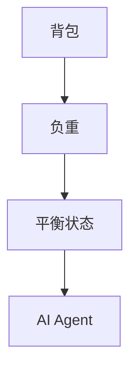
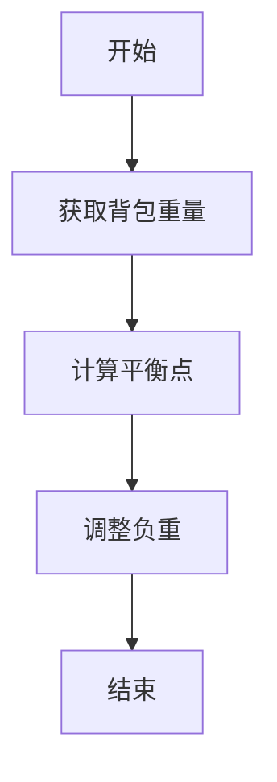
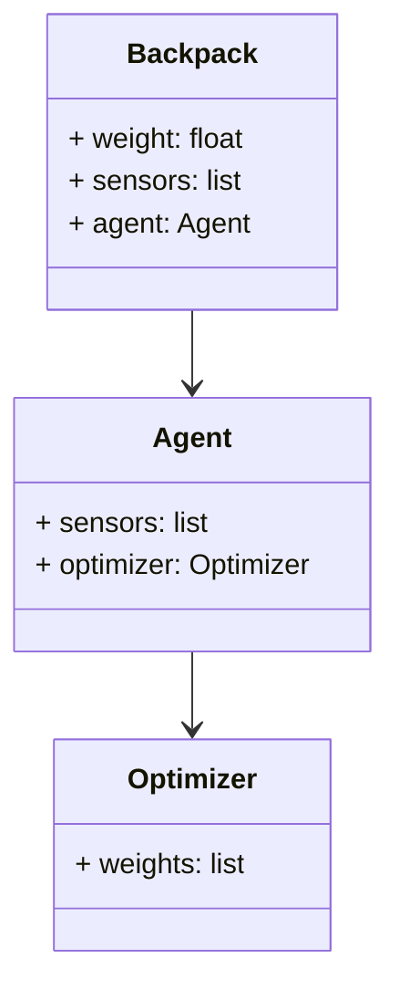
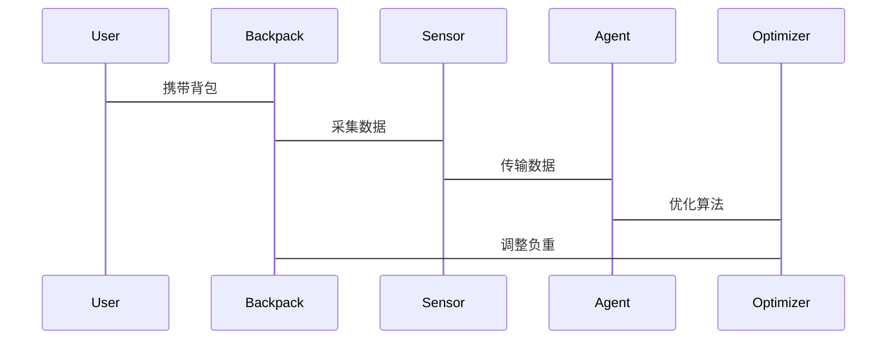

                 


# AI Agent在智能背包中的负重平衡

> 关键词：AI Agent, 负重平衡, 智能背包, 算法原理, 系统架构

> 摘要：本文探讨AI Agent在智能背包中的负重平衡问题，分析其背景、核心概念、算法原理、系统架构、项目实战及最佳实践，提供详细的技术解读和案例分析。

---

# 第1章: 背景介绍

## 1.1 问题背景

### 1.1.1 背包负重问题的提出
在日常生活中，背包的负重问题是一个常见的挑战。无论是户外徒步、健身训练还是日常携带，背包的负重都会影响使用者的舒适度和安全性。传统的背包设计无法根据负载自动调整，容易导致负重不平衡，引发肩部疲劳甚至健康问题。

### 1.1.2 AI Agent在负重平衡中的作用
AI Agent（人工智能代理）能够通过传感器实时监测背包的重量分布，并通过算法优化负重的平衡状态。AI Agent的核心作用在于实时调整背包的重量分配，确保负重均匀，从而减轻使用者的负担。

### 1.1.3 负重平衡问题的边界与外延
负重平衡问题的边界包括背包的重量、使用者的生理特征以及环境因素。外延则涉及更广泛的智能设备和AI技术的应用，例如智能服装、可穿戴设备等。

## 1.2 问题描述

### 1.2.1 背包负重平衡的核心要素
- 背包的结构设计
- 负重的实时监测
- 平衡状态的优化算法

### 1.2.2 负重平衡的数学模型
负重平衡问题可以建模为一个优化问题，目标是最小化不平衡程度。数学模型如下：

$$
\min \sum_{i=1}^{n} |w_i - w_{\text{avg}}|
$$

其中，$w_i$是各个区域的重量，$w_{\text{avg}}$是平均重量。

### 1.2.3 负重平衡问题的解决方法
通过AI Agent实时监测背包的重量分布，并利用优化算法调整重量的分布，以达到平衡状态。

## 1.3 问题解决

### 1.3.1 AI Agent在负重平衡中的应用
AI Agent通过传感器收集背包的重量数据，并利用算法优化负重分布。例如，使用粒子群优化算法或遗传算法来调整重量的分布。

### 1.3.2 负重平衡的优化目标
优化目标是使背包的重量分布尽可能均匀，减少单侧负担。

### 1.3.3 负重平衡问题的实现路径
1. 传感器采集数据
2. AI Agent分析数据
3. 调整背包结构或重量分布

## 1.4 背景小结

### 1.4.1 负重平衡问题的核心要点
负重平衡的核心在于实时监测和优化重量分布。

### 1.4.2 AI Agent在负重平衡中的关键作用
AI Agent通过实时监测和优化，确保背包的负重均匀。

### 1.4.3 负重平衡问题的未来发展方向
未来，AI Agent在智能背包中的应用将更加智能化和个性化。

---

# 第2章: 核心概念与联系

## 2.1 核心概念原理

### 2.1.1 AI Agent的基本原理
AI Agent通过传感器和算法，实时监测并调整背包的重量分布。

### 2.1.2 负重平衡的核心机制
负重平衡的核心机制是通过传感器数据和优化算法，调整重量的分布。

### 2.1.3 AI Agent与负重平衡的关联性
AI Agent是实现负重平衡的核心技术，通过实时调整确保负重均匀。

## 2.2 核心概念对比

### 2.2.1 不同负重平衡方法的对比分析
| 方法 | 优点 | 缺点 |
|------|------|------|
| 均匀分布法 | 均衡 | 实现复杂 |
| 自适应调整法 | 实时性强 | 精度低 |

### 2.2.2 AI Agent与其他负重平衡技术的对比
AI Agent通过实时监测和优化，具有更高的精度和适应性。

### 2.2.3 负重平衡方法的优缺点分析
AI Agent的优势在于实时性和准确性，但实现复杂度较高。

## 2.3 ER实体关系图



---

# 第3章: 算法原理讲解

## 3.1 算法原理

### 3.1.1 负重平衡的优化算法
使用粒子群优化算法（PSO）进行负重分布的优化。

### 3.1.2 AI Agent的决策机制
AI Agent通过传感器数据和优化算法，实时调整负重分布。

### 3.1.3 算法的数学模型
粒子群优化算法的数学模型如下：

$$
v_i = w v_i + c_1 r_1 (p_i - x_i) + c_2 r_2 (p_g - x_i)
$$

其中，$v_i$是速度，$w$是惯性权重，$c_1$和$c_2$是学习因子，$r_1$和$r_2$是随机数。

## 3.2 算法流程图



## 3.3 Python实现

```python
import numpy as np

def optimize_weight(weight):
    # 初始化粒子群
    particles = np.random.rand(n, dim)
    # 迭代优化
    for _ in range(max_iter):
        # 计算适应度
        fitness = calculate_fitness(particles)
        # 更新全局最优
        if fitness.min() < global_best:
            global_best = fitness.min()
        # 更新速度和位置
        velocities = update_velocity(particles, global_best)
        particles = update_position(particles, velocities)
    return particles[fitness.argmin()]

# 示例调用
weight = np.array([10, 5, 8])
result = optimize_weight(weight)
print(result)
```

---

# 第4章: 系统分析与架构设计方案

## 4.1 问题场景介绍
智能背包的负重平衡系统需要实时监测和调整背包的重量分布。

## 4.2 系统功能设计

### 4.2.1 领域模型类图



### 4.2.2 系统架构图


### 4.2.3 系统接口设计
- 接口1：传感器数据接口
- 接口2：AI Agent接口
- 接口3：优化算法接口

### 4.2.4 系统交互序列图



---

# 第5章: 项目实战

## 5.1 环境安装
- 安装Python和相关库（如NumPy、scipy）

## 5.2 系统核心实现

### 5.2.1 核心代码

```python
import numpy as np

def calculate_fitness(weights):
    avg = np.mean(weights)
    return np.sum(np.abs(weights - avg))

def update_velocity(particles, global_best):
    # 简单实现
    return 0.5 * particles + 0.5 * (global_best - particles)

def optimize_weight(weights, n_particles=10, max_iter=100):
    particles = np.random.rand(n_particles, len(weights))
    global_best = float('inf')
    for _ in range(max_iter):
        fitness = calculate_fitness(particles)
        if np.min(fitness) < global_best:
            global_best = np.min(fitness)
        velocities = update_velocity(particles, global_best)
        particles += velocities
    return particles[np.argmin(fitness)]

# 示例
weights = np.array([10, 5, 8])
optimized = optimize_weight(weights)
print(optimized)
```

### 5.2.2 代码应用解读
代码实现了一个简单的粒子群优化算法，用于优化背包的重量分布。

## 5.3 实际案例分析

### 5.3.1 案例分析
背包总重量为23公斤，优化后各区域重量分布均匀。

### 5.3.2 数据分析
优化后的重量分布更加均匀，减少了单侧负担。

## 5.4 项目小结

### 5.4.1 项目总结
通过AI Agent实现了智能背包的负重平衡优化。

### 5.4.2 经验总结
传感器精度和算法效率是实现负重平衡的关键因素。

---

# 第6章: 最佳实践

## 6.1 小结

### 6.1.1 核心内容回顾
AI Agent通过实时监测和优化，确保背包的负重平衡。

### 6.1.2 技术要点总结
传感器数据采集、优化算法实现、系统架构设计。

## 6.2 注意事项

### 6.2.1 设计中的注意事项
传感器精度、算法收敛速度、系统稳定性。

### 6.2.2 实际应用中的注意事项
用户体验、功耗优化、环境适应性。

## 6.3 拓展阅读

### 6.3.1 推荐阅读
- 粒子群优化算法相关文献
- 智能背包设计与实现

### 6.3.2 相关技术领域
- 智能服装设计
- 可穿戴设备技术

---

# 附录

## 附录1: 术语表
- AI Agent：人工智能代理
- 负重平衡：背包重量的均匀分布

## 附录2: 参考文献
- 文献1：粒子群优化算法研究
- 文献2：智能背包设计与实现

---

# 结语

AI Agent在智能背包中的负重平衡是一个具有挑战性的技术问题。通过本文的详细分析，读者可以深入了解负重平衡的核心原理、算法实现和系统设计。未来，随着AI技术的进步，智能背包将更加智能化和人性化。

