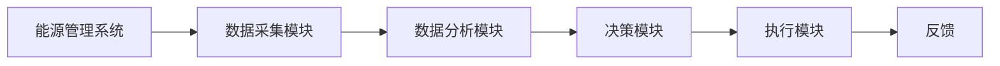
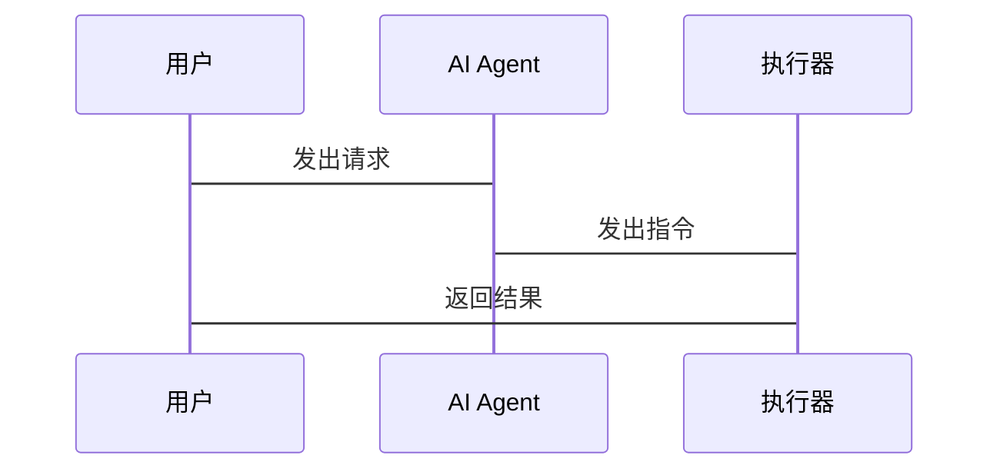

                 


---

# AI Agent在智能能源管理中的应用

## 关键词：AI Agent, 智能能源管理, 机器学习, 大数据分析, 智能电网, 可再生能源, 能源优化

## 摘要：  
本文深入探讨AI Agent在智能能源管理中的应用，从核心概念、技术基础到实际应用场景，结合系统架构设计和项目实战，全面解析AI Agent如何推动能源管理的智能化和高效化。通过详细的技术分析和实际案例，本文为读者提供从理论到实践的全面指导。

---

## 第一部分：引言

## 第1章：AI Agent与智能能源管理概述

### 1.1 AI Agent的基本概念

#### 1.1.1 AI Agent的定义  
AI Agent（人工智能代理）是指能够感知环境、自主决策并执行任务的智能实体。它通过传感器获取信息，利用算法进行分析和推理，然后通过执行器与环境互动。  

#### 1.1.2 AI Agent的核心特征  
- **自主性**：无需外部干预，自主完成任务。  
- **反应性**：能够实时感知环境变化并做出响应。  
- **目标导向性**：基于目标驱动行为，优化决策。  

#### 1.1.3 能源管理的基本概念  
能源管理是指通过优化能源的生产、分配和使用，以提高能源利用效率、降低成本并减少环境影响的过程。  

---

### 1.2 AI Agent在能源管理中的作用

#### 1.2.1 问题背景与挑战  
能源管理面临以下问题：  
1. **能源浪费**：传统能源管理方式效率低下，浪费严重。  
2. **需求波动**：能源需求随时间和场景变化，难以预测和调整。  
3. **多能源整合**：如何有效整合传统能源与可再生能源，实现协同优化。  

#### 1.2.2 AI Agent如何解决能源管理问题  
AI Agent通过实时数据分析、智能决策和自主执行，帮助能源管理系统实现：  
- **实时优化**：快速响应能源需求变化，优化能源分配。  
- **高效整合**：协调多种能源源，提高整体效率。  
- **降低能耗**：通过精准控制，减少能源浪费。  

#### 1.2.3 能源管理的边界与外延  
能源管理不仅限于电力，还包括热能、氢能等多种能源形式。其外延包括能源生产、传输、存储和消费的全生命周期管理。  

---

## 第二部分：AI Agent的核心概念与技术基础

## 第2章：AI Agent的核心概念与原理

### 2.1 AI Agent的核心概念

#### 2.1.1 AI Agent的分类  
AI Agent可以根据智能水平分为：  
- **反应式AI Agent**：基于当前感知做出反应，适用于实时任务。  
- **认知式AI Agent**：具备推理、规划能力，适用于复杂决策任务。  

#### 2.1.2 AI Agent的类型  
- **基于规则的AI Agent**：通过预定义规则进行决策。  
- **基于机器学习的AI Agent**：通过数据训练模型，实现自主学习与决策。  

#### 2.1.3 AI Agent的工作原理  
1. **感知环境**：通过传感器获取数据。  
2. **分析与决策**：利用算法分析数据，生成决策。  
3. **执行操作**：通过执行器执行决策。  

---

### 2.2 AI Agent的核心特征

#### 2.2.1 智能性  
AI Agent具备学习和适应能力，能够根据环境变化优化决策。  

#### 2.2.2 实时性  
AI Agent能够实时感知和响应，适用于动态变化的能源环境。  

#### 2.2.3 可扩展性  
AI Agent能够扩展至多种能源源和应用场景。  

---

## 第3章：AI Agent的技术基础

### 3.1 机器学习在能源管理中的应用

#### 3.1.1 机器学习基础  
机器学习是一种通过数据训练模型，使其具备预测和决策能力的技术。  

#### 3.1.2 常见机器学习算法  
- **监督学习**：用于能源需求预测和分类任务。  
- **无监督学习**：用于异常检测和聚类分析。  
- **强化学习**：用于复杂决策任务，如能源优化策略。  

#### 3.1.3 机器学习在能源管理中的应用案例  
- **能源需求预测**：利用历史数据训练模型，预测未来能源需求。  
- **设备故障预测**：通过分析设备运行数据，预测潜在故障。  

---

### 3.2 大数据分析在能源管理中的应用

#### 3.2.1 大数据分析基础  
大数据分析通过对海量数据的处理和分析，提取有价值的信息。  

#### 3.2.2 大数据分析在能源管理中的应用场景  
- **能源消耗分析**：通过分析用户用电数据，优化能源分配。  
- **能源浪费检测**：利用大数据分析发现能源浪费点。  

#### 3.2.3 大数据分析的关键技术  
- **数据采集**：通过传感器和数据库获取能源数据。  
- **数据处理**：清洗、转换和存储数据。  
- **数据分析**：使用统计分析和机器学习算法进行数据挖掘。  

---

## 第三部分：AI Agent在智能能源管理中的应用场景

## 第4章：智能电网中的AI Agent应用

### 4.1 智能电网的基本概念  
智能电网是一种通过智能化技术优化电力系统运行的电网系统。  

### 4.2 AI Agent在智能电网中的应用  

#### 4.2.1 电力负荷预测  
- **应用场景**：预测电力需求，优化发电计划。  
- **技术实现**：利用机器学习模型进行负荷预测。  

#### 4.2.2 电网优化控制  
- **应用场景**：实时调整电网运行参数，确保电力供应稳定。  
- **技术实现**：通过AI Agent实现分布式优化控制。  

---

## 第5章：需求侧管理中的AI Agent应用

### 5.1 需求侧管理的基本概念  
需求侧管理是指通过优化能源使用方式，降低能源消耗。  

### 5.2 AI Agent在需求侧管理中的应用  

#### 5.2.1 用户行为分析  
- **应用场景**：分析用户用电行为，制定个性化节能策略。  
- **技术实现**：利用大数据分析提取用户行为特征。  

#### 5.2.2 节能优化  
- **应用场景**：通过AI Agent优化能源使用，降低能耗。  
- **技术实现**：基于机器学习模型制定节能策略。  

---

## 第6章：可再生能源整合中的AI Agent应用

### 6.1 可再生能源的基本概念  
可再生能源包括太阳能、风能等清洁能源。  

### 6.2 AI Agent在可再生能源整合中的应用  

#### 6.2.1 可再生能源预测  
- **应用场景**：预测可再生能源的输出，优化能源分配。  
- **技术实现**：利用时间序列模型进行预测。  

#### 6.2.2 能源协同优化  
- **应用场景**：协调可再生能源与传统能源的输出，确保电网稳定。  
- **技术实现**：通过AI Agent实现多能源源的协同优化。  

---

## 第四部分：系统架构与设计

## 第7章：AI Agent在智能能源管理中的系统架构设计

### 7.1 系统模块划分  
- **数据采集模块**：负责采集能源数据。  
- **数据分析模块**：对数据进行处理和分析。  
- **决策模块**：基于分析结果生成决策。  
- **执行模块**：执行决策并反馈结果。  

### 7.2 系统架构设计  
使用Mermaid图展示系统架构：  


### 7.3 系统交互设计  
使用Mermaid图展示系统交互流程：  


---

## 第五部分：项目实战

## 第8章：AI Agent在智能能源管理中的项目实战

### 8.1 项目背景与目标  
本项目旨在开发一个基于AI Agent的智能能源管理系统，实现能源消耗的实时监控和优化。  

### 8.2 项目环境安装  
- **Python环境**：安装Python 3.8及以上版本。  
- **依赖库安装**：使用pip安装numpy、pandas、scikit-learn等库。  

### 8.3 项目核心实现  

#### 8.3.1 数据采集与处理  
```python
import pandas as pd
import numpy as np

# 数据采集
data = pd.read_csv('energy_data.csv')

# 数据处理
data_clean = data.dropna()
data_clean['timestamp'] = pd.to_datetime(data_clean['timestamp'])
```

#### 8.3.2 机器学习模型训练  
```python
from sklearn.model_selection import train_test_split
from sklearn.linear_model import LinearRegression

# 数据分割
X = data_clean[['temperature', 'humidity']]
y = data_clean['energy_consumption']

X_train, X_test, y_train, y_test = train_test_split(X, y, test_size=0.2)

# 模型训练
model = LinearRegression()
model.fit(X_train, y_train)

# 模型预测
y_pred = model.predict(X_test)
```

#### 8.3.3 系统实现  
```python
import time

class AI-Agent:
    def __init__(self):
        self.model = LinearRegression()

    def train(self, X, y):
        self.model.fit(X, y)

    def predict(self, X):
        return self.model.predict(X)

# 初始化AI Agent
agent = AI-Agent()
agent.train(X_train, y_train)

# 实时预测
while True:
    current_data = get_current_data()
    prediction = agent.predict(current_data)
    print(f"预测能源消耗：{prediction}")
    time.sleep(60)
```

---

## 第六部分：总结与展望

## 第9章：总结与展望

### 9.1 总结  
本文详细探讨了AI Agent在智能能源管理中的应用，从核心概念到实际应用，结合系统架构设计和项目实战，全面解析了AI Agent在能源管理中的重要作用。  

### 9.2 未来展望  
随着AI技术的不断发展，AI Agent在能源管理中的应用将更加广泛和深入。未来的研究方向包括：  
1. **多能源协同优化**：进一步研究如何协调多种能源源的输出，实现更高效的能源管理。  
2. **强化学习应用**：探索强化学习在复杂能源决策任务中的应用。  
3. **边缘计算结合**：通过边缘计算提升AI Agent的实时性和响应速度。  

---

## 参考文献  
（此处列出相关文献和资料来源）  

---

通过以上目录大纲，读者可以系统地了解AI Agent在智能能源管理中的应用，从理论到实践，逐步掌握相关技术和方法。

