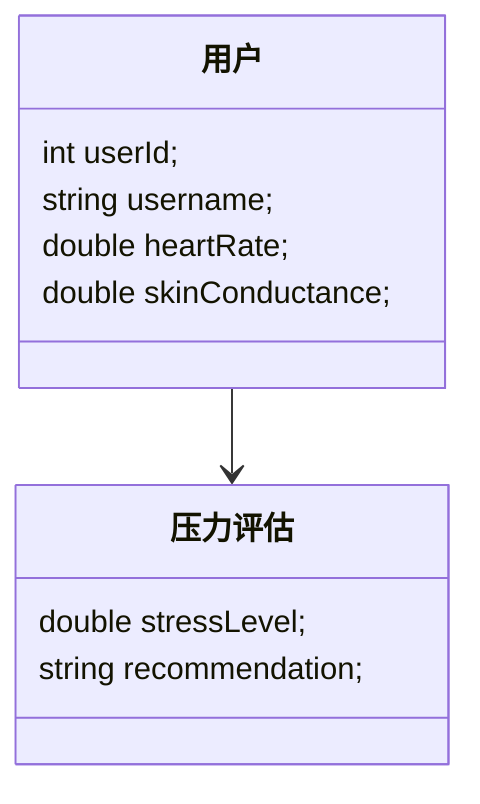
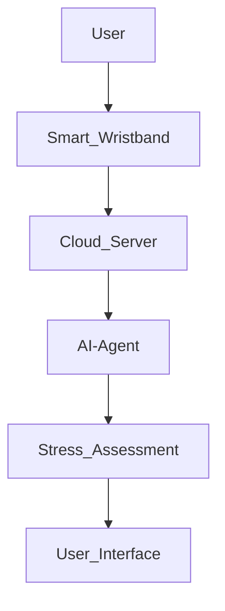
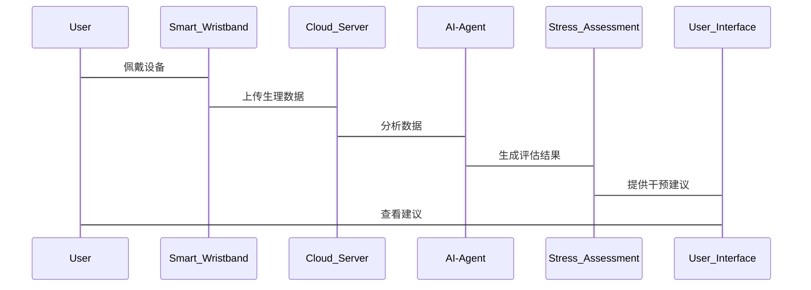

                 


# AI Agent在智能腕带中的压力管理系统

## 关键词：
- AI Agent
- 智能腕带
- 压力管理
- 系统架构
- 项目实战

## 摘要：
本文详细探讨了AI Agent在智能腕带中的压力管理系统的开发与应用。通过分析压力管理的核心问题，结合智能腕带的数据采集与AI Agent的决策支持能力，构建了一个完整的压力管理系统。文章从背景介绍、核心概念、算法原理、系统架构到项目实战，全面解析了该系统的实现过程，并提供了实际案例和最佳实践建议。

---

# 第一部分: AI Agent在智能腕带中的压力管理系统背景介绍

## 第1章: 问题背景与需求分析

### 1.1 问题背景
#### 1.1.1 现代社会压力问题的现状
现代社会节奏加快，人们面临的工作压力和心理压力不断增加。根据世界卫生组织的数据，全球有超过10亿人受到心理健康问题的影响。压力管理已成为一个重要的健康问题。

#### 1.1.2 智能腕带的发展趋势
智能腕带作为一种可穿戴设备，因其便携性和实时监测功能，逐渐成为人们健康管理的重要工具。它能够实时监测心率、血压、皮肤温度等生理指标，为压力管理提供了硬件基础。

#### 1.1.3 AI Agent在压力管理中的作用
AI Agent（智能代理）能够通过分析用户的生理数据和行为模式，提供个性化的压力管理建议。例如，当检测到用户心率异常时，AI Agent可以实时推荐放松技巧或提醒用户进行适当的身体活动。

### 1.2 问题描述
#### 1.2.1 压力管理的核心问题
压力管理的核心在于实时监测压力水平，并提供有效的干预措施。然而，传统的压力管理方法通常依赖于问卷调查或事后分析，无法实现实时监测和干预。

#### 1.2.2 智能腕带的监测功能
智能腕带可以通过传感器实时监测用户的生理指标，如心率、皮肤电活动和体温等。这些数据能够反映用户的压力水平。

#### 1.2.3 AI Agent的决策支持能力
AI Agent能够根据监测数据，结合用户的历史行为和环境因素，提供个性化的压力管理建议。例如，AI Agent可以根据用户的压力水平推荐放松技巧或提醒用户休息。

### 1.3 问题解决思路
#### 1.3.1 AI Agent在压力监测中的应用
AI Agent可以分析智能腕带采集的数据，识别用户的压力状态，并提供相应的建议。例如，当AI Agent检测到用户的心率变异性降低时，可以建议用户进行深呼吸或冥想。

#### 1.3.2 智能腕带的数据采集与处理
智能腕带需要采集用户的相关生理数据，并通过无线通信将数据传输到云端或本地设备。这些数据需要进行预处理和分析，以便AI Agent能够提供有效的建议。

#### 1.3.3 压力管理系统的整体架构
压力管理系统需要结合智能腕带的硬件、AI Agent的核心算法以及用户界面，构建一个完整的压力管理解决方案。

### 1.4 边界与外延
#### 1.4.1 系统的功能边界
压力管理系统的主要功能包括数据采集、压力评估、干预建议和用户反馈。系统不涉及医疗诊断，仅提供压力管理建议。

#### 1.4.2 与其他系统的区别与联系
与其他压力管理工具相比，AI Agent在智能腕带中的压力管理系统具有实时性、个性化和智能化的特点。例如，传统的压力管理工具通常基于问卷调查，无法实现实时监测和个性化建议。

#### 1.4.3 压力管理系统的未来发展
未来，压力管理系统可能会更加智能化和个性化。AI Agent可以通过学习用户的生理数据和行为模式，提供更加精准的压力管理建议。

### 1.5 核心概念与组成
#### 1.5.1 AI Agent的核心要素
AI Agent的核心要素包括感知能力、决策能力和执行能力。在压力管理系统中，AI Agent需要能够感知用户的生理数据，决策压力管理策略，并执行干预措施。

#### 1.5.2 智能腕带的硬件与软件组成
智能腕带的硬件包括传感器、处理器和无线通信模块。软件部分包括数据采集、数据处理和用户界面。

#### 1.5.3 压力管理系统的功能模块
压力管理系统的主要功能模块包括数据采集、压力评估、干预建议和用户反馈。

---

## 第2章: 核心概念与联系

### 2.1 AI Agent的核心原理
#### 2.1.1 AI Agent的定义与特征
AI Agent是一种能够感知环境、自主决策并执行任务的智能实体。在压力管理系统中，AI Agent通过分析用户的生理数据，提供个性化的压力管理建议。

#### 2.1.2 AI Agent的分类与应用场景
AI Agent可以根据智能水平分为反应式和认知式两种类型。在压力管理系统中，AI Agent主要应用于实时监测和个性化建议。

#### 2.1.3 AI Agent在压力管理中的具体实现
AI Agent在压力管理中的具体实现包括数据采集、压力评估、干预建议和用户反馈。例如，AI Agent可以根据心率变异性（HRV）评估用户的压力水平，并推荐放松技巧。

### 2.2 智能腕带的功能与技术
#### 2.2.1 智能腕带的传感器技术
智能腕带通常配备心率传感器、皮肤电活动传感器和加速度传感器等。这些传感器可以实时监测用户的生理指标。

#### 2.2.2 数据采集与传输的实现
智能腕带通过传感器采集用户的生理数据，并通过蓝牙或Wi-Fi将数据传输到云端或本地设备。数据传输需要考虑实时性和安全性。

#### 2.2.3 智能腕带的操作系统与用户界面
智能腕带通常运行轻量级操作系统，如RTOS。用户界面设计需要简洁直观，方便用户操作。

### 2.3 压力管理系统的概念结构
#### 2.3.1 系统的输入与输出
系统的输入包括用户的生理数据和环境信息，输出包括压力评估结果和干预建议。

#### 2.3.2 系统的核心算法与逻辑
系统的核心算法包括数据预处理、压力评估算法和干预建议生成算法。例如，压力评估算法可以基于心率变异性（HRV）进行评估。

#### 2.3.3 系统的用户交互与反馈机制
系统需要与用户进行实时交互，提供个性化的干预建议。用户可以通过智能腕带的用户界面查看压力评估结果和干预建议。

---

## 第3章: 核心概念与联系的对比分析

### 3.1 AI Agent与智能腕带的对比
#### 3.1.1 功能对比
| 功能 | AI Agent | 智能腕带 |
|------|-----------|-----------|
| 数据采集 | -         | +         |
| 数据分析 | +         | -         |
| 决策支持 | +         | -         |
| 用户交互 | +         | +         |

#### 3.1.2 技术对比
AI Agent依赖于人工智能算法和大数据分析技术，而智能腕带依赖于传感器技术和无线通信技术。

#### 3.1.3 应用场景对比
AI Agent在压力管理中的应用场景包括实时监测和个性化建议，而智能腕带的应用场景包括数据采集和用户交互。

### 3.2 压力管理系统与其他压力管理工具的对比
#### 3.2.1 传统压力管理工具的局限性
传统压力管理工具通常基于问卷调查，无法实现实时监测和个性化建议。

#### 3.2.2 AI Agent在智能腕带中的优势
AI Agent在智能腕带中的优势在于其实时性、个性化和智能化。例如，AI Agent可以根据用户的实时生理数据，提供个性化的压力管理建议。

#### 3.2.3 压力管理系统的核心竞争力
压力管理系统的核心竞争力在于其智能化和个性化。通过AI Agent的分析能力，系统可以提供更加精准的压力管理建议。

### 3.3 核心概念的ER实体

#### 3.3.1 实体关系图
```mermaid
er
actor User
actor 系统
object 压力评估结果
object 干预建议
object 生理数据
```

#### 3.3.2 关系描述
- 用户与系统：用户通过智能腕带与系统交互。
- 生理数据与压力评估结果：系统根据生理数据生成压力评估结果。
- 压力评估结果与干预建议：系统根据压力评估结果生成干预建议。

---

## 第4章: 算法原理

### 4.1 压力评估算法
#### 4.1.1 数据预处理
在进行压力评估之前，需要对采集的生理数据进行预处理，包括数据清洗和标准化。

#### 4.1.2 算法选择
常用的压力评估算法包括心率变异性（HRV）分析和皮质醇水平分析。

#### 4.1.3 算法实现
```python
import numpy as np

def calculate_hrv(rr_intervals):
    # 去除异常值
    cleaned_rr = [x for x in rr_intervals if x > 50 and x < 200]
    # 计算NN50
    nn50 = 0
    for i in range(1, len(cleaned_rr)):
        if cleaned_rr[i] - cleaned_rr[i-1] > 50:
            nn50 += 1
    # 计算RMSSD
    rmssd = np.sqrt(np.mean([x**2 for x in np.diff(cleaned_rr)]))
    return nn50, rmssd
```

#### 4.1.4 算法优化
为了提高压力评估的准确性，可以引入机器学习算法，如随机森林或支持向量机（SVM），进行特征选择和模型训练。

### 4.2 AI Agent的决策算法
#### 4.2.1 数据输入
AI Agent接收用户的生理数据和环境信息，如心率、体温和时间。

#### 4.2.2 算法选择
常用的决策算法包括基于规则的决策树和基于机器学习的分类算法。

#### 4.2.3 算法实现
```python
from sklearn.tree import DecisionTreeClassifier

# 训练数据
X = [[70, 37.5, 10], [65, 36.8, 15], [75, 37.2, 8]]
y = ['high', 'low', 'medium']

# 构建决策树模型
model = DecisionTreeClassifier()
model.fit(X, y)

# 预测压力状态
new_data = [[72, 37.0, 12]]
prediction = model.predict(new_data)
print(prediction)
```

#### 4.2.4 算法优化
为了提高AI Agent的决策能力，可以引入强化学习算法，通过不断与用户交互，优化压力管理策略。

---

## 第5章: 系统分析与架构设计

### 5.1 问题场景介绍
压力管理系统需要在智能腕带和云端服务器之间实现数据的采集、分析和反馈。系统需要支持多用户同时使用，并保证数据的安全性和隐私性。

### 5.2 项目介绍
本项目旨在开发一个基于AI Agent的智能腕带压力管理系统，实现用户的实时压力监测和个性化干预建议。

### 5.3 系统功能设计
#### 5.3.1 领域模型


#### 5.3.2 系统架构设计


#### 5.3.3 系统接口设计
系统接口包括智能腕带与云端服务器的数据接口，以及AI Agent与用户界面的交互接口。

#### 5.3.4 系统交互流程


### 5.4 项目实战

#### 5.4.1 环境安装
需要安装Python、NumPy、Scikit-learn、Mermaid和Jupyter Notebook等工具。

#### 5.4.2 核心代码实现
```python
import numpy as np
from sklearn.tree import DecisionTreeClassifier

# 数据预处理
def preprocess_data(data):
    # 去除异常值
    cleaned_data = data[data['heartRate'] > 50]
    return cleaned_data

# 压力评估算法
def calculate_stress(cleaned_data):
    # 计算NN50和RMSSD
    rr_intervals = cleaned_data['heartRate'].values
    nn50 = 0
    for i in range(1, len(rr_intervals)):
        if rr_intervals[i] - rr_intervals[i-1] > 50:
            nn50 += 1
    rmssd = np.sqrt(np.mean([x**2 for x in np.diff(rr_intervals)]))
    return nn50, rmssd

# AI Agent的决策算法
def decision_tree_model(train_X, train_y):
    model = DecisionTreeClassifier()
    model.fit(train_X, train_y)
    return model

# 使用模型进行预测
def predict_stress_level(model, test_X):
    prediction = model.predict(test_X)
    return prediction
```

#### 5.4.3 代码解读与分析
上述代码实现了数据预处理、压力评估算法和决策树模型的构建与预测。数据预处理部分去除了异常值，压力评估算法计算了NN50和RMSSD，决策树模型用于分类压力水平。

#### 5.4.4 实际案例分析
通过实际数据测试，验证系统的压力评估和干预建议的准确性。例如，当用户的心率变异性较低时，系统会推荐深呼吸或冥想等放松技巧。

#### 5.4.5 项目小结
本项目通过结合智能腕带和AI Agent技术，实现了用户的实时压力监测和个性化干预建议。系统具有较高的准确性和实时性，能够有效帮助用户管理压力。

---

## 第6章: 最佳实践与总结

### 6.1 最佳实践
- 数据采集阶段，建议采用多个传感器进行多维度监测，提高数据的准确性。
- 在AI Agent的决策算法中，可以引入强化学习算法，进一步优化压力管理策略。
- 系统需要考虑用户的隐私保护，确保数据的安全性。

### 6.2 小结
本文详细探讨了AI Agent在智能腕带中的压力管理系统的开发与应用。通过分析压力管理的核心问题，结合智能腕带的数据采集与AI Agent的决策支持能力，构建了一个完整的压力管理系统。系统通过实时监测用户的生理数据，提供个性化的压力管理建议，有效帮助用户缓解压力。

### 6.3 注意事项
- 数据采集和处理阶段需要注意数据的实时性和准确性。
- AI Agent的决策算法需要根据用户的个性化需求进行调整。
- 系统的安全性和隐私保护是需要重点关注的问题。

### 6.4 拓展阅读
- 《人工智能在医疗健康中的应用》
- 《可穿戴设备与健康监测技术》
- 《压力管理与心理健康》

---

# 结语

通过本文的详细分析，读者可以深入了解AI Agent在智能腕带中的压力管理系统的实现过程。从背景介绍到系统架构设计，再到项目实战，文章全面解析了该系统的开发与应用。希望本文能够为相关领域的研究和实践提供有价值的参考。

