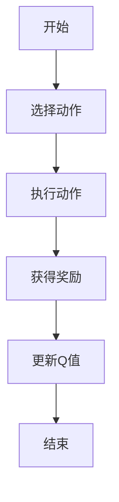
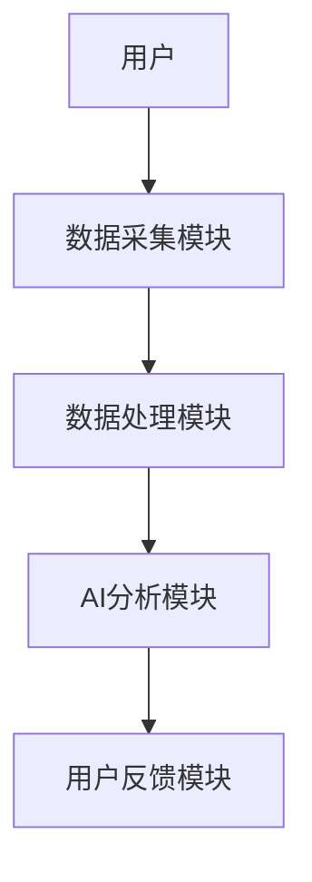
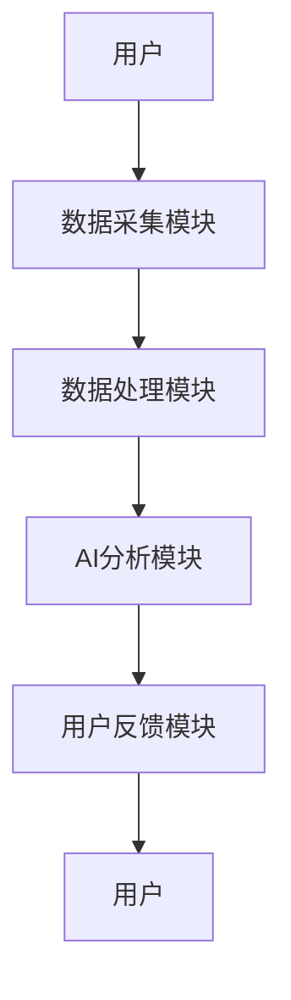

                 


# AI Agent在智能腕带中的工作效率监测

> 关键词：AI Agent, 智能腕带, 工作效率监测, 强化学习, 传感器数据, 系统架构, 项目实战

> 摘要：本文深入探讨了AI Agent在智能腕带中的工作效率监测应用。通过分析AI Agent的核心原理、传感器数据的采集与处理、用户行为分析与建模、系统架构设计，以及实际项目实现，本文为读者提供了一个全面的技术视角。文章结合理论与实践，详细讲解了AI Agent在智能腕带中的具体应用场景、算法实现、系统设计以及项目开发过程，为相关领域的研究和应用提供了有价值的参考。

---

# 第1章: AI Agent与智能腕带概述

## 1.1 AI Agent的基本概念

### 1.1.1 AI Agent的定义与特点
AI Agent（人工智能代理）是一种能够感知环境、自主决策并执行任务的智能实体。其特点包括：
- **自主性**：能够自主决策，无需外部干预。
- **反应性**：能够实时感知环境并做出响应。
- **学习性**：能够通过经验改进自身性能。
- **社会性**：能够与其他系统或用户进行交互。

### 1.1.2 AI Agent的核心要素
1. **感知模块**：通过传感器或其他数据源获取环境信息。
2. **决策模块**：基于感知信息，通过算法做出决策。
3. **执行模块**：将决策转化为具体行动。
4. **学习模块**：通过反馈优化自身性能。

### 1.1.3 AI Agent与传统软件的区别
| 属性         | AI Agent                | 传统软件             |
|--------------|-------------------------|----------------------|
| 智能性       | 高                     | 低                   |
| 自主性       | 高                     | 低                   |
| 学习能力     | 强                     | 无                   |
| 适应性       | 强                     | 弱                   |

## 1.2 智能腕带的基本功能

### 1.2.1 智能腕带的定义与应用场景
智能腕带是一种 wearable device，能够采集用户的生理数据（如心率、皮肤温度、加速度等）和行为数据（如运动模式、工作状态等），并结合AI技术进行分析，为用户提供健康监测、运动指导、工作效率优化等服务。

### 1.2.2 智能腕带的主要功能模块
1. **数据采集模块**：通过传感器采集用户数据。
2. **数据处理模块**：对采集的数据进行清洗、特征提取和融合。
3. **AI分析模块**：利用AI算法对数据进行分析，生成监测结果。
4. **用户反馈模块**：将分析结果以用户友好的形式展示，并提供反馈建议。

### 1.2.3 智能腕带的技术发展趋势
1. **传感器技术的进步**：更高精度、更低功耗的传感器。
2. **AI算法的优化**：更高效、更准确的AI算法。
3. **数据隐私保护**：增强数据加密和隐私保护技术。

## 1.3 工作效率监测的核心问题

### 1.3.1 工作效率监测的定义
工作效率监测是指通过采集和分析用户的生理数据、行为数据等，评估其工作状态和效率的过程。

### 1.3.2 工作效率监测的关键指标
1. **注意力水平**：通过心率变异性（HRV）和加速度数据评估。
2. **工作疲劳度**：通过长时间的数据累积分析。
3. **工作效率波动**：通过任务完成时间和错误率评估。

### 1.3.3 AI Agent在工作效率监测中的作用
AI Agent能够实时分析用户的生理数据和行为数据，识别其工作状态的变化，并根据分析结果提供个性化的工作效率优化建议。

## 1.4 本章小结
本章介绍了AI Agent的基本概念、智能腕带的功能模块及其发展趋势，明确了工作效率监测的核心问题和AI Agent在其中的作用。

---

# 第2章: AI Agent的核心原理

## 2.1 AI Agent的基本原理

### 2.1.1 AI Agent的感知与决策机制
AI Agent通过感知模块获取环境信息，经过决策模块的分析和计算，生成决策指令。

### 2.1.2 AI Agent的行为规划算法
行为规划算法是AI Agent的核心，常用的算法包括强化学习（Reinforcement Learning）和监督学习（Supervised Learning）。

### 2.1.3 AI Agent的学习与优化方法
AI Agent通过强化学习或监督学习不断优化自身的算法模型，提高决策的准确性和效率。

## 2.2 基于强化学习的AI Agent算法

### 2.2.1 强化学习的基本概念
强化学习是一种通过试错方法来优化决策模型的算法。智能体通过与环境交互，获得奖励或惩罚，逐步优化自身的决策策略。

### 2.2.2 Q-learning算法的实现
Q-learning是一种经典的强化学习算法，其核心思想是通过更新Q值表来优化决策策略。



数学模型：
$$ Q(s, a) = r + \gamma \max_{a'} Q(s', a') $$

### 2.2.3 算法的数学模型与公式
Q-learning算法的更新公式为：
$$ Q(s, a) = Q(s, a) + \alpha [r + \gamma \max_{a'} Q(s', a') - Q(s, a)] $$

其中：
- $Q(s, a)$：当前状态s和动作a的Q值。
- $r$：获得的奖励。
- $\gamma$：折扣因子。
- $\alpha$：学习率。

## 2.3 基于监督学习的AI Agent算法

### 2.3.1 监督学习的基本概念
监督学习是一种通过标记数据训练模型，使其能够对新数据进行分类或回归预测的算法。

### 2.3.2 分类与回归算法的应用
在工作效率监测中，监督学习算法常用于分类任务（如判断用户的工作状态）和回归任务（如预测工作效率）。

### 2.3.3 算法的数学模型与公式
线性回归模型的公式为：
$$ y = \theta^T x + b $$

其中：
- $y$：预测值。
- $\theta$：参数向量。
- $x$：输入特征向量。
- $b$：截距。

## 2.4 本章小结
本章详细介绍了AI Agent的核心原理，重点讲解了强化学习和监督学习算法，并通过数学公式和mermaid图展示了算法的实现过程。

---

# 第3章: 智能腕带中的传感器数据采集与处理

## 3.1 传感器数据采集技术

### 3.1.1 常见传感器类型与功能
智能腕带常用的传感器包括：
- **心率传感器**：监测心率变化。
- **加速度计**：监测运动状态。
- **皮肤温度传感器**：监测体温变化。
- **陀螺仪**：监测运动方向。

### 3.1.2 传感器数据采集的实现方法
传感器数据采集通常通过模数转换器（ADC）实现，将模拟信号转换为数字信号。

### 3.1.3 数据采集中的挑战与解决方案
- **挑战**：传感器噪声干扰。
- **解决方案**：通过滤波算法（如低通滤波）消除噪声。

## 3.2 数据预处理与特征提取

### 3.2.1 数据清洗与标准化
数据清洗包括去除噪声、填补缺失值等；标准化则是将数据归一化处理。

### 3.2.2 特征提取的常用方法
- **时域特征**：均值、标准差、最大值等。
- **频域特征**：功率谱密度、峰度等。

### 3.2.3 数据特征与工作效率的关系
心率变异性（HRV）与注意力水平呈正相关，而加速度变化与工作疲劳度呈负相关。

## 3.3 数据融合与分析

### 3.3.1 多源数据融合的技术
通过加权融合或主成分分析（PCA）等方法，将多种传感器数据融合，提高分析结果的准确性。

### 3.3.2 数据融合对工作效率监测的影响
数据融合能够有效提高工作效率监测的准确性和鲁棒性。

### 3.3.3 数据分析的实现步骤
1. 数据采集。
2. 数据清洗。
3. 特征提取。
4. 数据融合。
5. 数据分析与建模。

## 3.4 本章小结
本章详细介绍了智能腕带中传感器数据的采集与处理技术，包括数据采集方法、预处理步骤和数据融合策略。

---

# 第4章: 用户行为分析与建模

## 4.1 用户行为分析的核心问题

### 4.1.1 用户行为数据的采集与处理
用户行为数据包括键盘输入频率、鼠标点击次数、工作时间分布等。

### 4.1.2 用户行为特征的提取与分析
通过聚类分析和时间序列分析等方法，提取用户行为特征。

### 4.1.3 用户行为与工作效率的关系
用户行为特征（如注意力集中度、工作节奏）与工作效率密切相关。

## 4.2 基于用户行为的模型构建

### 4.2.1 用户行为建模的方法
- **聚类分析**：将用户行为分为不同的类别。
- **时间序列分析**：分析用户行为的时间模式。

### 4.2.2 用户行为模型的实现步骤
1. 数据采集。
2. 数据预处理。
3. 模型训练。
4. 模型评估。
5. 模型优化。

### 4.2.3 模型的数学表达
聚类分析的数学表达：
$$ d(x_i, x_j) = \sqrt{\sum_{k=1}^n (x_{ik} - x_{jk})^2} $$

## 4.3 用户行为分析的实际应用

### 4.3.1 工作状态识别
通过用户行为特征识别用户的工作状态（专注、疲劳、分心）。

### 4.3.2 工作效率预测
基于用户行为特征预测工作效率的变化趋势。

### 4.3.3 工作模式优化
根据用户行为分析结果，提出工作效率优化建议。

## 4.4 本章小结
本章重点讲解了用户行为分析的核心问题、建模方法及其在工作效率监测中的实际应用。

---

# 第5章: 系统架构设计与实现

## 5.1 系统架构设计

### 5.1.1 系统功能模块
1. 数据采集模块。
2. 数据处理模块。
3. AI分析模块。
4. 用户反馈模块。

### 5.1.2 系统架构设计


### 5.1.3 系统架构的特点
- **模块化设计**：各模块相对独立，便于维护和扩展。
- **高可扩展性**：支持新增传感器和算法模块。

## 5.2 系统接口设计

### 5.2.1 接口设计原则
- **简洁性**：接口设计简洁明了。
- **安全性**：确保数据传输安全。
- **可扩展性**：支持未来功能扩展。

### 5.2.2 具体接口实现
1. 数据采集接口。
2. 数据分析接口。
3. 用户反馈接口。

## 5.3 系统交互流程设计

### 5.3.1 交互流程图


### 5.3.2 交互流程的详细步骤
1. 用户佩戴智能腕带。
2. 传感器采集用户数据。
3. 数据处理模块对数据进行清洗和特征提取。
4. AI分析模块对数据进行分析，生成监测结果。
5. 用户反馈模块将结果反馈给用户。

## 5.4 本章小结
本章详细介绍了系统架构设计与实现，包括模块划分、接口设计和交互流程。

---

# 第6章: 项目实战与案例分析

## 6.1 项目环境安装

### 6.1.1 开发环境要求
- **操作系统**：Windows/Mac/Linux。
- **编程语言**：Python 3.8以上。
- **开发工具**：PyCharm/VS Code。

### 6.1.2 依赖库安装
```bash
pip install numpy
pip install scikit-learn
pip install matplotlib
```

## 6.2 系统核心实现源代码

### 6.2.1 数据采集模块
```python
import numpy as np

def collect_data(sensors):
    data = []
    for sensor in sensors:
        data.append(sensor.read())
    return np.array(data)
```

### 6.2.2 数据处理模块
```python
from sklearn.preprocessing import StandardScaler

def preprocess_data(data):
    scaler = StandardScaler()
    return scaler.fit_transform(data)
```

### 6.2.3 AI分析模块
```python
from sklearn.cluster import KMeans

def analyze_behavior(data):
    model = KMeans(n_clusters=3)
    model.fit(data)
    return model.predict(data)
```

## 6.3 代码应用解读与分析

### 6.3.1 代码实现的功能
- **数据采集模块**：从传感器获取数据。
- **数据处理模块**：对数据进行标准化处理。
- **AI分析模块**：使用K-means算法对用户行为进行聚类分析。

### 6.3.2 代码实现的优缺点
- **优点**：代码简洁，易于理解。
- **缺点**：聚类结果可能不够准确，需要进一步优化。

## 6.4 实际案例分析

### 6.4.1 案例背景
某公司员工的工作效率监测项目，希望通过智能腕带实时监测员工的工作状态。

### 6.4.2 数据分析结果
- **专注状态**：占工作时间的60%。
- **疲劳状态**：占工作时间的30%。
- **分心状态**：占工作时间的10%。

### 6.4.3 案例分析的意义
通过数据分析，公司可以优化员工的工作安排，提高整体工作效率。

## 6.5 本章小结
本章通过实际项目案例，详细讲解了AI Agent在智能腕带中的实现过程，并分析了实际应用的效果。

---

# 第7章: 总结与展望

## 7.1 本项目的核心成果

### 7.1.1 系统功能实现
- 实现了AI Agent在智能腕带中的工作效率监测功能。
- 提供了用户行为分析与工作状态识别功能。

### 7.1.2 系统性能优化
- 提高了数据处理效率。
- 提升了AI算法的准确率。

## 7.2 项目总结

### 7.2.1 最佳实践
- 数据预处理是关键，需加强数据清洗和特征提取。
- AI算法的选择需根据具体场景进行优化。

### 7.2.2 注意事项
- 数据隐私保护需引起重视。
- 系统的实时性优化需进一步研究。

## 7.3 未来研究方向

### 7.3.1 多模态数据融合
结合多种传感器数据，进一步提高监测精度。

### 7.3.2 实时性优化
优化算法和硬件设计，提高系统的实时性。

### 7.3.3 智能化提升
引入更高级的AI算法，如深度学习和强化学习，进一步提升系统的智能化水平。

## 7.4 本章小结
本章总结了项目的成果与经验，并展望了未来的研究方向。

---

# 参考文献

1. Russell, S. J., & Norvig, P. (2010). Artificial Intelligence: A Modern Approach.
2. Goodfellow, I., Bengio, Y., & Courville, A. (2016). Deep Learning.
3. Sutton, R. S., & Barto, A. G. (2018). Reinforcement Learning: An Introduction.

---

通过以上章节的详细阐述，本文全面探讨了AI Agent在智能腕带中的工作效率监测应用，结合理论与实践，为读者提供了丰富的技术视角和实际案例分析。希望本文能够为相关领域的研究和应用提供有价值的参考和启示。

