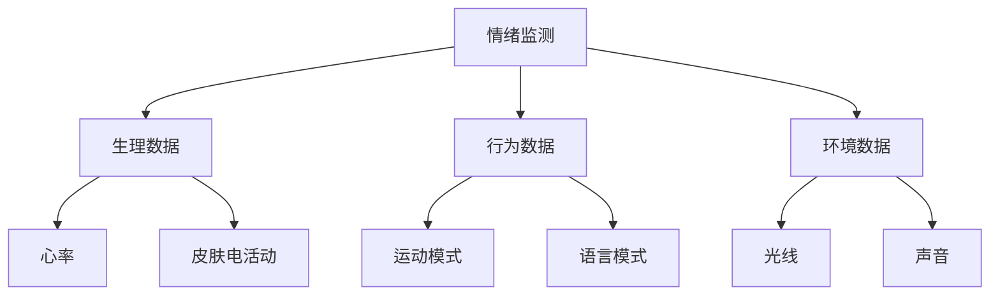
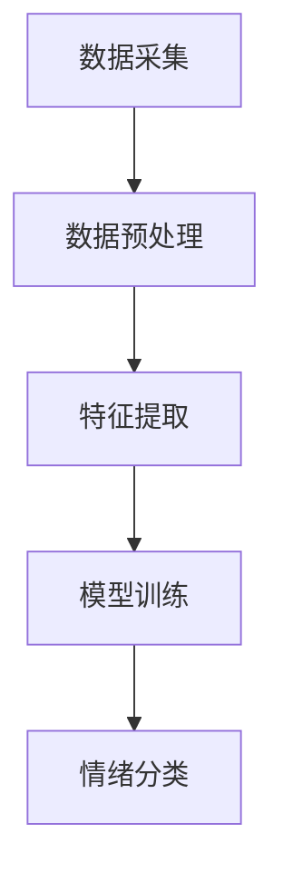
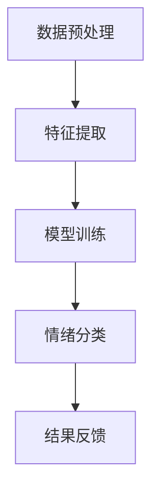
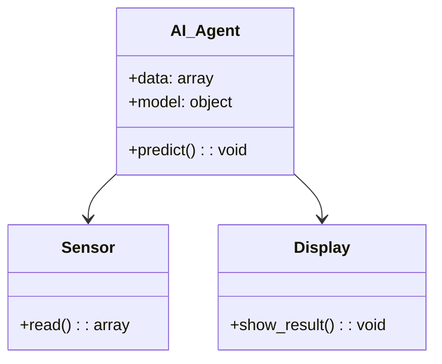
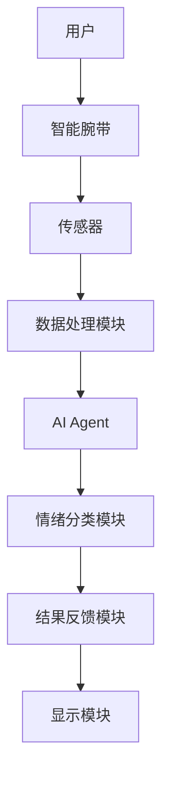

                 


# AI Agent在智能腕带中的情绪监测

> 关键词：AI Agent，智能腕带，情绪监测，机器学习，数据采集，实时处理

> 摘要：本文探讨了AI Agent在智能腕带中的情绪监测应用，从背景、核心概念、算法原理到系统架构和项目实战，详细分析了情绪监测的实现过程和挑战，为开发者提供全面的技术指导。

---

# 第一部分: 情绪监测的背景与重要性

## 第1章: 情绪监测的背景介绍

### 1.1 情绪监测的定义与核心概念

情绪监测是通过分析生理数据、行为数据和环境数据，来推断个体情绪状态的过程。AI Agent在其中扮演着数据处理、分析和反馈的核心角色。

**核心概念：**

- **生理数据**：如心率、皮肤电活动、体温等。
- **行为数据**：如运动模式、语言模式、社交互动等。
- **环境数据**：如光线、声音、温度等。

**概念结构图（Mermaid）：**



### 1.2 情绪监测在智能设备中的应用场景

- **健康监测**：帮助识别压力、焦虑等情绪问题。
- **个性化服务**：根据情绪状态提供定制化建议。
- **社交辅助**：在社交场合中提供情绪反馈。

### 1.3 AI Agent在智能腕带中的作用

AI Agent负责从数据采集、特征提取到情绪分类的整个流程，实现对佩戴者情绪状态的实时监测和反馈。

---

## 第2章: 智能腕带的发展与趋势

### 2.1 智能腕带的功能演变

从简单的计步器到多功能健康监测设备，智能腕带的功能逐步扩展，情绪监测成为最新趋势。

### 2.2 情绪监测在智能腕带中的创新应用

- **实时反馈**：佩戴者可以通过腕带实时了解自己的情绪状态。
- **数据记录**：长期记录情绪变化，帮助用户进行情绪管理。

### 2.3 未来发展趋势与挑战

- **技术挑战**：提高数据采集精度和情绪分类的准确性。
- **隐私问题**：如何保护用户的隐私数据。

---

# 第二部分: AI Agent的核心概念与情绪监测的原理

## 第3章: AI Agent的基本原理与实现机制

### 3.1 AI Agent的核心概念

- **AI Agent**：具有感知环境、自主决策和执行任务的能力。
- **智能腕带**：作为AI Agent的载体，负责数据采集和交互。

**概念属性对比表：**

| 概念      | 定义                                                                 | 属性               |
|-----------|--------------------------------------------------------------------|--------------------|
| AI Agent  | 具备感知、推理和执行能力的智能实体                                   | 自主性、适应性     |
| 智能腕带  | 集成传感器和计算模块，用于数据采集和用户交互的可穿戴设备         | 实时性、便捷性     |

### 3.2 情绪监测的核心原理

- **数据采集**：通过传感器获取生理数据和环境数据。
- **特征提取**：对数据进行预处理和特征提取，便于后续分析。
- **情绪分类**：基于机器学习模型，对情绪进行分类。

**数据流处理流程图（Mermaid）：**



---

# 第三部分: AI Agent在智能腕带中的算法实现

## 第4章: 情绪监测的算法原理与流程

### 4.1 情绪监测的算法选择

- **机器学习算法**：如支持向量机（SVM）、随机森林（Random Forest）。
- **深度学习算法**：如卷积神经网络（CNN）、长短期记忆网络（LSTM）。

**算法选择对比表：**

| 算法类型 | 优势                | 劣势                |
|----------|---------------------|--------------------|
| SVM      | 高准确性，易部署     | 数据依赖性高         |
| LSTM     | 能捕捉时间序列特征   | 训练时间较长         |

### 4.2 情绪监测的算法流程

**算法流程图（Mermaid）：**



**Python代码示例：**

```python
import numpy as np
from sklearn.svm import SVC

# 数据预处理
data = np.array([...])
labels = np.array([...])

# 特征提取
features = data[:, :5]

# 模型训练
model = SVC()
model.fit(features, labels)

# 情绪分类
new_data = np.array([...])
prediction = model.predict(new_data)
print("预测的情绪类别：", prediction)
```

### 4.3 数学模型与公式

**SVM模型的优化目标（LaTeX公式）：**

$$
\min_{\theta, \alpha} \frac{1}{2}\alpha^2 + C\sum_{i=1}^n \xi_i
$$

---

# 第四部分: 系统分析与架构设计

## 第5章: 智能腕带情绪监测系统的架构设计

### 5.1 系统功能设计

**领域模型类图（Mermaid）：**



### 5.2 系统架构设计

**系统架构图（Mermaid）：**



---

# 第五部分: 项目实战与应用案例

## 第6章: 智能腕带情绪监测系统的实现

### 6.1 环境安装与配置

- **Python环境**：安装Python 3.x及以上版本。
- **库的安装**：使用pip安装numpy、scikit-learn、tensorflow等库。

### 6.2 核心代码实现

```python
import numpy as np
from sklearn.model_selection import train_test_split
from sklearn.svm import SVC
from sklearn.metrics import accuracy_score

# 数据加载
data = np.loadtxt('emotion_data.csv', delimiter=',')
labels = data[:, -1]
features = data[:, :-1]

# 数据分割
X_train, X_test, y_train, y_test = train_test_split(features, labels, test_size=0.2)

# 模型训练
model = SVC()
model.fit(X_train, y_train)

# 模型测试
y_pred = model.predict(X_test)
print("准确率：", accuracy_score(y_test, y_pred))
```

### 6.3 项目小结与优化建议

- **小结**：成功实现了基于AI Agent的智能腕带情绪监测系统。
- **优化建议**：优化算法性能，增加更多数据特征，提升分类准确率。

---

# 第六部分: 最佳实践与注意事项

## 第7章: 最佳实践与注意事项

### 7.1 最佳实践

- **数据质量**：确保数据的准确性和完整性。
- **模型优化**：定期更新模型，提升分类性能。
- **用户体验**：提供直观的反馈方式，增强用户体验。

### 7.2 注意事项

- **隐私保护**：严格保护用户数据，避免泄露。
- **性能优化**：确保系统在低功耗环境下高效运行。

---

# 第七部分: 总结与展望

## 第8章: 总结与展望

### 8.1 总结

本文详细介绍了AI Agent在智能腕带中的情绪监测应用，从背景、原理到实现，为开发者提供了全面的技术指导。

### 8.2 展望

未来，随着AI技术的不断发展，智能腕带的情绪监测将更加智能化、个性化，为用户带来更好的使用体验。

---

# 第八部分: 拓展阅读与参考资料

## 第9章: 拓展阅读与参考资料

### 9.1 相关书籍

- 《Machine Learning: A

