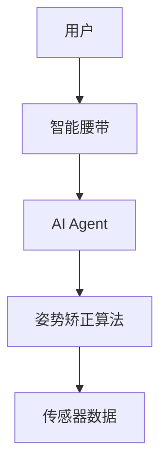
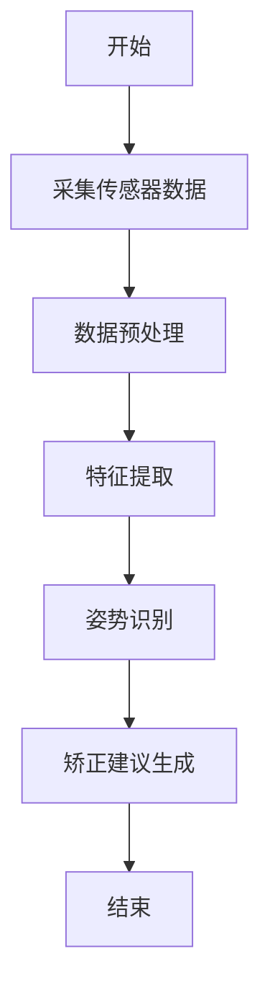
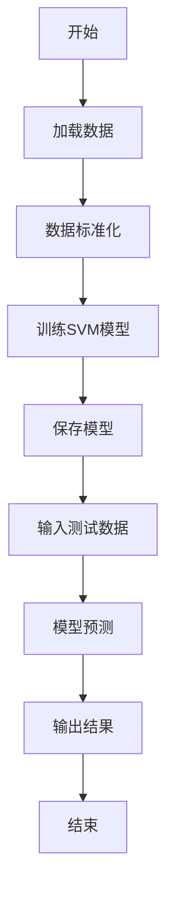
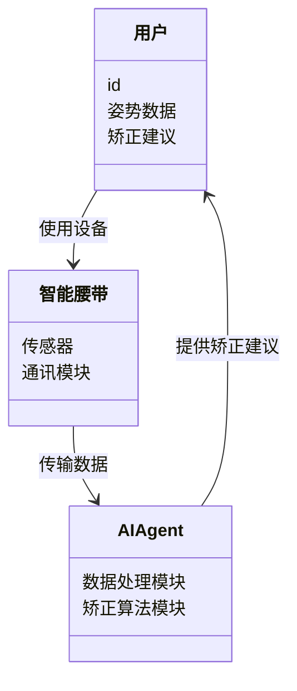

                 


# AI Agent在智能腰带中的姿势矫正与提醒

## 关键词：AI Agent, 智能腰带, 姿势矫正, 传感器数据, 支持向量机, 深度学习, 健康监测

## 摘要：  
本文详细探讨了AI Agent在智能腰带中的姿势矫正与提醒功能。通过分析传感器数据和AI算法，展示了如何利用支持向量机（SVM）和深度学习技术实现姿势识别与矫正。文章还提供了系统架构设计、项目实战代码和实际案例分析，帮助读者全面理解AI Agent在智能腰带中的应用。

---

# 第1章: 背景介绍

## 1.1 问题背景  
### 1.1.1 姿势矫正的重要性  
长时间的不良姿势可能导致颈椎病、腰椎病等健康问题，尤其是在现代工作环境中，久坐族的比例不断增加，健康问题日益严重。  

### 1.1.2 AI Agent在健康领域的应用潜力  
AI Agent能够通过实时数据分析，提供个性化的健康建议，帮助用户改善生活习惯，预防疾病。  

### 1.1.3 智能腰带的市场现状与发展趋势  
随着可穿戴设备的普及，智能腰带因其便携性和实用性，成为健康监测领域的热门产品。AI Agent的加入，进一步提升了其功能和用户体验。  

## 1.2 问题描述  
### 1.2.1 不良姿势对健康的负面影响  
不良姿势会导致肌肉疲劳、骨骼变形，甚至引发严重的健康问题。  

### 1.2.2 智能腰带在姿势矫正中的角色  
智能腰带通过传感器采集数据，结合AI算法，实时监测用户姿势，并提供矫正建议。  

### 1.2.3 当前姿势矫正技术的局限性  
传统姿势矫正设备功能单一，用户体验较差，难以满足多样化的需求。  

## 1.3 问题解决  
### 1.3.1 AI Agent如何实现姿势矫正  
AI Agent通过分析传感器数据，识别不良姿势，并通过震动或语音提醒用户调整姿势。  

### 1.3.2 智能腰带的传感器与数据采集  
智能腰带配备多种传感器，如加速度计、陀螺仪等，实时采集用户的运动数据。  

### 1.3.3 AI算法在姿势矫正中的应用  
AI算法能够快速识别姿势类型，预测用户的健康风险，并提供个性化的矫正方案。  

## 1.4 边界与外延  
### 1.4.1 智能腰带的功能边界  
智能腰带主要关注姿势矫正和健康监测，不涉及其他功能如心率监测。  

### 1.4.2 AI Agent的适用场景与限制  
AI Agent适用于办公室、学校等场景，但在复杂环境中可能受到传感器精度的影响。  

### 1.4.3 姿势矫正技术的未来发展  
未来，姿势矫正技术将更加智能化、个性化，结合更多传感器和AI算法，提供更精准的服务。  

## 1.5 概念结构与核心要素组成  
### 1.5.1 AI Agent的核心要素  
- 数据采集：传感器实时采集用户姿势数据  
- 数据分析：AI算法分析数据，识别不良姿势  
- 矫正提醒：通过震动或语音提醒用户调整姿势  

### 1.5.2 智能腰带的系统架构  
- 传感器模块：采集姿势数据  
- AI处理模块：分析数据，生成矫正建议  
- 用户交互模块：提供反馈提醒  

### 1.5.3 姿势矫正算法的实现流程  
1. 数据采集：传感器获取用户姿势数据  
2. 数据预处理：去除噪声，提取特征  
3. 姿势识别：AI算法识别姿势类型  
4. 矫正建议：生成个性化矫正方案  

---

# 第2章: 核心概念与联系

## 2.1 AI Agent的原理  
### 2.1.1 AI Agent的基本概念  
AI Agent是一种能够感知环境、自主决策的智能系统，能够根据输入数据执行任务。  

### 2.1.2 AI Agent在姿势矫正中的工作流程  
1. 传感器采集数据  
2. AI Agent分析数据，识别不良姿势  
3. 提供矫正建议  

### 2.1.3 AI Agent与智能腰带的交互机制  
AI Agent通过蓝牙或Wi-Fi与智能腰带连接，实时接收数据并发送矫正指令。  

## 2.2 核心概念对比  
### 2.2.1 传统传感器与AI Agent的对比  
| 特性 | 传统传感器 | AI Agent |  
|------|-------------|-----------|  
| 功能 | 数据采集    | 数据分析与决策 |  
| 优势 | 成本低       | 智能化     |  
| 局限 | 无法处理复杂数据 | 学习依赖数据质量 |  

### 2.2.2 不同姿势矫正算法的优缺点对比  
| 算法 | 优点 | 缺点 |  
|------|------|------|  
| SVM  | 高精度，速度快 | 对复杂数据处理能力有限 |  
| CNN  | 高度非线性，适合复杂场景 | 计算复杂度高 |  
| RNN  | 时间序列建模能力强 | 收敛速度慢 |  

### 2.2.3 AI Agent与其他健康监测设备的对比  
AI Agent能够结合多种传感器数据，提供更精准的健康监测服务，而传统设备仅能进行单一功能监测。  

## 2.3 ER实体关系图  


## 2.4 算法流程图  


---

# 第3章: 算法原理讲解

## 3.1 支持向量机(SVM)原理  
### 3.1.1 SVM的基本概念  
支持向量机是一种监督学习算法，主要用于分类和回归问题。  

### 3.1.2 SVM的数学模型  
$$ \text{目标函数} = \sum_{i=1}^{n} y_i w \cdot x_i + \xi $$
$$ \text{约束条件} = y_i (w \cdot x_i + b) \geq 1 - \xi_i $$
其中，$y_i$ 是标签，$w$ 是权重向量，$x_i$ 是输入向量，$b$ 是偏置项，$\xi_i$ 是松弛变量。  

### 3.1.3 SVM在姿势识别中的应用  
通过将用户姿势数据映射到高维空间，构建超平面进行分类，识别不同姿势类型。  

## 3.2 算法实现  
### 3.2.1 Python代码实现  
```python
import numpy as np
from sklearn import svm

# 生成训练数据
X = np.array([[1, 1], [1, 0], [0, 1], [0, 0]])
y = np.array([1, 1, 0, 0])

# 训练SVM模型
model = svm.SVC()
model.fit(X, y)

# 预测测试数据
test = np.array([[0.5, 0.5]])
print(model.predict(test))
```

### 3.2.2 算法流程图  


---

# 第4章: 系统分析与架构设计

## 4.1 项目背景  
本项目旨在开发一款基于AI Agent的智能腰带，帮助用户改善姿势，预防健康问题。  

## 4.2 系统功能设计  
### 4.2.1 领域模型  


### 4.2.2 系统架构  


## 4.3 系统接口设计  
- 用户与智能腰带的交互接口：蓝牙/Wi-Fi  
- 智能腰带与AI Agent的交互接口：API  

---

# 第5章: 项目实战

## 5.1 环境安装  
- Python 3.8+  
- numpy, scikit-learn, mermaid  

## 5.2 核心代码实现  
### 5.2.1 数据预处理  
```python
import numpy as np
from sklearn.preprocessing import StandardScaler

# 加载数据
X = np.array([[1, 1], [1, 0], [0, 1], [0, 0]])
y = np.array([1, 1, 0, 0])

# 标准化数据
scaler = StandardScaler()
X_scaled = scaler.fit_transform(X)
```

### 5.2.2 算法实现  
```python
from sklearn import svm

# 训练SVM模型
model = svm.SVC()
model.fit(X_scaled, y)

# 保存模型
import joblib
joblib.dump(model, 'pose_classifier.pkl')
```

### 5.2.3 代码解读  
- 数据预处理：标准化数据，确保模型输入一致。  
- 算法实现：使用SVM训练模型，并保存模型以供后续使用。  

## 5.3 案例分析  
### 5.3.1 数据采集  
用户长时间低头工作，传感器采集到的数据为：加速度值异常。  

### 5.3.2 数据分析  
AI Agent识别用户姿势为“低头”，触发矫正提醒。  

### 5.3.3 矫正建议  
智能腰带震动提醒用户抬头，AI Agent建议用户每隔20分钟休息一次。  

---

# 第6章: 最佳实践和小结

## 6.1 项目小结  
通过AI Agent和智能腰带的结合，实现了高效的姿势矫正功能，帮助用户改善健康问题。  

## 6.2 注意事项  
- 数据采集的准确性会影响矫正效果。  
- 需要定期更新模型，以适应不同用户的需求。  

## 6.3 未来展望  
未来，AI Agent将与更多传感器结合，提供更精准的健康监测服务。  

---

# 附录

## 附录A: 参考文献  
1. 《支持向量机：理论与应用》  
2. 《深度学习：方法与实践》  

## 附录B: 术语表  
- AI Agent：人工智能代理  
- SVM：支持向量机  
- 智能腰带：可穿戴健康监测设备  

--- 

通过本文的详细讲解，读者可以全面了解AI Agent在智能腰带中的姿势矫正与提醒功能，并掌握其实现原理和应用方法。

