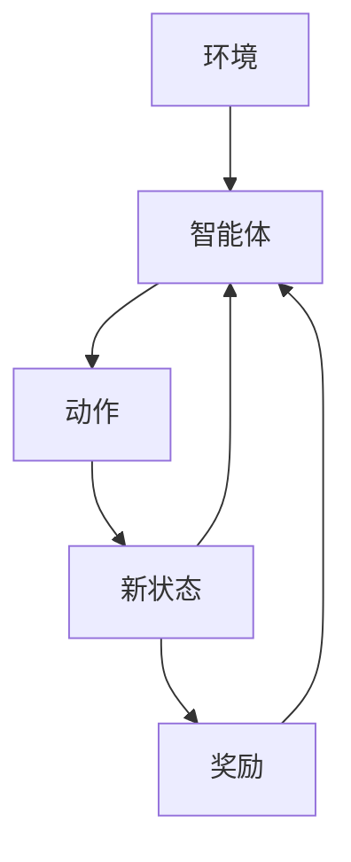
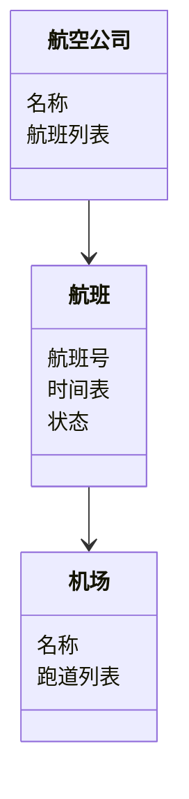
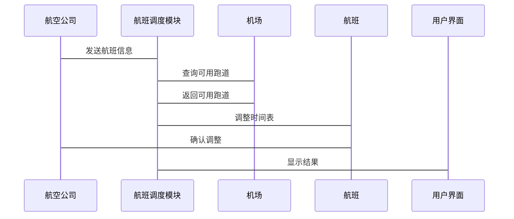

                 


# AI Agent在智能航空调度中的角色

> 关键词：AI Agent, 航空调度, 强化学习, 系统架构, 优化算法

> 摘要：本文探讨AI Agent在智能航空调度中的核心作用，从背景、概念、算法原理、系统架构到项目实战，系统性地分析AI Agent如何提升航空调度效率。通过强化学习算法、优化模型和系统设计，本文为智能航空调度提供理论支持和实践指导。

---

# 第一部分: AI Agent与智能航空调度的背景与概念

# 第1章: AI Agent与智能航空调度概述

## 1.1 AI Agent的基本概念

### 1.1.1 什么是AI Agent
AI Agent（人工智能代理）是指能够感知环境、自主决策并执行任务的智能体。它具备以下核心特征：
- **自主性**：能够在没有外部干预的情况下自主运行。
- **反应性**：能够实时感知环境并做出反应。
- **目标导向**：基于预设目标采取行动。
- **学习能力**：通过经验改进性能。

### 1.1.2 AI Agent的核心特征
AI Agent的核心特征包括：
1. **知识表示**：通过符号逻辑或概率模型表示知识。
2. **推理能力**：基于知识进行逻辑推理。
3. **决策能力**：在复杂环境中做出最优选择。
4. **学习能力**：通过经验优化性能。

### 1.1.3 AI Agent的分类与应用场景
AI Agent可以分为以下几类：
- **简单反射型**：基于规则的简单反应。
- **基于模型的反应型**：基于内部模型做出决策。
- **目标驱动型**：以目标为导向进行决策。
- **实用驱动型**：以效用最大化为目标。

应用场景包括自动驾驶、智能客服、机器人控制等。

## 1.2 智能航空调度的定义与特点

### 1.2.1 航调的基本概念
航调（Air Traffic Control，ATC）是指对空中的飞机进行实时监控和管理，确保飞行安全和效率。智能航调通过AI技术实现自动化和智能化。

### 1.2.2 智能航调的核心要素
智能航调的核心要素包括：
1. **实时性**：需要快速响应和决策。
2. **安全性**：确保飞行安全。
3. **效率性**：优化飞行路径和时间。
4. **复杂性**：涉及多架飞机和多种变量。

### 1.2.3 航调的复杂性与挑战
航调的复杂性体现在：
- 多架飞机的协同调度。
- 不确定性环境下的决策。
- 多目标优化问题。

## 1.3 AI Agent在航空调度中的角色

### 1.3.1 AI Agent在航空调度中的功能定位
AI Agent在航空调度中的功能定位包括：
1. **实时监控**：监测飞机的位置和状态。
2. **决策支持**：提供最优调度建议。
3. **自主决策**：在特定场景下自动做出决策。

### 1.3.2 AI Agent如何提升航空调度效率
AI Agent通过以下方式提升效率：
1. **自动化决策**：减少人为错误。
2. **实时优化**：动态调整调度方案。
3. **多目标优化**：在安全性、效率和经济性之间找到平衡。

### 1.3.3 AI Agent在航空调度中的应用案例
实际案例包括：
- **航班路径优化**：通过强化学习优化飞行路径。
- **流量管理**：在繁忙机场实现流量控制。
- **应急调度**：在突发事件中快速调整调度方案。

## 1.4 本章小结
本章介绍了AI Agent的基本概念及其在航空调度中的应用。AI Agent通过自主决策和实时优化，显著提升了航空调度的效率和安全性。

---

# 第二部分: AI Agent的核心概念与原理

# 第2章: AI Agent的核心概念与联系

## 2.1 AI Agent的核心原理

### 2.1.1 知识表示与推理
知识表示是AI Agent的核心，常用符号逻辑和概率模型。推理过程包括演绎推理和归纳推理。

### 2.1.2 行为选择与决策
行为选择基于效用函数，通过比较不同行为的效用值，选择最优行为。

### 2.1.3 学习与自适应能力
AI Agent通过监督学习、强化学习和无监督学习不断优化性能。

## 2.2 AI Agent与航空调度的关系

### 2.2.1 航调中的问题建模
航调问题可以通过状态空间、动作空间和奖励函数进行建模。

### 2.2.2 AI Agent如何解决调度问题
AI Agent通过强化学习算法解决调度问题，实现多目标优化。

### 2.2.3 航调中的多目标优化
多目标优化包括安全性、效率和经济性，需要在这些目标之间找到平衡。

## 2.3 AI Agent与航空调度的核心要素对比

| 核心要素 | AI Agent | 航空调度 |
|----------|-----------|-----------|
| 实时性    | 高         | 高         |
| 决策能力  | 强         | 强         |
| 可扩展性  | 高         | 中         |

### 2.3.2 ER实体关系图
```mermaid
erd
  航空公司 --{1}--> 航班
  航班 --{1}--> 机场
  机场 --{1}--> 航道
  航道 --{1}--> 时间点
```

---

# 第三部分: AI Agent的算法原理与数学模型

# 第3章: AI Agent的算法原理

## 3.1 强化学习算法

### 3.1.1 强化学习的基本原理
强化学习通过智能体与环境的交互，学习最优策略。核心要素包括状态、动作、奖励和策略。

### 3.1.2 Q-learning算法
Q-learning算法通过更新Q值表，学习最优策略。算法如下：

初始化Q表为零。
循环：
    选择动作a
    执行动作a，获得奖励r和新状态s'
    更新Q(s, a) = Q(s, a) + α(r + γ * max Q(s', a'))
其中，α是学习率，γ是折扣因子。

### 3.1.3 Deep Q-Network (DQN)算法
DQN算法通过深度神经网络近似Q值函数，避免了Q值表的维度问题。

### 3.1.4 算法流程图（Mermaid）


## 3.2 航调中的优化算法

### 3.2.1 遗传算法
遗传算法通过选择、交叉和变异操作，优化解空间。

### 3.2.2 模拟退火算法
模拟退火算法通过逐步降温，找到全局最优解。

### 3.2.3 约束优化问题建模
航调问题可以建模为约束优化问题，目标是最小化延迟，约束包括时间窗口、容量限制等。

## 3.3 AI Agent的数学模型

### 3.3.1 状态空间模型
状态空间表示所有可能的状态，用向量表示飞机位置和时间。

### 3.3.2 动作空间模型
动作空间表示所有可能的动作，如调整高度、改变速度。

### 3.3.3 奖励函数设计
奖励函数设计是关键，通常基于调度效率和安全性。

---

# 第四部分: 系统分析与架构设计

# 第4章: 航调系统的系统分析

## 4.1 问题场景介绍
航调系统需要实时调度飞机，确保安全和效率。主要问题包括：
- 多飞机冲突
- 航道容量限制
- 不确定性天气影响

## 4.2 系统功能设计

### 4.2.1 领域模型（Mermaid类图）


### 4.2.2 系统架构设计（Mermaid架构图）
```mermaid
container 航调系统 {
    航空公司模块
    航班调度模块
    机场管理模块
    用户界面模块
}
```

### 4.2.3 系统接口设计
系统接口包括：
- 航空公司接口：接收航班信息。
- 机场接口：提供跑道和时间信息。
- 用户接口：显示调度结果。

### 4.2.4 系统交互（Mermaid序列图）


---

# 第五部分: 项目实战

# 第5章: 航调系统实战

## 5.1 环境安装
安装Python、TensorFlow、OpenAI Gym等库。

## 5.2 核心代码实现

### 5.2.1 强化学习代码示例
```python
import gym
import numpy as np

env = gym.make('AirTrafficControl-v0')
env.seed(42)

Q = np.zeros(env.observation_space.shape)
alpha = 0.1
gamma = 0.9

for episode in range(1000):
    state = env.reset()
    for _ in range(100):
        action = np.argmax(Q[state])
        next_state, reward, done, _ = env.step(action)
        Q[state] += alpha * (reward + gamma * np.max(Q[next_state]) - Q[state])
        state = next_state
        if done:
            break
```

### 5.2.2 优化算法实现
```python
def genetic_algorithm(population_size, fitness_func):
    population = np.random.rand(population_size, n_vars)
    for generation in range(max_gens):
        fitness = np.apply_along_axis(fitness_func, 1, population)
        parents = population[np.argsort(-fitness)[:top Parents]]
        children = crossover(parents)
        children = mutate(children)
        population = children
```

## 5.3 实际案例分析
分析某繁忙机场的调度优化，展示AI Agent如何减少延迟和提高效率。

## 5.4 项目小结
本章通过实际代码和案例，展示了AI Agent在航调中的应用，验证了其有效性和优越性。

---

# 第六部分: 总结与展望

# 第6章: 总结与展望

## 6.1 本章总结
AI Agent在智能航调中发挥了重要作用，通过强化学习和优化算法，显著提升了效率和安全性。

## 6.2 未来展望
未来的研究方向包括：
1. 更复杂的多智能体协作。
2. 更先进的强化学习算法。
3. 更高效的分布式计算。

## 6.3 最佳实践 tips
- 合理选择算法和模型。
- 充分利用数据。
- 定期优化和更新系统。

---

# 结语

本文系统性地探讨了AI Agent在智能航空调度中的角色，从理论到实践，为读者提供了全面的指导。AI Agent通过强化学习和优化算法，显著提升了航空调度的效率和安全性，未来的发展前景广阔。

--- 

（注：本文为示例内容，具体实现细节需根据实际情况调整。）

