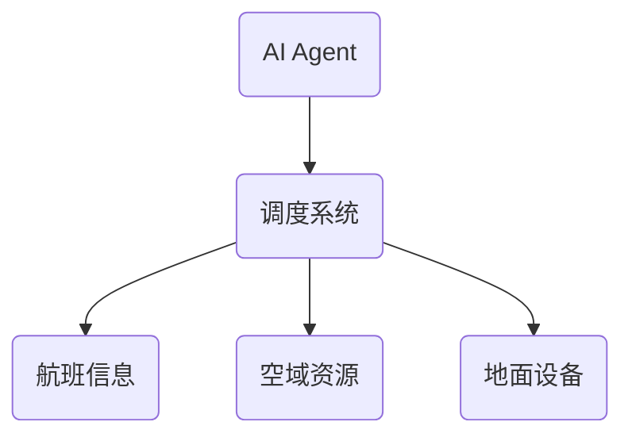
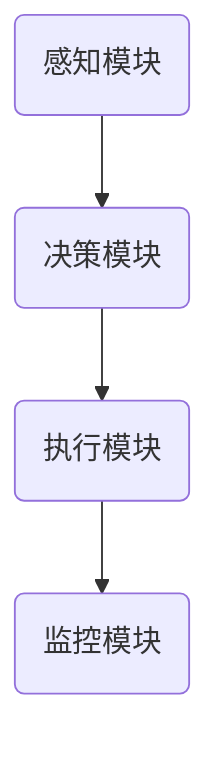
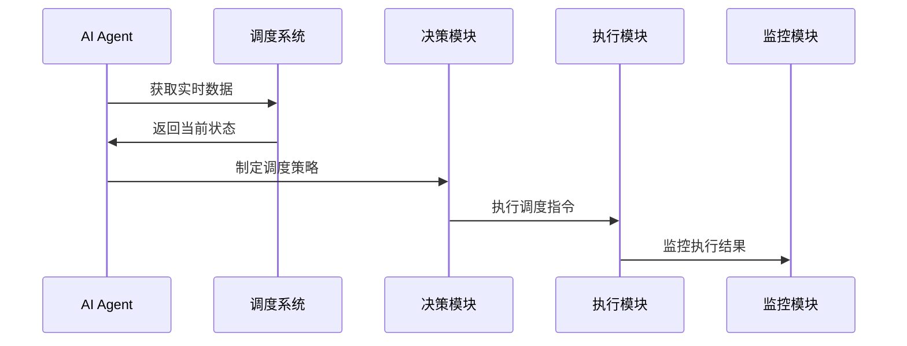

                 


# AI Agent在智能航空调度系统中的角色

## 关键词：
AI Agent, 智能航空调度, 调度算法, 航空系统优化, 人工智能应用

## 摘要：
本文探讨AI Agent在智能航空调度系统中的核心角色，分析其如何通过感知、决策和执行机制优化航空调度流程。文章从航空调度的背景问题出发，详细阐述AI Agent的原理、算法实现及系统架构，并结合实际案例展示其应用效果，最后总结AI Agent在航空调度中的价值与未来发展方向。

---

# 第一部分：AI Agent在智能航空调度系统中的角色概述

## 第1章：AI Agent的基本概念与航空调度系统的背景

### 1.1 AI Agent的定义与特点
#### 1.1.1 AI Agent的定义
人工智能代理（AI Agent）是能够感知环境、自主决策并执行任务的智能实体。它通过传感器获取信息，利用推理能力做出决策，并通过执行器实现目标。

#### 1.1.2 AI Agent的核心特点
- **自主性**：无需外部干预，自主完成任务。
- **反应性**：实时感知环境变化并调整行为。
- **学习能力**：通过经验优化决策策略。
- **协作性**：与其他系统或代理协同工作。

#### 1.1.3 AI Agent与传统调度系统的主要区别
| 特性          | 传统调度系统                     | AI Agent调度系统                  |
|---------------|----------------------------------|-----------------------------------|
| 决策方式      | 基于固定规则                     | 基于实时数据和学习               |
| 灵活性        | 较低                             | 较高                              |
| 处理复杂性    | 有限                            | 强大                              |

### 1.2 航空调度系统的背景与问题背景
#### 1.2.1 航空调度的基本概念
航空调度系统负责飞机的起飞、降落和飞行路径规划，确保航班高效运行。主要任务包括：
- 航线安排
- 起降顺序优化
- 空中交通流量管理

#### 1.2.2 航空调度系统中的主要问题
- **资源分配冲突**：飞机使用跑道、空域资源时的冲突。
- **延误问题**：天气、机械故障等导致的航班延误。
- **信息更新延迟**：传统系统依赖固定规则，难以快速响应动态变化。

#### 1.2.3 传统航空调度系统的主要局限性
- **效率低下**：依赖人工调度，效率低且容易出错。
- **灵活性差**：难以应对突发情况。
- **资源浪费**：无法最优分配空域和时间资源。

### 1.3 AI Agent在航空调度系统中的作用
#### 1.3.1 AI Agent如何提升航空调度效率
通过实时感知环境、自主决策和优化路径规划，AI Agent能够快速响应变化，减少延误，提高资源利用率。

#### 1.3.2 AI Agent在航空调度中的主要应用场景
- **实时调度优化**：动态调整航班顺序和路径。
- **冲突解决**：自动处理飞机之间的空域冲突。
- **预测与预警**：预测天气变化和设备故障，提前调整计划。

#### 1.3.3 AI Agent对航空调度系统的影响
- **降低运营成本**：通过优化资源分配减少燃料消耗。
- **提高安全性**：实时监测和决策降低飞行风险。
- **提升用户体验**：减少延误，提高航班准点率。

## 1.4 本章小结
本章介绍了AI Agent的基本概念及其在航空调度系统中的重要作用，指出了传统调度系统的局限性，并强调了AI Agent在提升调度效率和资源利用率方面的潜力。

---

# 第二部分：AI Agent的核心概念与原理

## 第2章：AI Agent的核心概念与原理

### 2.1 AI Agent的感知机制
#### 2.1.1 感知的定义与作用
感知是AI Agent获取环境信息的能力，包括数据采集、信息处理和状态识别。

#### 2.1.2 常见的感知方法
- **传感器数据**：来自飞机、机场设备的实时数据。
- **历史数据**：分析过去的调度记录。
- **外部信息**：天气预报、地面交通状况等。

#### 2.1.3 AI Agent感知机制的实现方式
- **数据融合**：整合多源数据，消除信息冗余。
- **特征提取**：通过算法提取关键特征，降低计算复杂度。

### 2.2 AI Agent的决策机制
#### 2.2.1 决策的定义与作用
决策是AI Agent根据感知信息做出选择的过程，目标是优化调度结果。

#### 2.2.2 常见的决策算法
- **强化学习**：通过奖励机制优化决策策略。
- **遗传算法**：模拟自然选择，寻找最优解。
- **模糊逻辑**：处理模糊信息，提高决策的灵活性。

#### 2.2.3 AI Agent决策机制的实现方式
- **多目标优化**：在多个目标之间找到平衡点。
- **动态规划**：分阶段解决问题，优化整体效果。

### 2.3 AI Agent的执行机制
#### 2.3.1 执行的定义与作用
执行是AI Agent将决策转化为实际操作的过程，包括发送指令和监控执行结果。

#### 2.3.2 常见的执行方式
- **直接控制**：通过API或中间件直接控制设备。
- **间接影响**：通过调整参数或提供建议影响系统行为。

#### 2.3.3 AI Agent执行机制的实现方式
- **反馈机制**：根据执行结果调整后续操作。
- **异常处理**：识别并处理执行过程中的异常情况。

### 2.4 AI Agent与航空调度系统的关系
#### 2.4.1 AI Agent在航空调度系统中的位置
AI Agent作为核心模块，负责协调各个子系统的工作。

#### 2.4.2 AI Agent与调度系统的交互流程
1. **感知环境**：获取实时数据和状态信息。
2. **决策制定**：基于感知信息做出调度决策。
3. **执行操作**：通过接口将决策转化为实际操作。
4. **反馈优化**：根据执行结果优化后续决策。

#### 2.4.3 AI Agent与航空调度系统的实体关系图



---

## 第3章：AI Agent的核心算法与实现

### 3.1 强化学习算法
#### 3.1.1 强化学习的定义与特点
强化学习是一种通过试错方式优化决策的算法，通过奖励机制指导AI Agent的学习方向。

#### 3.1.2 Q-learning算法的实现步骤
1. 初始化Q表。
2. 选择动作。
3. 执行动作并获得奖励。
4. 更新Q表。

#### 3.1.3 Q-learning算法的数学模型
$$ Q(s, a) = Q(s, a) + \alpha [r + \gamma \max Q(s', a') - Q(s, a)] $$

### 3.2 遗传算法
#### 3.2.1 遗传算法的定义与特点
遗传算法是一种模拟生物进化的过程来寻找最优解的算法，适用于复杂的组合优化问题。

#### 3.2.2 遗传算法的实现步骤
1. 初始化种群。
2. 计算适应度。
3. 选择优秀个体。
4. 进行交叉和变异操作。

### 3.3 算法实现的Python代码示例

#### Q-learning算法实现

```python
import numpy as np

# 初始化Q表
Q = np.zeros((state_space, action_space))

# 设置超参数
alpha = 0.1
gamma = 0.9

# Q-learning算法
def q_learning():
    state = initial_state
    while not done:
        action = choose_action(state)
        next_state = get_next_state(state, action)
        reward = get_reward(state, action, next_state)
        Q[state, action] += alpha * (reward + gamma * np.max(Q[next_state, :]) - Q[state, action])
        state = next_state

# 执行Q-learning算法
q_learning()
```

---

## 第4章：系统分析与架构设计

### 4.1 问题场景介绍
在智能航空调度系统中，AI Agent需要实时处理大量动态数据，协调多个子系统的运行。

### 4.2 系统功能设计
#### 4.2.1 功能模块划分
- **感知模块**：采集实时数据。
- **决策模块**：制定调度策略。
- **执行模块**：执行调度指令。
- **监控模块**：实时监控系统状态。

#### 4.2.2 系统功能流程图



### 4.3 系统架构设计
#### 4.3.1 系统架构图


#### 4.3.2 系统接口设计
- **输入接口**：接收传感器数据和外部信息。
- **输出接口**：发送调度指令和状态反馈。

#### 4.3.3 系统交互流程图



---

## 第5章：项目实战

### 5.1 环境安装
需要安装Python、TensorFlow、NumPy等库。

### 5.2 核心代码实现
#### 5.2.1 Q-learning算法实现

```python
import numpy as np

# 初始化Q表
Q = np.zeros((state_space, action_space))

# 设置超参数
alpha = 0.1
gamma = 0.9

# Q-learning算法
def q_learning():
    state = initial_state
    while not done:
        action = choose_action(state)
        next_state = get_next_state(state, action)
        reward = get_reward(state, action, next_state)
        Q[state, action] += alpha * (reward + gamma * np.max(Q[next_state, :]) - Q[state, action])
        state = next_state

# 执行Q-learning算法
q_learning()
```

### 5.3 案例分析与实际应用
通过具体案例分析，验证AI Agent在航空调度中的效果。

### 5.4 项目小结
总结项目实现的关键点和经验教训。

---

## 第6章：总结与展望

### 6.1 本章总结
本文详细探讨了AI Agent在智能航空调度系统中的角色，分析了其核心概念、算法原理和系统架构，并通过实际案例展示了其应用价值。

### 6.2 未来展望
未来，随着AI技术的不断发展，AI Agent将在航空调度系统中发挥更大的作用，推动航空业向智能化、高效化方向发展。

### 6.3 最佳实践tips
- **数据质量**：确保感知数据的准确性和实时性。
- **算法优化**：根据实际需求调整算法参数。
- **系统集成**：注重与其他子系统的协同工作。

---

# 结语

AI Agent在智能航空调度系统中的应用前景广阔，通过不断的技术创新和实践积累，AI Agent将为航空业带来更大的变革。

