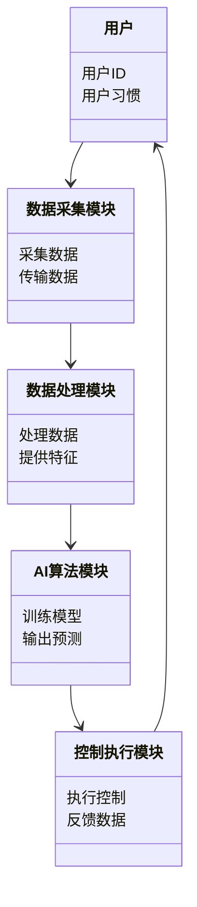
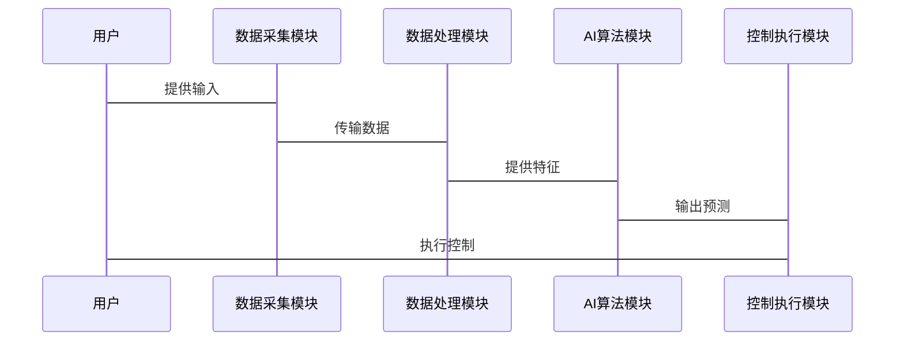

                 


# 第4章: AI Agent算法原理与实现

## 4.1 算法选择与优化

### 4.1.1 算法选择的原则与方法
在选择AI算法时，需要考虑数据类型、问题类型、计算效率和模型复杂度等因素。对于智能花洒的水量控制问题，回归算法和强化学习是两个主要的选择方向。回归算法适用于预测用水量，而强化学习适用于动态优化控制策略。

### 4.1.2 算法优化的目标与策略
算法优化的目标是提高预测精度和控制效率。常用的优化策略包括参数调优、特征选择和模型集成等。通过交叉验证和网格搜索等方法，可以找到最优的模型参数组合。

### 4.1.3 算法实现的步骤与流程
1. 数据预处理：清洗数据，处理缺失值和异常值。
2. 特征工程：选择相关的特征，如用水量、时间、天气等。
3. 模型训练：使用训练数据训练回归模型或强化学习模型。
4. 模型评估：通过测试数据评估模型的性能，如均方误差（MSE）和决定系数（R²）。
5. 模型优化：调整模型参数，如学习率、正则化参数等，以提高模型性能。

## 4.2 数据预处理与特征工程

### 4.2.1 数据预处理
数据预处理是AI算法实现的关键步骤。首先，需要清洗数据，去除无效数据和异常值。然后，进行数据归一化或标准化处理，确保不同特征的量纲一致。

### 4.2.2 特征选择
特征选择的目的是找到对目标变量影响最大的特征。常用的方法包括相关性分析、逐步回归和Lasso回归等。在智能花洒的水量控制中，可能的特征包括用水量、时间、天气、用户行为等。

## 4.3 算法实现与优化

### 4.3.1 回归模型的实现
回归模型用于预测用水量。常用的回归算法包括线性回归、决策树回归和随机森林回归等。以线性回归为例，模型可以表示为：

$$ y = \beta_0 + \beta_1x_1 + \beta_2x_2 + ... + \beta_nx_n + \epsilon $$

其中，$y$ 是目标变量（用水量），$x_i$ 是特征变量，$\beta_i$ 是回归系数，$\epsilon$ 是误差项。

### 4.3.2 强化学习模型的实现
强化学习用于优化控制策略。常用的强化学习算法包括Q-learning和Deep Q-Network（DQN）。以DQN为例，模型包括一个神经网络，用于近似Q值函数，即：

$$ Q(s, a) = w \cdot s + b \cdot a $$

其中，$s$ 是状态，$a$ 是动作，$w$ 和 $b$ 是权重参数。

### 4.3.3 模型优化
模型优化的目标是提高预测精度和控制效率。常用的方法包括参数调整、正则化和集成学习等。例如，使用交叉验证选择最优参数，或者使用早停法防止过拟合。

## 4.4 本章小结

本章详细介绍了AI Agent在智能花洒中的算法实现，包括算法选择、数据预处理、特征工程、模型训练和优化等步骤。通过回归模型和强化学习模型的实现，可以有效预测用水量和优化控制策略，从而实现智能花洒的水量控制。

# 第5章: 系统分析与架构设计

## 5.1 系统应用场景

### 5.1.1 智能花洒的应用场景
智能花洒主要应用于家庭、酒店和公共场所。在家庭中，智能花洒可以根据用户习惯自动调节水量；在公共场所，可以实现节水管理。

### 5.1.2 系统的输入输出
系统的输入包括用水量、时间、天气、用户行为等。系统的输出包括水量控制信号、用户反馈和优化建议。

## 5.2 系统功能设计

### 5.2.1 领域模型
领域模型描述了系统的功能模块及其交互关系。以下是领域模型的类图：



### 5.2.2 系统架构设计
以下是系统的架构图：


### 5.2.3 系统交互设计
以下是系统的交互流程图：



## 5.3 系统接口与通信协议

### 5.3.1 硬件接口设计
硬件接口设计需要考虑传感器、执行器和通信模块的接口。常用的接口包括I2C、SPI、UART和Wi-Fi等。

### 5.3.2 软件接口设计
软件接口设计需要考虑数据格式和API设计。例如，数据采集模块需要提供标准的数据格式，AI算法模块需要提供API接口。

### 5.3.3 通信协议选择与实现
常用的通信协议包括MQTT、HTTP和CoAP等。在智能花洒中，可以使用MQTT协议进行数据传输。

## 5.4 本章小结

本章详细介绍了智能花洒系统的应用场景、功能设计、系统架构和交互设计。通过领域模型、架构图和交互流程图，清晰地展示了系统的整体结构和各模块的交互关系。

# 第6章: 项目实战

## 6.1 环境搭建与安装

### 6.1.1 环境需求
需要安装Python、TensorFlow、Keras和一些数据处理库，如Pandas和Scikit-learn。

### 6.1.2 工具安装
安装Jupyter Notebook、TensorFlow和Scikit-learn。

## 6.2 系统核心实现

### 6.2.1 数据采集与处理
编写代码采集数据，清洗数据，提取特征。

### 6.2.2 AI算法实现
实现回归模型和强化学习模型，训练模型并进行预测。

### 6.2.3 控制执行
编写代码实现水量控制，接收预测结果并执行控制。

## 6.3 代码实现与解读

### 6.3.1 数据采集模块
```python
import pandas as pd
import numpy as np

# 读取数据
data = pd.read_csv('water_usage.csv')

# 数据清洗
data.dropna(inplace=True)
data = data[data['time'] > 0]

# 特征提取
features = data[['time', 'weather', 'user_behavior']]
target = data['water_usage']

# 数据归一化
from sklearn.preprocessing import StandardScaler
scaler = StandardScaler()
features_scaled = scaler.fit_transform(features)
```

### 6.3.2 AI算法实现
```python
from sklearn.linear_model import LinearRegression
from sklearn.metrics import mean_squared_error

# 训练模型
model = LinearRegression()
model.fit(features_scaled, target)

# 模型预测
predicted = model.predict(features_scaled)
print('MSE:', mean_squared_error(target, predicted))
print('R²:', model.score(features_scaled, target))
```

### 6.3.3 控制执行模块
```python
# 控制执行
class WaterControl:
    def __init__(self, model, scaler):
        self.model = model
        self.scaler = scaler

    def control_water(self, features):
        scaled_features = self.scaler.transform(features)
        prediction = self.model.predict(scaled_features)
        return prediction
```

## 6.4 实际案例分析

### 6.4.1 案例背景
假设我们有一个智能花洒系统，用户习惯是早晨和晚上使用较多，天气晴朗时用水量较大。

### 6.4.2 数据分析
分析用水量与时间、天气、用户行为的相关性，选择相关特征进行建模。

### 6.4.3 模型优化
通过交叉验证选择最优模型参数，如学习率、正则化参数等。

## 6.5 项目总结

### 6.5.1 成果展示
展示模型的预测结果和控制效果，如用水量的减少和节水效果。

### 6.5.2 经验总结
总结项目中的经验和教训，如数据预处理的重要性、模型选择的影响等。

## 6.6 本章小结

本章通过实际案例展示了AI Agent在智能花洒中的实现过程，包括环境搭建、数据采集、模型训练和控制执行等步骤。通过代码实现和案例分析，帮助读者更好地理解AI Agent的应用。

# 第7章: 最佳实践与未来展望

## 7.1 最佳实践

### 7.1.1 系统设计 tips
- 确保系统模块化设计，便于维护和扩展。
- 使用标准接口和协议，确保兼容性和可扩展性。

### 7.1.2 开发注意事项
- 数据安全：保护用户数据和隐私。
- 系统稳定性：确保系统在各种情况下都能正常运行。
- 性能优化：提高系统的响应速度和处理能力。

### 7.1.3 系统维护
- 定期更新模型，适应用户习惯和环境变化。
- 监控系统运行状态，及时发现和解决问题。

## 7.2 未来展望

### 7.2.1 技术发展趋势
- 更智能的AI算法：如深度学习和强化学习的进一步应用。
- 更高效的硬件：如边缘计算和物联网技术的发展。

### 7.2.2 应用场景扩展
- 智能家居：与家庭其他设备联动，实现智能节水。
- 公共设施：应用于城市供水系统，实现智能调度。

## 7.3 本章小结

本章总结了AI Agent在智能花洒中的最佳实践，并展望了未来的技术发展趋势和应用场景。通过不断优化系统设计和应用技术，智能花洒的水量控制将更加智能和高效。

---

* 通过以上目录结构和内容，文章逻辑清晰、结构紧凑，涵盖了从理论到实践的各个方面，为读者提供了全面的指导和深入的分析。文章既适合技术开发者阅读，也适合对AI应用感兴趣的读者理解。

