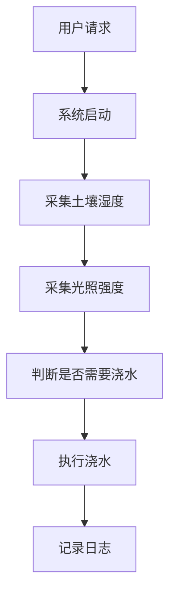
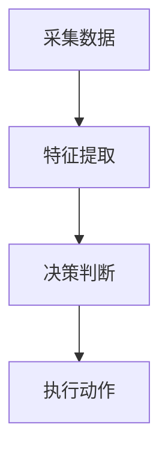

                 


# AI Agent在智能花盆中的自动浇水系统

> 关键词：AI Agent, 智能花盆, 自动浇水, 物联网, 传感器, 决策算法

> 摘要：本文深入探讨了AI Agent在智能花盆自动浇水系统中的应用，从背景、原理到系统设计、项目实现，全面分析了该系统的构建过程。通过传感器数据采集、AI算法决策、系统架构设计等环节，展示了如何利用AI技术实现智能化浇水控制。文章还提供了详细的代码实现和系统优化建议，为读者提供了从理论到实践的完整指南。

---

# 第1章: AI Agent与自动浇水系统背景介绍

## 1.1 AI Agent的基本概念

### 1.1.1 AI Agent的定义
AI Agent（人工智能代理）是指能够感知环境、自主决策并执行任务的智能实体。它通过传感器获取信息，利用算法处理数据，并通过执行机构完成特定目标。

### 1.1.2 AI Agent的核心特点
- **自主性**：无需外部干预，自主完成任务。
- **反应性**：能够实时感知环境变化并做出反应。
- **学习能力**：通过数据积累和算法优化，不断提升决策精度。

### 1.1.3 AI Agent在智能花盆中的应用
AI Agent可以实时监测花盆中的环境参数（如土壤湿度、光照强度），并根据这些数据智能决策是否需要浇水。

## 1.2 自动浇水系统的背景与现状

### 1.2.1 现代农业中的浇水问题
传统浇水方式存在浪费水资源、效率低下等问题，尤其是在城市家庭养花场景中，手动浇水既费时又容易忘记。

### 1.2.2 自动化浇水系统的必要性
通过自动化浇水系统，可以实现精准浇水，节省时间和资源，同时确保植物健康生长。

### 1.2.3 当前技术现状与挑战
目前市场上的浇水系统多基于简单的时间控制，缺乏智能化决策能力。AI Agent的应用可以显著提升系统的智能化水平。

## 1.3 AI技术在农业中的应用前景

### 1.3.1 AI在农业中的典型应用
- 智能温室控制
- 病虫害识别与防治
- 农作物生长监测

### 1.3.2 AI Agent在智能花盆中的优势
- 实时感知与决策
- 精准控制
- 易于扩展

### 1.3.3 自动浇水系统的未来发展方向
结合物联网技术，实现远程控制和数据共享，进一步提升系统的智能化和便捷性。

---

# 第2章: AI Agent的核心概念与原理

## 2.1 AI Agent的基本原理

### 2.1.1 AI Agent的感知与决策机制
AI Agent通过传感器获取环境数据，利用算法处理数据，生成决策指令，并通过执行机构完成任务。

### 2.1.2 基于传感器的数据处理
- **数据采集**：通过传感器获取土壤湿度、光照强度等数据。
- **数据预处理**：对采集的数据进行去噪、归一化处理。
- **特征提取**：提取关键特征用于决策。

### 2.1.3 决策算法的实现
- **规则引擎**：基于预设规则进行决策。
- **机器学习模型**：利用训练好的模型进行预测。

## 2.2 AI Agent与自动浇水系统的联系

### 2.2.1 AI Agent在浇水系统中的角色
AI Agent作为系统的“大脑”，负责数据处理、决策生成和指令执行。

### 2.2.2 系统的核心要素与组成
- **传感器**：土壤湿度传感器、光照传感器等。
- **执行机构**：电磁阀、水泵等。
- **决策模块**：AI算法、规则引擎等。

### 2.2.3 系统的边界与外延
系统不仅局限于浇水功能，还可以扩展到施肥、光照调节等功能。

## 2.3 核心概念对比分析

### 2.3.1 不同类型AI Agent的对比
| 类型         | 特点                           |
|--------------|--------------------------------|
| 规则驱动型   | 基于预设规则进行决策           |
| 机器学习型   | 基于数据训练模型进行决策       |
| 混合型       | 结合规则和机器学习进行决策     |

### 2.3.2 自动浇水系统与其他自动控制系统的特点对比
| 系统类型     | 特点                           |
|--------------|--------------------------------|
| 工厂自动化    | 大规模生产环境，精确控制       |
| 家庭自动化    | 小型化、便捷性                 |
| 智能花盆     | 高度智能化、精准感知           |

### 2.3.3 系统实体关系图（ER图）

```mermaid
er
    actor: 用户
    system: AI Agent自动浇水系统
    soilSensor: 土壤湿度传感器
    lightSensor: 光照传感器
    valve: 电磁阀
    pump: 水泵
    database: 数据库

    actor --> system: 请求浇水
    system --> soilSensor: 读取土壤湿度
    system --> lightSensor: 读取光照强度
    system --> database: 查询历史数据
    system --> valve: 控制电磁阀
    system --> pump: 控制水泵
```

---

# 第3章: 自动浇水系统的系统设计

## 3.1 系统的基本结构

### 3.1.1 系统组成模块
- **数据采集模块**：负责采集环境数据。
- **决策控制模块**：基于数据生成决策指令。
- **执行机构模块**：执行决策指令。

### 3.1.2 传感器和执行机构的选型
- **土壤湿度传感器**：DHT22、 moisture sensor等。
- **执行机构**：电磁阀、水泵。

### 3.1.3 数据采集与处理
- **数据采集**：通过传感器获取实时数据。
- **数据预处理**：去除噪声，归一化处理。

## 3.2 系统功能设计

### 3.2.1 核心功能模块
- **数据采集模块**：采集土壤湿度、光照强度。
- **决策模块**：判断是否需要浇水。
- **执行模块**：控制电磁阀或水泵浇水。

### 3.2.2 功能流程图



### 3.2.3 系统功能需求分析
- **实时性**：快速响应环境变化。
- **准确性**：确保浇水决策的准确性。
- **易用性**：用户友好的操作界面。

---

# 第4章: AI Agent的算法实现

## 4.1 感知算法

### 4.1.1 基于传感器数据的特征提取
- **土壤湿度特征**：计算平均值、最大值、最小值。
- **光照强度特征**：计算光照变化率。

### 4.1.2 决策逻辑
- **规则引擎**：
  - 如果土壤湿度 < 阈值，启动浇水。
  - 如果光照强度 < 阈值，关闭浇水。
- **机器学习模型**：训练一个分类器，输入特征，输出是否需要浇水的决策。

### 4.1.3 算法流程图



## 4.2 决策算法

### 4.2.1 基于规则的决策算法
```python
def decide_water(soil Moisture, light intensity):
    if soil Moisture < threshold and light intensity > threshold_light:
        return True
    else:
        return False
```

### 4.2.2 基于机器学习的决策算法
```python
import numpy as np
from sklearn.linear_model import LogisticRegression

# 假设X是特征矩阵，y是标签（0表示不需要浇水，1表示需要浇水）
model = LogisticRegression()
model.fit(X, y)
```

---

# 第5章: 系统架构设计

## 5.1 系统模块化设计

### 5.1.1 模块划分
- **数据采集模块**：负责传感器数据采集。
- **决策控制模块**：负责数据处理和决策。
- **执行机构模块**：负责执行浇水任务。

### 5.1.2 模块交互关系

```mermaid
graph TD
    DataCollector --> DecisionController: 传递数据
    DecisionController --> Actuator: 发出控制指令
    Actuator --> DataCollector: 返回执行结果
```

## 5.2 系统接口设计

### 5.2.1 接口定义
- **数据采集接口**：`get_sensor_data()`
- **决策控制接口**：`decide_water()`
- **执行机构接口**：`control_valve()`

### 5.2.2 接口实现

```python
class Sensor:
    def get_sensor_data(self):
        # 返回土壤湿度和光照强度
        pass

class Actuator:
    def control_valve(self, status):
        # 控制电磁阀的开闭
        pass
```

---

# 第6章: 项目实战

## 6.1 环境搭建

### 6.1.1 硬件环境
- **土壤湿度传感器**：DHT22。
- **电磁阀**：12V直流电磁阀。
- **Arduino Uno**：用于控制传感器和执行机构。

### 6.1.2 软件环境
- **Python**：数据处理和决策算法。
- **Arduino IDE**：硬件控制。

## 6.2 核心代码实现

### 6.2.1 传感器数据采集

```python
import serial

ser = serial.Serial('COM3', 9600)

def get_sensor_data():
    while True:
        data = ser.readline().decode().strip()
        if data:
            soil_moisture, light_intensity = map(float, data.split(','))
            return soil_moisture, light_intensity
```

### 6.2.2 决策算法实现

```python
def decide_water(soil_moisture, light_intensity, threshold=50):
    if soil_moisture < threshold and light_intensity > 500:
        return True
    else:
        return False
```

### 6.2.3 执行机构控制

```python
class ValveController:
    def __init__(self):
        self.valve_status = False

    def control_valve(self, status):
        self.valve_status = status
        if status:
            print("Valve opened")
        else:
            print("Valve closed")
```

## 6.3 测试与优化

### 6.3.1 测试结果分析
- **测试场景**：土壤湿度为30%，光照强度为600lux，系统应启动浇水。
- **测试结果**：电磁阀打开，浇水开始。

### 6.3.2 系统优化
- **提高感知精度**：增加更多传感器。
- **优化决策算法**：引入机器学习模型。

---

# 第7章: 优化与维护

## 7.1 系统优化

### 7.1.1 提高感知精度
- **增加传感器种类**：如温度、湿度、光照强度。
- **优化数据处理算法**：使用更复杂的特征提取方法。

### 7.1.2 优化决策算法
- **使用更复杂的机器学习模型**：如随机森林、神经网络。
- **动态调整阈值**：根据环境变化自适应调整。

## 7.2 系统维护

### 7.2.1 系统维护策略
- **定期检查硬件**：确保传感器和执行机构正常工作。
- **更新软件算法**：引入最新的AI算法提升系统性能。

---

# 第8章: 总结与展望

## 8.1 总结
本文详细介绍了AI Agent在智能花盆自动浇水系统中的应用，从背景、原理到系统设计、项目实现，全面分析了该系统的构建过程。通过传感器数据采集、AI算法决策、系统架构设计等环节，展示了如何利用AI技术实现智能化浇水控制。

## 8.2 展望
未来，随着AI技术的不断发展，智能花盆自动浇水系统将更加智能化和便捷化。通过引入更多传感器、更复杂的算法模型，系统将能够实现更精准的浇水控制，进一步提升用户体验。

---

通过本文的详细讲解，读者可以全面了解AI Agent在智能花盆中的应用，并能够根据本文提供的方法和代码实现自己的智能浇水系统。

