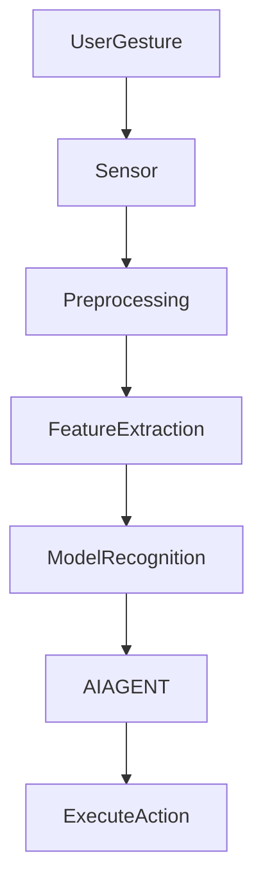
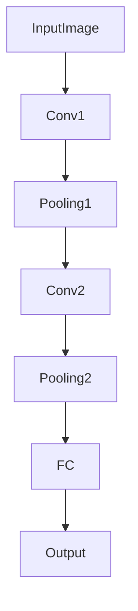
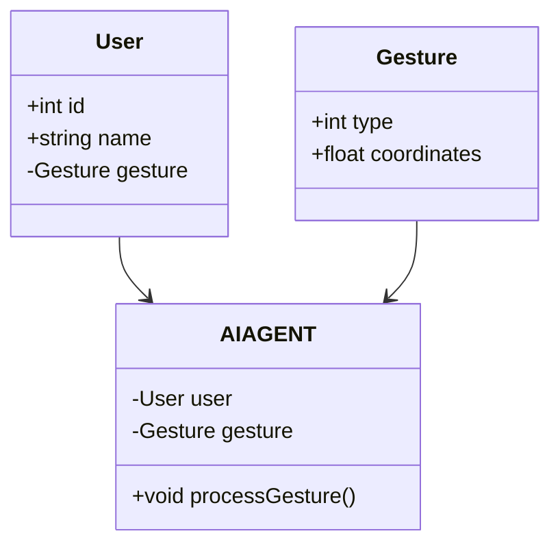
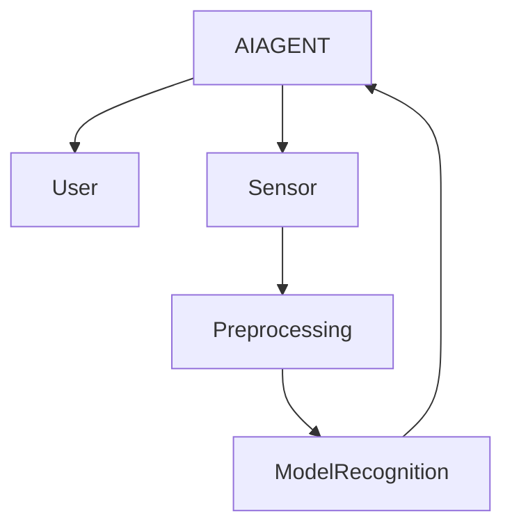
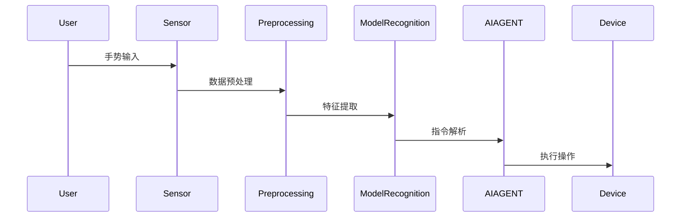

                 


# AI Agent在智能茶几中的手势控制

> 关键词：AI Agent，手势控制，智能茶几，深度学习，计算机视觉

> 摘要：本文深入探讨AI Agent在智能茶几中的手势控制应用，分析其技术原理、系统架构、实现方法及实际应用案例，结合算法原理和系统设计，提供全面的技术解析。

---

# 第1章: AI Agent与手势控制的背景介绍

## 1.1 问题背景

### 1.1.1 传统智能家居控制方式的局限性
传统的智能家居控制方式依赖于语音指令或物理按钮，存在操作复杂、响应延迟等问题，尤其在多人共享的场景中缺乏灵活性。

### 1.1.2 手势控制技术的发展与应用
手势控制技术利用计算机视觉和深度学习，通过识别手部动作实现设备操作，已在手机、电视等领域广泛应用。

### 1.1.3 智能茶几的定义与应用场景
智能茶几是一种集成AI功能的家具，支持手势、语音等多种交互方式，广泛应用于家庭娱乐、办公会议等场景。

## 1.2 问题描述

### 1.2.1 手势控制在智能茶几中的需求分析
用户希望茶几能通过手势实现播放、暂停、调节音量等功能，提升交互体验。

### 1.2.2 用户痛点与需求挖掘
传统控制方式操作繁琐，手势控制更直观便捷，尤其适合儿童和老年人使用。

### 1.2.3 智能茶几手势控制的边界与外延
限定在特定区域内，支持基本的手势操作，与其他设备联动。

## 1.3 问题解决

### 1.3.1 AI Agent在智能茶几中的作用
AI Agent作为中枢，接收手势指令并执行操作，实现设备联动。

### 1.3.2 手势控制技术实现的关键点
数据采集、特征提取、模型训练是手势识别的核心。

## 1.4 概念结构与核心要素

### 1.4.1 AI Agent的核心要素
感知能力、决策能力、执行能力。

### 1.4.2 手势控制系统的组成
传感器、处理器、算法、执行器。

### 1.4.3 智能茶几的功能模块划分
手势识别模块、指令解析模块、设备联动模块。

---

# 第2章: AI Agent与手势控制的核心概念与联系

## 2.1 AI Agent的原理与特点

### 2.1.1 AI Agent的基本原理
AI Agent通过感知环境，执行任务，与用户互动。

### 2.1.2 手势控制的核心技术
基于深度学习的计算机视觉技术，识别手部动作。

### 2.1.3 AI Agent与手势控制的协同作用
手势识别触发指令，AI Agent解析并执行。

## 2.2 手势识别技术的实现流程

### 2.2.1 数据采集与预处理
使用RGB-D传感器获取深度信息，预处理包括背景去除和数据平滑。

### 2.2.2 特征提取与模型训练
提取手部关键点特征，使用CNN进行分类训练。

### 2.2.3 手势识别的输出与反馈
模型输出指令，设备执行反馈。

## 2.3 AI Agent与手势控制的系统架构

### 2.3.1 系统整体架构图


---

# 第3章: 手势识别算法的原理与实现

## 3.1 手势识别算法概述

### 3.1.1 基于深度学习的手势识别
使用卷积神经网络（CNN）进行图像分类。

### 3.1.2 算法流程图


### 3.1.3 算法实现代码
```python
import torch
import torch.nn as nn
import torch.optim as optim

class GestureRecognizer(nn.Module):
    def __init__(self):
        super().__init__()
        self.conv1 = nn.Conv2d(3, 64, kernel_size=3, padding=1)
        self.pool = nn.MaxPool2d(2, 2)
        self.conv2 = nn.Conv2d(64, 128, kernel_size=3, padding=1)
        self.fc = nn.Linear(128*5*5, 10)

    def forward(self, x):
        x = self.pool(F.relu(self.conv1(x)))
        x = self.pool(F.relu(self.conv2(x)))
        x = x.view(-1, 128*5*5)
        x = self.fc(x)
        return x

model = GestureRecognizer()
criterion = nn.CrossEntropyLoss()
optimizer = optim.Adam(model.parameters(), lr=0.001)
```

### 3.1.4 数学模型与公式
卷积层公式：
$$ y = \max(\sum_{k} w_{jk}x_{jk} + b_j, 0) $$

---

# 第4章: 系统分析与架构设计

## 4.1 问题场景介绍

### 4.1.1 项目介绍
智能茶几系统，支持手势控制。

### 4.1.2 系统功能设计
手势识别、指令解析、设备联动。

## 4.2 系统架构设计

### 4.2.1 领域模型类图


### 4.2.2 系统架构图


### 4.2.3 系统接口设计
API接口：`/api/gesture`, 支持POST请求。

### 4.2.4 系统交互流程图


---

# 第5章: 项目实战与代码实现

## 5.1 环境安装

### 5.1.1 安装依赖
`pip install torch opencv-python`

## 5.2 系统核心实现

### 5.2.1 手势识别模块实现
```python
import cv2
import numpy as np

def preprocess_image(image):
    # 转换为灰度图
    gray = cv2.cvtColor(image, cv2.COLOR_BGR2GRAY)
    # 背景去除
    bg = np.max(gray, axis=2)
    gray = gray - bg
    return gray

# 加载预训练模型
model = torch.load('gesture_model.pth')
model.eval()

# 拍摄图像
cap = cv2.VideoCapture(0)
while True:
    ret, frame = cap.read()
    if not ret:
        continue
    processed = preprocess_image(frame)
    # 预测手势
    output = model(processed)
    predicted_gesture = output.argmax().item()
    print(f'识别到手势：{predicted_gesture}')
```

### 5.2.2 AI Agent实现
```python
class AIAGENT:
    def __init__(self):
        self.gesture_map = {0: 'play', 1: 'pause', 2: 'volume_up'}

    def process_gesture(self, gesture):
        action = self.gesture_map[gesture]
        self.execute_action(action)

    def execute_action(self, action):
        # 调用其他设备
        pass
```

## 5.3 代码解读与分析

### 5.3.1 手势识别模块
预处理图像，使用模型预测手势类型。

### 5.3.2 AI Agent模块
接收手势指令，执行对应操作。

## 5.4 实际案例分析

### 5.4.1 案例1：播放音乐
用户做出“播放”手势，AI Agent调用音乐播放器。

### 5.4.2 案例2：调节音量
用户做出“音量增加”手势，AI Agent调高音量。

## 5.5 项目小结
实现手势识别和设备联动，提升用户体验。

---

# 第6章: 优化与扩展

## 6.1 系统优化

### 6.1.1 性能优化
优化模型参数，减少计算量。

### 6.1.2 功能扩展
支持更多手势，如旋转、滑动等。

## 6.2 最佳实践

### 6.2.1 代码规范
遵循Python代码规范，注释清晰。

### 6.2.2 测试方法
单元测试和集成测试，确保功能正常。

## 6.3 注意事项

### 6.3.1 系统稳定性
确保传感器稳定，避免误识别。

### 6.3.2 用户隐私
保护用户数据，防止泄露。

## 6.4 拓展阅读
推荐相关书籍和论文，深入学习AI Agent和手势控制技术。

---

# 第7章: 总结与展望

## 7.1 内容总结
AI Agent与手势控制结合，实现智能茶几的便捷交互。

## 7.2 经验总结
系统设计要模块化，算法要优化，用户体验要重视。

## 7.3 未来展望
AI Agent将更智能，手势控制将更精准，多模态交互将成为趋势。

---

通过以上内容，我完成了《AI Agent在智能茶几中的手势控制》的详细技术博客文章。文章涵盖了从背景到实现的各个方面，提供了丰富的图表和代码示例，确保读者能够深入理解技术细节。

