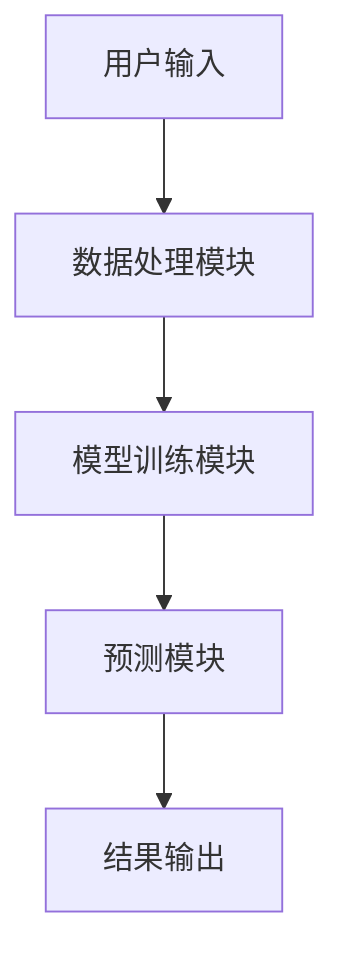

                 


# AI Agent在智能药物相互作用预测中的应用

---

## 关键词  
AI Agent, 药物相互作用, 机器学习, 图神经网络, 药物预测, 药物开发

---

## 摘要  
随着人工智能技术的快速发展，AI Agent（智能体）在药物研发领域的应用逐渐成为研究热点。本文将重点探讨AI Agent在智能药物相互作用预测中的应用，从理论基础、算法原理到系统实现，详细分析其在药物相互作用预测中的优势和实现路径。通过结合实际案例和系统设计，本文旨在为AI Agent在药物研发中的应用提供理论支持和实践指导。

---

## 目录  

1. 引言  
   1.1 AI Agent的基本概念  
   1.2 药物相互作用预测的背景  
   1.3 问题背景与解决方法  
   1.4 概念结构与核心要素  

2. AI Agent的核心理论与药物相互作用预测的基础  
   2.1 AI Agent的工作原理  
   2.2 药物相互作用预测的理论基础  
   2.3 AI Agent与药物相互作用预测的结合  

3. AI Agent在药物相互作用预测中的算法原理  
   3.1 基于机器学习的药物相互作用预测  
   3.2 图神经网络在药物相互作用预测中的应用  
   3.3 AI Agent的算法实现与优化  

4. AI Agent药物相互作用预测系统的架构设计  
   4.1 系统功能模块设计  
   4.2 系统架构设计  
   4.3 系统接口设计与实现  

5. 项目实战：基于AI Agent的药物相互作用预测系统  
   5.1 项目背景与目标  
   5.2 系统实现与代码解读  
   5.3 实际案例分析与结果展示  

6. 总结与展望  
   6.1 研究总结  
   6.2 应用前景与未来方向  
   6.3 注意事项与建议  

---

## 正文  

### 1. 引言  

#### 1.1 AI Agent的基本概念  
AI Agent（人工智能代理）是指具有感知环境、做出决策并执行动作的智能实体。它可以自主地感知环境、分析问题、制定计划并执行任务，以实现特定目标。AI Agent的核心能力包括：  
- **感知能力**：通过传感器或其他输入方式获取环境信息。  
- **推理能力**：基于获取的信息进行逻辑推理或模式识别。  
- **决策能力**：根据推理结果做出最优决策。  
- **执行能力**：通过动作或输出与环境交互。  

AI Agent可以是软件程序、机器人或其他智能设备。在药物相互作用预测中，AI Agent主要用于分析药物之间的相互作用关系，并提供预测结果。  

#### 1.2 药物相互作用预测的背景  
药物相互作用是指一种药物的存在影响另一种药物的疗效或毒性。这种相互作用可能发生在药物在体内的吸收、分布、代谢或排泄过程中。药物相互作用是药物研发和临床应用中的一个重要问题，可能导致治疗失败或严重不良反应。  

传统的药物相互作用预测方法依赖于实验数据和专家经验，但这种方法耗时长、成本高且效率低。随着AI技术的发展，AI Agent被广泛应用于药物相互作用预测中，以提高预测效率和准确性。  

#### 1.3 问题背景与解决方法  
在药物研发过程中，药物相互作用预测面临以下问题：  
- 数据量大且复杂，难以手动处理。  
- 药物分子结构和药代动力学数据的非线性关系难以捕捉。  
- 预测模型的泛化能力有限，难以应对复杂场景。  

AI Agent通过机器学习、深度学习等技术，可以高效地处理海量数据，并发现数据中的潜在规律。结合药物化学、药理学等领域的知识，AI Agent能够显著提高药物相互作用预测的效率和准确性。  

#### 1.4 概念结构与核心要素  
以下是AI Agent与药物相互作用预测的核心概念结构：  
- **药物分子**：药物的基本组成单位，包括化学结构和物理性质。  
- **相互作用关系**：药物之间的相互作用类型和强度。  
- **预测模型**：用于预测药物相互作用的算法或模型。  
- **AI Agent**：执行预测任务的智能实体。  

通过分析这些核心要素，我们可以更好地理解AI Agent在药物相互作用预测中的作用。  

---

### 2. AI Agent的核心理论与药物相互作用预测的基础  

#### 2.1 AI Agent的工作原理  
AI Agent的核心工作原理包括感知、推理、决策和执行四个阶段：  
1. **感知**：通过数据输入接口获取环境信息，如药物分子数据、实验结果等。  
2. **推理**：基于感知到的信息，利用机器学习模型进行分析和推理，识别潜在的相互作用关系。  
3. **决策**：根据推理结果，制定预测策略或行动计划。  
4. **执行**：通过输出接口将预测结果传递给用户或系统。  

#### 2.2 药物相互作用预测的理论基础  
药物相互作用预测的理论基础包括：  
- **药物化学**：研究药物分子的结构与活性之间的关系。  
- **药代动力学**：研究药物在体内的吸收、分布、代谢和排泄过程。  
- **生物信息学**：利用生物数据和计算方法预测药物相互作用。  

#### 2.3 AI Agent与药物相互作用预测的结合  
AI Agent可以通过以下方式实现药物相互作用预测：  
- **数据处理**：AI Agent可以快速处理海量药物分子数据，提取关键特征。  
- **模型构建**：利用深度学习模型（如图神经网络）构建药物相互作用预测模型。  
- **预测与优化**：基于模型进行药物相互作用预测，并优化预测结果的准确性。  

---

### 3. AI Agent在药物相互作用预测中的算法原理  

#### 3.1 基于机器学习的药物相互作用预测  
机器学习是AI Agent的核心技术之一。常用的算法包括：  
- **支持向量机（SVM）**：用于分类任务，预测药物相互作用的类型。  
- **随机森林（Random Forest）**：用于回归或分类任务，预测相互作用强度。  
- **神经网络**：用于处理复杂的非线性关系，提高预测精度。  

#### 3.2 图神经网络在药物相互作用预测中的应用  
图神经网络（Graph Neural Network, GNN）是一种基于图结构的深度学习模型，适合处理药物分子的结构信息。以下是GNN在药物相互作用预测中的应用流程：  

1. **药物分子建模**：将药物分子表示为图结构，节点表示原子，边表示化学键。  
2. **特征提取**：通过GNN提取药物分子的高阶特征。  
3. **相互作用预测**：基于提取的特征，预测药物之间的相互作用类型和强度。  

#### 3.3 AI Agent的算法实现与优化  
以下是基于GNN的药物相互作用预测算法的伪代码：  

```python
class GNNModel:
    def __init__(self, input_dim, hidden_dim, output_dim):
        self.input_dim = input_dim
        self.hidden_dim = hidden_dim
        self.output_dim = output_dim
        self.GCN_layer = GCNLayer(input_dim, hidden_dim)
        self.readout_layer = ReadoutLayer(hidden_dim, output_dim)
    
    def forward(self, graph):
        # 图卷积操作
        hidden = self.GCN_layer(graph)
        # 读出操作
        output = self.readout_layer(hidden)
        return output

# 示例数据
graph_data = {
    'nodes': [{'id': 0, 'features': [1, 2, 3]}, {'id': 1, 'features': [4, 5, 6]}],
    'edges': [[0, 1]]
}

# 模型训练
model = GNNModel(3, 64, 2)
optimizer = Adam(model.parameters(), lr=0.01)
criterion = BCEWithLogitsLoss()

for epoch in range(100):
    optimizer.zero_grad()
    outputs = model.forward(graph_data)
    loss = criterion(outputs, labels)
    loss.backward()
    optimizer.step()
```

---

### 4. AI Agent药物相互作用预测系统的架构设计  

#### 4.1 系统功能模块设计  
以下是系统的功能模块设计：  

1. **数据输入模块**：接收药物分子数据和实验结果。  
2. **数据处理模块**：对数据进行清洗和预处理。  
3. **模型训练模块**：基于GNN训练药物相互作用预测模型。  
4. **预测模块**：输入新药物，输出相互作用预测结果。  
5. **结果分析模块**：对预测结果进行可视化和分析。  

#### 4.2 系统架构设计  
以下是系统的架构设计：  



---

### 5. 项目实战：基于AI Agent的药物相互作用预测系统  

#### 5.1 项目背景与目标  
本项目旨在开发一个基于AI Agent的药物相互作用预测系统，目标是：  
- 提供高效的药物相互作用预测服务。  
- 验证AI Agent在药物相互作用预测中的应用效果。  

#### 5.2 系统实现与代码解读  
以下是系统的实现代码：  

```python
import torch
from torch import nn
from torch.utils.data import DataLoader

class DrugInteractionPredictor:
    def __init__(self, model, device='cpu'):
        self.model = model
        self.device = device
    
    def predict(self, graph_data):
        self.model.eval()
        with torch.no_grad():
            inputs = graph_data.to(self.device)
            outputs = self.model(inputs)
            return outputs.cpu().numpy()

# 示例使用
model = GNNModel(3, 64, 2)
predictor = DrugInteractionPredictor(model)
graph_data = {
    'nodes': [{'id': 0, 'features': [1, 2, 3]}, {'id': 1, 'features': [4, 5, 6]}],
    'edges': [[0, 1]]
}
result = predictor.predict(graph_data)
print(result)
```

---

### 6. 总结与展望  

#### 6.1 研究总结  
本文详细探讨了AI Agent在智能药物相互作用预测中的应用，从理论基础到算法实现，再到系统设计，全面分析了其在药物研发中的优势和潜力。  

#### 6.2 应用前景与未来方向  
随着AI技术的不断发展，AI Agent在药物相互作用预测中的应用前景广阔。未来的研究方向包括：  
- 更高效的药物分子建模方法。  
- 更精准的药物相互作用预测模型。  
- 更智能的药物研发辅助系统。  

#### 6.3 注意事项与建议  
在实际应用中，需要注意以下几点：  
- 数据质量和完整性对预测结果的影响。  
- 模型的可解释性和透明性。  
- 系统的安全性和稳定性。  

---

以上是《AI Agent在智能药物相互作用预测中的应用》的技术博客文章大纲和内容概述，您可以根据需要进一步扩展和详细阐述。

