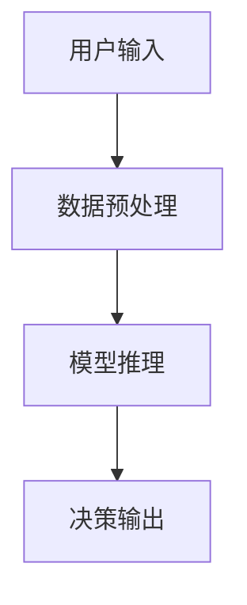

                 


# AI Agent在智能药物研发中的角色

## 关键词：
- AI Agent
- 药物研发
- 强化学习
- 知识图谱
- 系统架构
- 临床试验

## 摘要：
AI Agent在智能药物研发中扮演着越来越重要的角色。通过强化学习和知识图谱推理等技术，AI Agent能够显著提高药物研发的效率和精准度。本文将从AI Agent的基本概念、核心算法、系统架构到实际项目应用进行全面解析，深入探讨AI Agent在药物研发中的潜力和挑战。

---

# 第一部分: AI Agent与智能药物研发的背景介绍

## 第1章: AI Agent的基本概念

### 1.1 什么是AI Agent
AI Agent（人工智能代理）是一种能够感知环境、自主决策并执行任务的智能实体。它能够通过传感器获取信息，利用算法进行分析和推理，并根据结果采取行动。AI Agent的核心特征包括自主性、反应性、目标导向性和学习能力。

### 1.2 AI Agent与传统药物研发的区别
传统的药物研发过程依赖于人工经验和实验验证，耗时长、成本高且效率低。AI Agent的引入能够通过自动化和智能化的方式加速药物发现、优化化合物结构、预测药物疗效，并在临床试验中提供实时决策支持。

---

## 第2章: 智能药物研发的背景与挑战

### 2.1 药物研发的传统流程
药物研发通常包括药物发现、临床前研究、临床试验和上市后监管四个阶段。每个阶段都需要大量的实验和数据分析，耗时数年甚至更长。

### 2.2 传统药物研发的痛点
- 成本高昂：药物研发的平均成本超过20亿美元。
- 周期漫长：从实验室到市场通常需要10-15年。
- 数据爆炸：随着生物技术的发展，数据量急剧增加，人工处理效率低下。

### 2.3 AI技术在药物研发中的潜力
AI Agent能够通过强化学习优化化合物结构，利用知识图谱推理加速靶点识别，并在临床试验中实时分析数据，显著提高研发效率和成功率。

---

# 第二部分: AI Agent的核心原理与算法

## 第3章: AI Agent的核心原理

### 3.1 任务分解与优先级排序
AI Agent通过将复杂的药物研发任务分解为多个子任务，并根据优先级进行排序，确保资源的高效利用。

#### 示例：化合物优化任务分解
1. 数据收集与预处理
2. 目标靶点识别
3. 化合物生成与筛选
4. 药效预测与优化

### 3.2 知识表示与推理
AI Agent利用知识图谱表示药物研发中的知识，并通过推理算法进行靶点识别和化合物设计。

#### 3.2.1 知识图谱的构建
- 数据来源：公共数据库（如PubChem）、文献挖掘。
- 实体关系：化合物-靶点、靶点-疾病、化合物-属性。

#### 3.2.2 图神经网络推理
通过图神经网络（Graph Neural Network）对知识图谱进行推理，识别潜在的药物靶点。

---

## 第4章: AI Agent的核心算法

### 4.1 强化学习算法
强化学习（Reinforcement Learning）是一种通过试错方式优化决策的算法，广泛应用于药物研发中的化合物生成和优化。

#### 强化学习流程
1. 状态表示：化合物的化学结构。
2. 动作选择：生成新的化合物。
3. 奖励机制：评估化合物的药效。

#### 示例代码：强化学习框架
```python
class Agent:
    def __init__(self, model):
        self.model = model  # 强化学习模型
        self.memory = []  # 经验回放池
    def act(self, state):
        # 根据当前状态生成动作
        return self.model.predict(state)
    def remember(self, state, action, reward, next_state):
        self.memory.append((state, action, reward, next_state))
```

### 4.2 知识图谱推理算法
知识图谱推理通过图神经网络对化合物和靶点之间的关系进行建模，帮助AI Agent发现新的药物候选。

#### 图神经网络流程
1. 数据输入：化合物和靶点的特征向量。
2. 图构建：化合物-靶点关系图。
3. 推理：识别潜在的药物靶点。

#### 示例代码：图神经网络模型
```python
import tensorflow as tf
from tensorflow.keras import layers

class GraphNN(tf.keras.Model):
    def __init__(self, input_dim):
        super(GraphNN, self).__init__()
        self.embedding = layers.Dense(128, input_dim=input_dim)
        self.gnn = layers.GRU(64, return_sequences=False)
        self.dense = layers.Dense(1, activation='sigmoid')
    def call(self, inputs):
        x = self.embedding(inputs)
        x = self.gnn(x)
        x = self.dense(x)
        return x
```

---

# 第三部分: AI Agent的系统架构与设计

## 第5章: AI Agent的系统架构

### 5.1 系统整体架构
AI Agent在药物研发中的系统架构通常包括数据输入、模型推理、决策输出三个部分。

#### 系统架构图


### 5.2 各模块的功能与交互
1. 数据输入模块：接收化合物结构和靶点数据。
2. 模型推理模块：利用强化学习和知识图谱推理进行预测。
3. 决策输出模块：输出优化后的化合物结构和靶点建议。

---

## 第6章: 系统功能设计

### 6.1 药物发现模块
- 功能：生成和优化化合物结构。
- 输入：靶点信息。
- 输出：优化后的化合物。

### 6.2 临床试验模块
- 功能：预测药物疗效和安全性。
- 输入：患者数据。
- 输出：个性化治疗方案。

---

# 第四部分: AI Agent的项目实战

## 第7章: 项目实战

### 7.1 环境安装与配置
- 开发环境：Python 3.8+
- 依赖库：TensorFlow、Keras、NetworkX。

### 7.2 核心算法实现
#### 强化学习实现
```python
def train_agent():
    agent = Agent(model)
    for episode in range(1000):
        state = get_state()
        action = agent.act(state)
        reward = evaluate(action)
        next_state = get_next_state()
        agent.remember(state, action, reward, next_state)
        agent.model.train(agent.memory)
```

#### 知识图谱推理实现
```python
def build_knowledge_graph():
    graph = nx.Graph()
    for compound in compounds:
        graph.add_node(compound)
    for relation in relations:
        graph.add_edge(relation.source, relation.target)
    return graph
```

### 7.3 实际案例分析
通过AI Agent优化一个化合物的结构，提高其对目标靶点的亲和力。

---

## 第8章: 最佳实践与总结

### 8.1 最佳实践
- 数据质量至关重要：确保数据的准确性和完整性。
- 模型的可解释性：优化后的化合物需要可解释。
- 系统的鲁棒性：确保在数据不足时仍能提供合理的建议。

### 8.2 总结
AI Agent通过强化学习和知识图谱推理，显著提高了药物研发的效率和精准度。未来，随着AI技术的进一步发展，AI Agent将在药物研发中发挥更大的作用。

---

## 第9章: 注意事项与拓展阅读

### 9.1 注意事项
- 数据隐私与安全：处理患者数据时需遵守相关法规。
- 模型的泛化能力：确保模型在不同场景下都能有效。
- 系统的可扩展性：支持未来更多的药物研发任务。

### 9.2 拓展阅读
- 最新研究：《利用强化学习优化药物分子结构》。
- 相关书籍：《Deep Learning for Drug Discovery》。
- 未来方向：研究多Agent协作在药物研发中的应用。

---

通过以上内容，您可以开始撰写这篇结构清晰、内容详实的技术博客文章。希望对您有所帮助！

