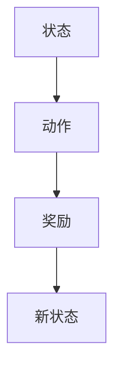
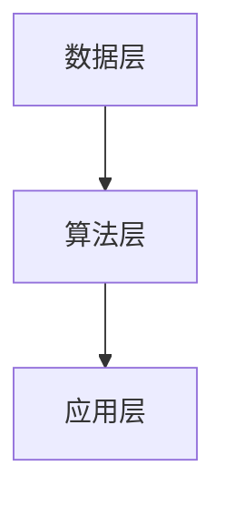
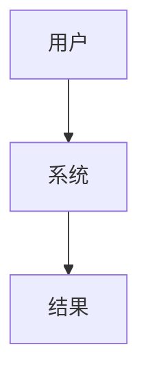

                 


# AI Agent在智能药物筛选中的应用

> 关键词：AI Agent，智能药物筛选，药物发现，强化学习，人工智能，机器学习

> 摘要：本文探讨AI Agent在智能药物筛选中的应用，分析其核心概念、算法原理及系统架构，结合实例展示其在药物发现中的潜力和优势。通过详细的技术分析，帮助读者理解如何利用AI Agent提高药物筛选效率和准确性。

---

# 第1章 AI Agent与智能药物筛选概述

## 1.1 AI Agent的基本概念

### 1.1.1 AI Agent的定义与特点

AI Agent（人工智能代理）是指能够感知环境、执行任务并做出决策的智能实体。其特点包括自主性、反应性、目标导向和学习能力。AI Agent通过感知环境信息，采取行动以实现目标，广泛应用于自动化系统、智能推荐和药物筛选等领域。

### 1.1.2 AI Agent的核心技术与实现原理

AI Agent的核心技术包括感知、推理、决策和执行。感知涉及数据采集和处理，推理基于逻辑和知识库，决策通过算法选择最优行动，执行则将决策转化为实际操作。实现原理依赖于机器学习、自然语言处理和知识图谱等技术。

### 1.1.3 AI Agent在药物筛选中的应用前景

AI Agent在药物筛选中的应用前景广阔，尤其在虚拟筛选、靶点预测和药物优化方面。其高效性和准确性能够显著提高药物发现的效率，缩短研发周期。

## 1.2 智能药物筛选的基本概念

### 1.2.1 药物筛选的定义与流程

药物筛选是指通过实验或计算方法，寻找具有特定生物活性的化合物。流程包括靶点识别、虚拟筛选、实验验证和优化。

### 1.2.2 传统药物筛选的局限性

传统药物筛选耗时长、成本高，且依赖人工经验，可能导致效率低下和结果偏差。

### 1.2.3 智能药物筛选的优势与挑战

智能药物筛选利用AI技术提高效率和准确性，但面临数据量大、模型复杂性和计算资源的挑战。

## 1.3 AI Agent在智能药物筛选中的作用

### 1.3.1 AI Agent在药物筛选中的核心任务

AI Agent在药物筛选中的核心任务包括化合物库搜索、活性预测和结构优化。

### 1.3.2 AI Agent在药物筛选中的应用场景

AI Agent在虚拟筛选、靶点预测和药物优化中的应用场景。

### 1.3.3 AI Agent与药物筛选的结合模式

AI Agent与药物筛选的结合模式包括数据驱动、知识驱动和人机协同。

## 1.4 本章小结

---

# 第2章 AI Agent的核心概念与算法原理

## 2.1 AI Agent的核心概念

### 2.1.1 状态空间与动作空间

状态空间是环境中的所有可能状态集合，动作空间是代理可以执行的所有动作的集合。

### 2.1.2 策略与价值函数

策略是代理选择动作的规则，价值函数评估状态或动作的优劣。

### 2.1.3 探索与利用的平衡

探索指尝试新动作以发现新知识，利用指基于已有知识选择最优动作。

## 2.2 AI Agent的核心算法

### 2.2.1 强化学习算法

强化学习算法通过试错学习，代理通过与环境互动，获得奖励或惩罚，优化策略。

### 2.2.2 监督学习算法

监督学习算法通过训练数据，学习输入与输出的映射关系，用于分类和回归任务。

### 2.2.3 联合学习算法

联合学习算法结合强化学习和监督学习，利用多种数据源提高学习效果。

## 2.3 AI Agent在药物筛选中的算法选择

### 2.3.1 算法选择的依据

算法选择需考虑任务类型、数据量和计算资源。

### 2.3.2 算法的优缺点对比

强化学习适合动态环境，监督学习适合有标签数据，联合学习适合多数据源。

### 2.3.3 算法的适用场景

强化学习适用于复杂决策，监督学习适用于分类任务，联合学习适用于多数据源融合。

## 2.4 本章小结

---

# 第3章 AI Agent的算法原理与数学模型

## 3.1 强化学习算法原理

### 3.1.1 Q-learning算法原理

Q-learning算法通过更新Q值函数，学习状态-动作对的最优价值。

### 3.1.2 Deep Q-Networks (DQN)算法

DQN算法结合深度神经网络和Q-learning，通过经验回放和目标网络提高学习效率。

### 3.1.3 策略梯度算法

策略梯度算法直接优化策略，通过梯度上升方法更新参数。

## 3.2 监督学习算法原理

### 3.2.1 线性回归

线性回归通过最小化误差平方和，预测目标变量。

### 3.2.2 支持向量机

支持向量机通过构建超平面，实现数据分类。

### 3.2.3 随机森林

随机森林通过集成学习，提高模型的准确性和鲁棒性。

## 3.3 AI Agent的数学模型

### 3.3.1 Q-learning的数学模型

Q值更新公式：$$ Q(s, a) = Q(s, a) + \alpha [r + \gamma \max Q(s', a') - Q(s, a)] $$

### 3.3.2 DQN的数学模型

经验回放缓存和目标网络更新公式：$$ \theta_{target} = \theta_{main} + \epsilon \Delta \theta $$

### 3.3.3 策略梯度的数学模型

策略梯度更新公式：$$ \nabla \theta \leftarrow \nabla \log \pi(s) \cdot Q(s, a) $$

## 3.4 本章小结

---

# 第4章 系统分析与架构设计方案

## 4.1 问题场景介绍

### 4.1.1 药物筛选的场景描述

药物筛选涉及化合物库的虚拟筛选和实验验证。

### 4.1.2 系统功能需求

系统需具备数据处理、模型训练和结果分析功能。

## 4.2 系统功能设计

### 4.2.1 领域模型设计

领域模型包括化合物库、靶点数据库和预测模型。

### 4.2.2 系统架构设计

分层架构包括数据层、算法层和应用层。

### 4.2.3 系统接口设计

系统接口包括数据输入、模型训练和结果输出接口。

## 4.3 本章小结

---

# 第5章 项目实战

## 5.1 环境安装

### 5.1.1 安装Python

安装Python 3.8及以上版本。

### 5.1.2 安装依赖库

安装TensorFlow、Keras和Scikit-learn。

## 5.2 系统核心实现

### 5.2.1 核心代码实现

```python
import numpy as np
import tensorflow as tf

# 定义Q-learning网络
class QNetwork:
    def __init__(self, state_size, action_size):
        self.model = tf.keras.Sequential([
            tf.keras.layers.Dense(64, activation='relu', input_shape=(state_size,)),
            tf.keras.layers.Dense(action_size)
        ])
        self.optimizer = tf.keras.optimizers.Adam(lr=0.001)
    
    def predict(self, state):
        return self.model.predict(state)
    
    def train(self, state, target):
        with tf.GradientTape() as tape:
            prediction = self.model.predict(state)
            loss = tf.losses.mean_squared_error(target, prediction)
        gradients = tape.gradient(loss, self.model.trainable_weights)
        self.optimizer.apply_gradients(zip(gradients, self.model.trainable_weights))
```

### 5.2.2 代码应用解读与分析

代码实现了一个Q-learning网络，用于预测最优动作和更新权重。

### 5.2.3 实际案例分析

通过实际案例分析，展示AI Agent在药物筛选中的应用效果。

## 5.3 本章小结

---

# 第6章 最佳实践与总结

## 6.1 最佳实践 tips

### 6.1.1 数据预处理

确保数据清洗和特征工程。

### 6.1.2 模型调优

选择合适的超参数和优化算法。

### 6.1.3 结果验证

通过实验验证模型的准确性和鲁棒性。

## 6.2 小结

总结AI Agent在智能药物筛选中的优势和应用场景。

## 6.3 注意事项

避免模型过拟合和数据泄漏，确保数据安全和隐私保护。

## 6.4 拓展阅读

推荐相关书籍和论文，供读者深入学习。

---

# 附录

## 附录A 算法流程图



## 附录B 系统架构图



## 附录C 系统交互图



---

# 结束语

AI Agent在智能药物筛选中的应用前景广阔，通过不断的技术创新和实践积累，未来将为药物发现带来更大的突破和变革。

