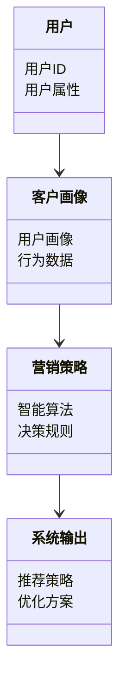

                 


# AI Agent在智能营销自动化中的应用

> 关键词：AI Agent，智能营销，自动化，算法原理，系统架构，项目实战

> 摘要：本文深入探讨AI Agent在智能营销自动化中的应用，分析其核心概念、算法原理、系统架构，并通过实际案例展示其在营销自动化中的实践价值。通过详细的技术分析和案例研究，本文为读者提供了一套系统化的理解和应用AI Agent的方法。

---

# 第一章: AI Agent与智能营销自动化概述

## 1.1 AI Agent的基本概念

### 1.1.1 什么是AI Agent

AI Agent（人工智能代理）是指能够感知环境、自主决策并执行任务的智能体。在营销领域，AI Agent能够根据用户行为和市场变化，自动调整营销策略，优化用户体验。

### 1.1.2 AI Agent的核心特征

AI Agent的核心特征包括：自主性、反应性、目标导向和学习能力。这些特征使其能够适应复杂的营销环境，并实时做出决策。

### 1.1.3 智能营销自动化的基本概念

智能营销自动化是指通过AI技术实现营销活动的自动化，包括客户画像、精准营销和动态优化等环节。

## 1.2 AI Agent在营销中的应用背景

### 1.2.1 营销自动化的发展历程

从传统营销到数字化营销，再到智能化营销，AI Agent的引入标志着营销自动化的重大进步。

### 1.2.2 AI Agent在营销自动化中的作用

AI Agent通过数据分析和实时决策，提升了营销活动的精准度和效率。

### 1.2.3 当前AI Agent在营销中的应用现状

当前，AI Agent已广泛应用于客户画像、个性化推荐和动态定价等领域，展现出强大的应用潜力。

## 1.3 本章小结

本章介绍了AI Agent的基本概念、核心特征以及在营销自动化中的应用背景，为后续内容奠定了基础。

---

# 第二章: AI Agent的核心概念与原理

## 2.1 AI Agent的核心原理

### 2.1.1 AI Agent的感知机制

AI Agent通过收集和分析数据，感知环境的变化。常见的感知方法包括数据采集和特征提取。

### 2.1.2 AI Agent的决策机制

基于感知到的信息，AI Agent通过算法模型做出最优决策，如分类和回归模型。

### 2.1.3 AI Agent的执行机制

AI Agent根据决策结果执行具体操作，如发送邮件或调整广告策略。

## 2.2 AI Agent与传统营销自动化的主要区别

### 2.2.1 传统营销自动化的局限性

传统营销自动化缺乏实时性和个性化，难以应对复杂多变的市场环境。

### 2.2.2 AI Agent带来的创新

AI Agent通过实时学习和自适应优化，显著提升了营销活动的效果。

## 2.3 AI Agent的分类与应用场景

### 2.3.1 基于规则的AI Agent

基于预设规则进行决策，适用于规则明确的场景。

### 2.3.2 基于学习的AI Agent

通过机器学习模型进行决策，适用于复杂多变的场景。

### 2.3.3 基于强化学习的AI Agent

通过与环境互动，不断优化决策策略。

## 2.4 本章小结

本章详细讲解了AI Agent的核心原理、与传统营销自动化的主要区别以及不同类型的AI Agent及其应用场景。

---

# 第三章: AI Agent的算法原理与数学模型

## 3.1 AI Agent的感知算法

### 3.1.1 朴素贝叶斯算法

用于分类任务，公式如下：

$$ P(y|x) = \frac{P(x|y)P(y)}{P(x)} $$

### 3.1.2 支持向量机（SVM）算法

用于分类和回归任务，通过最大化间隔实现最优解。

## 3.2 AI Agent的决策算法

### 3.2.1 决策树算法

通过构建树状结构进行分类，使用信息增益或基尼指数作为分裂标准。

### 3.2.2 随机森林算法

通过集成多个决策树提升模型的准确性和鲁棒性。

## 3.3 AI Agent的执行算法

### 3.3.1 强化学习算法

通过与环境互动，学习最优策略。

### 3.3.2 Q-Learning算法

使用Q值函数进行状态转移，公式如下：

$$ Q(s, a) = r + \gamma \cdot \max Q(s', 

---

# 第四章: 系统分析与架构设计

## 4.1 系统分析

### 4.1.1 问题场景介绍

营销自动化系统需要实时处理大量数据，快速做出决策。

### 4.1.2 项目介绍

本项目旨在开发一个基于AI Agent的智能营销系统。

## 4.2 系统功能设计

### 4.2.1 领域模型

使用Mermaid类图展示系统功能模块，如客户画像、营销策略等。



## 4.3 系统架构设计

### 4.3.1 系统架构

使用Mermaid架构图展示系统架构，包括前端、后端和数据库模块。

```mermaid
archimate
title 智能营销系统架构
actors 用户
systems 前端系统
systems 后端系统
systems 数据库
用户 --> 前端系统
前端系统 --> 后端系统
后端系统 --> 数据库
```

## 4.4 系统接口设计

### 4.4.1 API接口

设计RESTful API接口，用于数据传输和功能调用。

### 4.4.2 接口交互

使用Mermaid序列图展示用户与系统之间的交互流程。

```mermaid
sequenceDiagram
    participant 用户
    participant 前端系统
    participant 后端系统
    participant 数据库
    用户 -> 前端系统: 请求数据
    前端系统 -> 后端系统: 获取数据
    后端系统 -> 数据库: 查询数据
    返回
    数据库 --> 后端系统
    后端系统 --> 前端系统
    前端系统 --> 用户
```

---

# 第五章: 项目实战

## 5.1 环境安装

### 5.1.1 安装Python

使用Anaconda安装Python环境。

### 5.1.2 安装依赖库

安装numpy、pandas、scikit-learn等库。

## 5.2 系统核心实现

### 5.2.1 客户画像实现

使用Python代码实现客户画像的构建和分析。

```python
import pandas as pd
from sklearn.cluster import KMeans

# 加载数据
data = pd.read_csv('customer_data.csv')

# 特征提取
X = data[['age', 'income', 'purchase_frequency']]

# K-means聚类
kmeans = KMeans(n_clusters=3, random_state=0)
kmeans.fit(X)

# 获取聚类结果
clusters = kmeans.labels_
print(clusters)
```

### 5.2.2 精准营销策略实现

使用机器学习模型预测最佳营销策略。

```python
from sklearn.tree import DecisionTreeClassifier

# 加载数据
data = pd.read_csv('marketing_data.csv')

# 特征和目标变量
X = data.drop('target', axis=1)
y = data['target']

# 训练决策树模型
model = DecisionTreeClassifier()
model.fit(X, y)

# 预测结果
predictions = model.predict(X)
print(predictions)
```

## 5.3 案例分析

### 5.3.1 案例介绍

分析用户点击行为，优化营销策略。

### 5.3.2 数据分析与优化

通过AI Agent分析数据，优化广告投放策略，提升转化率。

---

# 第六章: 总结与展望

## 6.1 总结

本章总结了AI Agent在智能营销自动化中的应用，强调了其在提高营销效率和精准度方面的巨大潜力。

## 6.2 展望

未来，随着AI技术的不断发展，AI Agent在营销自动化中的应用将更加广泛和深入。

---

# 附录

## 附录A: 参考文献

列出本文中引用的主要文献和资源。

## 附录B: 工具与技术

详细列出项目中使用的工具和技术，如Python、scikit-learn、Mermaid等。

---

通过以上目录大纲，我们可以看到文章内容涵盖了AI Agent在智能营销自动化中的各个方面，从基本概念到实际应用，为读者提供了全面而深入的指导。

