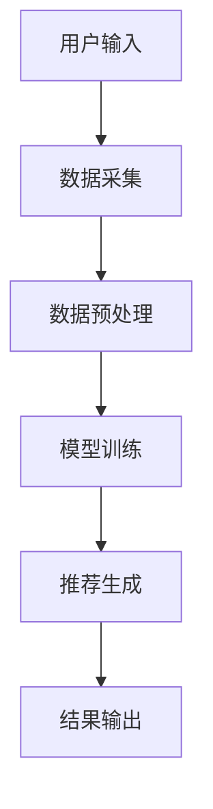
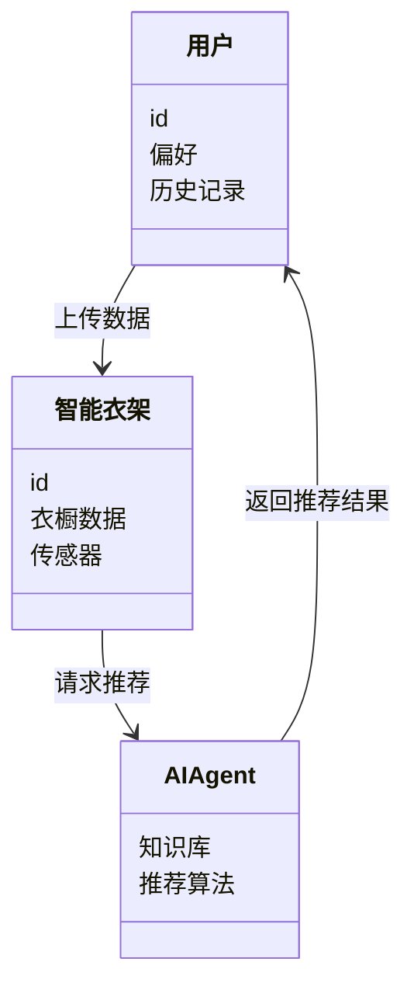
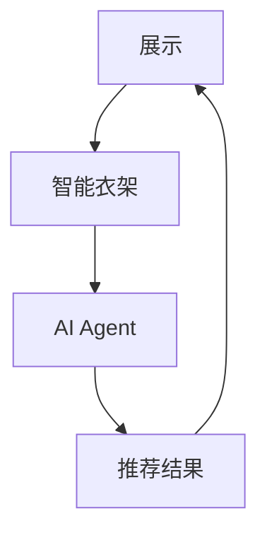
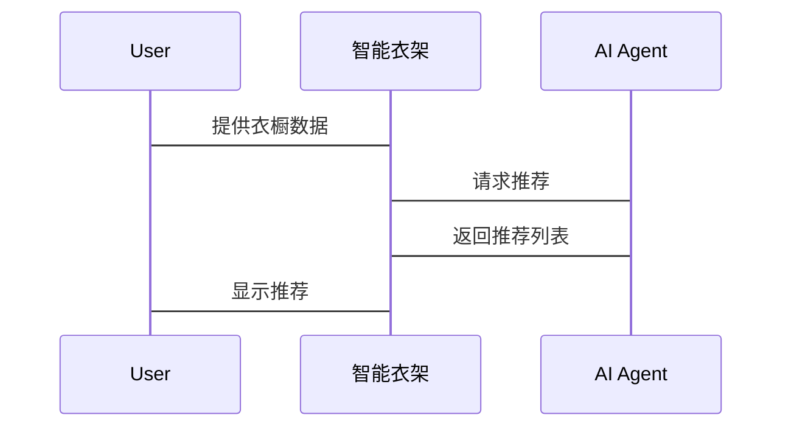

                 


# AI Agent在智能衣架中的穿搭灵感生成器

## 关键词：
AI Agent, 智能衣架, 穿搭灵感, 时尚推荐, 推荐算法

## 摘要：
本文探讨了AI Agent在智能衣架中的应用，特别是在穿搭灵感生成方面的创新。通过分析用户需求和AI技术，本文详细介绍了AI Agent的工作原理、算法实现，以及在智能衣架中的系统架构。结合实际案例，展示了如何通过协同过滤推荐算法为用户提供个性化的时尚建议，助力用户打造智能衣柜。

---

# 目录

1. 背景介绍  
   1.1 问题背景  
   1.2 问题描述  
   1.3 问题解决  
   1.4 边界与外延  
   1.5 核心概念与组成  

2. 核心概念与联系  
   2.1 AI Agent与智能衣架的概念对比  
   2.2 核心概念的ER实体关系图  

3. 算法原理讲解  
   3.1 AI Agent的算法流程  
   3.2 算法实现的Python代码示例  
   3.3 协同过滤推荐算法的数学模型  

4. 系统分析与架构设计  
   4.1 问题场景介绍  
   4.2 系统功能设计  
   4.3 系统架构设计  
   4.4 接口设计与交互流程  

5. 项目实战  
   5.1 环境安装与配置  
   5.2 系统核心实现代码  
   5.3 实际案例分析  
   5.4 项目总结与优化建议  

6. 最佳实践与注意事项  
   6.1 技术实现的注意事项  
   6.2 用户体验优化建议  
   6.3 系统维护与升级  

7. 小结与展望  
   7.1 本文总结  
   7.2 未来研究方向  

---

# 正文

## 1. 背景介绍

### 1.1 问题背景
随着时尚产业的快速发展，用户对个性化穿搭的需求日益增长。传统穿搭助手主要依赖人工推荐或简单的规则匹配，难以满足用户的多样化需求。AI Agent的引入，为智能衣架提供了强大的技术支持，能够根据用户的衣橱数据和偏好，实时生成穿搭灵感。

### 1.2 问题描述
用户在选择穿搭时，常常面临以下挑战：  
- 衣橱物品繁多，难以快速找到搭配方案。  
- 穿搭建议缺乏个性化，无法满足不同场合的需求。  
- 传统推荐系统依赖固定规则，难以应对用户的动态需求。  

智能衣架通过AI Agent技术，能够实时分析用户的衣橱数据和行为偏好，提供个性化的穿搭建议。

### 1.3 问题解决
AI Agent通过以下方式解决上述问题：  
1. 数据采集与处理：智能衣架通过RFID技术采集用户的衣橱数据，并结合用户的行为数据（如历史穿搭记录、喜好反馈）进行分析。  
2. 智能推荐：基于协同过滤推荐算法，AI Agent能够生成符合用户风格的穿搭建议，并通过动态调整推荐策略优化用户体验。  

### 1.4 边界与外延
- **边界**：智能衣架的功能仅限于穿搭建议生成，不涉及实际衣物的购买或配送。  
- **外延**：AI Agent技术可扩展应用于其他领域，如个性化购物推荐、健康管理等。  

### 1.5 核心概念与组成
- **AI Agent**：具备数据采集、分析和推荐能力的智能实体。  
- **智能衣架**：集成AI Agent的硬件设备，能够与用户交互并提供实时建议。  
- **穿搭灵感生成**：基于用户衣橱和偏好生成个性化搭配方案。  

---

## 2. 核心概念与联系

### 2.1 AI Agent与智能衣架的概念对比
| 概念       | AI Agent                         | 智能衣架                         |
|------------|----------------------------------|----------------------------------|
| 定义       | 具备智能决策能力的代理程序       | 集成AI技术的智能衣物管理设备     |
| 核心功能   | 数据分析、推荐生成               | 数据采集、交互推荐               |
| 输入       | 用户行为数据、衣橱数据           | 用户操作指令、传感器数据         |
| 输出       | 推荐结果、决策建议               | 搭配方案、互动反馈               |

### 2.2 核心概念的ER实体关系图
```mermaid
er
    entity(AI Agent) {
        id
        knowledge_base
        interaction_history
    }
    entity(智能衣架) {
        id
        user_data
        recommendation_log
    }
    relationship(AI Agent与智能衣架的交互) {
        --> 处理请求
        --> 提供推荐
    }
```

---

## 3. 算法原理讲解

### 3.1 AI Agent的算法流程


### 3.2 算法实现的Python代码示例
```python
def generate_recommendation(user_id):
    # 数据预处理
    user_data = load_user_data(user_id)
    # 模型训练
    model = CollaborativeFiltering()
    model.train(user_data)
    # 推荐生成
    recommendations = model.predict(user_id, 5)
    return recommendations
```

### 3.3 协同过滤推荐算法的数学模型
协同过滤推荐算法通过计算用户之间的相似度或物品之间的相似度，生成推荐结果。  
- **用户-用户协同过滤**：  
  $$ sim(u, v) = \frac{\sum_{i \in I_u \cap I_v} (r_{u,i} - \bar{r}_u)(r_{v,i} - \bar{r}_v)}{\sqrt{\sum_{i \in I_u} (r_{u,i} - \bar{r}_u)^2} \cdot \sqrt{\sum_{i \in I_v} (r_{v,i} - \bar{r}_v)^2}}} $$  
  其中，\( sim(u, v) \) 表示用户 \( u \) 和用户 \( v \) 的相似度，\( I_u \) 和 \( I_v \) 分别是用户 \( u \) 和 \( v \) 的行为记录。

---

## 4. 系统分析与架构设计

### 4.1 问题场景介绍
智能衣架系统需要满足以下需求：  
- 实时采集用户的衣橱数据。  
- 提供个性化的穿搭建议。  
- 支持用户与智能衣架的交互操作。  

### 4.2 系统功能设计


### 4.3 系统架构设计


### 4.4 接口设计与交互流程


---

## 5. 项目实战

### 5.1 环境安装与配置
```bash
pip install numpy pandas scikit-learn
```

### 5.2 系统核心实现代码
```python
import numpy as np
from sklearn.metrics.pairwise import cosine_similarity

def collaborative_filtering_recommendation(user_id, user_item_matrix):
    # 计算用户相似度
    user_similarities = cosine_similarity(user_item_matrix)
    # 找出最相似的用户
    similar_users = np.argsort(user_similarities[user_id])[::-1]
    # 返回推荐结果
    recommendations = []
    for user in similar_users:
        recommendations.extend(user_item_matrix[user][np.where(user_item_matrix[user] == 1)])
    return recommendations
```

### 5.3 实际案例分析
以用户A为例，假设用户A的衣橱数据如下：  
| 衣物类型 | 衣物名称 | 颜色 | 尺码 |
|----------|----------|------|------|
| 衬衣     | 衬衣1    | 白色 | M    |
| 裤子      | 裤子1    | 蓝色 | M    |  

AI Agent会基于协同过滤算法，推荐与用户A风格相似的用户B的搭配方案，例如：  
- 白色衬衫搭配蓝色裤子。  

---

## 6. 最佳实践与注意事项

### 6.1 技术实现的注意事项
- 确保数据采集的准确性和实时性。  
- 定期更新推荐模型，避免推荐结果过时。  

### 6.2 用户体验优化建议
- 提供多样化的推荐选项，满足用户的个性化需求。  
- 支持用户反馈功能，优化推荐算法。  

### 6.3 系统维护与升级
- 定期清理无效数据，优化系统性能。  
- 关注时尚潮流变化，及时更新推荐策略。  

---

## 7. 小结与展望

### 7.1 本文总结
本文详细介绍了AI Agent在智能衣架中的应用，通过协同过滤推荐算法为用户生成个性化穿搭灵感。系统设计部分展示了AI Agent与智能衣架的交互流程，项目实战部分提供了具体的实现方案和代码示例。

### 7.2 未来研究方向
- 探索更高效的推荐算法，如深度学习模型。  
- 结合增强现实技术，提供虚拟试衣功能。  

---

通过本文的分析与实践，读者可以深入了解AI Agent在智能衣架中的应用潜力，并为未来的时尚推荐系统开发提供参考。

