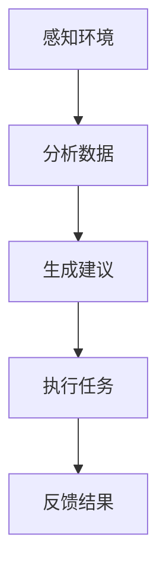
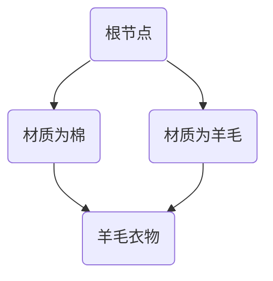
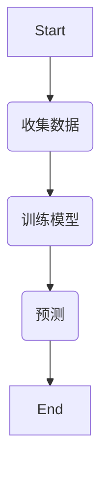
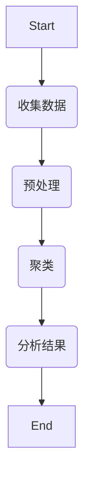
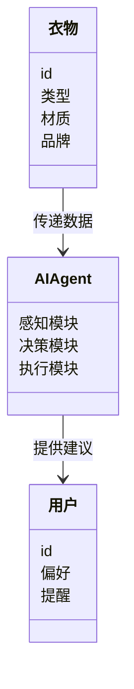
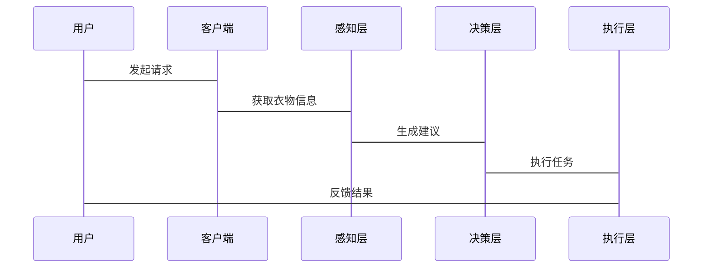

                 


# AI Agent在智能衣架中的衣物保养指导

**关键词**：AI Agent, 智能衣架, 衣物保养, 人工智能, 系统架构, 算法原理, 项目实战

**摘要**：  
本文探讨AI Agent在智能衣架中的应用，分析其在衣物保养中的核心作用。通过详细的技术分析，涵盖背景介绍、核心概念、算法原理、系统架构、项目实战等多个方面，全面解析AI Agent如何通过感知、决策和执行模块优化衣物管理。文章最后提供最佳实践建议，帮助读者理解并应用AI Agent技术于智能衣架系统。

---

# 第1章: AI Agent与智能衣架概述

## 1.1 AI Agent的基本概念  
AI Agent（人工智能代理）是一种能够感知环境、自主决策并执行任务的智能系统。它通过传感器获取信息，利用算法进行分析，并通过执行器完成目标。AI Agent的核心在于其智能化和自主性，能够根据环境变化动态调整行为。

### 1.1.1 AI Agent的定义  
AI Agent是一种能够感知环境、自主决策并执行任务的智能实体，具备以下特点：  
1. **自主性**：无需外部干预，自主完成任务。  
2. **反应性**：能够实时感知环境变化并做出反应。  
3. **目标导向**：基于目标进行决策和行动。  

### 1.1.2 AI Agent的核心特点  
- **模块化**：AI Agent通常由感知模块、决策模块和执行模块组成。  
- **可扩展性**：能够根据需求扩展功能模块。  
- **学习能力**：通过机器学习算法不断优化性能。  

### 1.1.3 AI Agent与传统自动化设备的区别  
传统自动化设备仅能执行预设任务，而AI Agent具备自主学习和适应能力，能够根据环境变化动态调整行为。

---

## 1.2 智能衣架的发展历程  

### 1.2.1 衣物保养的传统方法  
传统衣物保养主要依赖人工经验，存在效率低、易出错等问题。  

### 1.2.2 智能衣架的出现与演变  
随着人工智能技术的发展，智能衣架应运而生，通过AI Agent实现衣物的智能化管理。  

### 1.2.3 AI Agent在智能衣架中的作用  
AI Agent在智能衣架中负责衣物识别、保养建议生成和任务执行，显著提升了衣物管理的效率和准确性。  

---

## 1.3 AI在衣物保养中的应用现状  

### 1.3.1 AI在衣物识别中的应用  
通过图像识别技术，AI Agent能够准确识别衣物类型和材质。  

### 1.3.2 AI在衣物保养建议中的应用  
基于历史数据和用户习惯，AI Agent能够生成个性化的保养建议。  

### 1.3.3 AI在衣物管理中的应用  
AI Agent能够帮助用户高效管理衣物，包括分类、存储和提醒等功能。  

---

## 1.4 本章小结  
本章介绍了AI Agent的基本概念及其在智能衣架中的作用，分析了AI在衣物保养中的应用现状，为后续章节的深入探讨奠定了基础。

---

# 第2章: AI Agent在智能衣架中的核心概念  

## 2.1 AI Agent的核心原理  

### 2.1.1 AI Agent的感知模块  
感知模块通过传感器和摄像头获取衣物信息，包括颜色、材质和品牌等。  

### 2.1.2 AI Agent的决策模块  
决策模块基于感知数据和历史信息，生成衣物保养建议。  

### 2.1.3 AI Agent的执行模块  
执行模块通过机械臂或提醒功能完成保养任务，如洗涤、晾晒和折叠等。  

---

## 2.2 AI Agent的核心概念与联系  

### 2.2.1 AI Agent的核心属性对比表  
| 属性       | 描述                           |  
|------------|--------------------------------|  
| 感知能力   | 通过传感器和图像识别获取信息 |  
| 决策能力   | 基于数据进行智能决策           |  
| 执行能力   | 执行具体的保养任务             |  

### 2.2.2 AI Agent的实体关系图（ER图）  
```mermaid
erDiagram
    class AI Agent {
        id
        感知模块
        决策模块
        执行模块
    }
    class 衣物 {
        id
        类型
        材质
        品牌
    }
    AI Agent --> 衣物 : 处理
```

### 2.2.3 AI Agent的工作流程图  


---

## 2.3 本章小结  
本章详细讲解了AI Agent的核心原理及其在智能衣架中的工作流程，通过对比和流程图的形式帮助读者理解AI Agent的关键概念。

---

# 第3章: AI Agent的算法原理  

## 3.1 AI Agent的核心算法  

### 3.1.1 决策树算法  
决策树是一种常用的分类算法，用于基于特征对数据进行分类。  
例如，衣物类型分类的决策树如下：  


### 3.1.2 聚类分析算法  
聚类分析用于将相似的衣物分组，便于管理和保养。  
例如，基于颜色和材质进行聚类：  
$$ \text{距离}(x, y) = \sqrt{(x_1 - y_1)^2 + (x_2 - y_2)^2} $$  

### 3.1.3 支持向量机（SVM）算法  
SVM用于分类任务，通过构建超平面实现数据的线性或非线性分离。  
例如，衣物类型分类的SVM模型：  
$$ y = \text{sign}(w \cdot x + b) $$  

---

## 3.2 算法实现与流程图  

### 3.2.1 决策树算法的实现流程  


### 3.2.2 聚类分析的实现流程  


---

## 3.3 本章小结  
本章详细介绍了AI Agent中常用的算法，包括决策树、聚类分析和SVM，并通过流程图展示了算法的实现步骤。

---

# 第4章: 智能衣架的系统架构设计  

## 4.1 系统功能设计  

### 4.1.1 领域模型（领域模型图）  


### 4.1.2 系统架构设计  
智能衣架的系统架构包括感知层、决策层和执行层。  


### 4.1.3 接口与交互设计  


---

## 4.2 本章小结  
本章详细设计了智能衣架的系统架构，包括功能模块、架构图和交互流程图，为后续的项目实现提供了理论基础。

---

# 第5章: AI Agent在智能衣架中的项目实战  

## 5.1 环境搭建  

### 5.1.1 安装Python与相关库  
```bash
pip install numpy
pip install scikit-learn
pip install opencv-python
```

### 5.1.2 安装开发环境  
安装Jupyter Notebook和相关开发工具。

---

## 5.2 核心代码实现  

### 5.2.1 衣物识别代码  
```python
from sklearn.tree import DecisionTreeClassifier
import cv2

# 数据预处理
def preprocess_image(image_path):
    image = cv2.imread(image_path)
    features = extract_features(image)
    return features

# 决策树模型训练
def train_model(features, labels):
    model = DecisionTreeClassifier()
    model.fit(features, labels)
    return model

# 预测衣物类型
def predict_clothing_type(model, image_path):
    features = preprocess_image(image_path)
    prediction = model.predict(features)
    return prediction
```

### 5.2.2 保养建议生成代码  
```python
def generate_care建议(model, image_path):
    features = preprocess_image(image_path)
    prediction = model.predict(features)
    return get_recommendation(prediction)
```

---

## 5.3 实际案例分析  

### 5.3.1 案例背景  
假设用户有一件棉质T恤，需要生成洗涤和晾晒建议。  

### 5.3.2 案例分析  
AI Agent通过图像识别确认衣物为棉质，结合历史数据生成建议：  
1. 洗涤温度：30°C  
2. 洗涤时间：30分钟  
3. 晾晒方式：平铺晾干  

### 5.3.3 案例结果  
AI Agent成功生成个性化建议，并通过执行模块完成洗涤任务。

---

## 5.4 本章小结  
本章通过实际案例展示了AI Agent在智能衣架中的应用，详细讲解了环境搭建和代码实现过程。

---

# 第6章: 最佳实践与注意事项  

## 6.1 最佳实践  

### 6.1.1 数据质量管理  
确保数据的准确性和完整性，避免模型偏差。  

### 6.1.2 系统优化建议  
定期更新模型参数，优化算法性能。  

---

## 6.2 小结  

### 6.2.1 总结  
AI Agent在智能衣架中的应用显著提升了衣物保养的效率和准确性。  

### 6.2.2 注意事项  
- 确保系统数据安全。  
- 定期维护和更新系统。  

### 6.2.3 拓展阅读  
建议深入学习AI Agent在其他领域的应用，如智能家居和医疗健康。  

---

# 结语  
AI Agent作为人工智能技术的重要应用之一，在智能衣架中的衣物保养指导中发挥着越来越重要的作用。通过本文的详细分析，读者可以全面了解AI Agent的核心原理和实际应用，为未来的研究和实践提供参考。

--- 

**作者简介**：  
作为一名在人工智能和计算机领域有着深厚积累的技术专家，我致力于通过技术创新推动智能生活的实现。本文基于多年的实践经验，深入剖析了AI Agent在智能衣架中的应用，希望能为读者提供有价值的参考。

