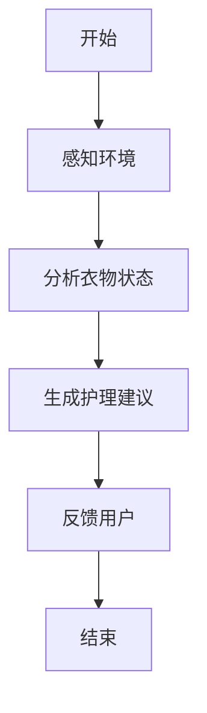
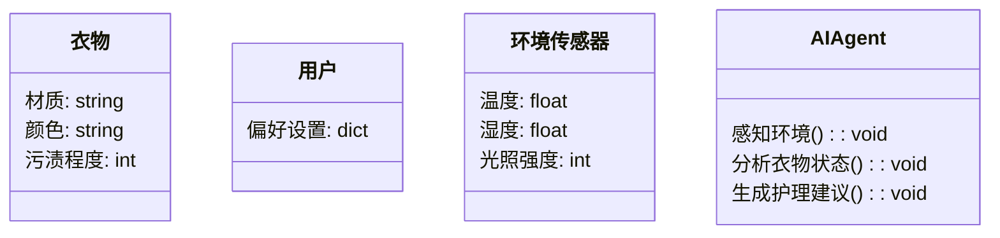
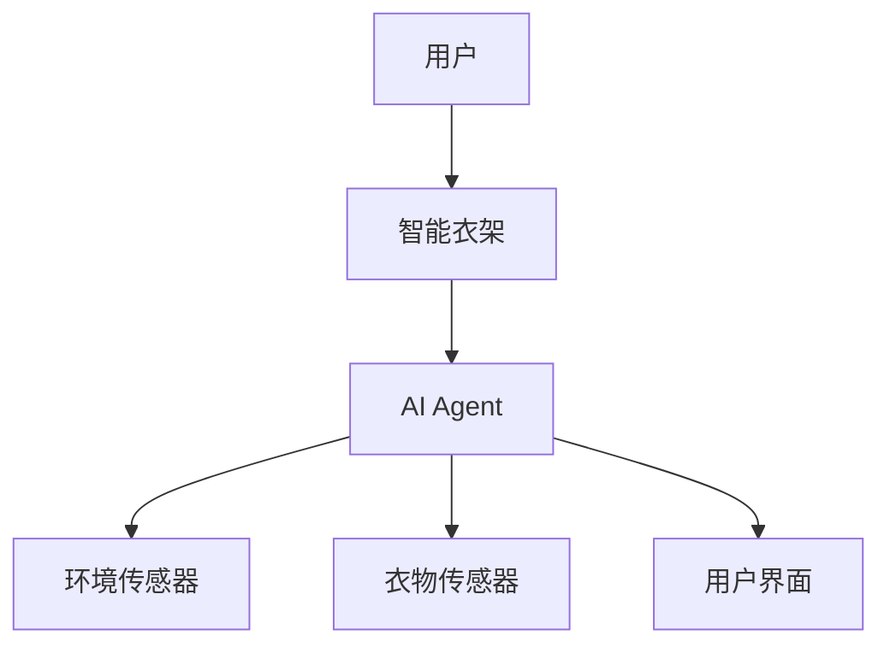
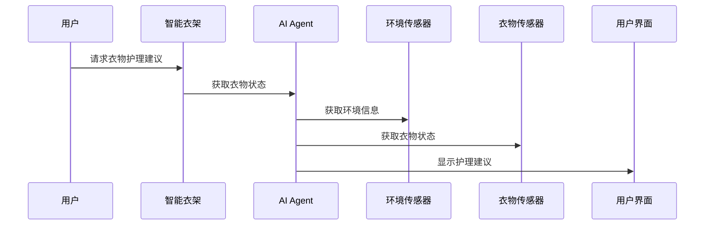

                 


# AI Agent在智能衣架中的衣物护理建议

## 关键词
智能衣架, AI Agent, 衣物护理, 人工智能, 物联网

## 摘要
本文深入探讨了AI Agent在智能衣架中的应用，重点分析了AI Agent如何通过感知环境、分析衣物状态和生成护理建议，帮助用户实现智能化的衣物管理。文章从背景介绍、核心概念、算法原理、系统架构、项目实战到最佳实践，全面阐述了AI Agent在智能衣架中的实现过程和应用场景。

---

## 第1章: 背景介绍

### 1.1 问题背景
#### 1.1.1 智能衣架的发展现状
智能衣架作为智能家居的一部分，近年来随着物联网技术的发展逐渐普及。传统的衣架功能单一，仅用于悬挂衣物，而智能衣架通过集成传感器、通信模块和AI技术，能够实现衣物的智能管理和护理。

#### 1.1.2 衣物护理中的常见问题
衣物护理涉及多个环节，包括清洗、晾晒、存放等。用户在衣物护理中常常面临以下问题：
1. **衣物材质复杂**：不同材质的衣物需要不同的护理方法，用户难以记忆和区分。
2. **环境因素影响**：温度、湿度等环境因素会影响衣物的保存，用户难以实时掌握。
3. **护理知识不足**：用户缺乏专业的衣物护理知识，容易导致衣物损坏。

#### 1.1.3 AI Agent在衣物护理中的应用潜力
AI Agent（人工智能代理）是一种能够感知环境、自主决策并执行任务的智能体。通过集成AI Agent，智能衣架能够实时感知衣物状态，分析环境信息，并提供个性化的护理建议，从而提升衣物护理的效果。

### 1.2 问题描述
#### 1.2.1 衣物护理的核心需求
衣物护理的核心需求包括：
1. **实时感知衣物状态**：包括衣物的材质、颜色、污渍等信息。
2. **环境信息监测**：包括温度、湿度、光照等环境因素。
3. **个性化护理建议**：根据衣物状态和环境信息，提供定制化的护理建议。

#### 1.2.2 用户在衣物护理中的痛点
1. **信息不对称**：用户难以获取专业的衣物护理知识。
2. **操作复杂**：传统衣物护理需要用户手动操作，流程繁琐。
3. **缺乏实时反馈**：用户无法实时了解衣物的护理状态。

#### 1.2.3 AI Agent如何解决衣物护理问题
AI Agent通过实时感知衣物状态和环境信息，利用机器学习算法生成个性化的护理建议，并通过用户界面提供反馈。这种方式能够简化用户的操作流程，提升衣物护理的效果。

### 1.3 问题解决
#### 1.3.1 AI Agent的基本概念
AI Agent是一种能够感知环境、自主决策并执行任务的智能体。它能够通过传感器获取环境信息，利用算法进行分析和决策，并通过执行器完成任务。

#### 1.3.2 AI Agent在智能衣架中的功能定位
在智能衣架中，AI Agent的主要功能包括：
1. **感知衣物状态**：通过传感器获取衣物的材质、颜色、污渍等信息。
2. **环境信息监测**：监测温度、湿度、光照等环境因素。
3. **生成护理建议**：基于衣物状态和环境信息，生成个性化的护理建议。

#### 1.3.3 AI Agent与智能衣架的结合方式
AI Agent与智能衣架的结合方式包括：
1. **硬件集成**：将AI Agent的感知和执行模块集成到智能衣架的硬件中。
2. **软件集成**：通过物联网平台将AI Agent的算法与智能衣架的软件系统结合。

### 1.4 边界与外延
#### 1.4.1 AI Agent在智能衣架中的应用边界
AI Agent在智能衣架中的应用边界包括：
1. **功能范围**：仅限于衣物护理相关的任务，不涉及其他智能家居功能。
2. **数据范围**：仅处理与衣物护理相关的数据，不涉及其他数据。

#### 1.4.2 衣物护理建议的范围界定
衣物护理建议的范围包括：
1. **清洗建议**：根据衣物材质和污渍程度，推荐清洗方式和洗涤剂。
2. **晾晒建议**：根据环境湿度和温度，推荐晾晒时间和方式。
3. **存放建议**：根据衣物材质和环境条件，推荐存放方式。

#### 1.4.3 AI Agent与其他智能设备的协同关系
AI Agent可以与其他智能设备（如智能洗衣机、智能晾衣架）协同工作，共同完成衣物的全生命周期管理。

### 1.5 概念结构与核心要素组成
#### 1.5.1 AI Agent的核心要素
AI Agent的核心要素包括：
1. **感知模块**：用于获取环境信息。
2. **决策模块**：用于分析信息并生成决策。
3. **执行模块**：用于执行决策任务。

#### 1.5.2 智能衣架的系统架构
智能衣架的系统架构包括：
1. **硬件部分**：包括传感器、通信模块和执行器。
2. **软件部分**：包括AI Agent算法和用户界面。

#### 1.5.3 衣物护理建议的实现流程
衣物护理建议的实现流程包括：
1. **感知衣物状态**：通过传感器获取衣物的材质、颜色、污渍等信息。
2. **环境信息监测**：监测温度、湿度、光照等环境因素。
3. **生成护理建议**：根据衣物状态和环境信息，生成个性化的护理建议。

---

## 第2章: 核心概念与联系

### 2.1 AI Agent的核心原理
#### 2.1.1 AI Agent的基本原理
AI Agent通过感知环境、分析信息、生成决策并执行任务，实现智能化的衣物护理。其核心原理包括：
1. **感知**：通过传感器获取环境信息。
2. **分析**：利用机器学习算法分析信息。
3. **决策**：根据分析结果生成护理建议。
4. **执行**：通过执行器完成任务。

#### 2.1.2 AI Agent的感知、决策与执行模块
AI Agent的感知模块通过传感器获取环境信息，决策模块通过机器学习算法生成护理建议，执行模块通过执行器完成任务。

#### 2.1.3 AI Agent与传统算法的对比
| 比较维度 | AI Agent | 传统算法 |
|----------|----------|----------|
| 输入方式 | 实时感知 | 预设规则 |
| 决策方式 | 自主学习 | 程序控制 |
| 输出方式 | 动态反馈 | 固定输出 |

### 2.2 AI Agent与智能衣架的关系
#### 2.2.1 AI Agent在智能衣架中的角色
AI Agent在智能衣架中扮演感知和决策的角色，通过实时感知衣物状态和环境信息，生成个性化的护理建议。

#### 2.2.2 AI Agent与智能衣架的交互方式
AI Agent与智能衣架的交互方式包括：
1. **数据交互**：AI Agent通过传感器获取衣物状态和环境信息。
2. **反馈交互**：AI Agent通过用户界面向用户反馈护理建议。

#### 2.2.3 AI Agent对衣物护理的影响
AI Agent通过实时感知和分析，能够提供更精准、个性化的护理建议，提升衣物的使用寿命和护理效果。

### 2.3 ER实体关系图
```mermaid
er
    衣物
    用户
    智能衣架
    环境传感器
    AI Agent
    衣物护理建议
    衣物状态
    用户反馈
    系统日志
```

---

## 第3章: 算法原理讲解

### 3.1 AI Agent的算法流程


### 3.2 AI Agent的感知模型
感知模型用于获取衣物的状态和环境信息，包括：
1. **衣物材质**：通过传感器检测衣物的材质类型。
2. **衣物颜色**：通过颜色传感器检测衣物的颜色。
3. **衣物污渍**：通过污渍传感器检测衣物的污渍程度。

### 3.3 AI Agent的决策模型
决策模型基于感知到的信息，生成个性化的护理建议，包括：
1. **清洗建议**：根据衣物材质和污渍程度，推荐清洗方式和洗涤剂。
2. **晾晒建议**：根据环境湿度和温度，推荐晾晒时间和方式。
3. **存放建议**：根据衣物材质和环境条件，推荐存放方式。

### 3.4 AI Agent的数学模型
#### 3.4.1 感知模型的数学表达
$$
\text{衣物状态} = f(\text{衣物材质}, \text{衣物颜色}, \text{衣物污渍})
$$

#### 3.4.2 决策模型的数学表达
$$
\text{护理建议} = g(\text{衣物状态}, \text{环境信息})
$$

### 3.5 AI Agent的实现代码
```python
import numpy as np
from sklearn import tree

# 感知模型
def感知衣物状态(衣物材质, 衣物颜色, 衣物污渍):
    # 实现感知逻辑
    pass

# 决策模型
def生成护理建议(衣物状态, 环境信息):
    # 实现决策逻辑
    pass
```

---

## 第4章: 系统分析与架构设计

### 4.1 问题场景介绍
智能衣架通过集成AI Agent，能够实时感知衣物状态和环境信息，生成个性化的护理建议。系统需要具备感知、分析、决策和反馈功能。

### 4.2 系统功能设计
#### 4.2.1 领域模型


#### 4.2.2 系统架构


### 4.3 系统接口设计
#### 4.3.1 接口设计
1. **感知接口**：AI Agent通过环境传感器和衣物传感器获取环境信息和衣物状态。
2. **决策接口**：AI Agent通过算法生成护理建议。
3. **反馈接口**：用户通过用户界面获取护理建议。

#### 4.3.2 交互流程图


---

## 第5章: 项目实战

### 5.1 环境搭建
1. **硬件环境**：需要智能衣架、环境传感器、衣物传感器等硬件设备。
2. **软件环境**：需要安装Python、机器学习库（如scikit-learn）等。

### 5.2 核心代码实现
```python
import numpy as np
from sklearn.tree import DecisionTreeClassifier

# 数据预处理
X = np.array([[1, '棉', '白色', 0], [2, '羊毛', '黑色', 1]])
y = np.array(['手洗', '机洗'])

# 训练决策树模型
clf = DecisionTreeClassifier()
clf.fit(X, y)

# 预测新的样本
new_sample = np.array([[3, '丝绸', '浅蓝色', 2]])
print(clf.predict(new_sample))
```

### 5.3 代码解读与分析
1. **数据预处理**：将衣物的材质、颜色和污渍程度等特征进行编码，构建特征矩阵。
2. **模型训练**：使用决策树算法训练模型，生成分类器。
3. **模型预测**：通过模型预测新的衣物样本的护理方式。

### 5.4 实际案例分析
假设有一件丝绸材质的浅蓝色衣物，污渍程度为2，AI Agent会根据训练好的模型，生成“手洗”的护理建议。

### 5.5 项目小结
通过实际案例分析，展示了AI Agent在智能衣架中的应用效果。AI Agent能够根据衣物状态和环境信息，生成个性化的护理建议，提升衣物的使用寿命和护理效果。

---

## 第6章: 最佳实践

### 6.1 小结
AI Agent在智能衣架中的应用，通过实时感知衣物状态和环境信息，生成个性化的护理建议，显著提升了衣物护理的效果和用户体验。

### 6.2 注意事项
1. **数据隐私**：在实际应用中，需要注意用户数据的隐私保护。
2. **模型优化**：需要不断优化AI Agent的算法模型，提升其准确性和响应速度。
3. **用户体验**：在设计用户界面时，需要考虑用户体验，确保用户能够方便地使用AI Agent提供的护理建议。

### 6.3 拓展阅读
1. **机器学习算法**：深入学习决策树、随机森林等机器学习算法，优化AI Agent的决策模型。
2. **物联网技术**：研究物联网技术在智能衣架中的应用，提升系统的智能化水平。
3. **人工智能前沿**：关注人工智能领域的最新研究，探索AI Agent在智能衣架中的更多应用场景。

---

## 总结
本文详细探讨了AI Agent在智能衣架中的衣物护理建议，从背景介绍、核心概念、算法原理到系统架构和项目实战，全面阐述了AI Agent在智能衣架中的实现过程和应用场景。通过实际案例分析和最佳实践，展示了AI Agent在智能衣架中的巨大潜力和实际价值。未来，随着人工智能和物联网技术的不断发展，AI Agent在智能衣架中的应用将更加广泛，为用户提供更加智能化、个性化的衣物护理服务。

