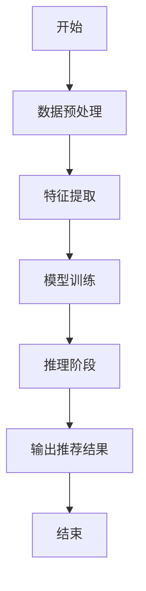
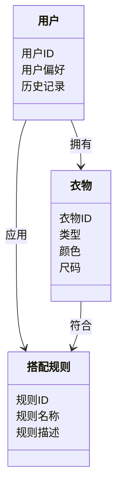
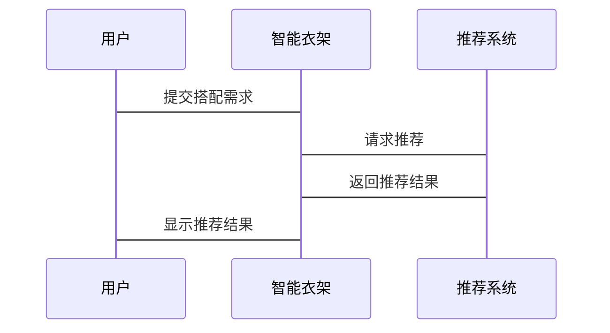

                 


# AI Agent在智能衣架中的衣物搭配建议

> 关键词：AI Agent，智能衣架，衣物搭配，推荐算法，系统架构

> 摘要：本文探讨了AI Agent在智能衣架中的应用，详细介绍了AI Agent的核心原理、算法实现、系统架构设计以及实际项目案例。通过分析AI Agent如何感知、推理和执行衣物搭配任务，展示了其在提升用户体验和优化衣物搭配效率方面的重要作用。

---

# 目录

1. **AI Agent在智能衣架中的背景与概念**
   - 1.1 AI Agent的基本概念
   - 1.2 智能衣架的定义与特点
   - 1.3 AI Agent在衣物搭配中的作用

2. **AI Agent的核心概念与联系**
   - 2.1 AI Agent的基本原理
   - 2.2 AI Agent的核心算法
   - 2.3 AI Agent与智能衣架的实体关系

3. **AI Agent的算法原理讲解**
   - 3.1 数据预处理与特征提取
   - 3.2 推荐算法实现
   - 3.3 数学模型与公式

4. **系统分析与架构设计方案**
   - 4.1 系统功能设计
   - 4.2 系统架构设计
   - 4.3 系统接口与交互设计

5. **项目实战：基于AI Agent的智能衣架衣物搭配系统**
   - 5.1 项目背景与目标
   - 5.2 核心代码实现
   - 5.3 实际案例分析

6. **总结与展望**
   - 6.1 项目总结
   - 6.2 未来展望
   - 6.3 注意事项与建议

---

## 第1章: AI Agent在智能衣架中的背景与概念

### 1.1 AI Agent的基本概念

AI Agent（人工智能代理）是一种能够感知环境、自主决策并执行任务的智能实体。在智能衣架的应用中，AI Agent主要负责根据用户的衣橱数据和搭配需求，提供个性化的衣物搭配建议。

#### 1.1.1 什么是AI Agent
AI Agent是一种能够通过感知环境信息、推理问题解决方案并执行相应操作的智能系统。它可以基于规则、机器学习或深度学习等方法实现不同的功能。

#### 1.1.2 AI Agent的核心特点
- **自主性**：AI Agent能够自主决策，无需人工干预。
- **反应性**：能够实时感知环境变化并做出反应。
- **学习能力**：通过数据和经验不断优化自身的推荐算法。

#### 1.1.3 AI Agent在智能衣架中的应用背景
随着人工智能技术的快速发展，AI Agent在服装搭配领域的应用越来越广泛。通过AI Agent，用户可以轻松获得个性化的衣物搭配建议，提升穿衣效率和时尚感。

### 1.2 智能衣架的定义与特点

#### 1.2.1 智能衣架的定义
智能衣架是一种结合了物联网和人工智能技术的智能设备，能够通过传感器和AI算法帮助用户进行衣物管理、搭配和推荐。

#### 1.2.2 智能衣架的核心功能
- **衣物识别**：通过图像识别技术自动识别衣物的款式、颜色和材质。
- **搭配推荐**：基于AI Agent算法，为用户提供个性化的搭配建议。
- **数据管理**：记录用户的衣橱数据，支持数据分析和优化。

#### 1.2.3 智能衣架与传统衣架的区别
智能衣架通过AI技术实现了衣物的智能化管理，而传统衣架仅作为衣物悬挂工具，不具备智能化功能。

### 1.3 AI Agent在衣物搭配中的作用

#### 1.3.1 AI Agent如何帮助用户搭配衣物
AI Agent通过分析用户的衣橱数据和搭配需求，推荐合适的衣物组合，帮助用户快速找到合适的搭配方案。

#### 1.3.2 AI Agent在智能衣架中的具体应用场景
- **日常搭配推荐**：根据用户的穿衣习惯和天气情况，推荐合适的衣物组合。
- **时尚搭配建议**：结合最新的时尚趋势，为用户提供创新的搭配方案。
- **衣橱优化建议**：根据用户的衣橱数据，推荐购买适合的衣物，避免重复购买。

#### 1.3.3 AI Agent的优势与局限性
- **优势**：高效、精准、个性化。
- **局限性**：依赖数据质量和算法模型的准确性。

---

## 第2章: AI Agent的核心概念与联系

### 2.1 AI Agent的基本原理

#### 2.1.1 AI Agent的感知模块
感知模块负责采集环境信息，包括用户的衣橱数据和当前天气情况等。

#### 2.1.2 AI Agent的推理模块
推理模块基于感知到的信息，利用推荐算法生成衣物搭配方案。

#### 2.1.3 AI Agent的执行模块
执行模块将推理结果反馈给用户，并通过智能衣架展示推荐的搭配方案。

### 2.2 AI Agent的核心算法

#### 2.2.1 基于规则的AI Agent
基于预设的规则进行衣物搭配，适合简单的搭配需求。

#### 2.2.2 基于机器学习的AI Agent
利用机器学习模型（如协同过滤、聚类分析）进行推荐，能够处理复杂的搭配需求。

#### 2.2.3 基于深度学习的AI Agent
通过深度学习模型（如神经网络）进行推荐，能够捕捉衣物之间的复杂关系。

### 2.3 AI Agent与智能衣架的实体关系

```mermaid
er
  %% AI Agent与智能衣架的实体关系图
  entity 用户 {
    key 用户ID
    属性 用户偏好
    属性 历史搭配记录
  }
  entity 衣物 {
    key 衣物ID
    属性 类型
    属性 颜色
    属性 尺码
  }
  entity 搭配规则 {
    key 规则ID
    属性 规则名称
    属性 规则描述
  }
  用户 --> 搭配规则: 选择搭配规则
  衣物 --> 搭配规则: 应用搭配规则
```

---

## 第3章: AI Agent的算法原理讲解

### 3.1 数据预处理与特征提取

#### 3.1.1 数据预处理
- 数据清洗：去除冗余数据和异常值。
- 数据归一化：将不同量纲的数据转换为统一尺度。

#### 3.1.2 特征提取
- 提取衣物的属性特征，如颜色、类型、尺码等。

### 3.2 推荐算法实现

#### 3.2.1 基于协同过滤的推荐算法

```python
import numpy as np
from sklearn.metrics import pairwise_distances

# 示例数据：用户-物品评分矩阵
users = ['User1', 'User2', 'User3']
items = ['T-shirt', 'Jeans', 'Sneakers']
user_item_matrix = np.array([
    [4, 3, 2],
    [5, 1, 4],
    [2, 5, 3]
])

# 计算物品相似度矩阵
item_similarity = pairwise_distances(user_item_matrix.T, metric='cosine')

# 定义推荐函数
def recommend(user_id, item_id, similarity_matrix):
    user_index = np.where(users == user_id)[0][0]
    item_index = np.where(items == item_id)[0][0]
    similar_items = np.argsort(similarity_matrix[item_index])[::-1]
    return similar_items

# 示例推荐
user_id = 'User1'
item_id = 'Jeans'
recommend(user_id, item_id, item_similarity)
```

#### 3.2.2 算法流程图



### 3.3 数学模型与公式

#### 3.3.1 余弦相似度
$$ \text{余弦相似度} = \frac{\sum_{i=1}^{n} x_i y_i}{\sqrt{\sum_{i=1}^{n} x_i^2} \cdot \sqrt{\sum_{i=1}^{n} y_i^2}} $$

#### 3.3.2 欧氏距离
$$ \text{欧氏距离} = \sqrt{\sum_{i=1}^{n} (x_i - y_i)^2} $$

---

## 第4章: 系统分析与架构设计方案

### 4.1 系统功能设计

#### 4.1.1 领域模型



### 4.2 系统架构设计

#### 4.2.1 系统架构图


### 4.3 系统接口与交互设计

#### 4.3.1 系统接口设计
- 用户接口：接收用户的搭配需求。
- 数据接口：与衣物数据库进行交互。

#### 4.3.2 交互流程图



---

## 第5章: 项目实战：基于AI Agent的智能衣架衣物搭配系统

### 5.1 项目背景与目标

#### 5.1.1 项目背景
通过AI Agent技术实现智能衣架的衣物搭配功能，提升用户体验。

#### 5.1.2 项目目标
开发一个能够根据用户需求推荐衣物搭配的智能衣架系统。

### 5.2 核心代码实现

#### 5.2.1 环境安装
```bash
pip install numpy scikit-learn matplotlib
```

#### 5.2.2 核心代码

```python
from sklearn.metrics.pairwise import cosine_similarity
import numpy as np

# 示例数据
clothes = {
    'T-shirt': {'type': '上衣', 'color': '白色', 'size': 'L'},
    'Jeans': {'type': '下装', 'color': '蓝色', 'size': '32'},
    'Sneakers': {'type': '鞋子', 'color': '黑色', 'size': '39'}
}

# 推荐算法
def recommend_clothes(user_preference):
    # 提取特征
    features = [v['type'] for k, v in clothes.items()]
    # 计算相似度
    similarity_matrix = cosine_similarity(features)
    # 返回推荐结果
    return similarity_matrix

# 示例推荐
user_preference = 'T-shirt'
print(recommend_clothes(user_preference))
```

### 5.3 实际案例分析

#### 5.3.1 案例背景
用户衣橱中有白色T-shirt、蓝色Jeans和黑色Sneakers。

#### 5.3.2 推荐过程
AI Agent根据用户的衣橱数据，推荐合适的搭配方案。

#### 5.3.3 推荐结果
- 白色T-shirt搭配蓝色Jeans和黑色Sneakers。

---

## 第6章: 总结与展望

### 6.1 项目总结
通过AI Agent技术，智能衣架能够为用户提供高效的衣物搭配建议，显著提升用户体验。

### 6.2 未来展望
未来可以进一步优化推荐算法，结合更多的时尚元素，提供更精准的搭配建议。

### 6.3 注意事项与建议
在实际应用中，需要注意数据隐私和算法的可解释性问题。

---

## 结语

AI Agent在智能衣架中的应用前景广阔，随着技术的不断发展，未来的衣物搭配将更加智能化和个性化。

--- 

希望这篇文章能满足您的需求！如果需要进一步调整或补充，请随时告诉我。

