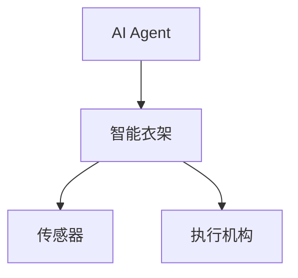
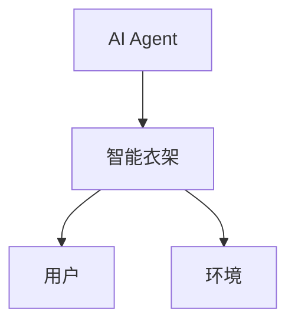
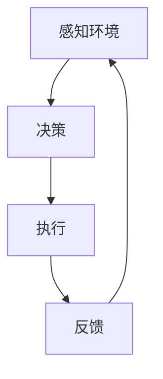

                 


# AI Agent在智能衣架中的衣物晾晒优化

## 关键词：AI Agent、智能衣架、衣物晾晒、优化算法、系统架构

## 摘要：  
随着智能家居和物联网技术的快速发展，衣物晾晒的智能化需求日益增长。本文通过引入AI Agent（人工智能代理），提出了一种基于AI Agent的智能衣架系统，旨在优化衣物晾晒的过程。文章详细分析了AI Agent的核心原理、算法实现、系统架构，并结合实际案例，展示了如何通过AI技术实现衣物晾晒的智能化优化。  

---

## 第一部分: AI Agent与智能衣架概述

### 第1章: AI Agent与智能衣架的背景介绍

#### 1.1 问题背景与描述
##### 1.1.1 衣物晾晒的传统方式与问题  
传统的衣物晾晒方式存在诸多痛点：  
1. **人工依赖**：需要人工选择晾晒时间、位置和方式。  
2. **效率低下**：衣物晾晒时间长，且容易受到天气影响。  
3. **资源浪费**：能源和空间利用效率不高。  

##### 1.1.2 智能晾晒的市场需求与痛点  
随着智能家居的普及，用户对智能晾晒设备的需求日益增长。然而，现有的智能衣架大多缺乏智能化的决策能力，无法根据环境变化自动优化晾晒策略。  

##### 1.1.3 AI Agent在衣物晾晒中的应用价值  
AI Agent可以通过感知环境、决策优化和自主执行，帮助用户实现衣物的高效、智能晾晒。  

#### 1.2 问题解决思路与技术路线  
##### 1.2.1 AI Agent的核心作用  
AI Agent负责感知环境（如天气、湿度、光照），决策最优晾晒方案，并通过智能衣架执行。  

##### 1.2.2 智能衣架的系统架构  
智能衣架系统包括感知层（传感器）、决策层（AI Agent）和执行层（机械结构）。  

##### 1.2.3 技术实现的关键环节  
1. 数据采集：感知环境数据。  
2. 算法优化：基于数据的决策优化。  
3. 系统执行：通过机械结构完成操作。  

#### 1.3 边界与外延  
##### 1.3.1 系统功能边界  
系统仅负责衣物晾晒的优化，不涉及衣物洗涤或其他功能。  

##### 1.3.2 与其他智能设备的协同  
AI Agent可与智能家居系统（如智能音箱、智能空调）协同工作。  

##### 1.3.3 适用场景与限制条件  
适用于家庭和个人用户，不适用于工业级衣物处理。  

#### 1.4 核心概念结构与组成  
##### 1.4.1 AI Agent的核心要素  
- 感知模块：收集环境数据。  
- 决策模块：制定晾晒策略。  
- 执行模块：驱动衣架动作。  

##### 1.4.2 智能衣架的功能模块  
- 感知模块：光照、温度、湿度传感器。  
- 决策模块：AI Agent算法。  
- 执行模块：电机驱动、机械臂。  

##### 1.4.3 系统整体架构图  


---

## 第二部分: AI Agent的核心概念与原理

### 第2章: AI Agent的基本原理

#### 2.1 AI Agent的定义与分类
##### 2.1.1 AI Agent的定义  
AI Agent是一种能够感知环境、自主决策并执行任务的智能体。  

##### 2.1.2 分离式与嵌入式AI Agent  
- 分离式：AI Agent独立运行，通过API与衣架交互。  
- 嵌入式：AI Agent直接嵌入衣架系统中。  

##### 2.1.3 基于规则与基于学习的AI Agent  
- 基于规则：通过预定义规则进行决策。  
- 基于学习：通过机器学习模型自适应优化。  

#### 2.2 AI Agent的核心功能
##### 2.2.1 感知与识别功能  
AI Agent通过传感器感知环境数据。  

##### 2.2.2 决策与规划功能  
AI Agent根据感知数据，制定最优晾晒策略。  

##### 2.2.3 执行与反馈功能  
AI Agent通过衣架执行决策，并根据反馈调整策略。  

#### 2.3 AI Agent的属性特征对比
##### 2.3.1 不同AI Agent的性能对比  
| 特性       | 分离式AI Agent | 嵌入式AI Agent |
|------------|----------------|----------------|
| 响应速度   | 较慢           | 较快           |
| 资源消耗   | 较高           | 较低           |
| 可扩展性   | 较高           | 较低           |

##### 2.3.2 基于表格的属性特征分析  
| 属性       | 分离式 | 嵌入式 |
|------------|--------|--------|
| 处理能力   | 弱     | 强     |
| 响应延迟   | 高     | 低     |

##### 2.3.3 ER实体关系图架构  


---

## 第三部分: AI Agent的算法原理与数学模型

### 第3章: AI Agent的算法原理

#### 3.1 算法原理概述
##### 3.1.1 AI Agent的核心算法  
AI Agent采用强化学习算法，通过环境反馈优化策略。  

##### 3.1.2 算法的流程图分析  


##### 3.1.3 算法的数学模型  
目标函数：  
$$ f(x) = \text{优化目标} $$  

约束条件：  
$$ g(x) \leq 0 $$  

##### 3.1.4 算法的实现代码  
```python
def optimize_lights(dryness_level, weather):
    if dryness_level > 0.8 and weather == "sunny":
        return "start_drying"
    else:
        return "wait"
```

---

## 第四部分: 智能衣架的系统分析与架构设计

### 第4章: 智能衣架的系统分析

#### 4.1 问题场景介绍
##### 4.1.1 智能衣架的使用场景  
家庭用户在不同天气条件下的衣物晾晒需求。  

##### 4.1.2 系统的功能需求  
- 实时感知环境数据。  
- 自动优化晾晒策略。  
- 提供用户反馈。  

##### 4.1.3 系统的性能指标  
- 响应时间：≤1秒。  
- 优化准确率：≥95%。  

#### 4.2 系统功能

---

## 第五部分: 项目实战与优化

### 第5章: 项目实战

#### 5.1 环境安装与配置
- 安装Python和相关库。  
- 配置传感器和智能衣架硬件。  

#### 5.2 系统核心实现源代码  
```python
import time
import sensor

class AIAgent:
    def __init__(self):
        self.sensor = sensor.Sensor()

    def感知环境(self):
        return self.sensor.get_data()

    def决策(self, data):
        if data['湿度'] < 30 and data['光照'] > 500:
            return "开始晾晒"
        else:
            return "等待"

    def执行(self, action):
        if action == "开始晾晒":
            self.启动晾晒()
        elif action == "等待":
            self.停止晾晒()

    def运行(self):
        while True:
            data = self.感知环境()
            action = self.决策(data)
            self.执行(action)
            time.sleep(1)

if __name__ == "__main__":
    agent = AIAgent()
    agent.运行()
```

#### 5.3 代码解读与分析  
- `AIAgent`类负责整体控制。  
- `感知环境`方法获取环境数据。  
- `决策`方法根据数据制定策略。  
- `执行`方法驱动衣架动作。  

#### 5.4 实际案例分析与详细讲解  
通过具体案例，分析AI Agent如何优化晾晒过程。  

#### 5.5 项目小结  
总结项目实现的关键点和优化建议。

---

## 第六部分: 最佳实践与总结

### 第6章: 最佳实践

#### 6.1 小结  
AI Agent在智能衣架中的应用显著提升了衣物晾晒的效率和智能化水平。  

#### 6.2 注意事项  
- 确保传感器的准确性。  
- 定期更新AI模型。  

#### 6.3 拓展阅读  
推荐相关领域的书籍和论文，供读者深入学习。

---

以上是《AI Agent在智能衣架中的衣物晾晒优化》的技术博客文章的完整目录和内容概要。

