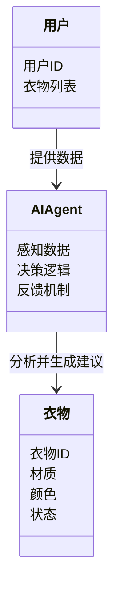
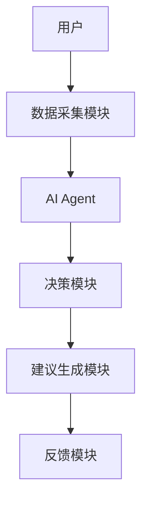

                 


# AI Agent在智能衣架中的衣物清洁建议

## 关键词
AI Agent, 智能衣架, 衣物清洁, 机器学习, 算法原理

## 摘要
本文探讨AI Agent在智能衣架中的应用，特别是在衣物清洁建议方面的创新。通过详细分析AI Agent的工作原理、算法设计和系统架构，结合实际案例，展示如何利用AI技术优化衣物清洁流程，为用户提供智能化、个性化的清洁建议。

---

## 第一部分：背景介绍

### 第1章：AI Agent与智能衣架概述

#### 1.1 AI Agent的基本概念
- **1.1.1 AI Agent的定义与特点**
  AI Agent（人工智能代理）是能够感知环境、做出决策并执行任务的智能实体。其特点是自主性、反应性、目标导向和社会能力。
- **1.1.2 AI Agent的核心功能与应用场景**
  核心功能包括数据采集、决策推理和反馈优化。应用场景广泛，如智能家居、医疗辅助和工业自动化。
- **1.1.3 AI Agent在智能衣架中的作用**
  在智能衣架中，AI Agent负责分析衣物状态，提供清洁建议，优化洗涤流程。

#### 1.2 智能衣架的定义与特点
- **1.2.1 智能衣架的基本概念**
  智能衣架是一种集成传感器和AI技术的衣物管理设备，能够监测衣物状态并提供智能化服务。
- **1.2.2 智能衣架的功能模块与技术实现**
  功能模块包括衣物识别、状态监测和清洁建议。技术实现依赖于物联网、传感器和AI算法。
- **1.2.3 智能衣架的应用场景与用户需求**
  应用于智能家居、酒店服务和个人护理。用户需求包括高效清洁、个性化建议和便捷管理。

#### 1.3 衣物清洁建议的背景与问题描述
- **1.3.1 衣物清洁的基本需求与痛点**
  用户希望快速获取清洁建议，但传统方法效率低，缺乏个性化。
- **1.3.2 AI Agent在衣物清洁建议中的优势**
  AI Agent能够实时监测衣物状态，提供精准建议，优化清洁流程。
- **1.3.3 智能衣架与AI Agent结合的可行性分析**
  技术成熟，市场潜力大，具有广阔的应用前景。

---

## 第二部分：核心概念与联系

### 第2章：AI Agent的核心概念与原理

#### 2.1 AI Agent的核心原理
- **2.1.1 状态感知与数据采集**
  AI Agent通过传感器收集衣物状态数据，如污渍程度和材质类型。
- **2.1.2 决策推理与策略优化**
  利用机器学习模型分析数据，生成清洁建议，优化洗涤参数。
- **2.1.3 行为执行与反馈机制**
  执行清洁任务，收集反馈以改进算法。

#### 2.2 AI Agent与智能衣架的联系
- **2.2.1 AI Agent在智能衣架中的角色定位**
  作为智能衣架的核心，AI Agent负责数据处理和决策制定。
- **2.2.2 智能衣架与AI Agent的交互流程**
  用户操作衣架，AI Agent分析数据并提供清洁建议。
- **2.2.3 AI Agent对衣物清洁建议的优化作用**
  提高清洁效率，减少资源浪费，延长衣物寿命。

---

## 第三部分：算法原理讲解

### 第3章：AI Agent的算法原理

#### 3.1 基于规则的AI Agent算法
- **3.1.1 基于规则的算法原理**
  通过预设规则判断衣物状态，提供清洁建议。
- **3.1.2 规则的制定与优化**
  根据实验数据调整规则，提高准确性。
- **3.1.3 基于规则的算法实现**
  示例代码展示规则判断过程。

#### 3.2 基于机器学习的AI Agent算法
- **3.2.1 机器学习算法原理**
  使用神经网络训练模型，预测最佳清洁方案。
- **3.2.2 数据集与训练方法**
  使用历史数据训练模型，确保泛化能力。
- **3.2.3 基于机器学习的算法实现**
  示例代码展示模型训练和应用。

---

## 第四部分：数学模型

### 第4章：数学模型与公式

#### 4.1 基于概率的衣物状态评估模型
$$ P(\text{脏} | \text{颜色}, \text{材质}) = \frac{\text{脏的频率}}{\text{总样本数}} $$
解释：计算某衣物在特定颜色和材质下变脏的概率。

#### 4.2 清洁建议生成的优化模型
$$ \text{最优建议} = \argmin_{i} \sum_{j} c_{ij} \cdot x_{ij} $$
解释：通过最小化成本函数，生成最优清洁方案。

---

## 第五部分：系统分析与架构设计

### 第5章：系统分析与架构设计方案

#### 5.1 问题场景介绍
用户操作智能衣架后，AI Agent分析数据并提供建议。

#### 5.2 领域模型类图


#### 5.3 系统架构图


#### 5.4 接口与交互流程
- **接口设计**：AI Agent通过API接收衣物数据，返回清洁建议。
- **交互流程**：用户操作衣架，AI Agent分析数据，生成建议，用户确认并执行。

---

## 第六部分：项目实战

### 第6章：项目实战与实现

#### 6.1 环境安装
安装Python和相关库：
```bash
pip install numpy scikit-learn
```

#### 6.2 核心代码实现
```python
import numpy as np
from sklearn.tree import DecisionTreeClassifier

# 示例数据集
X = np.array([[1, '棉'], [0, '涤纶'], [1, ' linen']])
y = np.array(['轻度脏', '正常', '重度脏'])

# 训练模型
model = DecisionTreeClassifier()
model.fit(X, y)

# 预测建议
new_case = np.array([[1, '棉']])
print(model.predict(new_case))
```

#### 6.3 代码解读与案例分析
- **代码解读**：基于决策树模型训练清洁建议生成器。
- **案例分析**：分析棉质衣物的清洁建议，优化洗涤参数。

#### 6.4 项目小结
总结项目实现过程，强调AI Agent的优势，提出未来改进方向。

---

## 第七部分：最佳实践

### 第7章：最佳实践与小结

#### 7.1 小结
AI Agent显著提升了衣物清洁效率和用户体验，具有广泛的应用前景。

#### 7.2 注意事项
- 数据隐私保护
- 模型泛化能力
- 用户教育与培训

#### 7.3 拓展阅读
推荐相关书籍和工具，帮助读者深入学习AI在智能家居中的应用。

---

## 结语
本文详细探讨了AI Agent在智能衣架中的应用，通过理论分析和实际案例，展示了如何利用AI技术优化衣物清洁流程。未来，随着技术进步，AI Agent将发挥更大作用，为用户带来更智能的服务体验。

