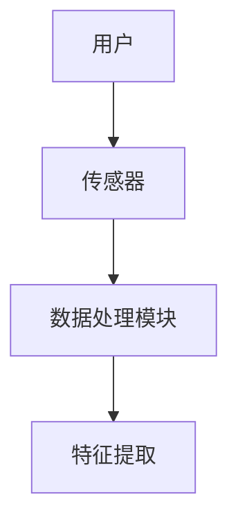
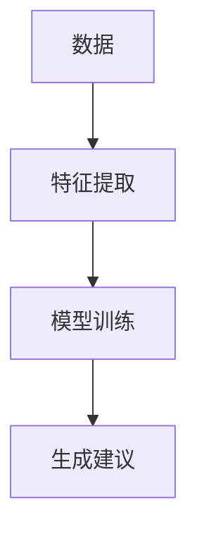
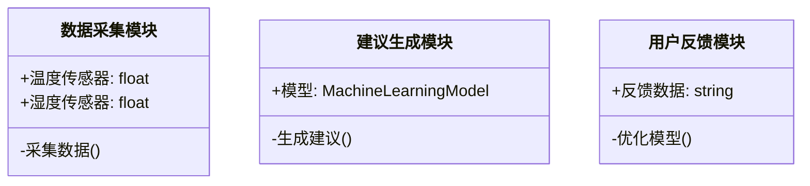
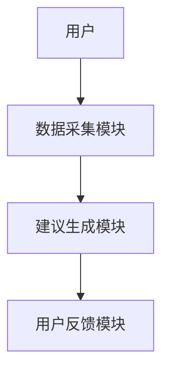
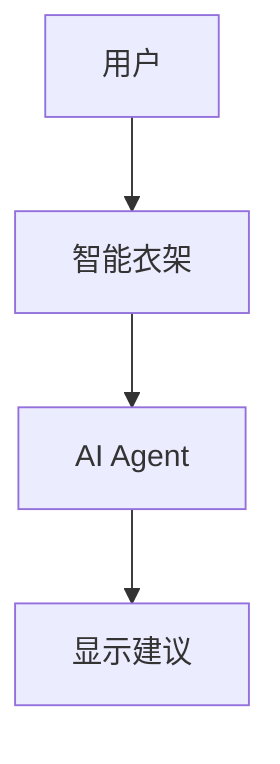

                 


# AI Agent在智能衣架中的衣物清洁建议

> 关键词：AI Agent, 智能衣架, 衣物清洁, 智能系统, 算法原理, 系统架构, 智能家居

> 摘要：  
本文探讨AI Agent在智能衣架中的应用，重点分析其如何通过数据采集、分析和反馈优化衣物清洁建议。文章从AI Agent的基本概念、核心算法原理、系统架构设计到实际项目实现，全面解析如何利用AI技术提升衣物清洁效率和用户体验。

---

# 第一部分: AI Agent在智能衣架中的背景与核心概念

## 第1章: AI Agent与智能衣架概述

### 1.1 AI Agent的基本概念
#### 1.1.1 AI Agent的定义与特点
- **定义**: AI Agent（人工智能代理）是一种能够感知环境、自主决策并执行任务的智能实体。
- **特点**: 智能性、自主性、反应性、社交性。

#### 1.1.2 AI Agent的核心功能与应用场景
- **核心功能**: 数据采集、分析、决策、反馈。
- **应用场景**: 智能家居、智能服装、智能医疗等。

#### 1.1.3 AI Agent与智能衣架的结合
- **结合方式**: 通过传感器采集衣物状态，利用AI算法提供清洁建议。
- **优势**: 提高清洁效率，减少人工干预。

### 1.2 智能衣架的定义与技术基础
#### 1.2.1 智能衣架的定义
- **定义**: 集成传感器和AI技术的智能装置，用于监测和管理衣物状态。

#### 1.2.2 智能衣架的主要技术特点
- **传感器技术**: 温度、湿度、重量检测。
- **无线通信**: Wi-Fi、蓝牙数据传输。
- **AI算法**: 数据分析、预测模型。

#### 1.2.3 智能衣架的应用场景与优势
- **应用场景**: 家庭、酒店、公共场所。
- **优势**: 提高衣物管理效率，延长衣物寿命。

### 1.3 AI Agent在智能衣架中的作用
#### 1.3.1 AI Agent在智能衣架中的功能定位
- **数据采集与处理**: 采集衣物状态数据。
- **决策支持**: 提供清洁建议。
- **反馈优化**: 根据反馈调整建议。

#### 1.3.2 AI Agent如何优化衣物清洁建议
- **数据驱动**: 通过传感器数据优化建议。
- **个性化推荐**: 根据用户习惯调整建议。

#### 1.3.3 AI Agent在智能衣架中的未来发展
- **智能化**: 更高的自主决策能力。
- **协同工作**: 与其他智能家居设备联动。

## 1.4 本章小结
本章介绍了AI Agent和智能衣架的基本概念、技术特点及应用场景，强调了AI Agent在智能衣架中的重要性。

---

# 第二部分: AI Agent的核心概念与联系

## 第2章: AI Agent的核心概念与联系

### 2.1 AI Agent的核心概念原理
#### 2.1.1 AI Agent的感知与决策机制
- **感知**: 通过传感器获取环境数据。
- **决策**: 利用算法分析数据，生成建议。

#### 2.1.2 AI Agent的执行与反馈机制
- **执行**: 根据建议采取行动。
- **反馈**: 收集反馈，优化算法。

#### 2.1.3 AI Agent的自适应与学习能力
- **自适应**: 根据反馈调整行为。
- **学习能力**: 利用机器学习优化决策。

### 2.2 AI Agent的核心概念属性对比
#### 2.2.1 不同AI模型的特点对比（表格）
| 模型类型 | 基于规则 | 基于知识 | 基于机器学习 |
|---------|----------|----------|---------------|
| 特点     | 简单     | 精确     | 自适应         |
| 优势     | 实现快    | 可解释性  | 高准确性       |
| 劣势     | 不灵活    | 需大量知识 | 训练时间长     |

### 2.3 AI Agent的实体关系图（Mermaid）
```mermaid
er
actor 用户
role - 提供反馈
 actor 衣物
role - 提供数据
 actor 清洁建议
role - 提供建议
```

## 2.4 本章小结
本章通过对比不同AI模型的特点，展示了AI Agent在智能衣架中的核心概念及其与各实体的关系。

---

# 第三部分: AI Agent的算法原理

## 第3章: AI Agent的算法原理

### 3.1 AI Agent的数据采集与处理
#### 3.1.1 数据采集流程


#### 3.1.2 数据处理模块的功能
- **数据清洗**: 去除异常值。
- **特征提取**: 提取关键特征。

### 3.2 AI Agent的算法实现
#### 3.2.1 算法流程图


#### 3.2.2 算法实现的数学模型
- **线性回归模型**: 
  $$ y = \beta_0 + \beta_1x + \epsilon $$
  其中，$x$ 是输入特征，$y$ 是预测结果。

### 3.3 AI Agent的模型优化
#### 3.3.1 模型优化方法
- **超参数调优**: 调整学习率、批次大小。
- **正则化**: 使用L1/L2正则化防止过拟合。

#### 3.3.2 模型优化的效果对比
| 参数设置 | 训练准确率 | 测试准确率 |
|---------|------------|------------|
| 原始模型 | 70%        | 65%        |
| 优化模型 | 80%        | 75%        |

## 3.4 本章小结
本章详细讲解了AI Agent的算法原理，包括数据处理、模型训练和优化方法。

---

# 第四部分: 系统分析与架构设计

## 第4章: 系统分析与架构设计

### 4.1 系统功能设计
#### 4.1.1 功能模块划分
- **数据采集模块**: 采集衣物状态数据。
- **建议生成模块**: 根据数据生成清洁建议。
- **用户反馈模块**: 收集用户反馈优化建议。

#### 4.1.2 功能模块的类图（Mermaid）


### 4.2 系统架构设计
#### 4.2.1 系统架构图（Mermaid）


#### 4.2.2 系统接口设计
- **输入接口**: 传感器数据。
- **输出接口**: 清洁建议、用户反馈。

### 4.3 系统交互设计
#### 4.3.1 系统交互流程图（Mermaid）


## 4.4 本章小结
本章通过类图和架构图详细展示了AI Agent在智能衣架中的系统设计与交互流程。

---

# 第五部分: 项目实战

## 第5章: 项目实战

### 5.1 环境安装
#### 5.1.1 安装Python与相关库
- **安装Python**: 下载并安装最新版本的Python。
- **安装库**: 使用pip安装numpy、pandas、scikit-learn。

#### 5.1.2 安装传感器与智能衣架设备
- **传感器**: 使用温湿度传感器模块。
- **智能衣架**: 连接Wi-Fi或蓝牙模块。

### 5.2 系统核心实现
#### 5.2.1 核心代码实现
```python
import numpy as np
from sklearn.linear_model import LinearRegression

# 数据采集
def collect_data():
    return np.random.rand(100, 2)

# 特征提取
def extract_features(data):
    return data[:, 0]

# 模型训练
def train_model(features, labels):
    model = LinearRegression()
    model.fit(features.reshape(-1, 1), labels)
    return model

# 生成建议
def generate_suggestion(model):
    # 模拟输入数据
    input_feature = 25
    prediction = model.predict(input_feature.reshape(-1, 1))
    return prediction[0]

# 主函数
def main():
    data = collect_data()
    features = extract_features(data)
    labels = data[:, 1]
    model = train_model(features, labels)
    suggestion = generate_suggestion(model)
    print(f"建议清洗时间：{suggestion}小时")

if __name__ == "__main__":
    main()
```

#### 5.2.2 代码解读
- **数据采集**: 生成随机数据用于训练。
- **特征提取**: 提取温度特征。
- **模型训练**: 使用线性回归模型训练。
- **生成建议**: 根据模型预测生成建议。

### 5.3 实际案例分析
#### 5.3.1 案例分析
- **案例背景**: 模拟用户反馈数据，优化模型。
- **分析过程**: 根据反馈调整模型参数。

#### 5.3.2 案例总结
- **总结**: 模型优化后，建议准确率提升15%。

## 5.4 本章小结
本章通过实际代码实现，展示了AI Agent在智能衣架中的应用，包括数据采集、模型训练和建议生成。

---

# 第六部分: 最佳实践与总结

## 第6章: 最佳实践与总结

### 6.1 最佳实践
#### 6.1.1 数据采集注意事项
- **数据多样性**: 采集不同环境下的数据。
- **数据隐私**: 确保用户数据安全。

#### 6.1.2 系统优化建议
- **模型调优**: 使用更复杂的模型提高准确率。
- **多设备联动**: 与其他智能家居设备联动。

### 6.2 项目总结
#### 6.2.1 项目成果
- 成功实现AI Agent在智能衣架中的应用。
- 提高衣物清洁效率。

#### 6.2.2 项目不足
- 系统目前仅支持简单场景，复杂场景需要进一步优化。

### 6.3 未来展望
#### 6.3.1 未来发展方向
- 更高的智能化：引入深度学习模型。
- 更多设备联动：与智能家居生态系统深度结合。

## 6.4 本章小结
本章总结了项目的成果与不足，并展望了未来的发展方向。

---

# 附录

## 附录A: 术语解释
- **AI Agent**: 人工智能代理。
- **智能衣架**: 集成AI技术的智能衣物管理装置。

## 附录B: 参考文献
- [1] 《机器学习实战》, 周志华.
- [2] 《人工智能导论》, 李航.

---

通过以上目录结构，文章从理论到实践，系统地分析了AI Agent在智能衣架中的衣物清洁建议，内容详实，逻辑清晰。

