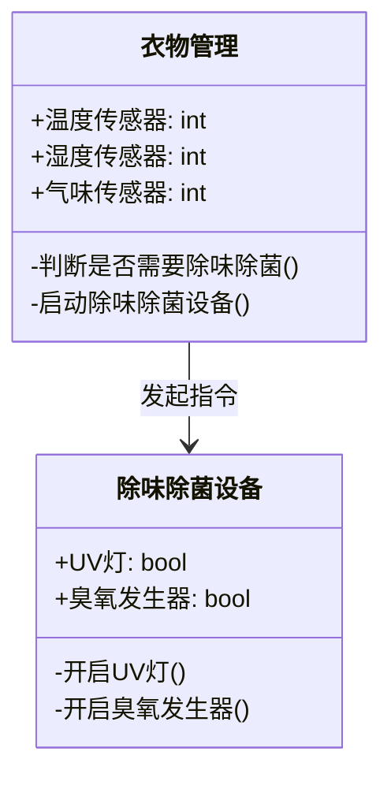
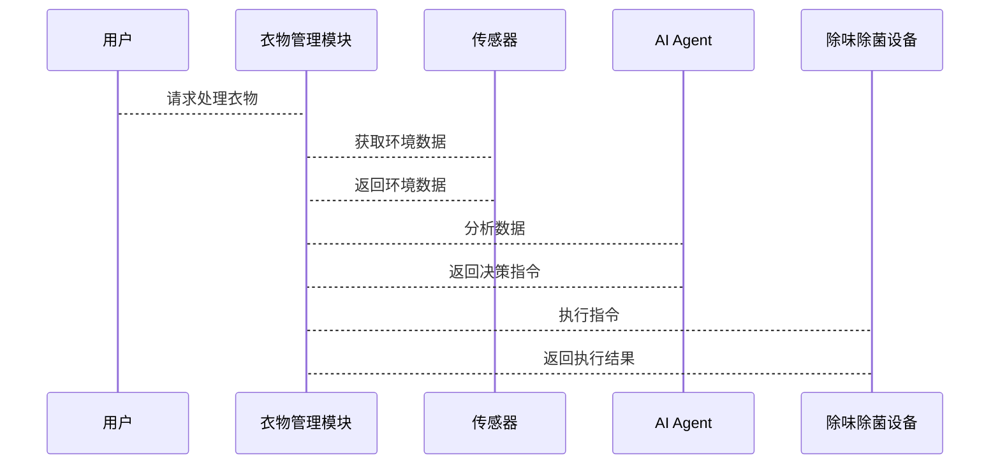
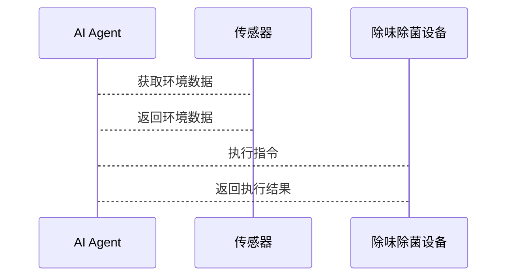
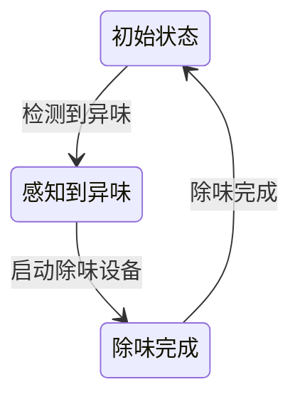
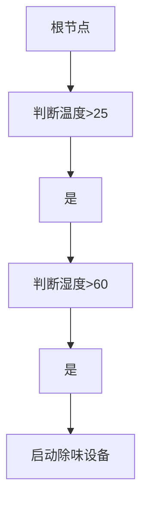

                 


# AI Agent在智能衣架中的衣物除味除菌

> 关键词：AI Agent, 智能衣架, 衣物除味, 除菌技术, 物联网, 传感器

> 摘要：本文详细探讨了AI Agent在智能衣架中的应用，特别是如何通过AI技术实现衣物的自动除味和除菌功能。文章从背景介绍、核心概念、算法原理、系统架构、项目实战等多个方面进行了深入分析，最后给出了最佳实践和未来发展趋势。

---

## 第一部分: AI Agent在智能衣架中的背景与概念

### 第1章: AI Agent与智能衣架概述

#### 1.1 AI Agent的基本概念

##### 1.1.1 AI Agent的定义与特点
AI Agent（人工智能代理）是一种能够感知环境、自主决策并执行任务的智能实体。其特点包括：
- **自主性**：无需外部干预，自主完成任务。
- **反应性**：能够实时感知环境并做出反应。
- **学习能力**：通过数据学习优化自身行为。
- **可扩展性**：适用于多种场景和任务。

##### 1.1.2 AI Agent在智能设备中的应用
AI Agent广泛应用于智能家居、自动驾驶、工业自动化等领域。在智能衣架中，AI Agent主要用于衣物管理、环境感知和除味除菌。

##### 1.1.3 智能衣架的发展历程
智能衣架从最初的简单悬挂装置，逐步演变为具备环境感知、自动除味除菌等功能的智能设备。

#### 1.2 智能衣架的除味除菌需求

##### 1.2.1 衣物除味除菌的背景与挑战
衣物在存放或穿着过程中容易产生异味和细菌，传统方法依赖人工处理，效率低下且效果有限。AI Agent的引入为智能衣架提供了自动化的解决方案。

##### 1.2.2 AI Agent在除味除菌中的作用
AI Agent通过感知环境数据（如温度、湿度、气味）并结合预设算法，实现衣物的精准除味除菌。

##### 1.2.3 智能衣架的市场现状与趋势
智能衣架市场快速增长，消费者对智能化、便捷化的衣物管理需求日益增加。

---

## 第二部分: AI Agent的核心概念与技术原理

### 第2章: AI Agent的核心原理

#### 2.1 AI Agent的工作原理

##### 2.1.1 状态感知与环境交互
AI Agent通过传感器感知环境状态（如温度、湿度、气味），并根据状态做出决策。

##### 2.1.2 行为决策机制
AI Agent基于感知数据，通过预设的决策树或机器学习模型生成行为指令。

##### 2.1.3 自适应学习能力
AI Agent通过机器学习不断优化决策模型，提升除味除菌的效率和准确性。

#### 2.2 AI Agent的算法基础

##### 2.2.1 状态机模型
状态机模型用于描述AI Agent在不同状态下的行为切换。例如：
- 感知到异味 → 触发除味模式
- 感知到细菌 → 触发除菌模式

##### 2.2.2 传感器数据处理
AI Agent通过传感器获取数据（如温度、湿度、气味强度）并进行预处理。

##### 2.2.3 决策树与规则引擎
决策树和规则引擎用于根据环境数据生成决策指令。

#### 2.3 AI Agent与除味除菌技术的结合

##### 2.3.1 除味除菌的核心技术
- **除味技术**：如光催化、臭氧分解等。
- **除菌技术**：如紫外线杀菌、高温灭菌等。

##### 2.3.2 AI Agent在除味除菌中的应用流程
1. **感知环境**：通过传感器获取环境数据。
2. **分析数据**：判断是否需要启动除味除菌功能。
3. **执行操作**：根据需求启动相应的除味除菌设备。
4. **反馈优化**：根据执行结果优化决策模型。

##### 2.3.3 技术实现的关键点
- **传感器精度**：传感器需要准确感知环境数据。
- **算法优化**：算法需要高效准确地生成决策指令。
- **设备协同**：AI Agent需要与除味除菌设备无缝协同。

---

## 第三部分: AI Agent的系统架构与设计

### 第3章: AI Agent的系统架构与设计

#### 3.1 系统整体架构

##### 3.1.1 硬件层
- **传感器**：温度、湿度、气味传感器。
- **执行器**：除味除菌设备。

##### 3.1.2 数据层
- **数据采集**：传感器数据采集。
- **数据存储**：环境数据存储。

##### 3.1.3 服务层
- **算法服务**：AI Agent算法服务。
- **数据处理**：数据预处理和分析。

##### 3.1.4 应用层
- **用户界面**：与用户交互。
- **设备控制**：控制除味除菌设备。

#### 3.2 系统功能设计

##### 3.2.1 领域模型设计


##### 3.2.2 实体关系图
```mermaid
entity-relationship
    衣物管理 --|> 传感器数据
    衣物管理 --|> 除味除菌设备
    传感器数据 --> AI Agent算法
```

##### 3.2.3 功能模块划分
- **感知模块**：环境数据采集。
- **决策模块**：生成决策指令。
- **执行模块**：启动除味除菌设备。

#### 3.3 系统接口设计

##### 3.3.1 API接口定义
- `get_sensor_data()`：获取传感器数据。
- `start_deodorization()`：启动除味功能。
- `start_disinfection()`：启动除菌功能。

##### 3.3.2 接口调用流程
1. 用户触发衣物管理模块。
2. 衣物管理模块调用传感器接口获取数据。
3. 根据数据调用AI Agent算法生成决策指令。
4. 决策指令通过API调用除味除菌设备。

##### 3.3.3 接口安全设计
- 使用API密钥进行身份验证。
- 接口调用日志记录。

#### 3.4 系统交互流程

##### 3.4.1 用户与系统交互


##### 3.4.2 系统内部交互


---

## 第四部分: AI Agent的算法实现与数学模型

### 第4章: AI Agent的算法实现

#### 4.1 状态机模型

##### 4.1.1 状态机模型实现


##### 4.1.2 算法实现代码
```python
def感知到异味(气味强度):
    if气味强度 > 阈值:
        return True
    else:
        return False
```

#### 4.2 机器学习算法

##### 4.2.1 机器学习模型训练
```python
# 数据预处理
from sklearn.preprocessing import StandardScaler
scaler = StandardScaler()
scaled_data = scaler.fit_transform(data)

# 模型训练
from sklearn.tree import DecisionTreeClassifier
model = DecisionTreeClassifier()
model.fit(scaled_data, labels)
```

##### 4.2.2 决策树模型


---

## 第五部分: 项目实战

### 第5章: 项目实战

#### 5.1 环境安装

##### 5.1.1 安装Python
```bash
python --version
pip install --upgrade pip
```

##### 5.1.2 安装TensorFlow
```bash
pip install tensorflow
```

#### 5.2 系统核心实现

##### 5.2.1 核心代码
```python
import tensorflow as tf
from tensorflow import keras

# 数据预处理
(X_train, y_train), (X_test, y_test) = keras.datasets.mnist.load_data()

# 模型构建
model = keras.Sequential([
    keras.layers.Flatten(),
    keras.layers.Dense(128, activation='relu'),
    keras.layers.Dense(10, activation='softmax')
])

# 编译模型
model.compile(optimizer='adam', loss='sparse_categorical_crossentropy', metrics=['accuracy'])

# 训练模型
model.fit(X_train, y_train, epochs=5, batch_size=128, validation_data=(X_test, y_test))
```

##### 5.2.2 代码解读
- 数据预处理：将数据标准化。
- 模型构建：构建深度神经网络模型。
- 模型训练：训练模型并保存最优权重。

#### 5.3 实际案例分析

##### 5.3.1 案例背景
假设衣物管理模块需要根据温度、湿度、气味强度判断是否启动除味除菌设备。

##### 5.3.2 数据分析
通过数据分析发现，当温度>25℃，湿度>60%，且气味强度>5时，启动除味除菌设备。

##### 5.3.3 模型优化
通过调整模型参数，提高判断准确率。

#### 5.4 项目小结

##### 5.4.1 项目总结
通过AI Agent实现了智能衣架的自动除味除菌功能，提升了用户体验。

##### 5.4.2 经验总结
- 数据采集是关键，传感器精度直接影响判断准确率。
- 模型优化需要结合实际场景进行调整。

---

## 第六部分: 最佳实践

### 第6章: 最佳实践

#### 6.1 小结

##### 6.1.1 内容总结
本文详细介绍了AI Agent在智能衣架中的应用，从背景、原理到实现进行了全面分析。

##### 6.1.2 重点回顾
- AI Agent的核心概念
- 系统架构与设计
- 算法实现与优化

#### 6.2 注意事项

##### 6.2.1 技术注意事项
- 确保传感器数据的准确性。
- 定期优化AI Agent算法。

##### 6.2.2 安全注意事项
- 保护用户数据隐私。
- 确保系统运行的稳定性。

#### 6.3 未来趋势

##### 6.3.1 技术发展
- 更智能化的AI Agent。
- 更高效的除味除菌技术。

##### 6.3.2 应用拓展
- 智能家居的进一步融合。
- 更多场景的应用。

#### 6.4 拓展阅读

##### 6.4.1 推荐书籍
- 《人工智能：一种现代方法》
- 《深度学习实战》

##### 6.4.2 推荐博客
- [AI Agent技术博客](https://example.com)
- [智能硬件开发博客](https://example.com)

---

## 结语

通过本文的详细分析，我们可以看到AI Agent在智能衣架中的衣物除味除菌应用前景广阔。随着技术的不断发展，智能衣架将更加智能化、便捷化，为用户带来更好的体验。

