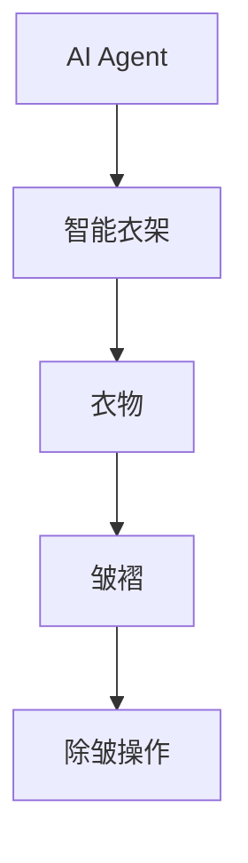
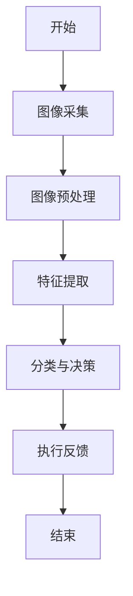
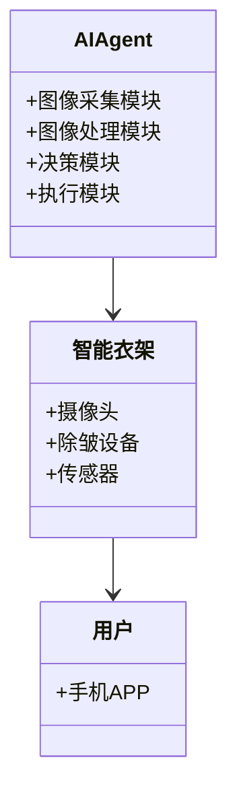
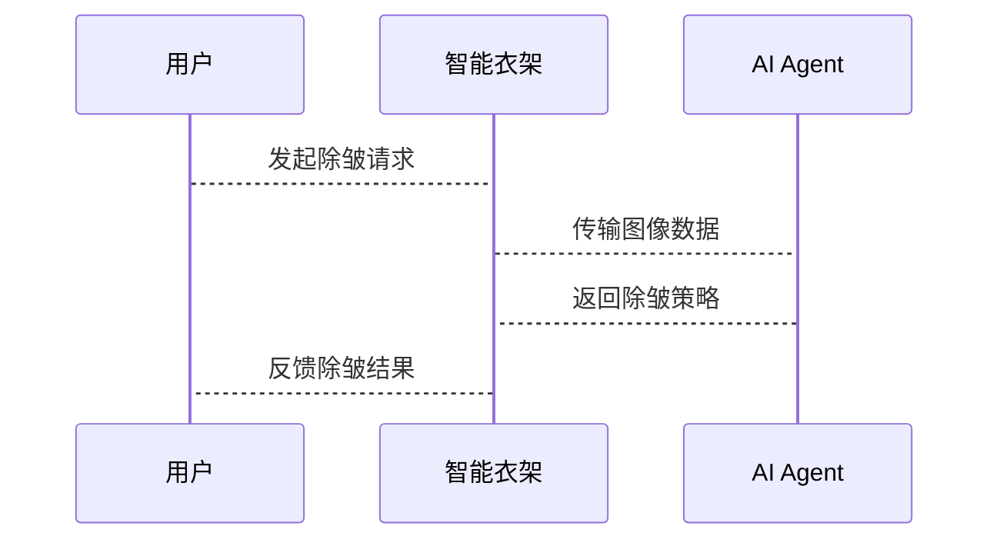

                 


# AI Agent在智能衣架中的衣物除皱功能

> 关键词：AI Agent，智能衣架，衣物除皱，深度学习，物联网，智能家居

> 摘要：本文详细探讨了AI Agent在智能衣架中的应用，重点分析了衣物除皱功能的技术实现。通过结合深度学习算法和物联网技术，AI Agent能够智能识别衣物皱褶并优化除皱流程。本文从问题背景、核心概念、算法原理、系统架构设计、项目实战等多个维度进行深入分析，旨在为读者提供全面的技术视角。

---

# 第1章: 问题背景与目标

## 1.1 问题背景
### 1.1.1 衣物皱褶问题的普遍性
衣物皱褶是日常生活中常见的问题，尤其是在熨烫或悬挂存储时。传统除皱方法（如手动熨烫或使用蒸汽挂烫机）效率低下，且难以满足现代用户对便捷性和智能化的需求。

### 1.1.2 传统除皱方法的局限性
传统除皱方法存在以下问题：
- 需要人工操作，耗时耗力。
- 无法精确识别衣物材质和皱褶类型。
- 无法根据环境条件（如温度、湿度）自动调整除皱策略。

### 1.1.3 智能化除皱的需求驱动
随着智能家居和物联网技术的普及，用户对智能衣物护理设备的需求日益增长。AI Agent的引入为智能衣架的智能化除皱功能提供了技术基础。

## 1.2 问题描述
### 1.2.1 智能衣架的功能定位
智能衣架是一种结合物联网和人工智能技术的衣物护理设备，能够通过传感器和AI算法实现衣物护理的自动化和智能化。

### 1.2.2 AI Agent在除皱中的角色
AI Agent通过图像识别、深度学习和实时反馈机制，帮助智能衣架实现以下功能：
- 自动识别衣物的材质和皱褶程度。
- 自动生成最优的除皱方案。
- 实时调整除皱参数以确保最佳效果。

### 1.2.3 用户需求与技术实现的结合
用户需求包括：
- 快速、高效的除皱效果。
- 无需人工干预的自动化操作。
- 精确识别不同衣物材质和皱褶类型。

## 1.3 问题解决思路
### 1.3.1 利用AI技术优化除皱流程
通过AI技术，智能衣架可以实现衣物的自动识别和精准护理。

### 1.3.2 AI Agent在智能衣架中的具体实现
AI Agent通过图像识别和深度学习模型，实时分析衣物状态并优化除皱策略。

### 1.3.3 除皱功能的智能化提升
智能化除皱功能的核心在于AI Agent的实时反馈机制和自适应能力。

## 1.4 边界与外延
### 1.4.1 功能边界
智能衣架的除皱功能仅限于通过AI Agent实现的自动识别和优化，不包括其他衣物护理功能（如清洗、消毒等）。

### 1.4.2 技术实现的范围
本文主要讨论AI Agent在除皱功能中的技术实现，不涉及其他辅助功能（如衣物分类、存储管理等）。

### 1.4.3 与其他功能的关联
智能衣架的除皱功能与其他功能（如衣物分类、存储管理）通过物联网平台进行协同工作。

## 1.5 概念结构与核心要素
### 1.5.1 核心概念组成
- AI Agent
- 智能衣架
- 衣物
- 皱褶
- 除皱操作

### 1.5.2 关键技术要素
- 图像识别
- 深度学习模型
- 实时反馈机制
- 自适应优化算法

### 1.5.3 系统架构的核心组成
- 数据采集模块
- 数据处理模块
- AI Agent决策模块
- 执行模块

# 第2章: AI Agent的核心概念与原理

## 2.1 AI Agent的基本原理
### 2.1.1 AI Agent的定义
AI Agent是一种能够感知环境、自主决策并执行任务的智能实体。

### 2.1.2 AI Agent的核心特征
- **自主性**：能够在无外部干预的情况下自主决策。
- **反应性**：能够实时感知环境变化并调整行为。
- **学习能力**：通过数据训练不断优化性能。

### 2.1.3 AI Agent与传统算法的区别
| 特性 | AI Agent | 传统算法 |
|------|----------|----------|
| 决策能力 | 自主决策 | 预先定义 |
| 学习能力 | 可以学习 | 无法学习 |
| 灵活性 | 高 | 低 |

## 2.2 AI Agent在智能衣架中的应用
### 2.2.1 AI Agent的功能模块
- **图像采集模块**：通过摄像头采集衣物表面的图像。
- **图像处理模块**：对图像进行预处理和特征提取。
- **决策模块**：基于深度学习模型生成除皱策略。
- **执行模块**：根据决策结果调整除皱设备的参数。

### 2.2.2 AI Agent与智能衣架的交互机制
AI Agent通过以下步骤与智能衣架交互：
1. 图像采集：AI Agent通过摄像头获取衣物表面的图像。
2. 数据处理：对图像进行预处理和特征提取。
3. 决策生成：基于深度学习模型生成除皱策略。
4. 执行反馈：调整除皱设备的参数并实时反馈结果。

### 2.2.3 AI Agent在除皱中的具体应用
AI Agent通过以下方式实现智能化除皱：
- 精确识别衣物材质和皱褶类型。
- 自动生成最优的除皱方案。
- 实时调整除皱参数以确保最佳效果。

## 2.3 实体关系图


# 第3章: 算法原理与实现

## 3.1 算法原理
### 3.1.1 算法选择
本文采用基于卷积神经网络（CNN）的图像识别算法。

### 3.1.2 算法流程
1. **图像采集**：通过摄像头获取衣物表面的图像。
2. **图像预处理**：对图像进行降噪、增强和归一化处理。
3. **特征提取**：使用CNN提取衣物的纹理和形状特征。
4. **分类与决策**：基于提取的特征生成除皱策略。

### 3.1.3 算法优化
- **模型优化**：通过迁移学习和数据增强技术提升模型的泛化能力。
- **计算优化**：采用轻量化设计以降低计算成本。

## 3.2 算法流程图


## 3.3 核心代码实现
```python
import tensorflow as tf
from tensorflow.keras import layers

# 数据预处理
def preprocess_image(image):
    image = image.resize((224, 224))
    image = image / 255.0
    return image

# 特征提取模型
base_model = tf.keras.applications.VGG16(
    weights='imagenet', 
    include_top=False,
    input_shape=(224, 224, 3)
)

# 自定义分类模型
model = tf.keras.Sequential([
    base_model,
    layers.Flatten(),
    layers.Dense(256, activation='relu'),
    layers.Dense(10, activation='softmax')
])

# 模型训练
model.compile(optimizer='adam', loss='sparse_categorical_crossentropy', metrics=['accuracy'])
model.fit(train_images, train_labels, epochs=10, batch_size=32)
```

## 3.4 数学模型与公式
- **损失函数**：交叉熵损失函数
  $$ L = -\sum_{i=1}^{n} y_i \log(p_i) $$
- **优化器**：Adam优化器
  $$ \theta_{t+1} = \theta_t - \eta \frac{\partial L}{\partial \theta_t} $$

# 第4章: 系统分析与架构设计方案

## 4.1 问题场景介绍
智能衣架通过AI Agent实现衣物的自动识别和精准护理，用户可以通过手机APP远程控制除皱功能。

## 4.2 系统功能设计
### 4.2.1 领域模型


### 4.2.2 系统架构设计


## 4.3 系统接口设计
- **API接口**：通过RESTful API实现设备与云端的通信。
- **数据格式**：JSON格式的数据传输。

## 4.4 系统交互流程图


# 第5章: 项目实战

## 5.1 环境安装
```bash
pip install tensorflow==2.5.0
pip install keras==2.5.0
pip install opencv-python==4.5.5.52
```

## 5.2 核心代码实现
```python
import cv2
import numpy as np

# 图像采集
cap = cv2.VideoCapture(0)
while cap.isOpened():
    ret, frame = cap.read()
    if not ret:
        break
    cv2.imshow('Camera', frame)
    if cv2.waitKey(1) & 0xFF == ord('q'):
        break

cap.release()
cv2.destroyAllWindows()
```

## 5.3 实际案例分析
- **案例1**：棉质衬衫的除皱
  - AI Agent识别衣物材质为棉质，调整蒸汽温度为低档。
- **案例2**：羊毛外套的除皱
  - AI Agent识别衣物材质为羊毛，调整蒸汽温度为中档。

## 5.4 项目小结
通过AI Agent的引入，智能衣架实现了衣物的精准识别和智能化除皱，显著提升了用户体验。

# 第6章: 最佳实践与总结

## 6.1 最佳实践
- **数据优化**：增加多样化的训练数据以提升模型的泛化能力。
- **算法优化**：通过模型剪枝和量化技术降低计算成本。

## 6.2 小结
本文详细探讨了AI Agent在智能衣架中的应用，通过图像识别和深度学习技术实现了衣物的智能化除皱。

## 6.3 注意事项
- 除皱过程中需注意衣物材质的特殊要求。
- 系统运行时需保持网络连接以确保AI Agent的正常工作。

## 6.4 拓展阅读
- 《深度学习入门：基于Python和TensorFlow》
- 《人工智能：一种现代方法》

---

# 结语
AI Agent在智能衣架中的应用展示了人工智能技术在智能家居领域的巨大潜力。通过持续的技术创新和实践探索，未来我们将看到更多智能化、个性化的衣物护理设备走进千家万户。

