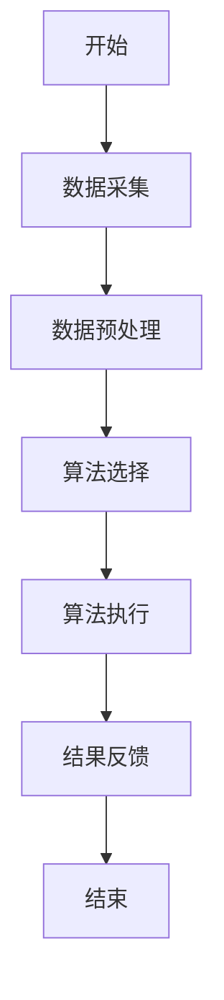
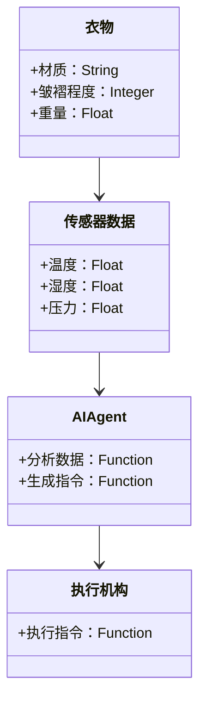

                 


# AI Agent在智能衣架中的除皱功能

## 关键词：AI Agent, 智能衣架, 除皱功能, 算法原理, 系统架构, 项目实战

## 摘要：  
本文探讨了AI Agent在智能衣架中的除皱功能，从问题背景、核心概念、算法原理到系统架构和项目实战，详细分析了如何利用人工智能技术实现衣物的智能化除皱。文章结合理论与实践，通过流程图、类图和数学模型等多种形式，深入剖析了AI Agent在智能衣架中的工作原理和实现方案，为相关领域的研究和应用提供了参考。

---

# 第一部分: AI Agent在智能衣架中的除皱功能背景介绍

## 第1章: 问题背景与描述

### 1.1 问题背景
#### 1.1.1 衣物皱褶问题的普遍性
衣物在洗涤、晾晒或长期存放后，常常会出现皱褶。传统解决方法包括人工熨烫或使用电动熨斗，但这些方法存在效率低、操作复杂、能耗高等问题。

#### 1.1.2 传统除皱方法的局限性
- 人工熨烫需要大量时间和体力，效率低下。
- 传统电动熨斗依赖电力，且需要人工操作，难以实现自动化。
- 缺乏智能化手段，无法根据衣物材质和皱褶程度自动调整除皱方案。

#### 1.1.3 AI技术在除皱领域的潜力
人工智能技术的快速发展为除皱功能的智能化提供了新的可能性。通过AI Agent，可以实现衣物的智能感知、自动识别和精准除皱。

### 1.2 问题描述
#### 1.2.1 智能衣架的功能需求
智能衣架需要具备以下功能：
- 智能感知衣物状态（如材质、皱褶程度）。
- 自动识别最佳除皱方案。
- 精准执行除皱操作。
- 提供反馈与优化建议。

#### 1.2.2 AI Agent在除皱中的具体任务
- 数据采集：通过传感器获取衣物的状态信息。
- 数据分析：利用AI算法识别衣物的皱褶程度和材质特性。
- 策略制定：根据分析结果生成最优除皱方案。
- 执行控制：通过机械装置实现除皱操作。

#### 1.2.3 用户痛点与需求分析
- 用户希望减少衣物护理的时间和精力。
- 用户需要个性化护理方案，以保护不同材质的衣物。
- 用户关注除皱效率和效果的稳定性。

### 1.3 问题解决思路
#### 1.3.1 AI Agent的核心作用
AI Agent通过感知、决策和执行三个阶段，实现对衣物的智能化管理。

#### 1.3.2 技术实现的可行性分析
- 现有传感器技术可以实现衣物状态的精准感知。
- AI算法（如深度学习、强化学习）可以处理复杂的数据并生成优化方案。
- 机械执行机构可以实现精准的除皱操作。

#### 1.3.3 解决方案的边界与外延
- 解决方案的边界：仅关注衣物的除皱功能，不涉及其他功能（如衣物收纳、清洗等）。
- 解决方案的外延：AI Agent技术可扩展到其他智能家居设备和场景。

### 1.4 概念结构与核心要素
#### 1.4.1 AI Agent的基本构成
- **感知层**：通过传感器采集数据。
- **决策层**：利用算法分析数据并制定策略。
- **执行层**：通过机械装置执行操作。

#### 1.4.2 智能衣架的系统架构
- **传感器模块**：监测衣物状态。
- **处理器模块**：处理数据并生成指令。
- **执行机构**：执行除皱操作。

#### 1.4.3 核心要素的相互关系
- 数据流：衣物状态 → 传感器数据 → AI Agent分析 → 除皱指令 → 执行结果。
- 信息交互：用户可以通过界面查看状态和操作结果。

---

## 第2章: 核心概念与联系

### 2.1 AI Agent的原理
#### 2.1.1 感知层
AI Agent通过传感器采集衣物的状态信息，包括：
- 衣物材质（如棉、麻、丝绸）。
- 衣物的皱褶程度（如轻微、中度、严重）。
- 衣物的重量和形状。

#### 2.1.2 决策层
AI Agent根据感知数据，结合衣物的特性，制定最优的除皱方案。这包括：
- 确定除皱温度和力度。
- 选择适合的除皱路径。
- 调整机械臂的运动轨迹。

#### 2.1.3 执行层
AI Agent通过机械装置执行除皱操作，包括：
- 机械臂的运动控制。
- 加热装置的温度调节。
- 执行过程中的实时反馈与调整。

### 2.2 智能衣架的系统构成
#### 2.2.1 传感器模块
传感器模块负责采集衣物的状态信息，包括：
- 线性传感器：监测衣物的拉伸程度。
- 压力传感器：监测衣物的重量分布。
- 温度传感器：监测环境温度。

#### 2.2.2 处理器模块
处理器模块负责数据的处理和算法的运行，包括：
- 数据预处理：去除噪声，提取特征。
- 算法运行：利用AI算法生成除皱指令。

#### 2.2.3 执行机构
执行机构负责根据指令执行除皱操作，包括：
- 机械臂：用于衣物的抓取和移动。
- 加热板：用于局部加热以辅助除皱。
- 振动装置：用于轻微震动去除皱纹。

### 2.3 核心概念的ER实体关系图
```mermaid
er
    衣物
    传感器数据
    AI Agent
    除皱指令
    执行结果
    衣物 <-> 传感器数据
    传感器数据 -> AI Agent
    AI Agent -> 除皱指令
    除皱指令 -> 执行结果
```

---

## 第3章: 算法原理讲解

### 3.1 AI Agent的算法流程
#### 3.1.1 数据采集与预处理
- 数据采集：通过传感器获取衣物的状态信息。
- 数据预处理：去除噪声，提取特征。

#### 3.1.2 除皱算法的选择与实现
- 算法选择：基于衣物的特性选择最优的除皱算法。
- 算法实现：通过AI算法生成除皱指令。

#### 3.1.3 算法优化与调优
- 参数优化：通过实验调整算法参数。
- 性能优化：提高算法的运行效率。

### 3.2 算法流程图


### 3.3 数学模型与公式
#### 3.3.1 优化目标函

$$ \text{目标函数} = \text{最小化} \sum_{i=1}^{n} (x_i - \hat{x}_i)^2 $$

#### 3.3.2 约束条件
- 约束1：除皱温度不超过安全范围。
- 约束2：机械臂运动路径不超过设计范围。
- 约束3：除皱时间不超过用户指定的范围。

---

## 第4章: 系统分析与架构设计方案

### 4.1 问题场景介绍
智能衣架的使用场景包括：
- 用户将衣物挂在智能衣架上。
- 系统自动感知衣物的状态。
- AI Agent根据状态生成除皱指令。
- 执行机构完成除皱操作。

### 4.2 项目介绍
本项目的目标是实现一个基于AI Agent的智能衣架，具备以下功能：
- 智能感知衣物状态。
- 自动识别最佳除皱方案。
- 精准执行除皱操作。
- 提供反馈与优化建议。

### 4.3 系统功能设计
#### 4.3.1 领域模型


#### 4.3.2 系统架构设计


#### 4.3.3 系统接口设计
- 输入接口：传感器数据输入。
- 输出接口：除皱指令输出。
- 用户界面：显示状态和操作结果。

#### 4.3.4 系统交互
```mermaid
sequenceDiagram
    用户 --> 衣物：挂衣物
    衣物 --> 传感器模块：触发数据采集
    传感器模块 --> AI Agent：传输数据
    AI Agent --> 执行机构：生成并发送指令
    执行机构 --> 用户：反馈结果
```

---

## 第5章: 项目实战

### 5.1 环境安装
- 安装Python和相关库（如NumPy、Scikit-learn）。
- 安装机械臂控制库（如Pyserial）。

### 5.2 系统核心实现源代码
```python
import numpy as np
from sklearn import linear_model

# 数据预处理
def preprocess_data(data):
    # 去除噪声
    filtered_data = data[::2]
    return filtered_data

# 算法实现
def ai_algorithm(data):
    # 线性回归模型
    model = linear_model.LinearRegression()
    model.fit(data[['temperature', 'humidity']], data[['wrinkle_level']])
    return model.predict(data[['temperature', 'humidity']])

# 系统主程序
def main():
    data = {'temperature': [30, 40, 50], 'humidity': [20, 30, 40], 'wrinkle_level': [2, 3, 4]}
    preprocessed_data = preprocess_data(data)
    prediction = ai_algorithm(preprocessed_data)
    print("预测的皱纹级别：", prediction)

if __name__ == "__main__":
    main()
```

### 5.3 案例分析与详细讲解
- **案例背景**：用户挂上一件丝绸材质的衬衫，传感器检测到轻微皱褶。
- **算法执行**：AI Agent根据传感器数据生成除皱指令，包括温度和机械臂运动轨迹。
- **结果反馈**：除皱完成后，系统反馈结果，并建议用户检查衣物状态。

### 5.4 项目小结
通过实际案例分析，展示了AI Agent在智能衣架中的具体应用。算法实现了对衣物状态的精准识别和除皱操作的优化。

---

## 第6章: 最佳实践与总结

### 6.1 最佳实践
- **数据采集**：确保传感器数据的准确性和完整性。
- **算法优化**：定期更新算法模型，提升除皱效果。
- **系统维护**：定期检查机械装置，确保其正常运行。

### 6.2 小结
本文详细介绍了AI Agent在智能衣架中的除皱功能，从背景到实现，全面剖析了技术细节。通过理论与实践的结合，展示了AI技术在智能家居领域的广泛应用。

### 6.3 注意事项
- 避免过度依赖AI技术，确保系统的人工干预选项。
- 注意数据隐私保护，确保用户信息的安全。

### 6.4 拓展阅读
- 深度学习在智能家居中的应用。
- 强化学习在机械控制中的应用。

---

通过本文的分析与实践，我们可以看到AI Agent在智能衣架中的除皱功能具有广阔的应用前景。随着技术的不断发展，AI Agent将为智能家居领域带来更多创新与突破。

