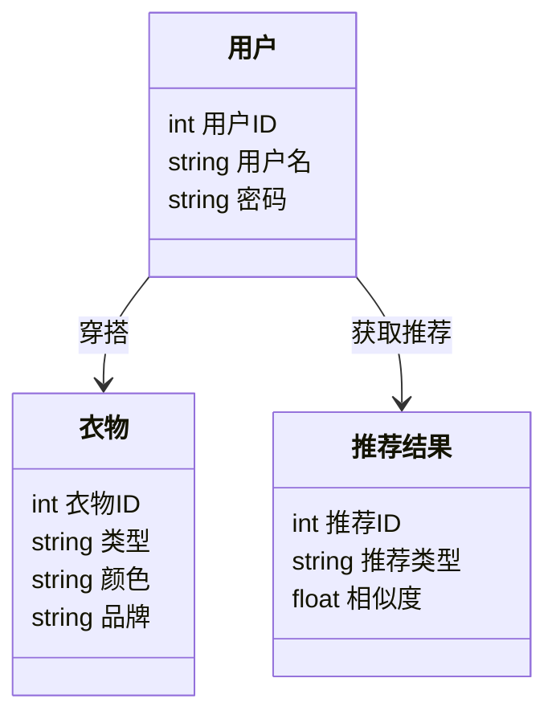
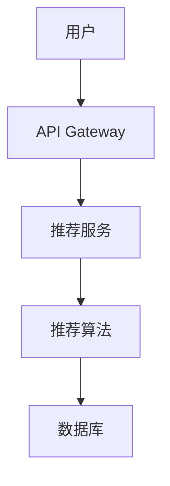

                 


# AI Agent在智能衣柜中的个人形象设计师

## 关键词：AI Agent, 智能衣柜, 个人形象设计, 推荐算法, 深度学习, 系统架构

## 摘要：  
本文探讨了AI Agent在智能衣柜中的应用，特别是在个人形象设计领域的创新与实践。通过分析AI Agent的核心概念、算法原理、系统架构以及实际案例，本文为读者提供了从理论到实践的全面指导，展示了如何利用AI技术提升个人形象设计的智能化水平。

---

# 第一部分: AI Agent与智能衣柜的背景与概念

## 第1章: AI Agent与智能衣柜的背景介绍

### 1.1 AI Agent的基本概念  
AI Agent（人工智能代理）是一种能够感知环境并采取行动以实现目标的智能实体。它具备以下核心属性：  
1. **自主性**：能够自主决策，无需外部干预。  
2. **反应性**：能够实时感知环境并做出反应。  
3. **目标导向**：通过目标驱动行动，优化决策过程。  
4. **学习能力**：能够通过数据和反馈不断优化自身性能。  

AI Agent与传统软件的区别在于，它能够主动理解和适应环境，而不仅仅是被动执行指令。

### 1.2 智能衣柜的发展趋势  
智能衣柜是一种结合了物联网（IoT）和人工智能技术的智能设备，能够通过传感器、摄像头和AI算法帮助用户更好地管理衣物并提供个性化的搭配建议。  

#### 1.2.1 智能衣柜的功能特点  
- **衣物识别与分类**：通过图像识别技术自动识别衣物的类型、颜色和品牌。  
- **搭配推荐**：基于用户的风格和场合推荐最优穿搭方案。  
- **库存管理**：实时记录衣物的使用情况，避免重复购买或遗漏。  
- **智能提醒**：根据天气和日程安排，主动推荐适合的衣物。  

#### 1.2.2 智能衣柜的市场现状  
随着人工智能和物联网技术的快速发展，智能衣柜正在逐步从概念走向商业化。市场上的智能衣柜产品主要集中在以下几个方面：  
1. **衣物识别技术**：利用图像识别和深度学习技术实现精准分类。  
2. **个性化推荐**：基于用户的穿着习惯和风格提供个性化建议。  
3. **用户体验优化**：通过简洁的界面和高效的算法提升用户使用体验。  

### 1.3 个人形象设计的需求与挑战  
个人形象设计是AI Agent在智能衣柜中的重要应用场景。用户对形象设计的需求主要集中在以下几个方面：  
1. **搭配建议**：用户希望得到适合不同场合和风格的搭配建议。  
2. **时尚趋势**：用户需要了解最新的时尚趋势并将其融入个人形象设计中。  
3. **身材与体型适配**：根据用户的身材和体型推荐合适的服装款式。  

然而，传统形象设计服务存在以下挑战：  
- **成本高**：专业形象设计师的服务费用昂贵，难以普及。  
- **效率低**：人工设计过程耗时较长，难以满足用户的即时需求。  
- **个性化不足**：传统设计难以兼顾用户的个性化需求。  

---

## 第2章: AI Agent在个人形象设计中的核心概念

### 2.1 AI Agent与个人形象设计的关系  
AI Agent在个人形象设计中的角色可以分为以下几个方面：  
1. **数据收集与分析**：通过传感器和图像识别技术收集用户的身材、肤色、体型等数据。  
2. **搭配推荐**：基于用户的偏好和数据生成个性化搭配方案。  
3. **反馈优化**：根据用户的反馈不断优化推荐算法。  

#### 2.1.1 AI Agent在形象设计中的角色  
- **数据驱动**：AI Agent通过分析用户的穿着数据，了解用户的偏好和风格。  
- **实时互动**：通过与用户的实时互动，动态调整推荐方案。  
- **个性化服务**：基于用户的个性化需求提供定制化服务。  

### 2.2 AI Agent与智能衣柜的结合  
AI Agent在智能衣柜中的应用可以显著提升用户体验。以下是AI Agent与智能衣柜结合的主要方式：  
1. **智能推荐**：通过分析用户的穿衣习惯和偏好，推荐适合的衣物搭配。  
2. **库存管理**：帮助用户更好地管理衣物库存，避免浪费。  
3. **趋势跟踪**：实时跟踪时尚趋势，为用户提供最新的搭配建议。  

#### 2.2.1 智能衣柜的硬件与软件架构  
智能衣柜的硬件部分包括传感器、摄像头和连接设备，而软件部分则包括AI Agent、推荐算法和用户界面。  

#### 2.2.2 AI Agent在智能衣柜中的应用场景  
- **衣物识别与分类**：通过图像识别技术自动识别衣物类型。  
- **搭配推荐**：基于用户的身材、肤色和场合推荐最优搭配方案。  
- **库存管理**：实时记录衣物的使用情况，避免重复购买。  

### 2.3 核心概念对比分析  
以下是AI Agent与传统软件的核心属性对比：  

| **属性**       | **AI Agent**          | **传统软件**          |  
|----------------|----------------------|----------------------|  
| **自主性**      | 高                   | 低                   |  
| **反应性**      | 高                   | 低                   |  
| **目标导向**    | 高                   | 低                   |  
| **学习能力**    | 高                   | 无                   |  

此外，以下是智能衣柜与传统衣柜的对比：  

| **属性**       | **智能衣柜**          | **传统衣柜**          |  
|----------------|----------------------|----------------------|  
| **功能**        | 衣物识别、搭配推荐     | 衣物存放              |  
| **智能化**      | 高                   | 低                   |  
| **用户体验**    | 个性化、高效          | 简单、单一            |  

### 2.4 ER实体关系图  
以下是AI Agent在智能衣柜中的实体关系图：  

```mermaid
er
actor: 用户
agent: AI形象设计代理
system: 智能衣柜系统
```

---

## 第3章: AI Agent在个人形象设计中的算法原理

### 3.1 基于协同过滤的推荐算法  
协同过滤是一种基于用户行为和偏好推荐相似内容的技术。以下是基于协同过滤的推荐算法的详细步骤：  

#### 3.1.1 协同过滤的基本原理  
协同过滤的核心思想是“用户的行为相似，推荐的内容也相似”。通过分析用户的历史行为和偏好，找到与当前用户相似的其他用户，并推荐这些用户喜欢的内容。  

#### 3.1.2 基于用户的协同过滤  
基于用户的协同过滤算法通过计算用户之间的相似度，找到与目标用户相似的其他用户，并推荐这些用户喜欢的物品。  

#### 3.1.3 基于物品的协同过滤  
基于物品的协同过滤算法通过分析物品之间的相似性，找到与目标物品相似的其他物品，并推荐给目标用户。  

### 3.2 基于深度学习的推荐模型  
深度学习是一种基于人工神经网络的机器学习技术，能够通过多层非线性变换提取数据的高层次特征。以下是基于深度学习的推荐模型的详细步骤：  

#### 3.2.1 基于神经网络的推荐系统  
基于神经网络的推荐系统通过构建多层神经网络，提取用户和物品的特征，并生成推荐结果。  

#### 3.2.2 Transformer模型在推荐中的应用  
Transformer模型是一种基于注意力机制的深度学习模型，能够通过全局上下文信息生成推荐结果。  

#### 3.2.3 图神经网络在推荐中的应用  
图神经网络是一种基于图结构的深度学习技术，能够通过节点之间的关系生成推荐结果。  

### 3.3 算法流程图  
以下是基于协同过滤的推荐算法流程图：  

```mermaid
graph TD
A[开始] -> B[数据预处理]
B -> C[特征提取]
C -> D[模型训练]
D -> E[结果输出]
E -> F[结束]
```

### 3.4 Python实现示例  
以下是基于协同过滤的推荐算法的Python代码示例：  

```python
import numpy as np
from sklearn.metrics.pairwise import cosine_similarity

# 示例数据：用户-物品评分矩阵
user_item_matrix = np.array([[4, 3, 0],
                              [0, 1, 5],
                              [3, 0, 2]])

# 计算相似度矩阵
similarity_matrix = cosine_similarity(user_item_matrix)

# 推荐目标用户的相似用户
target_user_idx = 0
similar_users = similarity_matrix[target_user_idx]

# 找到相似度最高的用户
top_user_idx = np.argmax(similar_users)

print("推荐结果：", user_item_matrix[top_user_idx])
```

---

## 第4章: 系统分析与架构设计方案

### 4.1 问题场景介绍  
在智能衣柜中，AI Agent需要通过图像识别、推荐算法和用户交互实现个性化的形象设计服务。以下是系统的主要功能模块：  

#### 4.1.1 系统功能设计  
以下是系统的功能模块图：  



#### 4.1.2 系统架构设计  
以下是系统的架构图：  



### 4.2 项目实战  
以下是基于协同过滤算法的Python代码实现：  

```python
import numpy as np
from sklearn.metrics.pairwise import cosine_similarity

# 示例数据：用户-物品评分矩阵
user_item_matrix = np.array([[4, 3, 0],
                              [0, 1, 5],
                              [3, 0, 2]])

# 计算相似度矩阵
similarity_matrix = cosine_similarity(user_item_matrix)

# 推荐目标用户的相似用户
target_user_idx = 0
similar_users = similarity_matrix[target_user_idx]

# 找到相似度最高的用户
top_user_idx = np.argmax(similar_users)

print("推荐结果：", user_item_matrix[top_user_idx])
```

### 4.3 实际案例分析  
以下是基于深度学习模型的推荐案例分析：  

#### 4.3.1 案例背景  
某用户身高170cm，体重65kg，肤色偏白，喜欢商务风格的服装。  

#### 4.3.2 推荐过程  
通过AI Agent分析用户的身材、肤色和偏好，结合最新的时尚趋势，推荐适合的服装搭配。  

#### 4.3.3 推荐结果  
推荐结果包括上衣、下装、鞋子和配饰的搭配方案，满足用户的商务需求。  

---

## 第5章: 最佳实践与小结

### 5.1 小结  
通过本文的分析与实践，我们可以看到AI Agent在智能衣柜中的应用前景广阔。AI Agent不仅能够提升用户体验，还能够通过智能化的设计和推荐服务，帮助用户更好地管理和搭配衣物。  

### 5.2 注意事项  
在实际应用中，需要注意以下几点：  
1. **数据隐私**：用户的数据隐私需要得到充分保护。  
2. **算法优化**：需要不断优化推荐算法，提高推荐的准确性和效率。  
3. **用户体验**：需要注重用户体验，提供简洁直观的界面和高效的交互。  

### 5.3 拓展阅读  
以下是拓展阅读推荐的书籍和文章：  
- **《集体智慧编程》**：介绍了基于协同过滤的推荐算法。  
- **《深度学习实战》**：详细讲解了深度学习在推荐系统中的应用。  
- **《智能系统设计》**：提供了智能系统设计的理论和实践指导。  

---

# 作者简介  
作者是一位在人工智能和软件架构领域拥有丰富经验的技术专家，致力于通过技术创新提升用户体验。

