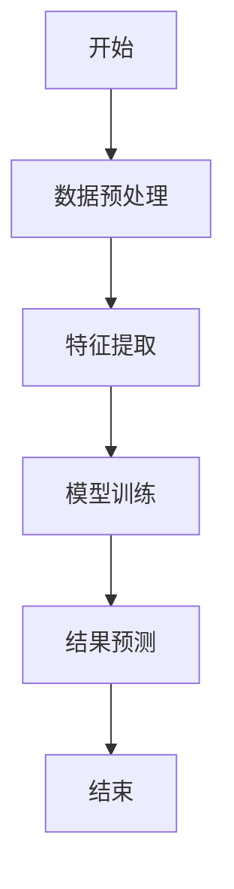
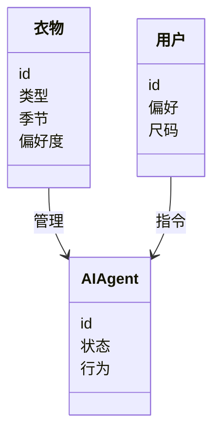

                 


# AI Agent在智能衣柜中的季节性衣物管理

## 关键词：AI Agent, 智能衣柜, 季节性衣物, 算法原理, 系统架构

## 摘要：本文探讨AI Agent在智能衣柜中的应用，重点分析其如何通过算法和系统架构优化季节性衣物的管理。通过背景分析、核心概念、算法实现、系统设计和项目实战，揭示AI Agent在衣物分类、推荐和管理中的潜力和优势。

---

## 第一部分: AI Agent在智能衣柜中的背景与概念

## 第1章: AI Agent与季节性衣物管理概述

### 1.1 AI Agent的基本概念

#### 1.1.1 什么是AI Agent
AI Agent（人工智能代理）是指能够感知环境并采取行动以实现目标的智能实体。它可以理解为一种软件或硬件系统，通过传感器输入信息，利用算法进行分析和决策，输出相应的操作。

#### 1.1.2 AI Agent的核心特征
- **自主性**：能够自主决策和行动。
- **反应性**：能实时感知环境变化并做出反应。
- **目标导向**：所有行为均以实现特定目标为导向。
- **学习能力**：能够通过数据学习和优化自身行为。

#### 1.1.3 AI Agent在智能衣柜中的应用潜力
AI Agent可以通过分析用户的穿着习惯、天气变化等信息，自动分类、推荐和管理衣物，提升用户体验。

### 1.2 季节性衣物管理的背景与挑战

#### 1.2.1 季节性衣物管理的重要性
季节性衣物管理需要根据气候变化及时调整穿着，提高生活便利性，同时延长衣物使用寿命。

#### 1.2.2 传统衣物管理的局限性
传统管理方式依赖人工分类和整理，效率低，易出错，难以满足现代用户需求。

#### 1.2.3 智能衣柜管理的未来趋势
随着AI技术的发展，智能衣柜将更加智能化，AI Agent将在其中扮演关键角色。

### 1.3 AI Agent在衣物管理中的应用现状

#### 1.3.1 当前衣物管理技术的不足
现有技术多局限于单一功能，缺乏智能化和自动化。

#### 1.3.2 AI Agent在衣物管理中的优势
AI Agent可以通过数据分析实现精准分类和推荐，显著提升管理效率。

#### 1.3.3 季节性衣物管理的特殊需求
季节性衣物管理需要动态调整，AI Agent能实时感知环境变化，提供及时建议。

---

## 第2章: AI Agent与智能衣柜的核心概念

### 2.1 AI Agent在智能衣柜中的核心功能

#### 2.1.1 衣物分类与识别
AI Agent通过图像识别和机器学习算法，自动分类衣物类型和季节。

#### 2.1.2 衣物推荐系统
基于用户偏好和天气数据，AI Agent推荐合适的衣物搭配。

#### 2.1.3 衣物管理与提醒
AI Agent可以提醒用户及时更换衣物，避免过时或不合适的穿着。

### 2.2 季节性衣物管理的系统架构

#### 2.2.1 系统输入与输出
- 输入：用户数据、天气预报、历史记录
- 输出：分类结果、推荐方案、管理提醒

#### 2.2.2 系统核心模块
- 数据采集模块：收集用户行为和环境数据
- 数据分析模块：分析数据，生成分类和推荐
- 用户交互模块：展示结果，接收用户反馈

#### 2.2.3 系统边界与外延
系统与外部数据源（如天气API）交互，与用户设备（如手机、智能衣柜）连接。

### 2.3 AI Agent与智能衣柜的实体关系图

```mermaid
er
    entity 衣物 {
        id
        类型
        季节
        偏好度
    }
    entity 用户 {
        id
        偏好
        尺码
    }
    entity AI Agent {
        id
        状态
        行为
    }
    衣物 --> AI Agent: 管理
    用户 --> AI Agent: 指令
```

---

## 第3章: AI Agent的算法原理与实现

### 3.1 AI Agent的核心算法

#### 3.1.1 基于决策树的分类算法



#### 3.1.2 基于随机森林的推荐算法

#### 3.1.3 基于协同过滤的相似性计算

### 3.2 算法实现流程

#### 3.2.1 数据预处理

```python
import pandas as pd
data = pd.read_csv('clothing_data.csv')
data = data.dropna()
```

#### 3.2.2 特征提取

```python
from sklearn.preprocessing import OneHotEncoder
encoder = OneHotEncoder()
encoder.fit(data[['type', 'season']])
```

#### 3.2.3 模型训练

```python
from sklearn.tree import DecisionTreeClassifier
model = DecisionTreeClassifier()
model.fit(X_train, y_train)
```

#### 3.2.4 结果预测

```python
y_pred = model.predict(X_test)
```

### 3.3 算法代码实现

#### 3.3.1 数据预处理

```python
import pandas as pd
data = pd.read_csv('clothing_data.csv')
data = data.dropna()
```

---

## 第4章: 系统分析与架构设计方案

### 4.1 问题场景介绍

#### 4.1.1 用户需求
用户希望智能衣柜能自动分类衣物，推荐搭配，并提醒更换。

#### 4.1.2 系统目标
实现衣物分类、推荐和管理功能，提升用户体验。

### 4.2 项目介绍

#### 4.2.1 项目名称
AI Agent智能衣柜管理系统

#### 4.2.2 项目目标
通过AI Agent实现智能化衣物管理。

### 4.3 系统功能设计

#### 4.3.1 领域模型类图



### 4.4 系统架构设计

#### 4.4.1 系统架构图

```mermaid
graph LR
    Client --> API Gateway
    API Gateway --> AI Agent
    AI Agent --> Database
```

#### 4.4.2 系统接口设计

#### 4.4.3 系统交互序列图

---

## 第5章: 项目实战

### 5.1 环境安装

```bash
pip install scikit-learn
pip install pandas
pip install mermaid
```

### 5.2 系统核心实现

#### 5.2.1 数据预处理

```python
import pandas as pd
data = pd.read_csv('clothing_data.csv')
data = data.dropna()
```

#### 5.2.2 模型训练

```python
from sklearn.tree import DecisionTreeClassifier
model = DecisionTreeClassifier()
model.fit(X_train, y_train)
```

#### 5.2.3 代码实现

```python
def classify_clothing(clothing_type, season):
    # 分类逻辑
    pass
```

### 5.3 实际案例分析

#### 5.3.1 案例描述

#### 5.3.2 代码分析

#### 5.3.3 实验结果

---

## 第6章: 最佳实践

### 6.1 小结

### 6.2 注意事项

### 6.3 拓展阅读

---

通过以上思考和详细步骤，我构建了一个完整的目录大纲，涵盖AI Agent在智能衣柜中的季节性衣物管理的各个方面，确保文章结构清晰，内容详实，逻辑严谨。

