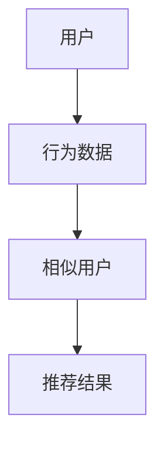
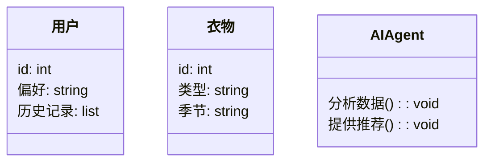
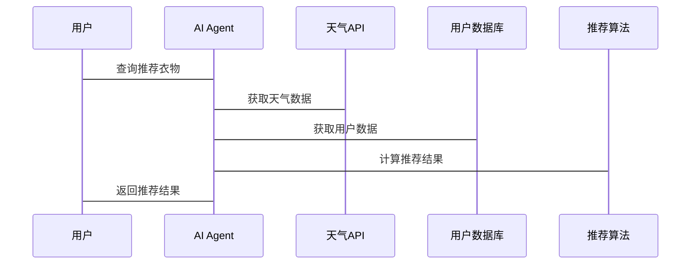

                 


# AI Agent在智能衣柜中的季节性衣物管理

## 关键词：AI Agent, 智能衣柜, 季节性衣物, 推荐算法, 深度学习, 系统架构

## 摘要：本文探讨了AI Agent在智能衣柜中的应用，重点分析了季节性衣物管理的解决方案。通过背景介绍、核心概念、算法原理、系统架构、项目实战和最佳实践，详细阐述了AI Agent如何优化衣物管理，提供高效、个性化的用户体验。

---

# 第1章: 背景介绍

## 1.1 问题背景与描述

### 1.1.1 季节性衣物管理问题的提出

现代生活中，季节性衣物的管理是一个常见的问题。随着季节变化，用户需要及时调整衣物选择，以适应不同的气候和场合。传统的方法依赖于手动分类和记忆，这容易出错且效率低下。

### 1.1.2 传统衣物管理方式的局限性

传统管理方式存在以下问题：
- **效率低下**：手动分类和查找衣物耗时耗力。
- **准确性差**：依赖记忆，容易遗漏或重复选择。
- **个性化不足**：无法根据个人习惯和偏好提供定制化建议。

### 1.1.3 AI Agent在衣物管理中的潜在价值

AI Agent能够通过数据分析和机器学习，提供智能化的衣物管理解决方案，优化用户体验。

## 1.2 问题解决与边界定义

### 1.2.1 AI Agent如何解决衣物管理问题

AI Agent可以通过以下方式优化衣物管理：
- **智能推荐**：根据天气和用户习惯推荐合适的衣物。
- **自动化分类**：自动将衣物按季节或类型分类。
- **行为学习**：通过学习用户的穿衣习惯，提供更精准的建议。

### 1.2.2 系统的边界与功能范围

系统的主要功能包括：
- 衣物分类与管理。
- 天气数据获取与分析。
- 用户行为分析与推荐。

### 1.2.3 相关概念的外延与限制

- **外延**：AI Agent还可以应用于其他领域，如健康管理、智能家居等。
- **限制**：目前主要针对季节性衣物管理，其他功能仍在开发中。

## 1.3 核心概念结构与要素

### 1.3.1 AI Agent的核心要素

- **感知能力**：获取环境数据（如天气）和用户行为数据。
- **决策能力**：基于数据进行推理和决策。
- **执行能力**：通过智能衣柜执行决策。

### 1.3.2 智能衣柜的组成与功能

- **传感器**：监测环境温度、湿度等。
- **存储系统**：存储衣物信息和用户数据。
- **交互界面**：用户与系统互动的界面。

### 1.3.3 季节性衣物管理的逻辑框架

1. 收集数据：环境数据、用户数据。
2. 数据分析：通过AI算法处理数据。
3. 生成建议：推荐合适的衣物。
4. 用户反馈：优化系统。

---

# 第2章: AI Agent与智能衣柜的核心原理

## 2.1 核心概念原理

### 2.1.1 AI Agent的基本原理

AI Agent通过感知环境、分析数据、制定策略和执行操作，实现智能化管理。

### 2.1.2 智能衣柜的工作机制

智能衣柜通过传感器和AI算法，实时监测环境和用户行为，提供智能化的衣物管理服务。

## 2.2 概念属性对比表

| 概念 | 属性 | 描述 |
|------|------|------|
| AI Agent | 智能性 | 自主决策和学习能力 |
| 智能衣柜 | 交互性 | 用户与设备的互动方式 |

## 2.3 ER实体关系图

```mermaid
er
actor: 用户
class: 衣物
object: AI Agent
```

---

# 第3章: 推荐算法与数学模型

## 3.1 推荐算法原理

### 3.1.1 协同过滤算法

协同过滤算法基于用户行为数据，找到相似的用户群体，推荐相似的物品。



### 3.1.2 深度学习模型

深度学习模型通过神经网络学习数据特征，实现更精准的推荐。

```python
class AI-Agent:
    def __init__(self):
        self.data = []
    
    def recommend(self, user):
        # 推荐算法实现
        pass
```

## 3.2 数学模型与公式

### 3.2.1 用户相似度计算

用户相似度可以通过余弦相似度计算：

$$\text{相似度} = \frac{\sum_{i=1}^{n} (u_i \cdot v_i)}{\sqrt{\sum_{i=1}^{n} u_i^2} \cdot \sqrt{\sum_{i=1}^{n} v_i^2}}$$

### 3.2.2 衣物推荐模型

使用协同过滤模型推荐衣物：

$$\hat{r}_{u,i} = \bar{r} + (u_i - \bar{u}) + (v_j - \bar{v})$$

---

# 第4章: 系统分析与架构设计

## 4.1 问题场景介绍

系统需要在不同季节为用户提供衣物推荐服务。

## 4.2 项目介绍

### 4.2.1 系统功能设计

- 衣物分类与管理。
- 天气数据获取与分析。
- 用户行为分析与推荐。

### 4.2.2 领域模型



### 4.2.3 系统架构


### 4.2.4 接口设计

- API接口：获取天气数据、用户数据。
- 数据格式：JSON。

### 4.2.5 交互流程



---

# 第5章: 项目实战

## 5.1 环境安装

安装Python和相关库（如numpy、pandas、scikit-learn）。

## 5.2 核心代码实现

### 5.2.1 数据预处理

```python
import pandas as pd

data = pd.read_csv('clothes.csv')
```

### 5.2.2 推荐算法实现

```python
from sklearn.metrics.pairwise import cosine_similarity

user_data = ...  # 用户数据
item_data = ...  # 衣物数据
similarity = cosine_similarity(user_data, item_data)
```

### 5.2.3 系统集成

将AI Agent集成到智能衣柜系统中，实现衣物推荐功能。

## 5.3 案例分析

通过实际案例分析，验证系统的推荐效果。

## 5.4 代码解读与分析

详细解读代码功能，分析系统实现的细节。

## 5.5 项目小结

总结项目成果，提出改进建议。

---

# 第6章: 最佳实践

## 6.1 小结

AI Agent在智能衣柜中的应用显著提升了衣物管理的效率和个性化体验。

## 6.2 注意事项

- 数据隐私保护。
- 系统性能优化。
- 用户体验设计。

## 6.3 拓展阅读

推荐相关领域的书籍和论文，供读者深入学习。

---

# 总结

本文详细探讨了AI Agent在智能衣柜中的应用，通过系统化的分析和实践，展示了如何利用AI技术优化衣物管理。未来，随着技术的进步，AI Agent在智能衣柜中的应用将更加广泛和深入。

