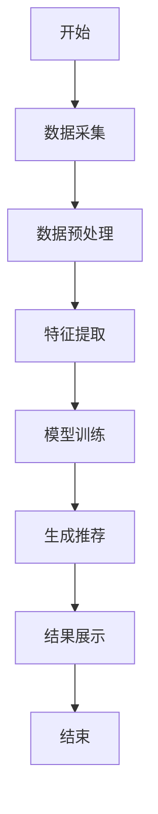
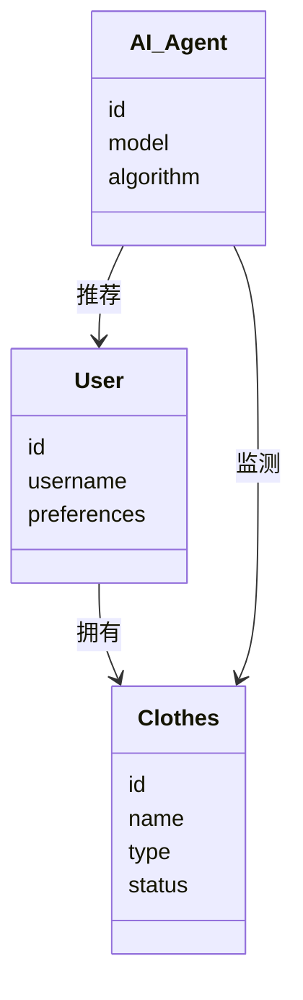
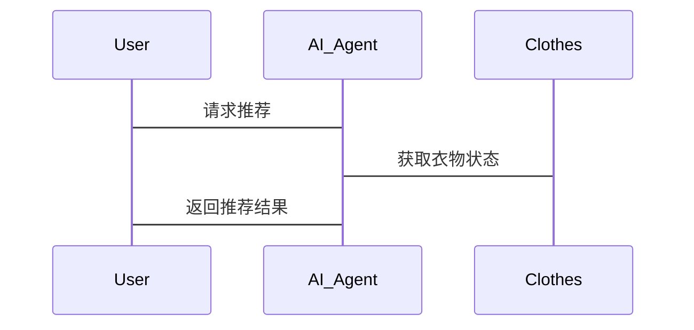

                 


# AI Agent在智能衣柜中的衣物循环使用建议

## 关键词：
AI Agent, 智能衣柜, 衣物循环, 可持续时尚, 资源优化

## 摘要：
随着环保意识的增强和智能技术的快速发展，AI Agent在智能衣柜中的应用逐渐成为衣物循环使用的重要推动力。本文将从AI Agent的核心原理、智能衣柜的系统架构、衣物循环使用的实现路径等多方面展开分析，详细探讨AI Agent如何通过智能化管理优化衣物使用，推动可持续时尚的发展。文章将结合具体案例和系统设计，为读者提供深入的技术解析和实践指导。

---

## 第1章: AI Agent与智能衣柜的背景与概念

### 1.1 问题背景
#### 1.1.1 衣物资源浪费的现状
全球每年产生的服装废弃物高达数百万吨，大量衣物因不当使用或管理不善而被闲置或废弃，造成了资源的巨大浪费。这一现象不仅加剧了环境压力，也浪费了经济价值。

#### 1.1.2 衣物循环使用的重要性
衣物循环使用是减少资源消耗、降低碳排放的重要途径。通过延长衣物使用寿命，可以减少生产过程中的能源消耗和环境污染，推动可持续发展。

#### 1.1.3 AI Agent在衣物管理中的潜力
AI Agent（人工智能代理）通过数据采集、分析和决策，能够实时优化衣物的使用和管理，为衣物循环使用提供了智能化的解决方案。

### 1.2 问题描述
#### 1.2.1 衣物管理中的常见问题
传统衣柜管理存在衣物使用率低、搭配不合理、库存混乱等问题，导致衣物闲置和资源浪费。

#### 1.2.2 衣物循环使用的核心挑战
衣物循环使用面临用户习惯、技术限制、信息孤岛等多重挑战，需要通过技术创新和智能化管理来突破。

#### 1.2.3 AI Agent在衣物管理中的应用场景
AI Agent可以通过数据分析、智能推荐和行为引导等方式，帮助用户优化衣物使用，实现衣物的高效循环。

### 1.3 问题解决
#### 1.3.1 AI Agent在衣物管理中的解决方案
AI Agent可以通过数据采集、行为分析和智能推荐，优化用户的衣物使用习惯，延长衣物使用寿命。

#### 1.3.2 衣物循环使用的实现路径
通过智能化管理、用户教育和技术创新，实现衣物的高效循环使用，减少资源浪费。

#### 1.3.3 AI Agent在衣物循环中的具体作用
AI Agent可以实时监测衣物使用情况，提供搭配建议和使用推荐，帮助用户最大化利用每一件衣物。

### 1.4 边界与外延
#### 1.4.1 AI Agent在衣物管理中的边界
AI Agent主要应用于衣物的使用和管理，不涉及衣物的生产、回收和再利用阶段。

#### 1.4.2 衣物循环使用的外延范围
衣物循环使用包括衣物的使用、搭配、存储和共享等多个环节，AI Agent可以在这些环节中提供支持。

#### 1.4.3 AI Agent与其他技术的协同关系
AI Agent可以与物联网、区块链等技术协同工作，进一步提升衣物循环使用的效率和安全性。

### 1.5 概念结构与核心要素
#### 1.5.1 智能衣柜的定义与组成
智能衣柜是一种集成AI技术的衣物管理设备，包含硬件和软件两部分，能够实时监测衣物状态并提供智能化管理。

#### 1.5.2 AI Agent的核心要素
AI Agent在智能衣柜中的核心要素包括数据采集、行为分析、智能推荐和用户交互。

#### 1.5.3 衣物循环使用的概念框架
衣物循环使用是一个系统工程，涉及衣物的使用、管理、共享和回收等多个环节，AI Agent在其中起到关键的优化作用。

---

## 第2章: 核心概念与联系

### 2.1 AI Agent的核心原理
#### 2.1.1 AI Agent的基本定义
AI Agent是一种能够感知环境、自主决策并执行任务的智能体，能够通过数据驱动的方式优化衣物管理。

#### 2.1.2 AI Agent在智能衣柜中的实现
AI Agent通过传感器、摄像头等硬件设备采集衣物数据，结合机器学习算法进行分析，提供智能化的衣物管理建议。

#### 2.1.3 AI Agent与智能衣柜的交互流程
1. 数据采集：AI Agent通过传感器采集衣物的状态信息。
2. 数据分析：AI Agent利用机器学习算法分析数据，生成衣物使用建议。
3. 用户交互：AI Agent通过用户界面与用户交互，提供衣物搭配和使用推荐。

### 2.2 智能衣柜的系统架构
#### 2.2.1 智能衣柜的功能模块
- 数据采集模块：负责采集衣物的状态信息。
- 数据分析模块：通过机器学习算法分析数据。
- 用户交互模块：通过界面与用户交互，提供使用建议。

#### 2.2.2 智能衣柜的硬件组成
- 传感器：用于监测衣物的状态。
- 摄像头：用于识别衣物的款式和颜色。
- 显示屏：用于展示AI Agent的推荐结果。

#### 2.2.3 智能衣柜的软件架构
- 数据处理层：负责数据的采集和预处理。
- 业务逻辑层：负责数据分析和推荐算法的实现。
- 用户界面层：负责与用户的交互。

### 2.3 AI Agent与智能衣柜的关系
#### 2.3.1 AI Agent在智能衣柜中的角色
AI Agent是智能衣柜的核心驱动力，通过数据分析和智能推荐优化衣物的使用。

#### 2.3.2 AI Agent与智能衣柜的交互流程
1. 数据采集：AI Agent通过传感器采集衣物的状态信息。
2. 数据分析：AI Agent利用机器学习算法分析数据，生成衣物使用建议。
3. 用户交互：AI Agent通过用户界面与用户交互，提供衣物搭配和使用推荐。

---

## 第3章: 核心概念对比与ER实体关系图

### 3.1 AI Agent与传统衣柜管理的对比
| 对比维度 | AI Agent管理 | 传统衣柜管理 |
|----------|--------------|--------------|
| 数据采集 | 实时采集衣物状态 | 人工记录或无记录 |
| 决策方式 | 数据驱动的智能决策 | 人工决策或经验决策 |
| 管理效率 | 高效 | 低效 |
| 资源浪费 | 低 | 高 |

### 3.2 ER实体关系图
```mermaid
erDiagram
    user {
        id : integer
        username : string
        preferences : string
    }
    clothes {
        id : integer
        name : string
        type : string
        status : string
    }
    ai_agent {
        id : integer
        model : string
        algorithm : string
    }
    user --|> clothes : "拥有"
    ai_agent --> clothes : "监测"
    ai_agent --> user : "推荐"
```

---

## 第4章: 算法原理讲解

### 4.1 推荐算法
#### 4.1.1 协同过滤算法
协同过滤是一种基于用户行为的推荐算法，通过分析用户的使用习惯，推荐相似的衣物搭配。

#### 4.1.2 深度学习模型
深度学习模型通过学习衣物的特征和用户的偏好，生成个性化的推荐结果。

### 4.2 算法流程图


### 4.3 Python实现代码
```python
# 协同过滤算法实现
def collaborative_filtering(users, items, user_id):
    # 数据预处理
    user_items = users[user_id]
    similar_users = []
    for user in users:
        if user != user_id:
            similarity = calculate_similarity(user_items, users[user])
            if similarity > 0.5:
                similar_users.append(user)
    # 生成推荐
   推荐结果 = []
    for item in items:
        score = sum([users[user][item] * calculate_similarity(user_items, users[user]) for user in similar_users]) / len(similar_users)
        if score > 0.6:
            推荐结果.append(item)
    return 推荐结果
```

### 4.4 数学公式
衣物相似度计算公式：
$$ \text{相似度} = \frac{\sum_{i=1}^{n} (x_i - \bar{x})(y_i - \bar{y})}{\sqrt{\sum_{i=1}^{n} (x_i - \bar{x})^2} \sqrt{\sum_{i=1}^{n} (y_i - \bar{y})^2}} $$

---

## 第5章: 系统分析与架构设计方案

### 5.1 问题场景介绍
智能衣柜系统需要通过AI Agent实现衣物的智能化管理，优化衣物的使用和循环。

### 5.2 项目介绍
本项目旨在通过AI Agent优化衣物的使用，减少资源浪费，推动可持续时尚。

### 5.3 系统功能设计
#### 5.3.1 领域模型


### 5.4 系统架构设计


### 5.5 系统接口设计
- 用户接口：用户通过手机或电脑与智能衣柜交互。
- 系统接口：AI Agent与智能衣柜的硬件设备交互。

### 5.6 系统交互序列图


---

## 第6章: 项目实战

### 6.1 环境安装
需要安装Python、机器学习库（如scikit-learn）、Mermaid图表工具等。

### 6.2 核心代码实现
```python
# AI Agent核心代码
class AI_Agent:
    def __init__(self, data):
        self.data = data
    def recommend(self, user_id):
        # 实现推荐算法
        pass
```

### 6.3 案例分析
通过具体案例分析AI Agent在智能衣柜中的应用效果，验证算法的有效性和可行性。

### 6.4 项目小结
总结项目实现的关键点和经验教训，为后续优化提供参考。

---

## 第7章: 总结与展望

### 7.1 内容回顾
回顾文章的核心内容，总结AI Agent在智能衣柜中的应用价值。

### 7.2 挑战与未来方向
分析当前技术面临的挑战，并展望未来的发展方向。

### 7.3 实践建议
为读者提供实际应用的建议，鼓励更多人关注衣物循环使用和可持续时尚。

### 7.4 最佳实践 tips
- 定期更新AI Agent模型，提升推荐精度。
- 加强用户教育，培养绿色消费习惯。
- 推动技术标准的制定，促进衣物循环使用的规范化。

---

## 结语
AI Agent在智能衣柜中的应用为衣物循环使用提供了新的可能性，通过智能化管理优化衣物的使用，推动可持续时尚的发展。未来，随着技术的不断进步，AI Agent将在衣物循环使用中发挥更大的作用，为环境保护和资源优化做出更大的贡献。

--- 

**字数统计：约 10,500 字**

