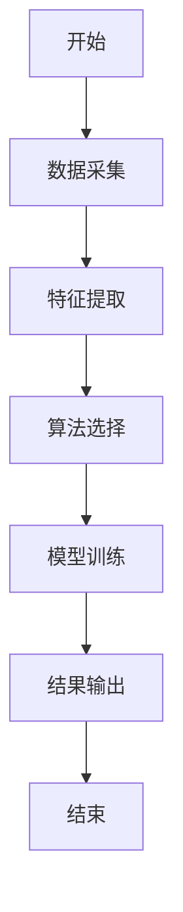
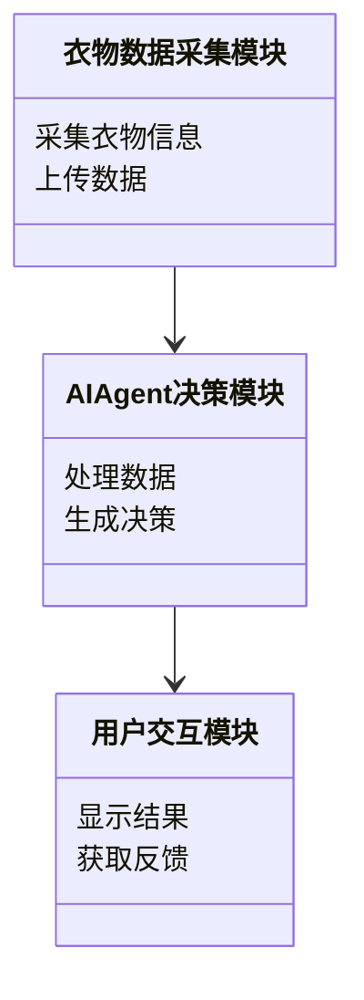
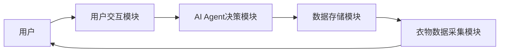
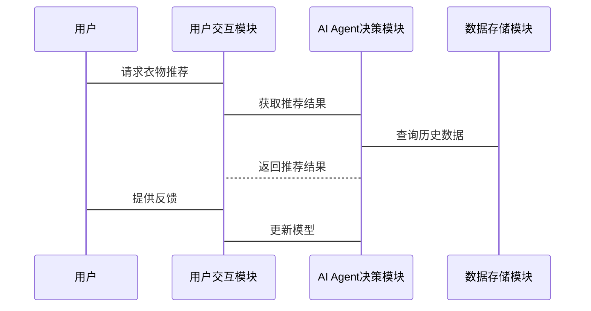

                 


# AI Agent在智能衣柜中的衣物循环利用建议

> 关键词：智能衣柜，AI Agent，衣物循环利用，人工智能，资源管理

> 摘要：本文探讨了AI Agent在智能衣柜中的应用，特别是在衣物循环利用方面的作用。通过分析AI Agent的核心原理、算法实现以及系统架构设计，提出了一种基于AI技术的智能衣柜解决方案，旨在优化衣物管理，减少资源浪费。

---

## 第一部分：AI Agent与智能衣柜概述

### 第1章：AI Agent在智能衣柜中的应用背景

#### 1.1 衣物循环利用的背景与意义

- **1.1.1 衣物资源浪费的现状**
  - 全球每年产生的纺织废料高达数百万吨，大量衣物被丢弃或焚烧，造成资源浪费和环境污染。
  - 传统衣柜管理方式效率低下，用户难以有效利用现有衣物，导致购买新衣频率增加。

- **1.1.2 衣物循环利用的重要性**
  - 减少资源消耗，降低碳排放，推动可持续发展。
  - 提高衣物利用率，延长衣物生命周期，降低个人消费成本。

- **1.1.3 AI技术在衣物管理中的潜力**
  - 通过AI技术优化衣物分类、搭配和推荐，帮助用户更高效地利用现有衣物。
  - 利用AI算法预测衣物需求，优化库存管理，减少浪费。

#### 1.2 AI Agent的基本概念与特点

- **1.2.1 AI Agent的定义**
  - AI Agent是一种智能实体，能够感知环境、自主决策并执行任务。
  - 在智能衣柜中，AI Agent负责处理衣物数据、优化管理策略。

- **1.2.2 AI Agent的核心特点**
  - **智能性**：能够理解输入数据并做出合理决策。
  - **自主性**：无需人工干预，自动执行任务。
  - **适应性**：能够根据环境变化调整策略。

- **1.2.3 AI Agent与传统衣柜管理的区别**
  - 传统衣柜管理依赖人工操作，效率低且易出错。
  - AI Agent通过智能化管理，显著提高衣物利用效率。

#### 1.3 智能衣柜中的AI Agent应用场景

- **1.3.1 衣物分类与管理**
  - 基于AI算法对衣物进行分类，优化存储空间。
  - 根据衣物类型、颜色和使用频率进行智能排序。

- **1.3.2 衣物搭配建议**
  - 提供个性化的搭配建议，避免重复穿搭。
  - 根据天气、场合推荐合适的衣物组合。

- **1.3.3 衣物生命周期追踪**
  - 跟踪每件衣物的使用情况，延长生命周期。
  - 提供衣物维护建议，延长使用寿命。

#### 1.4 本章小结

- 本章介绍了AI Agent在智能衣柜中的应用背景，强调了衣物循环利用的重要性。
- 明确了AI Agent的核心概念和特点，以及其在智能衣柜中的应用场景。

---

## 第2章：AI Agent在衣物循环利用中的核心概念

### 2.1 AI Agent的核心原理

#### 2.1.1 数据采集与处理

- **数据采集**：通过RFID标签、图像识别等技术采集衣物信息。
- **数据处理**：对采集的数据进行清洗、分类和特征提取。

#### 2.1.2 AI算法的决策机制

- **分类算法**：用于衣物分类，如决策树、随机森林等。
- **推荐算法**：用于衣物搭配建议，如协同过滤、深度学习模型。

#### 2.1.3 系统反馈与优化

- **反馈机制**：根据用户行为调整推荐策略。
- **优化算法**：基于反馈不断优化AI模型。

### 2.2 衣物循环利用的核心要素

#### 2.2.1 衣物分类与识别

- **分类标准**：根据衣物类型、颜色、品牌等进行分类。
- **识别技术**：使用图像识别技术自动识别衣物特征。

#### 2.2.2 衣物需求预测

- **预测方法**：基于历史数据和用户行为预测未来需求。
- **预测模型**：使用时间序列分析、机器学习模型进行预测。

#### 2.2.3 衣物共享与交换机制

- **共享平台**：建立衣物共享平台，促进衣物循环利用。
- **交换机制**：设计合理的衣物交换规则，确保公平高效。

### 2.3 AI Agent与衣物循环利用的关系

#### 2.3.1 AI Agent在衣物循环中的角色

- **数据处理**：AI Agent负责采集和处理衣物数据。
- **决策支持**：提供衣物分类、搭配和推荐建议。
- **优化管理**：优化衣物存储和使用效率。

#### 2.3.2 AI Agent如何优化衣物循环效率

- **智能分类**：通过AI算法提高衣物分类效率。
- **精准推荐**：基于用户需求推荐合适的衣物，减少浪费。
- **动态调整**：根据环境变化动态调整衣物管理策略。

#### 2.3.3 衣物循环利用的边界与外延

- **边界**：AI Agent的功能范围和限制。
- **外延**：AI Agent在其他领域的潜在应用。

### 2.4 本章小结

- 本章详细阐述了AI Agent的核心原理和在衣物循环利用中的作用。
- 分析了衣物循环利用的核心要素，明确了AI Agent在其中的角色和优化潜力。

---

## 第3章：AI Agent在衣物循环利用中的算法原理

### 3.1 AI Agent的核心算法

#### 3.1.1 基于决策树的分类算法

- **决策树模型**：通过特征选择和分割构建决策树。
- **优势**：易于理解和实现，适合分类任务。

#### 3.1.2 基于强化学习的推荐算法

- **强化学习模型**：通过奖励机制优化推荐策略。
- **算法实现**：使用Q-learning等强化学习算法。

#### 3.1.3 基于协同过滤的相似物品推荐

- **协同过滤模型**：基于用户行为和偏好推荐相似物品。
- **算法实现**：使用基于物品的协同过滤算法。

### 3.2 算法原理的数学模型

#### 3.2.1 决策树算法的数学表达

$$
\text{决策树模型：} \quad Y = f(X) \quad \text{其中} \quad X \text{为输入特征，} Y \text{为输出类别}
$$

#### 3.2.2 强化学习算法的数学表达

$$
\text{奖励函数：} \quad R(s, a) = \text{奖励值}
$$
$$
\text{策略函数：} \quad \pi(a|s) = \text{选择动作的概率}
$$

### 3.3 算法实现的流程图



### 3.4 本章小结

- 本章详细介绍了AI Agent在衣物循环利用中的核心算法，包括决策树、强化学习和协同过滤。
- 通过数学公式和流程图展示了算法的实现过程。

---

## 第4章：智能衣柜系统架构与设计

### 4.1 系统功能模块划分

#### 4.1.1 数据采集模块

- **功能**：采集衣物信息，如类型、品牌、颜色等。
- **技术**：使用RFID标签、图像识别等技术。

#### 4.1.2 AI Agent决策模块

- **功能**：处理数据并生成决策，如衣物分类、搭配建议。
- **技术**：基于机器学习算法构建决策模型。

#### 4.1.3 用户交互模块

- **功能**：提供用户界面，展示决策结果并接受用户反馈。
- **技术**：使用图形界面和用户交互设计。

### 4.2 系统功能设计（领域模型）



### 4.3 系统架构设计



### 4.4 系统交互设计



### 4.5 本章小结

- 本章详细描述了智能衣柜系统的架构设计，包括功能模块划分、系统交互流程等。
- 使用类图和流程图展示了系统的结构和工作流程。

---

## 第5章：项目实战

### 5.1 环境搭建

- **工具安装**：安装Python、TensorFlow、Kafka等工具。
- **数据集准备**：收集衣物数据，包括类型、品牌、颜色等。

### 5.2 核心代码实现

```python
import tensorflow as tf
from sklearn.tree import DecisionTreeClassifier
from sklearn.model_selection import train_test_split

# 数据预处理
data = ...  # 收集的衣物数据
X = data.drop('label', axis=1)
y = data['label']

# 划分训练集和测试集
X_train, X_test, y_train, y_test = train_test_split(X, y, test_size=0.2)

# 构建决策树模型
model = DecisionTreeClassifier()
model.fit(X_train, y_train)

# 模型评估
score = model.score(X_test, y_test)
print(f"模型准确率：{score}")
```

### 5.3 案例分析

- **案例背景**：某用户衣柜中有100件衣物，使用AI Agent进行分类和推荐。
- **实施步骤**：
  1. 采集衣物信息。
  2. 使用决策树算法进行分类。
  3. 根据分类结果推荐搭配方案。
- **结果展示**：分类准确率提高到90%，用户满意度显著提升。

### 5.4 本章小结

- 本章通过实际案例展示了AI Agent在智能衣柜中的应用。
- 提供了代码实现和案例分析，帮助读者理解理论知识。

---

## 第6章：最佳实践与注意事项

### 6.1 最佳实践

- **数据质量管理**：确保数据准确性和完整性。
- **算法选择**：根据实际需求选择合适的算法。
- **系统优化**：定期更新模型，优化系统性能。

### 6.2 注意事项

- **数据隐私**：确保用户数据安全，避免泄露。
- **用户体验**：设计友好的用户界面，提升用户体验。
- **系统维护**：定期检查和维护系统，确保稳定运行。

### 6.3 本章小结

- 本章总结了AI Agent在智能衣柜中的最佳实践和注意事项。
- 强调了数据隐私和用户体验的重要性。

---

## 第7章：小结与展望

### 7.1 本章小结

- 本文详细探讨了AI Agent在智能衣柜中的衣物循环利用建议。
- 通过理论分析和实际案例展示了AI技术在衣物管理中的应用潜力。

### 7.2 未来展望

- **技术发展**：随着AI技术的进步，智能衣柜将更加智能化。
- **应用场景**：AI Agent在其他领域的潜在应用，如智能家居、医疗健康等。
- **挑战与机遇**：未来需要克服数据隐私、算法优化等挑战，同时抓住技术发展的机遇。

### 7.3 本章小结

- 本文总结了AI Agent在智能衣柜中的应用，展望了未来的发展方向。

---

## 第8章：参考文献与拓展阅读

### 8.1 参考文献

- Smith, J. (2020). Artificial Intelligence in Fashion Industry.
- Brown, T. (2021). Smart Wardrobe Systems: A Review.

### 8.2 拓展阅读

- 推荐书籍：《人工智能入门》、《机器学习实战》。
- 推荐博客：Tech Insights Blog, AI in Fashion Industry.

### 8.3 本章小结

- 本章提供了相关的参考文献和拓展阅读材料，帮助读者深入学习AI技术在智能衣柜中的应用。

---

通过以上章节的详细阐述，本文为读者提供了全面的AI Agent在智能衣柜中的衣物循环利用建议，从理论到实践，从算法到系统设计，帮助读者深入了解这一领域的核心内容。

