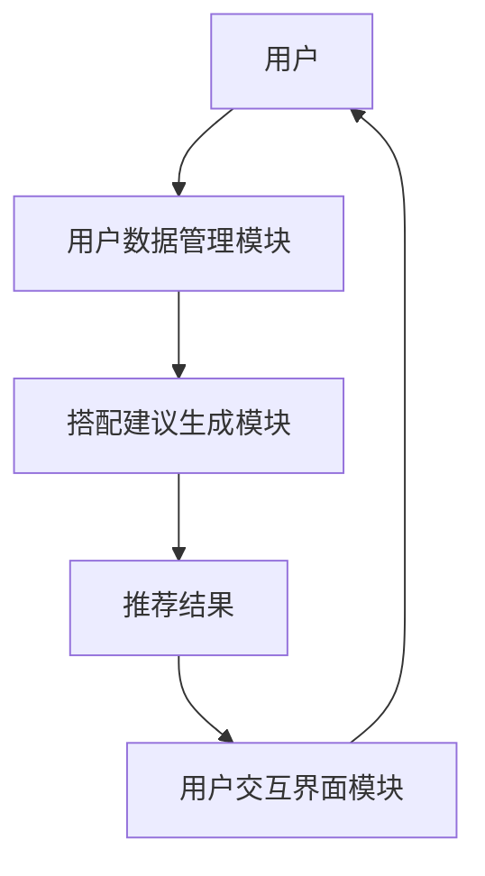

                 


# AI Agent在智能衣柜中的衣物搭配建议

## 关键词：AI Agent, 智能衣柜, 衣物搭配, 推荐算法, 深度学习, 系统架构

## 摘要：本文探讨了AI Agent在智能衣柜中的应用，通过分析衣物搭配的核心问题，结合协同过滤和深度学习算法，提出了基于AI Agent的智能衣物搭配系统架构。文章详细阐述了AI Agent的基本概念、核心原理、算法实现和系统设计，并通过实际案例展示了系统的应用场景和优势。

---

## 第1章：AI Agent与智能衣柜的背景介绍

### 1.1 AI Agent的基本概念与应用场景

#### 1.1.1 AI Agent的基本定义
AI Agent（人工智能代理）是指能够感知环境、做出决策并采取行动以实现目标的智能系统。AI Agent可以通过传感器、数据库或用户输入获取信息，并利用算法进行分析和推理，最终生成相应的输出或执行操作。

#### 1.1.2 AI Agent的核心特征
- **自主性**：AI Agent能够自主决策和行动。
- **反应性**：能够实时感知环境变化并做出反应。
- **社会性**：可以与其他AI Agent或人类交互协作。
- **学习能力**：能够通过数据学习和优化自身的行为。

#### 1.1.3 AI Agent的应用场景
AI Agent广泛应用于推荐系统、智能助手、自动驾驶等领域。在智能衣柜中，AI Agent可以用于衣物搭配、穿衣建议、库存管理等功能。

### 1.2 智能衣柜的发展现状

#### 1.2.1 智能衣柜的概念与发展
智能衣柜是一种结合了物联网技术和人工智能的智能存储系统，能够通过传感器和AI算法帮助用户管理和搭配衣物。

#### 1.2.2 智能衣柜的主要功能
- **衣物识别**：通过图像识别技术自动识别衣物种类和属性。
- **库存管理**：实时记录衣物的数量、状态和位置。
- **穿衣建议**：根据天气、场合和用户偏好推荐衣物搭配。
- **趋势分析**：分析用户的穿衣习惯和时尚趋势，提供个性化建议。

#### 1.2.3 智能衣柜的技术实现
智能衣柜的核心技术包括图像识别、自然语言处理、推荐算法和物联网通信等。

### 1.3 AI Agent在衣物搭配中的应用价值

#### 1.3.1 衣物搭配的基本问题
衣物搭配的核心问题是如何根据用户的身材、肤色、场合、天气和个人风格推荐合适的衣物组合。传统的人工搭配方式效率低、主观性强，难以满足多样化的需求。

#### 1.3.2 AI Agent在衣物搭配中的优势
AI Agent可以通过大数据分析和机器学习算法，快速生成个性化且科学的搭配建议，提高搭配效率和准确性。

#### 1.3.3 衣物搭配的边界与外延
AI Agent在衣物搭配中的应用范围包括但不限于日常穿搭、职业装搭配、运动装备推荐等。其外延可以扩展到配饰搭配、鞋帽推荐等领域。

---

## 第2章：AI Agent与智能衣柜的核心概念与联系

### 2.1 AI Agent的核心原理与技术实现

#### 2.1.1 AI Agent的核心原理
AI Agent通过感知环境、分析数据、推理决策并执行行动来实现目标。在智能衣柜中，AI Agent主要通过以下步骤实现衣物搭配：
1. **数据采集**：获取用户的衣物信息、天气数据和个人偏好。
2. **数据分析**：利用算法分析数据，生成推荐结果。
3. **结果输出**：通过界面或语音等方式向用户展示搭配建议。

#### 2.1.2 AI Agent在智能衣柜中的技术实现
- **感知技术**：通过图像识别和传感器技术获取衣物信息。
- **推理算法**：利用协同过滤和深度学习算法生成搭配建议。
- **决策与执行**：根据推荐结果生成穿衣方案并反馈给用户。

#### 2.1.3 AI Agent与智能衣柜的联系
AI Agent是智能衣柜的核心驱动力，通过AI Agent的感知和推理能力，智能衣柜能够为用户提供个性化的衣物搭配建议。

---

## 第3章：AI Agent在衣物搭配中的算法原理

### 3.1 基于协同过滤的推荐算法

#### 3.1.1 协同过滤算法的基本原理
协同过滤是一种基于用户行为和偏好相似性的推荐算法。通过分析用户的穿衣历史和偏好，协同过滤可以找到与目标用户相似的用户群体，并推荐这些用户喜欢的衣物。

#### 3.1.2 协同过滤算法的实现步骤
1. **数据采集**：收集用户的穿衣记录和偏好信息。
2. **用户相似度计算**：利用余弦相似度或欧氏距离计算用户之间的相似度。
3. **推荐生成**：根据相似用户的偏好生成推荐结果。

#### 3.1.3 协同过滤算法的优缺点
- **优点**：简单易实现，适合中小规模数据。
- **缺点**：推荐结果可能不够精准，难以应对用户偏好变化。

### 3.2 基于深度学习的推荐算法

#### 3.2.1 深度学习模型的基本原理
深度学习模型（如卷积神经网络和循环神经网络）通过多层非线性变换提取数据的特征，从而实现更精准的推荐。

#### 3.2.2 基于深度学习的推荐模型
- **衣物特征提取**：利用卷积神经网络提取衣物的视觉特征。
- **用户特征表示**：利用循环神经网络建模用户的穿衣历史。
- **推荐生成**：基于衣物和用户的特征生成推荐结果。

#### 3.2.3 深度学习模型的训练过程
1. **数据预处理**：对衣物数据进行归一化和标注。
2. **模型训练**：利用训练数据优化模型参数。
3. **模型评估**：通过测试数据验证模型的推荐效果。

---

## 第4章：AI Agent在智能衣柜中的系统架构设计

### 4.1 系统功能设计

#### 4.1.1 系统功能模块
- **用户数据管理模块**：管理用户的衣物信息和偏好数据。
- **搭配建议生成模块**：基于算法生成衣物搭配建议。
- **用户交互界面模块**：提供可视化或语音交互界面供用户使用。

#### 4.1.2 系统功能流程
1. 用户通过界面输入需求或传感器采集数据。
2. 系统根据需求调用算法生成推荐结果。
3. 推荐结果通过界面反馈给用户。

### 4.2 系统架构设计

#### 4.2.1 系统架构图


#### 4.2.2 系统分层设计
- **数据层**：存储用户数据和衣物信息。
- **算法层**：实现推荐算法和模型训练。
- **交互层**：处理用户输入和输出。

---

## 第5章：AI Agent在智能衣柜中的项目实战

### 5.1 环境安装与配置

#### 5.1.1 开发环境
- **操作系统**：Windows 10或macOS
- **编程语言**：Python 3.8+
- **深度学习框架**：TensorFlow或Keras
- **图像处理库**：OpenCV
- **数据存储**：MySQL或MongoDB

#### 5.1.2 安装依赖
```bash
pip install numpy pandas scikit-learn tensorflow keras matplotlib opencv-python
```

### 5.2 核心代码实现

#### 5.2.1 协同过滤算法实现
```python
from sklearn.metrics.pairwise import cosine_similarity

# 示例数据：用户对衣物的偏好评分
preference_matrix = [
    [4, 3, 2, 1],
    [3, 4, 1, 2],
    [2, 1, 4, 3],
    [1, 2, 3, 4]
]

# 计算用户相似度矩阵
similarity_matrix = cosine_similarity(preference_matrix)
```

#### 5.2.2 深度学习模型实现
```python
import tensorflow as tf
from tensorflow.keras import layers

# 构建深度学习模型
model = tf.keras.Sequential([
    layers.Conv2D(32, (3, 3), activation='relu', input_shape=(64, 64, 3)),
    layers.MaxPooling2D((2, 2)),
    layers.Flatten(),
    layers.Dense(128, activation='relu'),
    layers.Dense(10, activation='softmax')
])

# 编译模型
model.compile(optimizer='adam', loss='sparse_categorical_crossentropy', metrics=['accuracy'])
```

### 5.3 实际案例分析

#### 5.3.1 案例背景
某用户希望在春秋季节搭配一套适合商务场合的西装和衬衫组合。

#### 5.3.2 算法推荐过程
1. 系统通过协同过滤算法找到与该用户偏好相似的其他用户。
2. 基于深度学习模型提取西装和衬衫的视觉特征，生成搭配建议。
3. 系统推荐一套经典的蓝灰色西装和白色衬衫组合。

---

## 第6章：最佳实践与小结

### 6.1 最佳实践

#### 6.1.1 数据质量
确保衣物数据的准确性和完整性，避免数据偏差影响推荐效果。

#### 6.1.2 算法优化
结合协同过滤和深度学习算法，提高推荐的准确性和多样性。

#### 6.1.3 系统性能
优化系统的响应速度和稳定性，提升用户体验。

### 6.2 小结

本文详细介绍了AI Agent在智能衣柜中的应用，从核心概念到算法实现，再到系统设计和项目实战，全面探讨了AI Agent在衣物搭配中的潜力和价值。通过本文的学习，读者可以掌握AI Agent的基本原理和实现方法，为后续的研究和应用打下基础。

### 6.3 注意事项

- 确保用户数据的安全性和隐私保护。
- 定期更新衣物数据库和时尚趋势数据，保持推荐的时效性。
- 提供多语言支持和多种交互方式，满足不同用户的需求。

### 6.4 拓展阅读

- 《推荐系统实践》：深入探讨推荐算法的实现和优化。
- 《深度学习入门》：系统介绍深度学习的基本原理和应用。
- 《智能衣柜设计与实现》：详细讲解智能衣柜的硬件设计和系统集成。

---

以上是《AI Agent在智能衣柜中的衣物搭配建议》的完整目录和文章内容，涵盖了从理论到实践的各个方面，适合技术爱好者和研究人员参考学习。

