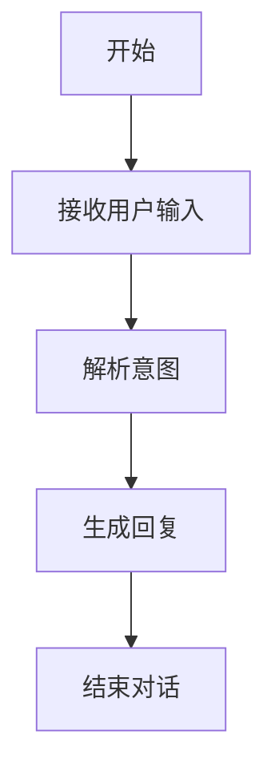
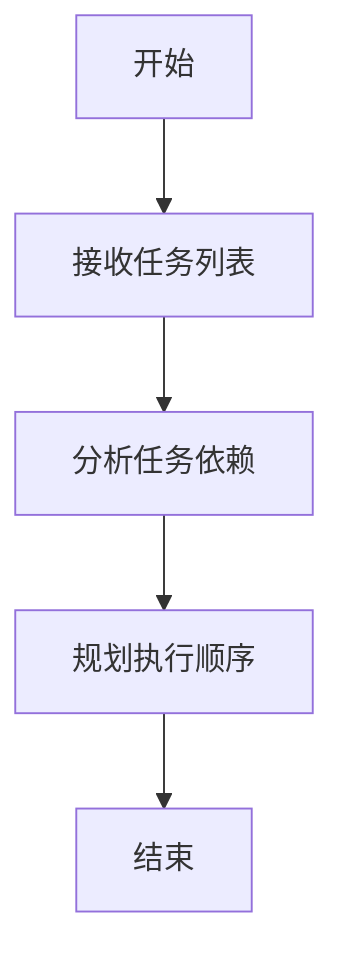
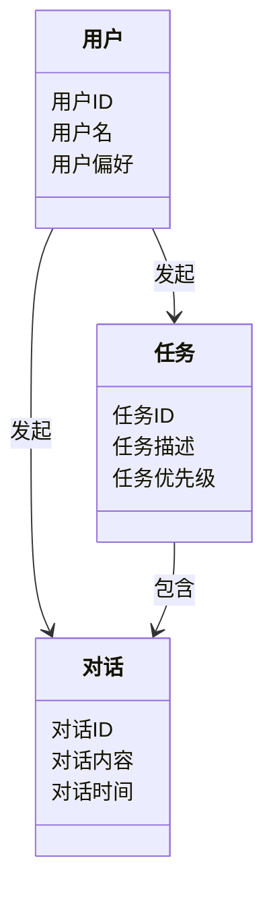
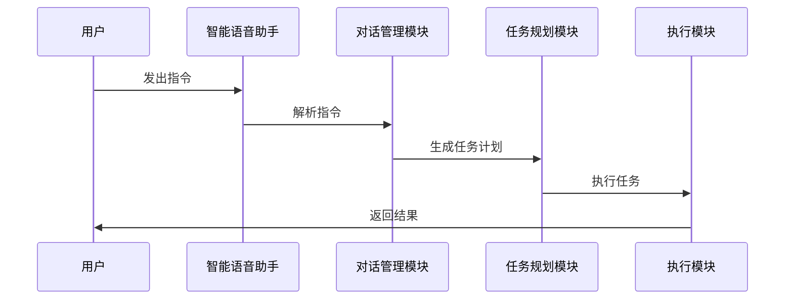

                 


# AI Agent在智能语音助手中的应用

> 关键词：AI Agent，智能语音助手，自然语言处理，对话管理，任务规划，语音交互，人机协作

> 摘要：AI Agent（人工智能代理）在智能语音助手中的应用，标志着人机交互技术的重大进步。本文系统地探讨了AI Agent的核心概念、算法原理、系统架构，并通过项目实战展示了其在智能语音助手中的具体应用。文章还分析了数学模型和公式，总结了系统设计的关键点，并展望了未来的发展趋势。

---

## 第1章: AI Agent与智能语音助手的背景介绍

### 1.1 问题背景

#### 1.1.1 传统语音助手的局限性
传统的智能语音助手（如Siri、Alexa）基于规则和预定义的语料库，无法处理复杂的上下文关系和动态任务。用户提问超出预设范围时，系统往往无法有效响应，影响用户体验。

#### 1.1.2 AI Agent的出现与意义
AI Agent是一种能够感知环境、自主决策并执行任务的智能体。其引入使语音助手具备更强的适应性和学习能力，能够处理更复杂的交互场景。

#### 1.1.3 智能语音助手的演变
从基于规则的简单交互向基于AI Agent的智能交互转变，语音助手的功能从单一查询扩展到任务管理、信息检索、日程安排等多个领域。

### 1.2 问题描述

#### 1.2.1 AI Agent的核心功能
AI Agent通过自然语言处理、机器学习和推理引擎实现对话理解、任务规划和执行反馈。

#### 1.2.2 智能语音助手的现状
目前，语音助手在用户体验、任务复杂度和环境适应性方面仍有提升空间，尤其在处理多轮对话和复杂任务时表现不足。

#### 1.2.3 当前技术的瓶颈与挑战
主要挑战包括如何处理动态上下文、优化任务规划算法、提高模型的可解释性和鲁棒性。

### 1.3 问题解决

#### 1.3.1 AI Agent在语音助手中的作用
AI Agent通过自然语言理解和任务规划，提升语音助手的交互能力，使其能够处理更复杂的用户需求。

#### 1.3.2 解决方案的技术路线
采用基于深度学习的对话模型和强化学习的任务规划算法，构建智能语音助手的核心模块。

#### 1.3.3 实现目标与预期效果
实现多轮对话管理和动态任务规划，提升用户体验和系统效率。

### 1.4 边界与外延

#### 1.4.1 AI Agent的应用范围
涵盖智能客服、智能家居、教育辅助等领域，尤其适合需要复杂任务处理和个性化服务的场景。

#### 1.4.2 与传统语音助手的区别
AI Agent具备自主决策和学习能力，而传统语音助手依赖预定义规则和语料库。

#### 1.4.3 相关技术的对比分析
对比基于规则的传统方法和基于AI Agent的现代方法，分析其优缺点和适用场景。

### 1.5 概念结构与核心要素

#### 1.5.1 AI Agent的基本构成
包括感知模块、决策模块和执行模块，分别负责信息收集、任务规划和动作执行。

#### 1.5.2 智能语音助手的核心要素
包括语音识别、自然语言理解、对话管理、任务规划和执行反馈。

#### 1.5.3 两者的关联与区别
AI Agent作为智能语音助手的核心，通过提供更智能的交互能力，增强了语音助手的功能和用户体验。

---

## 第2章: AI Agent的核心概念与联系

### 2.1 核心概念原理

#### 2.1.1 AI Agent的原理
AI Agent通过感知环境、理解用户需求、制定计划并执行任务，实现与用户的高效交互。

#### 2.1.2 智能语音助手的运作机制
智能语音助手通过语音识别、自然语言处理和任务规划，为用户提供服务。

#### 2.1.3 AI Agent与智能语音助手的联系
AI Agent是智能语音助手的核心模块，负责处理复杂的交互逻辑和任务执行。

### 2.2 概念属性对比

#### 2.2.1 不同类型AI Agent的对比
| 类型         | 基于规则的AI Agent | 基于学习的AI Agent |
|--------------|---------------------|---------------------|
| 决策方式     | 预定义规则         | 机器学习模型       |
| 适应性       | 较低               | 较高               |
| 应用场景     | 简单任务           | 复杂任务           |

### 2.3 ER实体关系图

```mermaid
er
    entity 用户 {
        key 用户ID
       属性 用户名
        属性 用户偏好
    }
    entity 任务 {
        key 任务ID
        属性 任务描述
        属性 任务优先级
    }
    entity 对话 {
        key 对话ID
        属性 对话内容
        属性 对话时间
    }
    relationship 用户-任务 {
        关联类型：拥有
        用户通过任务ID关联到任务
    }
    relationship 用户-对话 {
        关联类型：发起
        用户通过对话ID关联到对话
    }
    relationship 任务-对话 {
        关联类型：包含
        任务通过对话ID关联到对话
    }
```

---

## 第3章: AI Agent的算法原理

### 3.1 多轮对话管理算法

#### 3.1.1 算法原理
基于长短期记忆网络（LSTM）的序列模型，处理多轮对话的历史信息，生成连贯的回复。

#### 3.1.2 mermaid流程图



#### 3.1.3 Python代码实现

```python
import tensorflow as tf
from tensorflow.keras import layers

# 定义模型
model = tf.keras.Sequential()
model.add(layers.LSTM(128, return_sequences=True))
model.add(layers.Dense(128, activation='relu'))
model.add(layers.Dense(64, activation='softmax'))
model.compile(optimizer='adam', loss='categorical_crossentropy', metrics=['accuracy'])
```

### 3.2 任务规划算法

#### 3.2.1 算法原理
基于约束规划的强化学习算法，通过动态规划优化任务优先级和执行顺序。

#### 3.2.2 mermaid流程图



#### 3.2.3 Python代码实现

```python
import numpy as np

# 定义任务规划器
def plan_tasks(tasks, dependencies):
    # 使用约束规划算法
    ordered_tasks = []
    while tasks:
        for task in tasks:
            if all(dependency in ordered_tasks for dependency in dependencies.get(task, [])):
                ordered_tasks.append(task)
                tasks.remove(task)
                break
    return ordered_tasks
```

### 3.3 数学模型和公式

#### 3.3.1 对话管理模型
对话管理的目标是最大化用户满意度，可表示为：
$$
\text{目标函数} = \max_{\theta} \sum_{i=1}^{n} w_i x_i
$$
其中，$w_i$ 是任务权重，$x_i$ 是任务完成状态。

#### 3.3.2 任务规划模型
任务规划模型基于马尔可夫决策过程：
$$
V(s) = \max_{a} [r(s, a) + \gamma V(s') ]
$$
其中，$s$ 是当前状态，$a$ 是动作，$\gamma$ 是折扣因子。

---

## 第4章: 系统分析与架构设计

### 4.1 系统功能设计

#### 4.1.1 领域模型


#### 4.1.2 系统架构设计


#### 4.1.3 接口设计
- 用户输入接口：接收语音输入并解析为文本。
- 任务执行接口：调用第三方服务完成任务。
- 反馈接口：将执行结果返回给用户。

#### 4.1.4 交互流程


---

## 第5章: 项目实战

### 5.1 环境安装

#### 5.1.1 安装Python和相关库
```bash
pip install numpy tensorflow keras
```

#### 5.1.2 安装开发环境
安装Jupyter Notebook和相关开发工具。

### 5.2 核心实现

#### 5.2.1 对话管理模块
```python
class DialogManager:
    def __init__(self):
        self.history = []

    def process_input(self, input_text):
        # 处理输入并更新对话历史
        self.history.append(input_text)
        return self.generate_response()

    def generate_response(self):
        # 生成回复
        pass
```

#### 5.2.2 任务规划模块
```python
class TaskPlanner:
    def __init__(self):
        self.tasks = []

    def add_task(self, task):
        self.tasks.append(task)

    def plan_execution_order(self):
        # 使用约束规划算法
        pass
```

### 5.3 实际案例分析

#### 5.3.1 案例介绍
设计一个智能语音助手，支持任务管理功能，如日程安排、任务提醒等。

#### 5.3.2 代码实现
```python
# 对话管理模块实现
class DialogManager:
    def __init__(self):
        self.history = []

    def process_input(self, input_text):
        self.history.append(input_text)
        return self.generate_response()

    def generate_response(self):
        # 示例回复
        return "请问您有什么需要帮助的吗？"

# 任务规划模块实现
class TaskPlanner:
    def __init__(self):
        self.tasks = []

    def add_task(self, task):
        self.tasks.append(task)

    def plan_execution_order(self):
        ordered_tasks = []
        while self.tasks:
            for task in self.tasks:
                if all(dependency in ordered_tasks for dependency in task['dependencies']):
                    ordered_tasks.append(task)
                    self.tasks.remove(task)
                    break
        return ordered_tasks
```

### 5.4 项目总结

#### 5.4.1 项目经验
AI Agent在智能语音助手中的应用提升了系统的交互能力和任务处理能力。

#### 5.4.2 项目价值
实现了多轮对话管理和复杂任务规划，为用户提供了更智能的服务体验。

---

## 第6章: 总结与展望

### 6.1 总结

#### 6.1.1 全文回顾
本文系统地探讨了AI Agent在智能语音助手中的应用，从理论到实践，详细分析了其核心概念、算法原理和系统架构。

#### 6.1.2 核心内容
AI Agent通过自然语言处理和任务规划算法，显著提升了智能语音助手的交互能力。

### 6.2 未来展望

#### 6.2.1 技术发展
AI Agent在智能语音助手中的应用将更加智能化和个性化，结合边缘计算和物联网技术，实现更高效的交互和任务处理。

#### 6.2.2 应用场景
未来，AI Agent将广泛应用于智能客服、教育辅助、医疗健康等领域，为用户提供更智能的服务体验。

### 6.3 最佳实践

#### 6.3.1 数据质量的重要性
高质量的数据是训练AI Agent的关键，需注重数据的多样性和代表性。

#### 6.3.2 模型的可解释性
提高模型的可解释性，有助于优化系统并提升用户体验。

#### 6.3.3 用户隐私保护
加强用户隐私保护，确保数据安全和合规性。

---

# 结语

AI Agent在智能语音助手中的应用标志着人机交互技术的重要进步。通过本文的系统分析和项目实战，读者可以深入理解AI Agent的核心原理和应用场景。未来，随着技术的不断进步，AI Agent将在更多领域发挥重要作用，为人类带来更智能、更便捷的生活体验。

