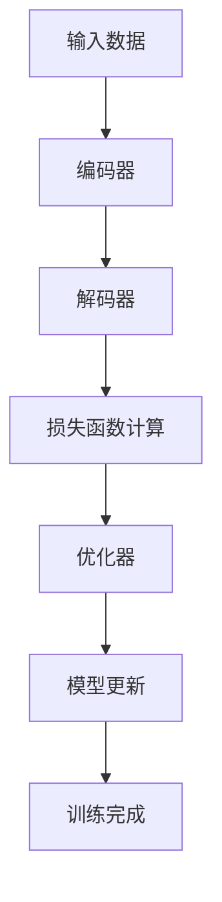
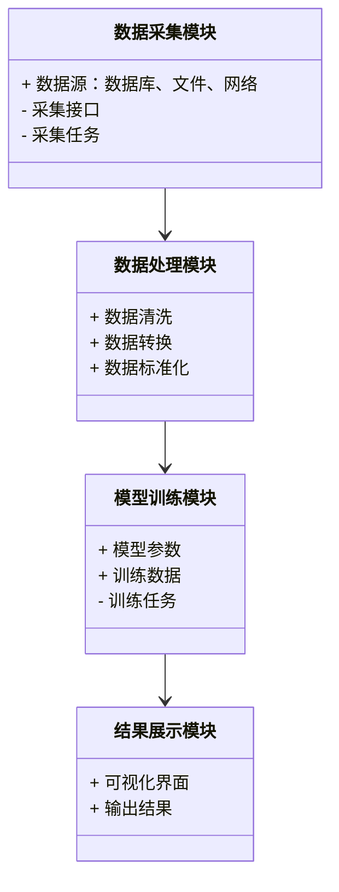
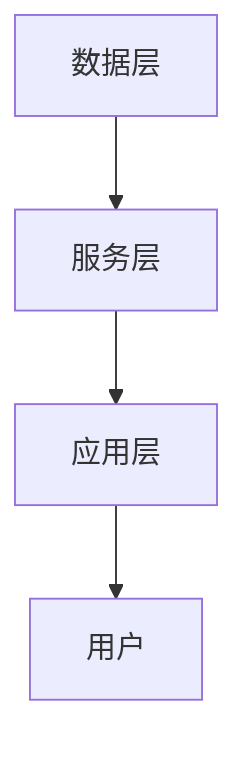
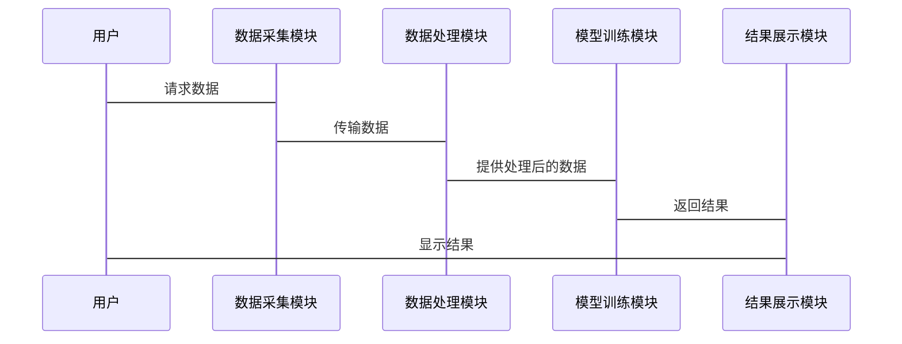

                 


# AI Agent在智能财务分析中的应用

## 关键词：AI Agent，智能财务分析，财务数据分析，人工智能，机器学习，深度学习

## 摘要：  
随着人工智能技术的飞速发展，AI Agent在智能财务分析中的应用越来越广泛。本文从AI Agent的基本概念出发，详细探讨其在智能财务分析中的核心原理、算法实现、系统架构以及实际应用案例。通过对比生成模型与检索模型，分析多模态数据处理能力，解读自适应学习机制，结合实际项目案例，为读者呈现AI Agent在智能财务分析中的深度应用与价值。  

---

## 第1章: AI Agent与智能财务分析的背景介绍

### 1.1 AI Agent的基本概念与技术基础  
AI Agent（人工智能代理）是一种能够感知环境、执行任务并做出决策的智能系统。它具备自主性、反应性、目标导向性和社交能力等核心特征。AI Agent在财务分析中的应用，能够显著提升数据分析的效率和准确性。  

**1.1.1 AI Agent的定义与核心特征**  
AI Agent是一种智能系统，能够通过感知环境、处理信息并执行任务来实现目标。其核心特征包括：  
- **自主性**：能够在没有外部干预的情况下独立运行。  
- **反应性**：能够实时感知环境并做出响应。  
- **目标导向性**：通过设定目标来指导行为和决策。  
- **社交能力**：能够与其他系统或用户进行交互和协作。  

**1.1.2 AI Agent在财务领域的应用背景**  
随着企业数据量的快速增长，传统的人工财务分析方式逐渐暴露出效率低、准确性差等问题。AI Agent通过自动化处理、智能分析和实时反馈，为财务分析提供了新的解决方案。  

**1.1.3 AI Agent与传统财务分析的对比**  
| 对比维度          | AI Agent财务分析          | 传统财务分析          |  
|-------------------|--------------------------|-----------------------|  
| 数据处理能力      | 高效处理多模态数据        | 依赖人工处理           |  
| 决策效率          | 实时决策，快速响应        | 周期性、依赖人工判断   |  
| 可扩展性          | 支持大规模数据处理        | 受限于人工处理能力     |  

### 1.2 智能财务分析的定义与技术基础  
智能财务分析是指通过人工智能技术，对财务数据进行深度分析、预测和决策的过程。其核心技术包括机器学习、自然语言处理（NLP）、计算机视觉（CV）等。  

**1.2.1 智能财务分析的定义**  
智能财务分析是一种基于人工智能技术的财务数据分析方法，能够通过自动化处理、智能学习和实时反馈，实现对财务数据的深度洞察和价值挖掘。  

**1.2.2 智能财务分析的核心技术**  
智能财务分析的核心技术包括：  
- **机器学习**：用于数据建模和预测。  
- **自然语言处理（NLP）**：用于处理财务报告和文本数据。  
- **计算机视觉（CV）**：用于处理财务图像数据（如发票识别）。  
- **知识图谱**：用于构建财务知识库。  

**1.2.3 智能财务分析的应用场景**  
- **财务报表分析**：自动解析财务报表并生成分析报告。  
- **财务预测**：基于历史数据预测未来的财务状况。  
- **风险评估**：识别潜在的财务风险并提出应对策略。  
- **智能决策支持**：为管理层提供实时的决策支持。  

### 1.3 AI Agent在智能财务分析中的应用价值  
AI Agent在智能财务分析中的应用价值主要体现在以下几个方面：  
1. **提高财务分析效率**：通过自动化处理减少人工干预，提升分析速度。  
2. **增强财务预测准确性**：利用机器学习模型提高预测的精准度。  
3. **优化财务决策过程**：通过实时反馈和智能建议优化决策质量。  

**1.3.1 提高财务分析效率**  
AI Agent能够快速处理大量数据，显著缩短财务分析的周期。例如，通过自然语言处理技术，AI Agent可以自动提取财务报告中的关键信息并生成摘要，大幅减少人工阅读和分析的时间。  

**1.3.2 增强财务预测准确性**  
基于机器学习的AI Agent能够从历史数据中学习模式和趋势，从而更准确地预测未来的财务状况。例如，通过时间序列模型（如LSTM）预测公司的未来收入和支出。  

**1.3.3 优化财务决策过程**  
AI Agent可以通过实时数据分析和反馈，为财务决策提供支持。例如，在预算制定过程中，AI Agent可以根据市场变化和公司内部数据，动态调整预算方案。  

### 1.4 本章小结  
本章介绍了AI Agent的基本概念、技术基础以及在智能财务分析中的应用背景。通过对比AI Agent与传统财务分析的差异，阐述了AI Agent在智能财务分析中的核心价值，包括提高效率、增强准确性和优化决策等方面。  

---

## 第2章: AI Agent与智能财务分析的核心概念  

### 2.1 AI Agent在财务分析中的核心概念  
AI Agent在财务分析中的应用涉及多个核心概念，包括生成模型、检索模型、多模态数据处理能力等。  

**2.1.1 AI Agent的定义与分类**  
AI Agent可以根据功能和应用场景进行分类，常见的分类方式包括：  
- **按智能水平**：分为简单反应式Agent和目标导向式Agent。  
- **按应用场景**：分为金融交易Agent、财务分析Agent和风险管理Agent等。  

**2.1.2 智能财务分析的定义与分类**  
智能财务分析可以根据分析对象和方法进行分类，常见的分类方式包括：  
- **按分析对象**：分为财务报表分析、现金流分析和预算分析等。  
- **按分析方法**：分为基于规则的分析和基于机器学习的分析。  

**2.1.3 AI Agent与智能财务分析的关系**  
AI Agent是智能财务分析的核心技术之一，通过AI Agent可以实现对财务数据的自动化处理和智能分析。  

### 2.2 AI Agent的核心技术原理  
AI Agent的核心技术原理包括生成模型和检索模型，以及多模态数据处理能力。  

**2.2.1 生成模型与检索模型的对比**  
生成模型和检索模型是AI Agent中常用的两种模型类型，它们在功能和实现上有显著差异。  

| 对比维度          | 生成模型          | 检索模型          |  
|-------------------|------------------|------------------|  
| 功能目标          | 生成新的数据      | 检索现有数据      |  
| 适用场景          | 数据缺失、数据生成 | 数据查询、信息提取 |  
| 示例应用          | 财务预测、数据补全 | 财务报表分析、风险评估 |  

**2.2.2 多模态数据处理能力**  
多模态数据处理能力是AI Agent的重要特征之一，能够同时处理文本、图像和结构化数据等多种数据类型。例如，在财务分析中，AI Agent可以通过多模态数据处理能力，同时分析财务报告和相关图像数据（如发票、账单等）。  

**2.2.3 自适应学习机制**  
自适应学习机制是AI Agent的核心特征之一，能够根据环境变化和新的数据，动态调整模型参数和策略。例如，在财务预测中，AI Agent可以根据市场变化和公司内部数据，动态调整预测模型。  

### 2.3 AI Agent在财务分析中的应用流程  
AI Agent在财务分析中的应用流程可以分为以下几个步骤：  
1. **数据收集与预处理**：收集财务数据并进行清洗和标准化。  
2. **模型训练与优化**：基于预处理后的数据，训练AI Agent模型并进行优化。  
3. **应用部署与监控**：将训练好的模型部署到实际应用中，并进行实时监控和维护。  

### 2.4 本章小结  
本章详细探讨了AI Agent在财务分析中的核心概念，包括生成模型、检索模型、多模态数据处理能力以及自适应学习机制。通过对比生成模型和检索模型的差异，阐述了AI Agent在智能财务分析中的技术原理和应用流程。  

---

## 第3章: AI Agent在智能财务分析中的算法原理  

### 3.1 生成模型与检索模型的对比  
生成模型和检索模型是AI Agent中常用的两种模型类型，它们在算法实现上有显著差异。  

**3.1.1 生成模型的工作原理**  
生成模型通过生成新的数据来实现目标，其核心算法包括变种自回归模型（如GPT）和生成对抗网络（GAN）。  

**3.1.2 检索模型的工作原理**  
检索模型通过检索已有的数据来实现目标，其核心算法包括基于向量空间模型的相似度检索和基于深度学习的检索模型（如DSSM）。  

**3.1.3 两种模型的优缺点对比**  
| 对比维度          | 生成模型          | 检索模型          |  
|-------------------|------------------|------------------|  
| 优点              | 数据生成能力强     | 数据检索效率高     |  
| 缺点              | 数据质量受限制     | 创新性不足         |  

### 3.2 基于Transformer的AI Agent模型  
基于Transformer的AI Agent模型是一种广泛应用于智能财务分析的模型，其核心算法包括编码器-解码器结构和自注意力机制。  

**3.2.1 Transformer模型的结构与特点**  
Transformer模型由编码器和解码器两部分组成，编码器负责将输入数据编码为一个固定长度的向量，解码器负责将编码后的向量解码为输出序列。  

**3.2.2 AI Agent在财务分析中的应用**  
在财务分析中，基于Transformer的AI Agent模型可以用于财务预测、数据生成和风险评估等任务。  

**3.2.3 模型训练的数学公式与流程图**  
以下是基于Transformer的AI Agent模型的训练流程图：  



数学公式：  
$$\text{损失函数} = \text{交叉熵损失}(\text{预测值}, \text{真实值})$$  
$$\text{优化目标} = \min \text{损失函数}$$  

### 3.3 AI Agent的多模态数据处理算法  
AI Agent的多模态数据处理算法能够同时处理文本、图像和结构化数据等多种数据类型。  

**3.3.1 多模态数据的定义与特点**  
多模态数据是指包含多种数据类型的复杂数据结构，例如文本、图像和表格数据。  

**3.3.2 基于多模态数据的财务分析算法**  
基于多模态数据的财务分析算法通常包括数据融合和联合学习两个步骤。  

**3.3.3 算法实现的数学模型与代码示例**  
以下是基于多模态数据的财务分析算法的代码示例：  

```python
import pandas as pd
import numpy as np
from sklearn.model import MultiOutputRegressor

# 加载数据
data = pd.read_csv('financial_data.csv')

# 数据预处理
X = data.drop(columns=['target'])
y = data['target']

# 模型训练
model = MultiOutputRegressor()
model.fit(X, y)

# 模型预测
y_pred = model.predict(X)
```

### 3.4 本章小结  
本章详细探讨了AI Agent在智能财务分析中的算法原理，包括生成模型、检索模型以及基于Transformer的AI Agent模型。通过对比生成模型和检索模型的优缺点，分析了多模态数据处理算法的实现方法，并给出了具体的数学公式和代码示例。  

---

## 第4章: AI Agent在智能财务分析中的系统架构设计  

### 4.1 系统功能设计  
智能财务分析系统的功能设计包括数据采集、数据处理、模型训练和结果展示四个模块。  

**4.1.1 数据采集模块**  
数据采集模块负责从多种数据源（如数据库、文件和网络）获取财务数据。  

**4.1.2 数据处理模块**  
数据处理模块对采集到的数据进行清洗、转换和标准化处理。  

**4.1.3 模型训练模块**  
模型训练模块基于处理后的数据，训练AI Agent模型并进行优化。  

**4.1.4 结果展示模块**  
结果展示模块将模型的输出结果以可视化的方式呈现给用户。  

**4.1.5 系统功能设计的领域模型（类图）**  
以下是系统功能设计的领域模型：  



### 4.2 系统架构设计  
智能财务分析系统的架构设计包括数据层、服务层和应用层三个部分。  

**4.2.1 数据层**  
数据层负责存储和管理财务数据，包括关系型数据库和非结构化数据存储（如NoSQL数据库）。  

**4.2.2 服务层**  
服务层负责实现系统的业务逻辑，包括数据处理、模型训练和结果展示等服务。  

**4.2.3 应用层**  
应用层负责与用户交互，包括用户界面和API接口。  

**4.2.4 系统架构设计的架构图**  
以下是系统架构设计的架构图：  



### 4.3 系统接口设计  
系统接口设计包括数据接口、模型接口和结果接口三部分。  

**4.3.1 数据接口**  
数据接口负责与数据源的交互，支持多种数据格式（如CSV、JSON和数据库）。  

**4.3.2 模型接口**  
模型接口负责与AI Agent模型的交互，支持模型训练和预测任务。  

**4.3.3 结果接口**  
结果接口负责将模型的输出结果返回给用户，支持可视化和API调用。  

**4.3.4 系统交互流程（序列图）**  
以下是系统交互流程的序列图：  



### 4.4 本章小结  
本章详细探讨了AI Agent在智能财务分析中的系统架构设计，包括系统功能设计、架构设计和接口设计。通过类图和序列图，展示了系统的模块关系和交互流程。  

---

## 第5章: AI Agent在智能财务分析中的项目实战  

### 5.1 项目介绍  
本项目旨在开发一个基于AI Agent的智能财务分析系统，能够实现财务数据的自动处理、智能分析和实时反馈。  

### 5.2 环境安装与配置  
项目所需的环境包括Python 3.8及以上版本、TensorFlow 2.0及以上版本以及Jupyter Notebook。  

### 5.3 系统核心实现源代码  
以下是项目的源代码实现：  

```python
import pandas as pd
import numpy as np
from tensorflow import keras
from tensorflow.keras import layers

# 数据加载
data = pd.read_csv('financial_data.csv')

# 数据预处理
X = data.drop(columns=['target'])
y = data['target']

# 模型构建
model = keras.Sequential()
model.add(layers.Dense(64, activation='relu', input_dim=X.shape[1]))
model.add(layers.Dense(1, activation='sigmoid'))

# 模型训练
model.compile(optimizer='adam', loss='binary_crossentropy', metrics=['accuracy'])
model.fit(X, y, epochs=10, batch_size=32)

# 模型预测
y_pred = model.predict(X)
```

### 5.4 代码实现与解读  
- **数据加载**：使用Pandas加载财务数据并进行预处理。  
- **模型构建**：使用Keras构建一个简单的神经网络模型。  
- **模型训练**：使用Adam优化器和二进制交叉熵损失函数进行模型训练。  
- **模型预测**：基于训练好的模型进行财务数据分析和预测。  

### 5.5 实际案例分析与详细讲解  
以某公司财务数据为例，通过训练好的模型进行财务预测和风险评估。  

### 5.6 项目小结  
本章通过一个实际项目案例，详细讲解了AI Agent在智能财务分析中的实现过程，包括环境安装、代码实现和案例分析。  

---

## 第6章: AI Agent在智能财务分析中的最佳实践与展望  

### 6.1 最佳实践  
在实际应用中，AI Agent的开发和部署需要注意以下几点：  
- **数据隐私与安全**：确保数据的安全性和隐私性。  
- **模型解释性**：提高模型的可解释性，便于用户理解和信任。  
- **系统可扩展性**：设计可扩展的系统架构，支持未来的业务需求。  

### 6.2 小结与展望  
本章总结了AI Agent在智能财务分析中的应用价值和实际应用中的注意事项，并展望了未来的发展趋势。  

---

## 附录: AI Agent在智能财务分析中的数学公式与代码示例  

### 附录A: 基于Transformer的AI Agent模型的数学公式  
$$\text{损失函数} = \text{交叉熵损失}(\text{预测值}, \text{真实值})$$  
$$\text{优化目标} = \min \text{损失函数}$$  

### 附录B: 多模态数据处理算法的代码示例  
```python
import pandas as pd
import numpy as np
from sklearn.model import MultiOutputRegressor

# 加载数据
data = pd.read_csv('financial_data.csv')

# 数据预处理
X = data.drop(columns=['target'])
y = data['target']

# 模型训练
model = MultiOutputRegressor()
model.fit(X, y)

# 模型预测
y_pred = model.predict(X)
```

---

## 参考文献  
1. Goodfellow, I., Bengio, Y., &

