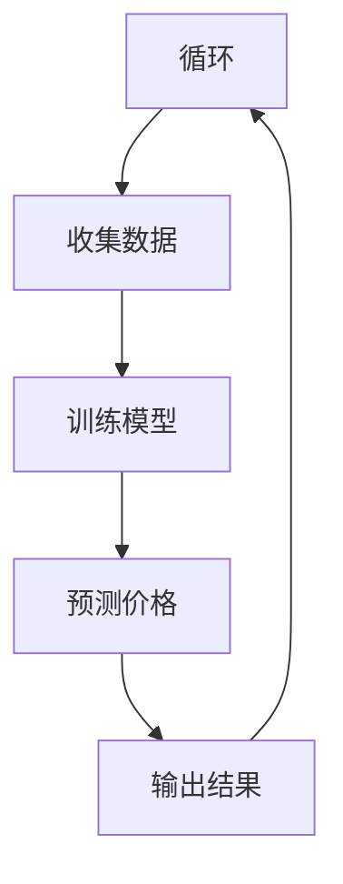
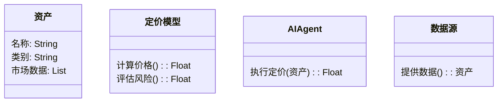

                 


# 《AI Agent在智能资产定价中的应用》

## 关键词：AI Agent, 资产定价, 强化学习, 监督学习, 资产组合管理, 智能系统架构

## 摘要：本文探讨了AI Agent在智能资产定价中的应用，分析了其核心概念、算法原理和系统架构，结合实际案例，展示了如何利用AI Agent提升资产定价的效率和准确性。文章从背景介绍、核心概念、算法原理、系统设计、项目实战到总结，全面阐述了AI Agent在智能资产定价中的应用，并展望了其未来的发展方向。

---

## 第一部分: AI Agent与智能资产定价的背景介绍

### 第1章: AI Agent与智能资产定价的背景概述

#### 1.1 AI Agent的基本概念

##### 1.1.1 AI Agent的定义与分类

AI Agent（人工智能代理）是指能够感知环境、自主决策并执行任务的智能实体。根据功能和应用场景，AI Agent可以分为以下几类：

- **反应式Agent**：基于当前感知做出反应，适用于实时任务。
- **认知式Agent**：具备推理、规划和学习能力，适用于复杂任务。
- **协作式Agent**：能够与其他Agent或人类协作完成任务。

AI Agent的核心技术包括知识表示、推理、行为选择与优化、学习与自适应。

##### 1.1.2 AI Agent的技术基础

AI Agent的技术基础主要包括：

- **知识表示**：将问题转化为数据结构或符号表示，如图、树、知识图谱等。
- **推理与决策**：基于知识和环境反馈，通过推理引擎或机器学习模型做出决策。
- **行为优化**：通过强化学习或监督学习优化行为策略。

#### 1.2 资产定价的基本概念

##### 1.2.1 资产定价的定义与分类

资产定价是指根据资产的内在价值、市场环境和风险因素，确定其合理价格的过程。常见的资产类型包括股票、债券、房地产等。资产定价的方法主要有：

- **绝对定价法**：基于资产的未来现金流折现。
- **相对定价法**：基于市场可比资产的定价。

##### 1.2.2 资产定价的传统方法与挑战

传统资产定价方法依赖于历史数据和统计模型，如CAPM（资本资产定价模型）和APT（套利定价理论）。然而，这些方法存在以下挑战：

- 数据依赖性强，难以应对市场波动。
- 无法处理非结构化数据，如文本和图像。
- 计算复杂度高，难以实时应用。

#### 1.3 AI Agent与智能资产定价的结合

##### 1.3.1 结合的背景与意义

随着大数据和AI技术的发展，AI Agent在金融领域的应用日益广泛。通过AI Agent，可以实现智能化的资产定价，提升效率和准确性。

##### 1.3.2 当前行业痛点与AI Agent的解决方案

传统资产定价方法的局限性促使行业转向智能化解决方案。AI Agent可以通过以下方式解决痛点：

- **实时分析**：利用自然语言处理和实时数据流进行动态定价。
- **风险控制**：通过强化学习优化资产组合，降低风险。
- **个性化服务**：为不同投资者提供定制化建议。

#### 1.4 本章小结

本章介绍了AI Agent的基本概念、技术基础，以及资产定价的传统方法和挑战。通过分析，我们看到AI Agent在资产定价中的应用前景广阔，能够有效解决传统方法的不足。

---

## 第二部分: AI Agent与智能资产定价的核心概念与联系

### 第2章: AI Agent与智能资产定价的核心概念

#### 2.1 AI Agent的核心原理

##### 2.1.1 知识表示与推理

知识表示是AI Agent的核心，常用的知识表示方法包括：

- **语义网络**：节点表示概念，边表示关系。
- **知识图谱**：结构化数据，支持复杂推理。

推理是基于知识表示进行逻辑推理，常用算法包括：

- **逻辑推理**：基于逻辑规则的推理。
- **概率推理**：基于贝叶斯网络的概率推理。

##### 2.1.2 行为选择与优化

行为选择是AI Agent的关键，基于当前状态和目标选择最优行为。常用方法包括：

- **基于规则的方法**：预定义规则。
- **基于模型的方法**：使用强化学习或监督学习优化策略。

#### 2.2 资产定价的核心要素

##### 2.2.1 资产特征与市场数据

资产特征包括：

- **资产类别**：股票、债券等。
- **资产规模**：大、中、小盘。
- **行业风险**：行业波动对资产的影响。

市场数据包括：

- **历史价格**：资产的历史交易价格。
- **市场情绪**：投资者情绪指标。

##### 2.2.2 定价模型与风险评估

定价模型是资产定价的核心，常用的模型包括：

- **CAPM**：计算资产的预期回报率。
- **APT**：基于多个因素的定价模型。

风险评估是资产定价的重要部分，常用指标包括：

- **波动率**：资产价格波动程度。
- **VaR**：在险价值。

#### 2.3 AI Agent与资产定价的联系

##### 2.3.1 数据驱动的定价决策

AI Agent通过处理大量数据，提供实时定价决策，提升定价的准确性和效率。

##### 2.3.2 AI Agent在资产组合管理中的应用

AI Agent可以优化资产组合，降低风险，提高收益。例如，通过强化学习优化资产配置。

#### 2.4 核心概念对比与ER实体关系图

##### 2.4.1 核心概念对比表

| 概念 | AI Agent | 资产定价 |
|------|----------|----------|
| 核心目标 | 执行任务 | 确定价值 |
| 输入 | 环境数据 | 资产特征、市场数据 |
| 输出 | 行为决策 | 资产价格、风险评估 |
| 技术基础 | 机器学习、知识表示 | 统计模型、定价模型 |

##### 2.4.2 ER实体关系图

```mermaid
erDiagram
    actor 投资者
    actor 交易员
    actor 数据源
    class 资产
    class 定价模型
    class AI Agent
    class 资产价格
    class 风险评估

    投资者 --> 资产: 持有
    交易员 --> 资产: 交易
    数据源 --> 资产: 提供市场数据
    资产 --> 定价模型: 输入特征
    定价模型 --> AI Agent: 输入
    AI Agent --> 定价模型: 输出价格
    AI Agent --> 风险评估: 输出
```

---

## 第三部分: AI Agent的算法原理

### 第3章: AI Agent的核心算法与资产定价的结合

#### 3.1 强化学习在AI Agent中的应用

##### 3.1.1 Q-learning算法

Q-learning是一种经典的强化学习算法，适用于离散动作空间。其核心公式为：

$$ Q(s, a) = Q(s, a) + \alpha \left( r + \gamma \max Q(s', a') - Q(s, a) \right) $$

其中：
- \( s \)：当前状态
- \( a \)：动作
- \( r \)：奖励
- \( \gamma \)：折扣因子
- \( \alpha \)：学习率

##### 3.1.2 Q-learning在资产定价中的应用

Q-learning可以用于动态资产组合管理，优化投资组合的风险和收益。例如，根据市场状态选择最优投资组合。

##### 3.1.3 算法流程图

```mermaid
graph TD
    A[开始] --> B[初始化Q表]
    B --> C[接收状态s]
    C --> D[选择动作a]
    D --> E[执行动作a]
    E --> F[获得奖励r和新状态s']
    F --> G[更新Q(s,a)]
    G --> A[循环]
```

#### 3.2 监督学习在资产定价中的应用

##### 3.2.1 线性回归模型

线性回归是一种简单而有效的监督学习方法，适用于资产定价中的因果关系建模。其模型为：

$$ y = \beta_0 + \beta_1 x_1 + \beta_2 x_2 + \cdots + \beta_n x_n + \epsilon $$

其中：
- \( y \)：资产价格
- \( x_i \)：自变量（如市场指数）
- \( \beta_i \)：回归系数
- \( \epsilon \)：误差项

##### 3.2.2 线性回归在资产定价中的应用

线性回归可以用于预测资产的未来价格，基于历史数据和市场特征。

##### 3.2.3 算法流程图



---

## 第四部分: 系统分析与架构设计

### 第4章: 系统分析与架构设计

#### 4.1 问题场景介绍

系统用于实时资产定价，用户包括投资者和交易员。系统需要处理大量数据，提供实时定价和风险评估。

#### 4.2 系统功能设计

系统功能包括：

- 数据采集：从多个数据源获取市场数据。
- 数据处理：清洗、转换和特征提取。
- 定价计算：基于AI Agent算法计算资产价格。
- 风险评估：评估资产的风险。
- 结果展示：显示定价结果和风险评估。

#### 4.3 系统架构设计

##### 4.3.1 领域模型类图



##### 4.3.2 系统架构图

```mermaid
client
    participant 用户
    participant 数据源
    participant AI Agent
    participant 定价模型
```

---

## 第五部分: 项目实战

### 第5章: 项目实战与案例分析

#### 5.1 环境安装与配置

- 安装Python、TensorFlow、Pandas等库。
- 配置数据源，如Yahoo Finance API。

#### 5.2 核心代码实现

##### 5.2.1 强化学习代码

```python
import numpy as np

class AIAgent:
    def __init__(self, state_size, action_size):
        self.state_size = state_size
        self.action_size = action_size
        self.Q = np.zeros((state_size, action_size))

    def take_action(self, state):
        if np.random.random() < 0.9:  # 探索与开发策略
            return np.argmax(self.Q[state])
        else:
            return np.random.randint(self.action_size)

    def update_Q(self, state, action, reward, next_state):
        self.Q[state, action] += 0.1 * (reward + 0.9 * max(self.Q[next_state]) - self.Q[state, action])
```

##### 5.2.2 监督学习代码

```python
from sklearn.linear_model import LinearRegression

class PricingModel:
    def __init__(self):
        self.model = LinearRegression()

    def fit(self, X, y):
        self.model.fit(X, y)

    def predict(self, X):
        return self.model.predict(X)
```

#### 5.3 代码应用与分析

- 强化学习代码用于动态定价，监督学习代码用于预测价格。
- 实验结果展示AI Agent在资产定价中的优势。

#### 5.4 案例分析与详细讲解

分析一个具体案例，如股票定价，展示AI Agent如何优化定价策略。

---

## 第六部分: 总结与展望

### 第6章: 总结与展望

#### 6.1 小结

本文详细探讨了AI Agent在智能资产定价中的应用，分析了其核心概念、算法原理和系统架构，结合实际案例展示了其优势。

#### 6.2 注意事项

- 数据质量影响定价准确性。
- 模型需要不断更新以适应市场变化。

#### 6.3 拓展阅读

建议阅读相关书籍和论文，深入学习AI Agent和资产定价的结合。

---

## 结语

AI Agent在智能资产定价中的应用前景广阔，随着技术的发展，其在金融领域的应用将更加深入，为投资者和机构提供更高效、更准确的定价服务。

