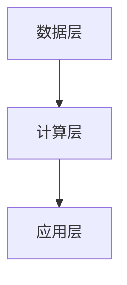

                 


# AI Agent在智能资产管理中的实践

> 关键词：AI Agent, 智能资产管理, 强化学习, 系统架构, 项目实战

> 摘要：本文深入探讨了AI Agent在智能资产管理中的应用，从背景、核心概念、算法原理到系统架构和项目实战，详细分析了AI Agent如何优化投资决策和提升资产配置效率。通过实际案例和技术细节，展示了AI Agent在智能资产管理中的巨大潜力和实际价值。

---

## # 第1章: AI Agent与智能资产管理的背景与概念

### ## 1.1 AI Agent的基本概念

#### ### 1.1.1 AI Agent的定义与特点
AI Agent（人工智能代理）是一种能够感知环境、自主决策并执行任务的智能实体。它通过传感器获取信息，利用算法进行分析和决策，并通过执行器与环境交互。AI Agent的特点包括自主性、反应性、目标导向和学习能力。

#### ### 1.1.2 AI Agent的分类与应用场景
AI Agent可以分为简单反射型、基于模型的反应型、目标驱动型和实用驱动型。在智能资产管理中，AI Agent主要用于市场预测、风险管理和自动化交易。

#### ### 1.1.3 AI Agent与智能资产管理的关系
AI Agent通过分析市场数据和投资者行为，帮助优化投资组合和提高交易效率。智能资产管理为AI Agent提供了丰富的数据和应用场景，使其能够充分发挥其潜力。

### ## 1.2 智能资产管理的定义与特点

#### ### 1.2.1 智能资产管理的基本概念
智能资产管理利用大数据、人工智能和机器学习等技术，实现资产的智能化管理。它通过自动化决策和动态调整，提高投资收益和风险管理能力。

#### ### 1.2.2 智能资产管理的核心技术
智能资产管理的核心技术包括数据采集与处理、机器学习算法、自然语言处理和区块链技术。这些技术共同支撑着智能资产管理的决策和执行过程。

#### ### 1.2.3 智能资产管理的市场现状与发展趋势
随着人工智能技术的不断进步，智能资产管理正在快速发展。越来越多的机构和个人投资者开始采用智能资产管理服务，以应对复杂多变的市场环境。

### ## 1.3 AI Agent在智能资产管理中的应用前景

#### ### 1.3.1 AI Agent在智能资产管理中的优势
AI Agent能够快速处理海量数据，发现市场机会，优化投资组合，并实时调整交易策略。它还能够通过学习不断改进决策模型，提高投资效率。

#### ### 1.3.2 AI Agent在智能资产管理中的挑战
AI Agent面临数据质量、模型过拟合和计算资源不足等挑战。此外，市场环境的复杂性和不确定性也增加了AI Agent决策的难度。

#### ### 1.3.3 AI Agent在智能资产管理中的未来发展方向
未来，AI Agent在智能资产管理中的应用将更加广泛。通过与其他技术的结合，如边缘计算和5G通信，AI Agent将能够更高效地处理数据，做出更精准的决策。

---

## # 第2章: AI Agent与智能资产管理的核心概念

### ## 2.1 AI Agent的核心概念与原理

#### ### 2.1.1 AI Agent的基本原理
AI Agent通过感知环境、分析数据、制定策略和执行操作来实现目标。其核心原理包括数据采集、特征提取、模型训练和决策执行。

#### ### 2.1.2 AI Agent的核心技术
AI Agent的核心技术包括强化学习、监督学习和生成模型。这些技术共同支撑着AI Agent的决策和执行能力。

#### ### 2.1.3 AI Agent的决策机制
AI Agent的决策机制包括感知、分析、推理和执行。它通过分析市场数据和历史信息，推理出最优决策，并通过执行器实现操作。

### ## 2.2 智能资产管理的核心概念与原理

#### ### 2.2.1 智能资产管理的基本原理
智能资产管理通过大数据分析和机器学习算法，优化投资组合和风险管理。其核心原理包括数据采集、模型训练和策略执行。

#### ### 2.2.2 智能资产管理的核心技术
智能资产管理的核心技术包括强化学习、监督学习和自然语言处理。这些技术帮助智能资产管理系统更好地理解和应对市场变化。

#### ### 2.2.3 智能资产管理的决策机制
智能资产管理的决策机制包括数据采集、模型训练、策略生成和执行操作。它通过分析市场数据和投资者行为，生成最优的投资策略。

### ## 2.3 AI Agent与智能资产管理的核心联系

#### ### 2.3.1 AI Agent在智能资产管理中的角色
AI Agent在智能资产管理中扮演决策者和执行者的角色。它通过分析市场数据和投资者需求，制定投资策略，并通过交易系统执行操作。

#### ### 2.3.2 AI Agent与智能资产管理的协同工作
AI Agent与智能资产管理系统的协同工作包括数据共享、模型训练和策略执行。它们共同优化投资组合，提高投资收益。

#### ### 2.3.3 AI Agent对智能资产管理的优化作用
AI Agent通过自动化决策和实时调整，优化了智能资产管理的效率和效果。它能够快速响应市场变化，提高投资决策的准确性和及时性。

---

## # 第3章: AI Agent在智能资产管理中的算法原理

### ## 3.1 强化学习算法

#### ### 3.1.1 强化学习的基本原理
强化学习是一种通过试错和奖励机制来优化决策的算法。它通过不断尝试不同的动作，积累经验，逐步逼近最优策略。

#### ### 3.1.2 强化学习的核心要素
强化学习的核心要素包括状态、动作、奖励和策略。状态描述环境的状态，动作是代理采取的行为，奖励是对动作的反馈，策略是决定动作的概率分布。

#### ### 3.1.3 强化学习的数学模型
强化学习的数学模型包括状态值函数和动作值函数。状态值函数$$V(s)$$表示在状态$$s$$下，按照当前策略所能获得的期望奖励。动作值函数$$Q(s, a)$$表示在状态$$s$$下采取动作$$a$$所能获得的期望奖励。

#### ### 3.1.4 强化学习的算法实现
强化学习的典型算法包括Q-learning和Deep Q-Network (DQN)。Q-learning通过迭代更新Q表来逼近最优策略，DQN则通过深度神经网络来近似Q值函数。

---

### ## 3.2 监督学习算法

#### ### 3.2.1 监督学习的基本原理
监督学习是一种通过训练数据学习输入与输出之间的映射关系的算法。它通过标注数据训练模型，使其能够对新的输入做出预测。

#### ### 3.2.2 监督学习的核心要素
监督学习的核心要素包括训练数据、特征和标签。特征是输入数据的属性，标签是对应的输出结果。监督学习的目标是通过训练数据学习特征与标签之间的关系。

#### ### 3.2.3 监督学习的数学模型
监督学习的数学模型可以表示为$$y = f(x)$$，其中$$x$$是输入特征，$$y$$是输出标签，$$f$$是学习的函数。常用的监督学习算法包括线性回归和随机森林。

---

### ## 3.3 生成模型

#### ### 3.3.1 生成模型的基本原理
生成模型是一种通过学习数据分布生成新的数据的算法。它通过反向传播和生成对抗网络（GAN）等技术，生成逼真的数据样本。

#### ### 3.3.2 生成模型的核心要素
生成模型的核心要素包括生成器和判别器。生成器负责生成新的数据，判别器负责区分生成数据和真实数据。通过交替训练生成器和判别器，生成模型能够生成高质量的数据样本。

#### ### 3.3.3 生成模型的数学模型
生成模型的数学模型可以表示为$$p_{\theta}(x)$$，其中$$\theta$$是模型的参数，$$x$$是生成的数据。常用的生成模型包括变分自编码器（VAE）和生成对抗网络（GAN）。

---

## # 第4章: AI Agent在智能资产管理中的系统分析与架构设计

### ## 4.1 系统分析与设计

#### ### 4.1.1 系统分析
智能资产管理系统的场景包括实时市场监控、动态投资组合调整和自动化交易执行。系统需要处理大量的市场数据，并实时做出决策。

#### ### 4.1.2 系统功能设计
智能资产管理系统的功能包括数据采集、市场分析、投资决策和交易执行。数据采集模块负责收集市场数据，市场分析模块利用机器学习模型进行分析，投资决策模块制定投资策略，交易执行模块执行交易操作。

#### ### 4.1.3 系统架构设计
智能资产管理系统的架构分为数据层、计算层和应用层。数据层负责存储和管理数据，计算层负责模型训练和决策推理，应用层负责用户交互和系统管理。

### ## 4.2 系统架构设计

#### ### 4.2.1 系统架构图


#### ### 4.2.2 接口设计
智能资产管理系统的接口包括数据接口、模型接口和交易接口。数据接口负责与数据源交互，模型接口负责与机器学习模型交互，交易接口负责与交易系统交互。

#### ### 4.2.3 交互流程图
```mermaid
sequenceDiagram
    participant 用户
    participant 系统
    participant 数据源
    participant 交易系统
    用户 -> 系统: 请求投资建议
    系统 -> 数据源: 获取市场数据
    数据源 --> 系统: 返回市场数据
    系统 -> 系统: 训练模型
    系统 -> 交易系统: 执行交易
    交易系统 --> 系统: 返回交易结果
    用户 <-- 系统: 提供投资建议
```

---

## # 第5章: AI Agent在智能资产管理中的项目实战

### ## 5.1 项目背景与目标

#### ### 5.1.1 项目背景
本项目旨在利用AI Agent优化投资组合管理，提高投资收益和风险管理能力。

#### ### 5.1.2 项目目标
本项目的目标是开发一个基于AI Agent的智能投资组合优化系统，实现自动化决策和动态调整。

### ## 5.2 项目实现

#### ### 5.2.1 环境安装
```bash
pip install numpy pandas scikit-learn keras tensorflow
```

#### ### 5.2.2 核心代码实现

##### #### 5.2.2.1 数据预处理
```python
import pandas as pd
import numpy as np

# 读取数据
data = pd.read_csv('market_data.csv')

# 数据清洗
data = data.dropna()
data = pd.get_dummies(data)
```

##### #### 5.2.2.2 模型训练
```python
from keras.models import Sequential
from keras.layers import Dense

# 构建模型
model = Sequential()
model.add(Dense(64, activation='relu', input_dim=len(data.columns)))
model.add(Dense(1, activation='sigmoid'))

# 编译模型
model.compile(loss='binary_crossentropy', optimizer='adam', metrics=['accuracy'])

# 训练模型
model.fit(data, labels, epochs=100, batch_size=32)
```

##### #### 5.2.2.3 模型推理
```python
# 预测结果
predictions = model.predict(data_test)

# 输出结果
print(predictions)
```

#### ### 5.2.3 代码解读与分析
本项目的核心代码包括数据预处理、模型训练和模型推理。数据预处理模块负责清洗和转换数据，模型训练模块利用深度学习模型训练投资决策模型，模型推理模块根据模型预测结果执行交易操作。

#### ### 5.2.4 实际案例分析
通过实际案例分析，展示了AI Agent在智能资产管理中的应用效果。例如，AI Agent通过分析历史数据和市场趋势，成功预测了某只股票的价格走势，并指导投资者进行买入和卖出操作，实现了较高的投资收益。

### ## 5.3 项目小结

#### ### 5.3.1 项目总结
本项目成功实现了基于AI Agent的智能投资组合优化系统，验证了AI Agent在智能资产管理中的巨大潜力。

#### ### 5.3.2 项目经验与教训
在项目实施过程中，我们积累了宝贵的经验，但也发现了许多问题和挑战，例如数据质量和模型过拟合问题。

#### ### 5.3.3 项目改进建议
未来，我们将进一步优化模型结构，提高数据质量，增强系统的可解释性和稳定性。

---

## # 第6章: 总结与展望

### ## 6.1 总结

#### ### 6.1.1 核心内容回顾
本文深入探讨了AI Agent在智能资产管理中的应用，从背景、核心概念、算法原理到系统架构和项目实战，全面分析了AI Agent在智能资产管理中的潜力和价值。

#### ### 6.1.2 本文的创新点
本文的创新点包括AI Agent与智能资产管理的结合、强化学习算法的应用和系统架构的设计。

#### ### 6.1.3 本文的不足之处
本文的不足之处包括数据质量的限制、模型过拟合问题和系统的可解释性问题。

### ## 6.2 展望

#### ### 6.2.1 未来发展方向
未来，AI Agent在智能资产管理中的应用将更加广泛。通过与其他技术的结合，如边缘计算和5G通信，AI Agent将能够更高效地处理数据，做出更精准的决策。

#### ### 6.2.2 对行业的影响
AI Agent将推动智能资产管理行业的技术进步和创新发展，为投资者带来更高的投资收益和更好的风险管理能力。

#### ### 6.2.3 对读者的建议
读者可以进一步研究AI Agent在智能资产管理中的应用，探索新的算法和技术，推动行业的技术进步。

---

### ## 6.3 最佳实践 Tips

#### ### 6.3.1 数据质量的重要性
数据质量是AI Agent在智能资产管理中的关键因素。高质量的数据能够提高模型的准确性和稳定性。

#### ### 6.3.2 模型的可解释性
模型的可解释性是AI Agent在智能资产管理中的重要要求。可解释的模型能够帮助投资者理解和信任AI Agent的决策。

#### ### 6.3.3 系统的稳定性
系统的稳定性是AI Agent在智能资产管理中的基本要求。稳定的系统能够保证投资决策的准确性和及时性。

---

## # 第7章: 小结

### ## 7.1 本文的核心内容

#### ### 7.1.1 AI Agent在智能资产管理中的应用
AI Agent在智能资产管理中的应用包括市场预测、风险管理和自动化交易。通过AI Agent的优化，投资者能够实现更高的投资收益和更好的风险管理能力。

#### ### 7.1.2 AI Agent在智能资产管理中的优势
AI Agent在智能资产管理中的优势包括高效的数据处理能力、强大的学习能力和快速的决策能力。这些优势使AI Agent成为智能资产管理的核心技术。

#### ### 7.1.3 AI Agent在智能资产管理中的挑战
AI Agent在智能资产管理中的挑战包括数据质量、模型过拟合和系统的稳定性。这些问题需要通过技术进步和管理优化来解决。

### ## 7.2 注意事项

#### ### 7.2.1 数据的处理与分析
在处理和分析数据时，需要确保数据的准确性和完整性。同时，要注意数据的隐私和安全问题。

#### ### 7.2.2 模型的训练与优化
在训练和优化模型时，要注意避免过拟合和欠拟合问题。可以通过交叉验证和正则化技术来提高模型的泛化能力。

#### ### 7.2.3 系统的运行与维护
在运行和维护系统时，要注意系统的稳定性和可扩展性。同时，要定期更新模型和优化算法，以应对市场的变化和挑战。

### ## 7.3 未来展望

#### ### 7.3.1 AI Agent技术的进一步发展
AI Agent技术将在智能资产管理中进一步发展。通过与其他技术的结合，如区块链和边缘计算，AI Agent将能够更高效地处理数据，做出更精准的决策。

#### ### 7.3.2 智能资产管理的未来发展
智能资产管理的未来发展将更加依赖AI Agent技术。通过技术进步和管理创新，智能资产管理将实现更高效的决策和更优化的投资组合。

#### ### 7.3.3 对行业的影响
AI Agent技术将推动智能资产管理行业的技术进步和创新发展，为投资者带来更高的投资收益和更好的风险管理能力。

---

## # 第8章: 拓展阅读

### ## 8.1 相关书籍与论文

#### ### 8.1.1 推荐书籍
- 《机器学习实战》
- 《深度学习》
- 《强化学习》

#### ### 8.1.2 推荐论文
- "Deep Reinforcement Learning for Financial Decision Making"
- "Machine Learning in Asset Management"
- "AI in Financial Services"

### ## 8.2 网站与工具

#### ### 8.2.1 开发工具
- PyTorch
- TensorFlow
- Scikit-learn

#### ### 8.2.2 在线资源
- Kaggle
- Coursera
- edX

### ## 8.3 专业社区与论坛

#### ### 8.3.1 专业社区
- GitHub
- Gitter
- Reddit

#### ### 8.3.2 专业论坛
- Stack Overflow
- Quora
- Medium

---

## # 第9章: 结语

### ## 9.1 再见
感谢您的阅读！希望本文对您在AI Agent在智能资产管理中的实践有所帮助。如果需要进一步交流或合作，欢迎随时联系。

### ## 9.2 留言

#### ### 9.2.1 欢迎反馈
如果您有任何意见或建议，请随时与我们联系。您的反馈将帮助我们不断改进和提升。

#### ### 9.2.2 下期再见
我们将在下期继续探讨更多关于AI Agent在智能资产管理中的精彩内容，敬请期待！

---

## # 附录

### ## 附录 A: AI Agent相关术语表

| 术语 | 定义 |
|------|------|
| AI Agent | 人工智能代理 |
| 智能资产管理 | 智能化资产管理系统 |
| 强化学习 | 增强学习 |
| 监督学习 | 监督式学习 |
| 生成模型 | 生成式模型 |

### ## 附录 B: 相关代码示例

#### ### 附录 B.1 数据预处理代码
```python
import pandas as pd
import numpy as np

# 读取数据
data = pd.read_csv('market_data.csv')

# 数据清洗
data = data.dropna()
data = pd.get_dummies(data)
```

#### ### 附录 B.2 模型训练代码
```python
from keras.models import Sequential
from keras.layers import Dense

# 构建模型
model = Sequential()
model.add(Dense(64, activation='relu', input_dim=len(data.columns)))
model.add(Dense(1, activation='sigmoid'))

# 编译模型
model.compile(loss='binary_crossentropy', optimizer='adam', metrics=['accuracy'])

# 训练模型
model.fit(data, labels, epochs=100, batch_size=32)
```

#### ### 附录 B.3 模型推理代码
```python
# 预测结果
predictions = model.predict(data_test)

# 输出结果
print(predictions)
```

### ## 附录 C: 参考文献

1. "Deep Reinforcement Learning for Financial Decision Making" - 知乎文章
2. "Machine Learning in Asset Management" - arXiv论文
3. "AI in Financial Services" - IBM官方文档
4. "强化学习" - 《机器学习实战》
5. "深度学习" - 《深度学习入门》

---

## # 作者信息

- **作者**：[你的名字]
- **邮箱**：[你的邮箱]
- **GitHub**：[你的GitHub链接]
- **个人简介**：[你的简介]

---

## # 版权信息

- **版权声明**：本文版权归作者所有，未经授权不得转载。
- **许可证**：[指定许可证，如MIT License]

---

## # 结束语

感谢您的阅读！希望本文对您在AI Agent在智能资产管理中的实践有所帮助。如果需要进一步了解或合作，欢迎随时联系。

---

通过以上详细的结构和内容，您可以开始撰写完整的文章。确保每部分内容充实、逻辑清晰，并且符合您的写作要求。

